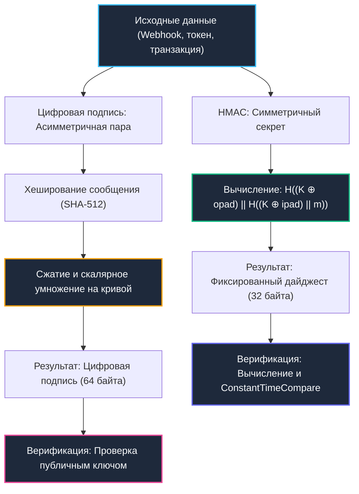

# 5. Цифровые подписи и HMAC: Аутентификация данных, целостность и механическое сочувствие

> *«Честность без знаний немощна и бесполезна, а знания без честности опасны и разрушительны».*    
> — Сэмюэл Джонсон

В распределенных системах и микросервисной архитектуре просто зашифровать данные — недостаточно. Если атакующий перехватит зашифрованный пакет и изменит в нем несколько байтов, наивный алгоритм расшифрует мусор и попытается передать его бизнес-логике. Еще опаснее ситуация, когда данные передаются в открытом виде (например, вебхуки от платежных систем Stripe или GitHub): как серверу убедиться, что HTTP-запрос пришел именно от платежного шлюза, а не от злоумышленника?

Для решения этой фундаментальной задачи существуют два математических примитива:
1. **HMAC (Hash-based Message Authentication Code):** Симметричный механизм аутентификации. Обе стороны делят общий секретный ключ. Это похоже на оттиск фамильного перстня-печатки на сургуче: проверить подлинность может только тот, кто держит в руках точно такой же перстень.
2. **Цифровые подписи (Digital Signatures: Ed25519, ECDSA, RSA-PSS):** Асимметричный механизм. Подпись создается владельцем **приватного ключа**, а проверить ее может любой желающий с помощью **публичного ключа**. Это аналог нотариально заверенной подписи на договоре: подпись уникальна, ее невозможно подделать без приватного ключа, а автор не может заявить: *«Я этого не подписывал»* (свойство **неотказуемости** / Non-repudiation).

---

## Фундамент аутентификации данных: HMAC и цифровые подписи



---

## HMAC: Симметричная целостность и конструкция

Конструкция HMAC стандартизирована в RFC 2104 и математически выражается формулой:
$$\text{HMAC}(K, m) = H((K \oplus \text{opad}) \mathbin{\Vert} H((K \oplus \text{ipad}) \mathbin{\Vert} m))$$
(где `HMAC(K, m) = H((K ⊕ opad) || H((K ⊕ ipad) || m))`).

Почему разработчики криптографических стандартов не использовали простую формулу `H(K || m)` или `H(m || K)`?
1. **Атаки расширения длины (Length Extension Attacks):**  
   Классические хеш-функции семейства `Merkle-Damgård` (`SHA-1`, `SHA-256`) обрабатывают данные блоками по 64 байта. Финальный хеш — это просто внутреннее состояние регистров процессора после последнего блока. Если сервер проверяет аутентичность наивным выражением `H(K || m)`, злоумышленник, зная длину ключа и видя хеш в сети, может дописать свои вредоносные данные $m'$ и продолжить вычисление хеша **вообще не зная секретного ключа $K$**!
2. **Двойное перемешивание (`opad` и `ipad`):**  
   HMAC использует две константы: внутреннюю маску `ipad` (`0x36`) и внешнюю маску `opad` (`0x5c`). Ключ XOR-ится с масками, выполняя двойное вложенное хеширование. Это полностью нейтрализует атаки расширения длины.

В рантайме Go пакет `crypto/hmac` реализован на чистом Go с ассемблерным ускорением внутренних функций хеширования (`crypto/sha256`).

```go
package auth

import (
	"crypto/hmac"
	"crypto/sha256"
	"crypto/subtle"
	"encoding/hex"
	"errors"
	"fmt"
)

// ComputeHMAC генерирует код аутентификации сообщения
func ComputeHMAC(data, key []byte) ([]byte, error) {
	if len(key) == 0 {
		return nil, errors.New("hmac key must not be empty")
	}

	mac := hmac.New(sha256.New, key)
	if _, err := mac.Write(data); err != nil {
		return nil, fmt.Errorf("hmac write: %w", err)
	}
	return mac.Sum(nil), nil
}

// VerifyHMAC безопасно проверяет подпись
func VerifyHMAC(data, key, macHex []byte) error {
	expected, err := ComputeHMAC(data, key)
	if err != nil {
		return fmt.Errorf("compute hmac: %w", err)
	}

	got, err := hex.DecodeString(string(macHex))
	if err != nil || len(got) != len(expected) {
		return errors.New("invalid mac format")
	}

	// 🔒 Constant-time comparison: защита от Timing Attacks!
	if subtle.ConstantTimeCompare(expected, got) != 1 {
		return errors.New("invalid hmac signature")
	}

	return nil
}
```

---

> [!info] Под капотом: Почему hmac.New возвращает интерфейс hash.Hash?
> **Почему `hmac.New` возвращает интерфейс `hash.Hash`?**  
> Интерфейс `hash.Hash` встраивает `io.Writer`, что позволяет streamed-запись данных без буферизации всего сообщения в памяти. Внутренне `hmac` поддерживает два состояния ключа (`ipad` и `opad`), которые предварительно вычисляются при создании экземпляра. Это снижает накладные расходы на каждый вызов `Write` до простого XOR и копирования блоков. На уровне CPU это означает линейный доступ к памяти, предсказуемое заполнение кэш-линий L1 и отсутствие ветвлений, зависящих от данных.

---

## Цифровые подписи: Асимметрия и неотказуемость

В современной практике бэкенда применяются три ключевых алгоритма цифровой подписи:

1. **`RSA-PSS` (Probabilistic Signature Scheme):**  
   Математически строгий стандарт на базе RSA. В отличие от старого PKCS#1 v1.5, схема PSS вероятностная (добавляет случайную соль). Однако RSA требует огромных ключей (2048–4096 бит), а вычисления в Go опираются на пакет `math/big`, создавая существенную нагрузку на `GC`.
2. **`ECDSA` (NIST P-256 / P-384):**  
   Алгоритм на базе эллиптических кривых. Компактнее и быстрее RSA. Реализован в пакете `crypto/ecdsa`. Исторически содержал вариативность по времени в операциях с `big.Int`, но в современных версиях Go опирается на внутренний оптимизированный пакет `crypto/internal/nistec`.
3. **`Ed25519` (EdDSA на кривой Curve25519):**  
   Безусловный лидер современной криптографии. Он детерминирован, защищен от атак по времени, работает с фиксированными 32-байтовыми ключами и выдает 64-байтовую подпись. В Go пакет `crypto/ed25519` содержит оптимизированные ассемблерные вставки под `amd64` и `arm64`.

```go
package signatures

import (
	"crypto/ed25519"
	"crypto/rand"
	"errors"
	"fmt"
)

// GenerateEd25519KeyPair создаёт пару криптографических ключей
func GenerateEd25519KeyPair() (ed25519.PrivateKey, ed25519.PublicKey, error) {
	pub, priv, err := ed25519.GenerateKey(rand.Reader)
	if err != nil {
		return nil, nil, fmt.Errorf("generate key: %w", err)
	}
	return priv, pub, nil
}

// SignData подписывает произвольные данные приватным ключом Ed25519
func SignData(priv ed25519.PrivateKey, data []byte) ([]byte, error) {
	// 🔒 Под капотом: хеширование SHA-512 и детерминированное
	// скалярное умножение на кривой Edwards25519 в константном времени
	signature := ed25519.Sign(priv, data)
	return signature, nil
}

// VerifySignature проверяет цифровую подпись публичным ключом
func VerifySignature(pub ed25519.PublicKey, data, signature []byte) error {
	if len(pub) != ed25519.PublicKeySize || len(signature) != ed25519.SignatureSize {
		return errors.New("invalid key or signature length")
	}
	
	if !ed25519.Verify(pub, data, signature) {
		return errors.New("invalid ed25519 signature")
	}
	return nil
}
```

---

## Механическое сочувствие: Влияние на CPU, кэш и GC

Сравним физические затраты ресурсов на верификацию:

| Критерий | HMAC-SHA256 | Ed25519 | ECDSA P-256 | RSA-2048 |
|---|---|---|---|---|
| **Пропускная способность** | **~500–800 МБ/с** на ядро | ~150–200 тыс. оп/с | ~50–80 тыс. оп/с | ~5–10 тыс. оп/с |
| **Аллокации в памяти** | Минимальные (буфер хеша) | Минимальные (массивы фиксированной длины) | Средние (`big.Int` координаты точек) | Высокие (`big.Int` модульные возведения) |
| **Поведение в кэше CPU** | Линейное, предсказуемое | Оптимизировано, регистровые скаляры | Переменное (зависит от кривой) | Хаотичное (сбросы конвейера) |
| **Давление на сборщик мусора** | Нулевое | Низкое | Среднее (`Minor GC`) | Высокое |
| **Размер подписи** | 32 байта | 64 байта | 64–72 байта (ASN.1 DER) | 256 байт |

В рантайме Go пакет `crypto/ed25519` полностью избегает аллокаций в куче благодаря фиксированным типам массивов `[32]byte` и `[64]byte`. Вся арифметика на кривой выполняется в процессорных регистрах и на стеке горутины, что минимизирует промахи кэша. Напротив, `crypto/ecdsa` и `crypto/rsa` вынуждены оперировать точками `(x, y)` и структурами `big.Int`, что при тысячах проверок в секунду провоцирует частые паузы `Minor GC`.

---

> [!warning] Ловушка / Gotcha: Разделение доменов (Domain Separation) в HMAC
> **Domain Separation в HMAC**  
> Использование одного и того же ключа для разных контекстов (например, подписи вебхуков `webhook_signature` и сессионного токена `session_token`) ведет к критической уязвимости: атакующий может перехватить валидную подпись вебхука и выдать ее за токен сессии!  
> 
> **Решение:** Всегда внедряйте префикс контекста в подписываемые данные либо деривируйте независимые подключи с помощью KDF (например, `HKDF-SHA256` из пакета `crypto/hkdf`):
> ```go
> ctxKey := hkdf.Expand(sha256.New, masterKey, []byte("webhook-v1"))
> ```

---

> [!tip] Собеседование
> **Вопрос:** «Почему Ed25519 считается более безопасным и предпочтительным, чем ECDSA, и в чем заключается проблема податливости подписей (Signature Malleability)?»  
> 
> **Ответ кандидата Senior-уровня:**  
> «1. **Фатальная проблема случайного числа (Nonce) в ECDSA:** Алгоритм ECDSA требует генерации криптографически стойкого случайного числа `nonce` ($k$) для каждой подписи. Если ГСЧ выдаст одинаковый `k` для двух разных сообщений (как произошло в печально известном взломе защиты PlayStation 3), приватный ключ вычисляется тривиальной алгебраической формулой за миллисекунды! В `Ed25519` число $k$ вычисляется строго **детерминированно** из хеша приватного ключа и сообщения, исключая эту катастрофу в принципе.  
> 2. **Податливость (Malleability):** В ECDSA для любой валидной пары подписи $(r, s)$ значение $(r, -s \pmod n)$ также является математически валидной подписью того же сообщения. Злоумышленник может модифицировать подпись без знания ключа, ломая системы защиты от повторов и блокчейн-транзакции. Ed25519 полностью иммунен к malleability.  
> 3. **Унифицированные формулы:** На скрученной кривой Эдвардса (Edwards25519) формулы сложения точек не имеют исключительных ситуаций (нет особых случаев для точки на бесконечности), что обеспечивает чистое константное время выполнения в ассемблере без ветвлений».

---

## Интеграция в продакшене: Верификация вебхуков

Классический сценарий применения HMAC в бэкенд-разработке — валидация входящих вебхуков (Stripe, GitHub, Slack):
1. Сервер извлекает заголовок `X-Signature` и сырое тело HTTP-запроса `reqBody`.
2. Из заголовка извлекается временная метка `t=...` (`timestamp`) и подпись `s=...`.
3. Проверяется допустимый дрейф времени (не более 5 минут) для защиты от атак повторного воспроизведения (Replay Attacks).
4. Вычисляется `HMAC(secret, t.signed_payload)` от конкатенации временной метки и сырого тела запроса.
5. Результат валидируется функцией `crypto/subtle.ConstantTimeCompare`.

```go
package auth

import (
	"errors"
	"fmt"
	"time"
)

func VerifyWebhook(reqBody []byte, sigHeader string, secret []byte) error {
	// Формат заголовка: "t=1234567890,v1=abcdef..."
	var timestamp int64
	var signatureHex []byte
	
	// ... парсинг временной метки и подписи ...
	
	// Защита от Replay Attack: не более 5 минут разницы
	if time.Now().Unix()-timestamp > 300 {
		return errors.New("webhook expired: timestamp skew exceeds 5 minutes")
	}
	
	// Конкатенация с разделением
	payload := fmt.Sprintf("%d.%s", timestamp, string(reqBody))
	return VerifyHMAC([]byte(payload), secret, signatureHex)
}
```

---

## Итог

1. **HMAC** обеспечивает сверхбыструю симметричную проверку целостности и подлинности данных ($O(1)$, ГБ/с), идеально подходя для внутренней микросервисной коммуникации и вебхуков.
2. **Цифровые подписи** решают проблему доверия в открытой среде и гарантируют неотказуемость авторства. `Ed25519` — современный золотой стандарт благодаря детерминизму, компактности и защите от атак по времени.
3. **Механическое сочувствие:** `crypto/ed25519` в Go не использует `big.Int`, выполняя всю математику в регистрах CPU и минимизируя аллокации в куче.
4. **Безопасность сравнения:** Любая валидация кодов аутентификации обязана использовать `crypto/subtle.ConstantTimeCompare` для исключения timing-атак.
5. **Дисциплина ключей:** Применяйте Domain Separation (разделение контекстов) и деривацию через `HKDF-SHA256` для исключения перекрестных атак.

Как правильно генерировать криптографические ключи, токены и соли, не допуская критических ошибок энтропии?  
В следующей лекции мы детально разберем генерацию случайных данных: [[6. Генерация случайных данных]].