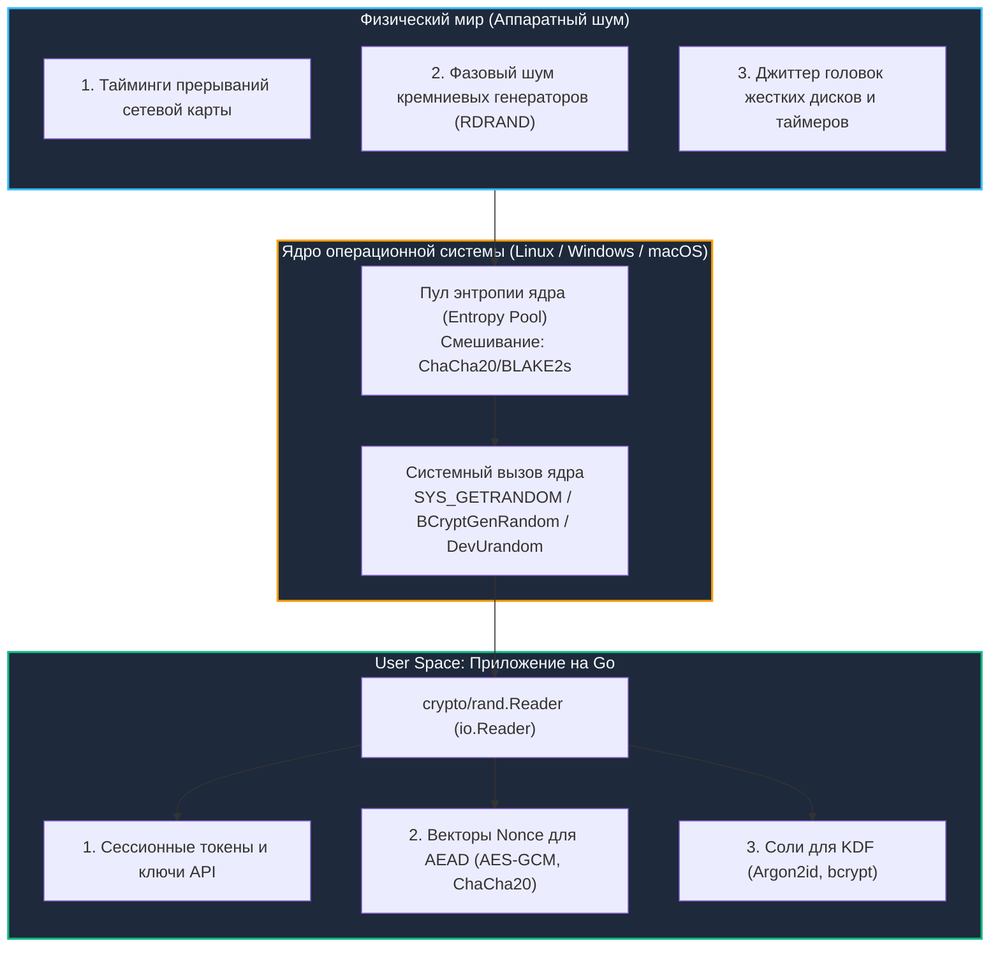

# 6. Генерация случайных данных: Энтропия, CSPRNG и механическое сочувствие к ядру

> *"Anyone who considers arithmetical methods of producing random digits is, of course, in a state of sin."*  
> — Джон фон Нейман

Цифровой компьютер по своей природе — абсолютно детерминированный конечный автомат. Если подать на кремниевый кристалл процессора идентичный набор входных сигналов и начальное состояние регистров, он миллиард раз подряд выполнит в точности одну и ту же последовательность инструкций.

Однако безопасность современного бэкенда целиком держится на **непредсказуемости**:
- Если злоумышленник сможет угадать хотя бы один 12-байтовый `nonce` в шифровании `AES-GCM`, он расшифрует весь трафик.
- Если злоумышленник предскажет сессионный токен пользователя или соль для паролей (`KDF`), он захватит аккаунт администратора.

Каким же образом абсолютно детерминированная машина способна родить истинную случайность? Единственный путь — прислушаться к хаосу окружающего физического мира.

В архитектуре Go для этого существует криптографически стойкий генератор псевдослучайных чисел — **CSPRNG (Cryptographically Secure Pseudorandom Number Generator)**, представленный пакетом `crypto/rand`.

---

## Фундамент энтропии: от аппаратных источников к пользовательскому пространству



---

## Операционная система: пул энтропии и системные вызовы

В современных операционных системах ядро непрерывно собирает недетерминированный шум внешнего мира. Ядро непрерывно «перемалывает» входящие биты криптографической хеш-функцией (`ChaCha20/BLAKE2s`), поддерживая внутреннее энтропийное состояние.

Исторически в Unix существовали два псевдоустройства:
1. **`/dev/random`:** Блокирующий интерфейс. Если внутренняя оценка доступной энтропии падала ниже порога, чтение замораживало вызывающий процесс. Это приводило к массовым таймаутам и зависаниям демонов при старте серверов и в виртуальных машинах.
2. **`/dev/urandom`:** Неблокирующий интерфейс. Он пропускал энтропию через криптографический генератор. До выхода ядра Linux 5.6 существовал теоретический риск чтения из `/dev/urandom` на самых ранних микросекундах загрузки ядра до первоначального накопления энтропии.

**Современный золотой стандарт:** Системный вызов **`getrandom(2)`** (появившийся в `Linux 3.17+`).  
Он работает напрямую в ядре без создания файловых дескрипторов (исключая оверхед `open`/`read`/`close`). Вызов автоматически блокируется *только* до момента первичной инициализации пула энтропии при старте системы, после чего работает гарантированно неблокирующе и на максимальной скорости.

---

## Реализация в Go: crypto/rand под капотом

В стандартной библиотеке Go доступ к криптографической случайности инкапсулирован в глобальной переменной `rand.Reader`, реализующей стандартный интерфейс `io.Reader`.

Реализация платформозависима и скомпилирована под конкретную ОС:
1. **Linux / Android:** Пакет приоритетно вызывает системный вызов `SYS_GETRANDOM` через внутренний ассемблер `runtime.asm` или `libc`. Если ядро устарело, происходит прозрачный фоллбэк на чтение из виртуального устройства `/dev/urandom`.
2. **macOS / iOS:** Вызывает системную функцию `CCRandomGenerateBytes` из `Security.framework` или обращается к `/dev/urandom`.
3. **Windows:** Вызывает функцию `BCryptGenRandom` из `CNG API`, напрямую взаимодействующую с аппаратными инструкциями процессора (`RDRAND`).
4. **WebAssembly (`WASM/JS`):** Делегирует генерацию вызову `crypto.getRandomValues` в контексте браузера или Node.js.

```go
package securegen

import (
	"crypto/rand"
	"encoding/hex"
	"fmt"
	"io"
)

// GenerateSecureToken создаёт криптографически стойкий токен заданной длины
func GenerateSecureToken(lengthBytes int) (string, error) {
	if lengthBytes <= 0 {
		return "", fmt.Errorf("token length must be positive")
	}

	buf := make([]byte, lengthBytes)
	// 🔒 io.ReadFull гарантирует заполнение ВСЕГО буфера или возврат ошибки.
	// Обычный вызов rand.Read может вернуть меньше байт при прерывании сигналом ОС.
	if _, err := io.ReadFull(rand.Reader, buf); err != nil {
		return "", fmt.Errorf("failed to generate secure token: %w", err)
	}

	return hex.EncodeToString(buf), nil
}

// GenerateSecureNonce создаёт 12-байтовый nonce для AES-GCM или ChaCha20-Poly1305
func GenerateSecureNonce() ([12]byte, error) {
	var nonce [12]byte
	if _, err := io.ReadFull(rand.Reader, nonce[:]); err != nil {
		return [12]byte{}, fmt.Errorf("nonce generation failed: %w", err)
	}
	return nonce, nil
}
```

---

> [!info] Под капотом: Почему rand.Reader использует io.ReadFull внутри?
> **Почему `rand.Reader` использует `io.ReadFull` внутри?**  
> На уровне ОС системный вызов `getrandom` может вернуть меньше запрошенных байт, если запрошен большой буфер, а пул энтропии временно ограничен (хотя в современных ядрах это редкость). `io.ReadFull` в стандартной библиотеке реализует цикл повторных вызовов, пока буфер не будет заполнен полностью или не возникнет фатальная ошибка. Это гарантирует детерминизм поведения в высоконагруженных сервисах, где частичные чтения могут привести к неинициализированной памяти в структуре данных.

---

## Механическое сочувствие: стоимость, аллокации и оптимизация

Каждое обращение к `crypto/rand` — это не просто вызов функции в оперативной памяти, а полноценный переход процессора из пространства пользователя в ядро: **`Ring 3 -> Ring 0`**.

Этот переход сопровождается аппаратными накладными расходами:
1. Сохранение пользовательских регистров CPU и переключение на стек ядра.
2. Обработка системного вызова ядра, вычитка байтов энтропии.
3. Копирование байтов из памяти ядра в пользовательский буфер процесса Go.
4. Возврат управления в кольцо Ring 3.

Один системный вызов `getrandom` занимает от 500 до 1500 наносекунд. Если вы в цикле запрашиваете случайные числа по 1 байту, процессор потратит 95% времени на переключение контекста!

**Инженерные правила оптимизации:**
1. **Буферизация порциями:** Запрашивайте энтропию пакетами оптимального размера (32, 64, 128 байт).
2. **Переиспользование буферов через `sync.Pool`:** При генерации сотен тысяч токенов в секунду аллокация временных срезов `[]byte` нагружает сборщик мусора. Используйте `sync.Pool`, но **строго заполняйте буфер целиком через `io.ReadFull`** перед использованием!
3. **Абсолютный запрет `math/rand` для безопасности:** Алгоритм `math/rand` (на базе `PCG/Xorshift`) работает молниеносно в User Space, но он математически детерминирован. Зная всего несколько сгенерированных чисел, злоумышленник за доли секунды вычисляет внутреннее состояние генератора и полностью предсказывает все последующие токены.

```go
package securegen

import (
	"crypto/rand"
	"encoding/base64"
	"io"
	"sync"
)

// SecureIDGenerator генерирует безопасные идентификаторы с переиспользованием буферов
type SecureIDGenerator struct {
	pool sync.Pool
}

func NewSecureIDGenerator() *SecureIDGenerator {
	return &SecureIDGenerator{
		pool: sync.Pool{
			New: func() any {
				return make([]byte, 32)
			},
		},
	}
}

func (g *SecureIDGenerator) NextID() (string, error) {
	buf := g.pool.Get().([]byte)
	defer g.pool.Put(buf) // Возврат в пул после сериализации

	// 🔒 Читаем ровно 32 байта криптографической энтропии
	if _, err := io.ReadFull(rand.Reader, buf); err != nil {
		return "", err
	}

	// Кодирование Base64URL без паддинга оптимально для HTTP-заголовков и URL
	return base64.RawURLEncoding.EncodeToString(buf), nil
}
```

---

> [!warning] Ловушка / Gotcha: Смещение по модулю (Modulo Bias) и math/rand.Intn
> **Смещение по модулю (Modulo Bias) и `math/rand.Intn`**  
> Частая ошибка: `rand.Intn(n) % limit` или прямой выбор из слайса через `rand.Intn(len(slice))`. Если `n` не кратно размеру диапазона, некоторые значения выпадают чаще других.  
> В `math/rand` это решается алгоритмом отбраковки (rejection sampling), но он не является криптографически стойким.  
> 
> **Решение для криптографии:** Никогда не используйте `math/rand` для выбора элементов, требующих равномерного распределения. Если необходимо выбрать случайное число в диапазоне `[0, max)`, используйте `crypto/rand` с алгоритмом отбраковки или берите достаточно большой буфер байт (например, 32 байта = 256 бит) и интерпретируйте его как большое число, применяя модуль только если он значительно меньше `2^256`, что делает смещение статистически ничтожным. Для выбора из слайса используйте криптографический рандом для индекса и проверяйте границы.

---

## math/rand в современных версиях Go: Go 1.20 и Go 1.22+

Исторически новички часто попадали в ловушку: вызов `math/rand` без ручной инициализации сида (`rand.Seed(time.Now().UnixNano())`) приводил к тому, что генератор при каждом запуске программы выдавал **абсолютно одинаковые числа**.

В современных версиях рантайма поведение кардинально улучшилось:
- Начиная с **`Go 1.20`**, глобальный генератор `math/rand` автоматически инициализируется случайным сидом из `crypto/rand` при старте приложения.
- В **`Go 1.22`** появился полностью переработанный пакет **`math/rand/v2`** с более быстрым и статистически безупречным генератором PCG.

Однако критически важно помнить: автоматическая инициализация зерна **не сделала `math/rand` криптографически стойким**! Это по-прежнему открытый алгоритм в User Space.

| Сценарий применения | `crypto/rand` | `math/rand` / `math/rand/v2` |
|---|:---:|:---:|
| **Токены сессий, пароли, ключи API** | ✅ **Строго обязательно** | ❌ **Категорически запрещено** |
| **Nonce для AEAD, соли для хешей паролей** | ✅ **Строго обязательно** | ❌ **Категорически запрещено** |
| **A/B-тестирование, процентная раскатка фичей** | ⚠️ Избыточно дорого | ✅ **Рекомендуется** |
| **Симуляции Монте-Карло, генерация тестовых баз** | ⚠️ Медленно | ✅ **Идеально** |
| **Джиттер таймаутов (Exponential Backoff Jitter)** | ⚠️ Избыточно | ✅ **Рекомендуется** |

---

> [!tip] Собеседование
> **Вопрос:** «Почему в Docker-контейнерах или виртуальных машинах часто возникали проблемы с генерацией случайных данных при старте, и как это влияло на рантайм Go?»  
> 
> **Ответ кандидата Senior-уровня:**  
> «1. **Проблема энтропийного голодания (Entropy Starvation):** В изолированных контейнерах и бездисковых виртуальных машинах отсутствуют реальные физические устройства: нет движения мыши, прерываний клавиатуры, а тайминги дисков эмулируются гипервизором. Пул энтропии ядра Linux заполняется крайне медленно.  
> 2. На старых ядрах Linux (< 5.6) системный вызов `getrandom` или чтение `/dev/random` приводили к полной блокировке потока ОС в ожидании сбора энтропии. В результате рантайм Go зависал прямо на этапе `init()` или при первом HTTP-запросе в системном вызове `syscall`!  
> 3. **Современные решения:**  
>    - В современных процессорах ядро собирает аппаратную энтропию напрямую через инструкции `RDRAND` / `RDSEED`, а интерфейс `vDSO` минимизирует накладные расходы.  
>    - На уровне хоста разворачиваются демоны генерации энтропии: `haveged` (собирает джиттер кэша инструкций CPU) или `rng-tools`.  
>    - В Docker-контейнерах пробрасывается устройство `--device=/dev/urandom`.  
>    - В самом коде Go пакет `crypto/rand` автоматически применяет неблокирующий фоллбэк на `/dev/urandom` после первой инициализации ядра».

---

## Итог

1. **Криптографическая непредсказуемость первична:** Безопасность криптосистемы держится на энтропии. Единственным легитимным источником случайности для секретов является `crypto/rand`.
2. **Цена системного вызова:** Чтение из `crypto/rand` требует перехода `Ring 3 -> Ring 0`. Читайте энтропию пакетами оптимального размера (32–64 байта) и переиспользуйте буферы с помощью `sync.Pool`.
3. **Гарантированное чтение:** Всегда используйте `io.ReadFull(rand.Reader, buf)`, чтобы исключить неинициализированную память при частичных системных чтениях.
4. **Строгое разделение задач:** `math/rand/v2` предназначен для тестов, балансировки нагрузки и симуляций; `crypto/rand` — для всего, что связано с безопасностью и криптографией.

---

Мы завершили фундаментальный разбор криптографических примитивов Go: от математических гарантий и симметричных шифров до TLS 1.3, цифровых подписей и генерации аппаратной энтропии.

В следующем подразделе мы перейдем к анализу главных практических угроз веб-приложений и разберем анатомию уязвимостей на реальных примерах: [[1. SQL injection]].