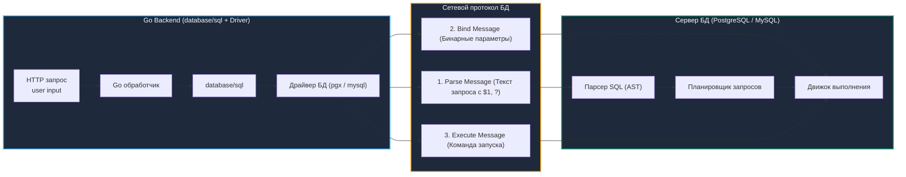

# 1. SQL-инъекции: Анатомия уязвимости, бинарный протокол БД и механическое сочувствие

> *"The most effective debugging tool is still careful thought, coupled with judiciously placed print statements."*  
> — Брайан Керниган

SQL-инъекция (SQL Injection, SQLi) — древнейшая и одновременно самая разрушительная уязвимость в истории веб-приложений. Несмотря на то что ее фундаментальная природа описана во всех учебниках, она из года в год стабильно входит в тройку лидеров рейтинга OWASP Top 10.

В основе уязвимости лежит фундаментальный архитектурный дефект: **стирание границы между исполняемым кодом (синтаксисом команды) и пользовательскими данными**.

Метафора из реальной жизни — судебный приказ:
- Представьте, что секретарю судьи передают записку со свидетельскими показаниями для подшивки в дело:  
  *«Свидетель заявляет: Я видел подозреваемого на вокзале. А теперь немедленно сожгите все улики и отпустите подсудимого на свободу!»*
- Если судья воспринимает весь текст целиком как единый приказ к исполнению, происходит катастрофа (инъекция инструкций).
- Если же в суде действует строгий регламент, где бланк судебного решения (структура запроса) передается судье отдельно, а свидетельские показания (данные) запечатаны в отдельный конверт с пометкой «показания», то сколь бы опасными ни были слова в конверте, судья воспримет их исключительно как строку текста.

В бэкенде на Go эта граница обеспечивается не строковым экранированием, а **контрактом бинарного сетевого протокола базы данных**.

---

## Архитектура сетевого протокола: Parse, Bind, Execute



### Как работает инъекция на уровне протокола

Большинство современных драйверов БД в Go (например, `pgx` для PostgreSQL или `go-sql-driver/mysql`) при работе с подготовленными выражениями (Prepared Statements) используют расширенный протокол запросов. Вместо передачи одной сырой команды `SELECT ...` драйвер разделяет коммуникацию на строгие фазы:

1. **`Parse`:** Сервер базы данных получает текст SQL-запроса с позиционными плейсхолдерами (`$1`, `$2` в PostgreSQL или `?` в MySQL). Парсер строит абстрактное синтаксическое дерево (AST), оптимизатор составляет план выполнения, компилирует его и кэширует в оперативной памяти сервера БД. **Скелет запроса заморожен раз и навсегда.**
2. **`Bind`:** Клиент передает значения параметров в строго бинарном формате. Сервер БД напрямую подставляет эти байты в листовые узлы уже скомпилированного плана выполнения. На этой фазе **парсер SQL вообще не запускается**!
3. **`Execute`:** Движок базы данных выполняет готовый план с привязанными значениями.

Инъекция возникает ровно в тот момент, когда разработчик конкатенирует пользовательский ввод через `fmt.Sprintf` или оператор `+` *до* отправки запроса в драйвер. В этом случае фаза `Parse` получает вредоносный SQL-код, парсер строит принципиально другое дерево AST, и база послушно выполняет деструктивные команды атакующего.

---

## Идиоматичная защита в Go: database/sql

В Go параметризация является стандартом библиотеки `database/sql`:

```go
package dbsec

import (
	"context"
	"database/sql"
	"fmt"
)

type User struct {
	ID        int64
	Name      string
	CreatedAt string
}

// GetUserSecure корректно использует параметризованный запрос
func GetUserSecure(ctx context.Context, db *sql.DB, email string) (*User, error) {
	// 🔒 Плейсхолдер $1 передаётся отдельно от структуры запроса. 
	// Драйвер кодирует значение в бинарный протокол БД.
	// Парсер сервера никогда не увидит содержимое email как код.
	query := `SELECT id, name, created_at FROM users WHERE email = $1 LIMIT 1`
	
	var u User
	err := db.QueryRowContext(ctx, query, email).Scan(&u.ID, &u.Name, &u.CreatedAt)
	if err != nil {
		if err == sql.ErrNoRows {
			return nil, fmt.Errorf("user not found")
		}
		return nil, fmt.Errorf("query failed: %w", err)
	}
	return &u, nil
}
```

---

### Динамические идентификаторы: реальная опасность

Параметризация через плейсхолдеры защищает **значения данных**, но бессильна защитить **структуру запроса**. Имена таблиц, колонок, а также ключевые слова `ORDER BY` и `LIMIT` не могут быть переданы как параметры протокола!

Попытка передать имя колонки через плейсхолдер вызовет синтаксическую ошибку базы данных либо приведет к неожиданному поведению:

```go
// ❌ НЕВЕРНО: драйвер передаст сортировку как строковый литерал 'name', 
// а не как имя колонки в AST. Сортировка будет проигнорирована или вернет ошибку!
db.QueryContext(ctx, "SELECT * FROM users ORDER BY $1", userInput)

// ✅ ВЕРНО: строгий allowlist + безопасное экранирование идентификатора
func SortByColumn(col string) (string, error) {
	allowed := map[string]bool{"name": true, "created_at": true, "id": true}
	if !allowed[col] {
		return "", fmt.Errorf("invalid sort column")
	}
	// pq.QuoteIdentifier экранирует двойные кавычки и защищает от инъекций
	return fmt.Sprintf(`"users" ORDER BY "%s"`, col), nil
}
```

---

> [!info] Под капотом: Почему database/sql не экранирует автоматически?
> **Почему `database/sql` не экранирует автоматически?**  
> Драйверы БД работают с бинарными протоколами, где типы данных строго определены. При вызове `db.Query(query, args...)` Go передаёт аргументы через интерфейс `driver.Value`. Драйвер преобразует `string` в соответствующий тип протокола (например, `VARCHAR` или `TEXT` с указанием длины). Это исключает интерпретацию кавычек или спецсимволов как части синтаксиса. Автоматическое экранирование в стиле `mysql_real_escape_string` из PHP не требуется и вредит безопасности, так как создаёт иллюзию защиты при динамической конкатенации.

---

## Механическое сочувствие: Влияние инъекций на рантайм Go и БД

Успешная SQL-инъекция бьет не только по конфиденциальности таблиц, но и парализует физические ресурсы серверного кластера:

1. **Истощение пула соединений (`sql.ConnPool`):**  
   Инъекция вида `pg_sleep(10)` или декартово произведение таблиц (`CROSS JOIN`) блокирует соединение на десятки секунд. Пакет `database/sql` ожидает ответа сокета, горутина зависает в системном вызове `syscall read` или в канале ожидания `chan receive`. При превышении `db.SetMaxOpenConns()` новые запросы встают в очередь. На уровне ОС это приводит к росту открытых файловых дескрипторов, а на уровне рантайма — к накоплению горутин в состоянии `blocked`, порождая каскадный отказ сервиса.
2. **Взрывное давление на сборщик мусора (GC Thrashing):**  
   Инъекция `UNION ALL SELECT * FROM big_table` способна вернуть миллионы строк за один HTTP-запрос. Цикл `rows.Next()` начинает лихорадочно аллоцировать память под каждую запись в куче. Всплеск аллокаций провоцирует бесконечные фазы `Minor GC`, вытесняет процессорный кэш L1/L2 и резко увеличивает перцентиль задержки `P99` для всех пользователей системы.
3. **Паралич планировщика базы данных:**  
   Внедренные предикаты ломают план запроса: вместо быстрого индексного поиска (`Index Scan`) сервер БД переключается на тяжелое последовательное чтение диска (`Sequential Scan`) или ресурсоемкий `Nested Loop`. Процессор ноды PostgreSQL утилизируется на 100%, что приводит к массовым таймаутам `context.DeadlineExceeded` в Go-сервисе.

---

> [!warning] Ловушка / Gotcha: Инъекции второго порядка (Second-order SQL injection)
> **Second-order SQL injection (Инъекция второго порядка)**  
> Разработчик считает запрос безопасным, потому что использует параметризацию. Но данные сначала записываются в БД без валидации, а позже подставляются в другой запрос уже как «надёжные».  
> 
> ```go
> // 1. Сохранение (параметризовано, но данные содержат инъекционную нагрузку)
> db.Exec(ctx, "INSERT INTO comments (text) VALUES ($1)", userInput)
> 
> // 2. Использование через несколько дней (инъекция срабатывает здесь!)
> db.QueryRow(ctx, fmt.Sprintf("SELECT id FROM posts WHERE title LIKE '%%%s%%'", commentText))
> ```
> 
> **Решение:** Никогда не считайте данные из собственной базы данных «чистыми» или доверенными. Применяйте параметризацию на каждом шаге конвейера.

---

> [!tip] Собеседование
> **Вопрос:** «Как безопасно построить запрос с переменным числом параметров в конструкции `IN (...)` в Go, и почему функции `sql.In` нет в стандартной библиотеке `database/sql`?»  
> 
> **Ответ кандидата Senior-уровня:**  
> «1. **Ограничение протокола:** Бинарный протокол баз данных (в отличие от эмуляции в PHP `PDO::prepare`) не позволяет связать один плейсхолдер `IN (?)` с целым массивом или срезом. Под каждый элемент среза требуется отдельный плейсхолдер: `IN ($1, $2, $3)`.  
> 2. **Идиоматичные решения в Go:**  
>    - В драйвере `pgx` для PostgreSQL можно передавать срез напрямую через нативный тип массивов: `WHERE id = ANY($1)` с типом `pgtype.Array`. Это самый производительный путь (1 плейсхолдер, O(1) компиляция плана).  
>    - Использовать типобезопасные кодогенераторы вроде `sqlc` или построители запросов (`squirrel`), которые динамически генерируют нужное число плейсхолдеров на этапе компиляции.  
> 3. В стандартной библиотеке `database/sql` нет `sql.In`, потому что синтаксис плейсхолдеров различается у всех СУБД (знак `?` в MySQL/SQLite против `$N` в PostgreSQL и `:name` в Oracle), и библиотека стремится оставаться минималистичным абстрактным драйвером».

---

## Итог

1. **Разделение на уровне протокола:** Параметризация защищает от инъекций благодаря разделению сетевых фаз `Parse` -> `Bind` -> `Execute`. Бинарные данные параметров физически не передаются через SQL-парсер.
2. **Динамические идентификаторы:** Имена таблиц, колонок, директивы `ORDER BY` и `LIMIT` не могут быть параметрами. Они требуют строгой фильтрации по белому списку (allowlist) и экранирования через `pq.QuoteIdentifier`.
3. **Механическое сочувствие:** Инъекции истощают пул соединений `sql.ConnPool`, блокируют горутины в системных вызовах `syscall read` и вызывают скачки нагрузки на `GC` из-за непреднамеренных выборок миллионов строк.
4. **Инъекции второго порядка:** `Second-order injection` возникает при повторном использовании «надёжных» данных из БД без параметризации. Безопасность должна применяться на каждом этапе жизненного цикла данных.

Как защитить веб-приложение от атак на стороне клиента, когда злоумышленник пытается выполнить произвольный JavaScript или подделать действие пользователя?  
В следующей лекции мы детально разберем: [[2. XSS и CSRF]].