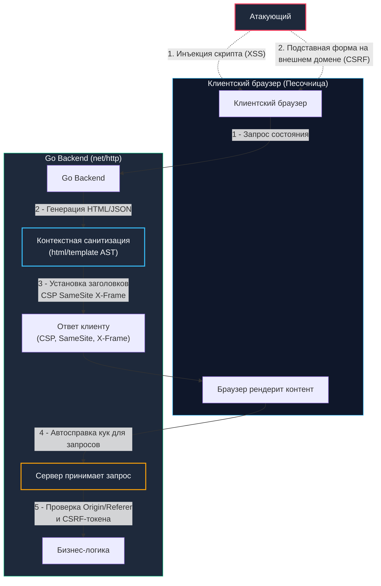

## Введение: Почему бэкенд отвечает за то, что происходит в браузере

Существует опасная иллюзия, будто безопасность клиентской части — это забота исключительно фронтенд-инженеров. На практике браузер пользователя представляет собой недоверенную удаленную виртуальную машину, которая послушно исполняет любой активный контент, полученный от вашего сервера. Если бэкенд отдаёт непроверенные пользовательские данные или не выстраивает строгие контекстные границы доверия, серверная система фактически передает бразды правления злоумышленнику.

Две классические веб-уязвимости — **XSS (Cross-Site Scripting)** и **CSRF (Cross-Site Request Forgery)** — бьют по разным сторонам одной медали:
- **XSS** — это *выполнение произвольного кода*: злоумышленник заставляет браузер жертвы выполнить чужой JavaScript в контексте вашего доверенного домена. Скрипт получает доступ к `document.cookie`, локальному хранилищу `localStorage`, токенам сессий и DOM-дереву.
- **CSRF** — это *эксплуатация механизма автоматической аутентификации* (Ambient Authority): браузер услужливо прикрепляет сессионные куки к любому HTTP-запросу, направленному на ваш сервер, даже если этот запрос был инициирован со стороннего вредоносного сайта.

Для инженера на Go защита от этих атак требует понимания внутреннего устройства `net/http`, абстрактного синтаксического дерева (AST) шаблонизатора `html/template`, механизмов аллокации памяти при валидации заголовков и правильной настройки политик браузерного песочника.



---

## 1. XSS: Инъекция кода и контекстная санитизация

Фундаментальная причина XSS — смешивание недоверенных данных с управляющим кодом страницы. В зависимости от точки внедрения и пути прохождения трафика выделяют три класса атак:
1. **Отражённый (Reflected):** Вредоносная полезная нагрузка передается в параметрах входящего HTTP-запроса (например, в query-параметре `?search=...`) и немедленно отражается сервером в теле ответа без сохранения на диске.
2. **Хранимый (Stored):** Полезная нагрузка сохраняется в постоянном хранилище (БД, кэш, файл) и впоследствии отдается сервером всем пользователям, запрашивающим эту запись (лента комментариев, профиль). Это наиболее разрушительный тип атаки.
3. **DOM-базированный:** Вредоносный код внедряется непосредственно клиентским JavaScript без перезагрузки страницы (например, через небезопасный `eval()` или свойство `innerHTML`). Бэкенд участвует косвенно, отдавая сырые неэкранированные данные через REST/JSON API.

### Как Go решает проблему: пакет `html/template`

В стандартной библиотеке Go существует два пакета шаблонов: `text/template` и `html/template`.  
**Никогда не используйте `text/template` для генерации веб-страниц!**

Пакет `html/template` содержит полноценный лексический анализатор HTML5, CSS и JavaScript. При компиляции шаблона он строит синтаксическое дерево и для каждого выражения `{{.}}` определяет его контекст исполнения:
- Обычный HTML-текст (между тегами).
- Значение HTML-атрибута (`<div class="{{.}}">`).
- Некавычечный атрибут (`<div class={{.}}>`).
- Контекст URL (`<a href="{{.}}">` или `<script src="{{.}}">`).
- Контекст тела JavaScript (`<script>var x = {{.}};</script>`).
- Контекст CSS (`<style>body { color: {{.}}; }</style>`).

```go
package views

import (
	"html/template"
	"net/http"
)

// Компиляция шаблона на старте программы
var profileTmpl = template.Must(template.New("profile").Parse(`
<!DOCTYPE html>
<html lang="ru">
<head>
    <meta charset="utf-8">
    <meta http-equiv="Content-Security-Policy" content="default-src 'self'; script-src 'none';">
    <title>Профиль пользователя</title>
</head>
<body>
    <h1>Привет, {{.Username}}</h1>
    <script>
        // Контекст JavaScript экранируется автоматически в безопасный строковый литерал
        var userBio = "{{.Bio}}";
        console.log("User loaded:", userBio);
    </script>
    <a href="/profile?id={{.ProfileID}}">Открыть профиль</a>
</body>
</html>
`))

func ProfileHandler(w http.ResponseWriter, r *http.Request) {
	data := struct {
		Username  template.HTMLAttr
		Bio       string
		ProfileID string
	}{
		// ⚠️ template.HTMLAttr отключает экранирование! 
		// Используйте только для статически проверенных доверенных констант.
		Username:  template.HTMLAttr("admin"),
		// Безопасно экранируется в JS-контексте как \x3cscript\x3ealert(\x27XSS\x27)\x3c/script\x3e
		Bio:       "<script>alert('XSS')</script>",
		// Безопасно экранируется как URL-query компонент: 123%26callback%3Dmalicious
		ProfileID: "123&callback=malicious",
	}

	w.Header().Set("Content-Type", "text/html; charset=utf-8")
	w.Header().Set("X-Content-Type-Options", "nosniff")
	// Современные браузеры отключают старый XSS-фильтр IE/WebKit, так как он сам порождал уязвимости
	w.Header().Set("X-XSS-Protection", "0")

	if err := profileTmpl.Execute(w, data); err != nil {
		http.Error(w, "template render error", http.StatusInternalServerError)
		return
	}
}
```

---

> [!info] Под капотом: Внутренний конечный автомат html/template и аллокации памяти
> **Как `html/template` работает с памятью и кэшем:**  
> 1. При вызове `template.New().Parse()` шаблон превращается во внутренний конечный автомат (State Machine). Компилятор разбивает шаблон на узлы и определяет контекст каждого вхождения `{{.}}`.  
> 2. Каждый последующий вызов `Execute` запускает обход АСТ и потоковую запись в переданный `io.Writer` (в сетевом стеке это `http.ResponseWriter`).  
> 3. Экранирование происходит посимвольно. Для динамических строк внутри рантайма используется `strings.Builder`, который минимизирует аллокации за счёт переаллокации буфера с коэффициентом роста ~2. Однако при потоковой обработке больших текстов (статьи, лонгриды) частые аллокации создают ощутимое давление на `GC`. В высоконагруженных шлюзах рекомендуется кэшировать отрендеренные фрагменты или использовать `sync.Pool` для пула `strings.Builder`, если вы проектируете кастомный движок рендеринга.

---

### Почему ручное экранирование через `regexp` или `strings.Replace` обречено на провал

Частая ошибка начинающих разработчиков — попытка «вычистить» опасные теги через `strings.Replace(s, "<script>", "", -1)` или наивный `regexp`. Атакующие легко обходят такие барьеры благодаря богатству спецификации HTML5:
- Событийные обработчики тегов: `` (тег `<script>` вообще отсутствует).
- Вложенные и ломающие теги в JS-блоках: `var x = "</script><script>alert(1)</script>";`.
- Псевдопротоколы в ссылках и стилях: `<a href="javascript:alert(1)">` или `background: url(javascript:alert(1))`.
- Unicode-нормализация, нулевые байты или двойное URL-кодирование.

Поскольку `html/template` анализирует язык на уровне грамматического разбора, он подставляет соответствующие таблицы подстановок: HTML-entity кодирование (`&lt;`, `&gt;`), JavaScript Unicode-экранирование (`\u003c`, `\x22`) или URL percent-encoding (`%20`, `%26`).

---

## 2. CSRF: Атаки через доверие браузера

Механизм **CSRF (Cross-Site Request Forgery)** опирается на фундаментальное соглашение ранней архитектуры Сети: если пользователь вошел на сайт `bank.com`, браузер сохраняет сессионную куку `session_id`. Когда тот же пользователь посещает вредоносный сайт `evil.com`, страница на `evil.com` может содержать скрытый элемент:

```html
<form action="https://bank.com/transfer" method="POST">
    <input type="hidden" name="to" value="attacker_account" />
    <input type="hidden" name="amount" value="10000" />
</form>
<script>document.forms[0].submit();</script>
```

Браузер добросовестно отправит POST-запрос на `https://bank.com/transfer` и **автоматически прикрепит куку `session_id`**. Сервер проверит куку, убедится в подлинности сессии пользователя и переведет деньги.

Защита от CSRF в современных веб-сервисах на Go строится по принципу эшелонированной обороны на трёх рубежах:

```
        ┌───────────────────────────────────────────────────────────────┐
        │ Рубеж 1: SameSite куки (Strict / Lax)                         │
        │ Браузер отказывается передавать куки при кросс-доменном POST   │
        └───────────────────────────────┬───────────────────────────────┘
                                        ▼
        ┌───────────────────────────────────────────────────────────────┐
        │ Рубеж 2: Валидация заголовков Origin и Referer                │
        │ Сервер сверяет домен источника запроса со своим белым списком  │
        └───────────────────────────────┬───────────────────────────────┘
                                        ▼
        ┌───────────────────────────────────────────────────────────────┐
        │ Рубеж 3: Криптографические токены (CSRF Token / Double Submit)│
        │ Проверка непредсказуемого секрета в заголовке X-CSRF-Token     │
        └───────────────────────────────────────────────────────────────┘
```

---

### Уровень 1: Атрибут `SameSite` в `http.Cookie`

Современные браузеры поддерживают атрибут `SameSite`, регулирующий передачу кук при переходах между разными источниками (Sites):
- `SameSite=Strict`: Кука никогда не отправляется в кросс-сайтовых запросах, даже если пользователь кликнул по обычной ссылке на внешнем сайте.
- `SameSite=Lax`: Кука отправляется только при безопасных навигационных запросах верхнего уровня (`GET`). Для мутирующих методов (`POST/PUT/DELETE`) через AJAX или формы куки блокируются.
- `SameSite=None`: Куки отправляются всегда, но требуют обязательного флага `Secure`.

В Go настройка выполняется непосредственно в `http.Cookie`:

```go
cookie := &http.Cookie{
    Name:     "session_id",
    Value:    token,
    Path:     "/",
    HttpOnly: true,                    // Защита от кражи через XSS
    Secure:   true,                    // Передача строго по HTTPS
    SameSite: http.SameSiteStrictMode, // 🔒 Ключевая защита от CSRF на уровне браузера
}
http.SetCookie(w, cookie)
```

---

> [!warning] Ловушка / Gotcha: Опасности режима SameSite=None и браузерная специфика
> **`SameSite=None` требует `Secure`:**  
> Если ваш сервис работает в распределенной микросервисной инфраструктуре на разных поддоменах или обслуживает встроенные iframe-виджеты и вам требуется кросс-доменная передача сессионных кук, вы обязаны указать комбинацию:  
> `SameSite: http.SameSiteNoneMode` **и** `Secure: true`.  
> Если флаг `Secure` опущен, современные браузеры (Chrome 80+, Safari, Firefox) отвергнут заголовок `Set-Cookie` или принудительно переведут куку в режим `Lax`, полностью ломая процесс входа пользователей.

---

### Уровень 2: Проверка заголовков `Origin` и `Referer`

Перед выполнением бизнес-логики сервер проверяет заголовки источника запроса. Это легковесная и очень быстрая операция, не требующая выделения состояния и генерации токенов:

```go
package security

import (
	"net/http"
	"net/url"
	"strings"
)

// isOriginAllowed проверяет заголовок Origin или Referer по списку доверенных доменов
func isOriginAllowed(r *http.Request, allowedDomains []string) bool {
	origin := r.Header.Get("Origin")
	if origin == "" {
		// Fallback на Referer, если Origin отсутствует (старые клиенты или навигация)
		referer := r.Header.Get("Referer")
		if referer == "" {
			return false
		}
		origin = referer
	}

	// Парсим URL и проверяем протокол. Категорически избегаем наивного strings.Contains!
	u, err := url.Parse(origin)
	if err != nil || u.Scheme != "https" {
		return false
	}

	for _, domain := range allowedDomains {
		// Точное совпадение домена либо доверенный поддомен (.example.com)
		if u.Host == domain || strings.HasSuffix(u.Host, "."+domain) {
			return true
		}
	}
	return false
}
```

---

### Уровень 3: CSRF-токены (Double Submit Cookie и Synchronized Token)

Когда поддержки `SameSite` недостаточно (старые браузеры, специфические REST-клиенты, сторонние интеграции), применяется токенизация:
1. **Synchronized Token Pattern:** Сервер генерирует криптографически случайный токен, сохраняет его в серверной сессии пользователя и встраивает в скрытое поле HTML-формы. При отправке формы сервер сверяет токен из запроса с токеном из сессии.
2. **Double Submit Cookie:** Популярен в Single Page Applications (SPA).
   - Сервер генерирует псевдослучайный токен и выставляет клиенту в куку `csrf_token` с флагом `HttpOnly=false` (чтобы клиентский JavaScript мог его прочесть), но обязательно с флагами `Secure/SameSite`.
   - Клиентский фреймворк (React/Vue/Angular) считывает значение куки и передает его в кастомном заголовке `X-CSRF-Token` при каждом мутирующем AJAX-запросе.
   - Сервер сравнивает значение из куки со значением из заголовка. Злоумышленник на `evil.com` не может прочесть куку `csrf_token` чужого домена в силу действия политики `Same-Origin Policy (SOP)`, а значит, не способен сформировать заголовок `X-CSRF-Token`.

```go
package security

import (
	"crypto/subtle"
	"errors"
	"fmt"
	"net/http"
)

// VerifyCSRFToken проверяет совпадение CSRF токена из заголовка и куки
func VerifyCSRFToken(r *http.Request) error {
	tokenHeader := r.Header.Get("X-CSRF-Token")
	if tokenHeader == "" {
		return errors.New("missing CSRF token in header")
	}

	cookie, err := r.Cookie("csrf_token")
	if err != nil {
		return fmt.Errorf("missing CSRF cookie: %w", err)
	}

	// 🔒 Сравнение в константном времени для защиты от timing-атак по сторонним каналам
	if subtle.ConstantTimeCompare([]byte(tokenHeader), []byte(cookie.Value)) != 1 {
		return errors.New("CSRF token mismatch")
	}
	return nil
}
```

---

## 3. Механика производительности: парсинг заголовков и аллокации

Проверка `Origin`, `Referer` и верификация CSRF-токенов находятся в критическом пути каждого входящего HTTP-запроса сервиса. Как это отражается на железе и рантайме Go?

1. **Аллокации при вызове `url.Parse`:**  
   Функция `url.Parse` производит синтаксический разбор строки и аллоцирует в куче структуру `url.URL`, включая вложенные срезы и строки. При нагрузке в 50 000 RPS частый парсинг `Origin` генерирует до 100–150 МБ короткоживущего мусора в секунду, вызывая всплески `Minor GC`.  
   *Оптимизация:* Если список входящих хостов предсказуем, кэшируйте результаты парсинга хоста или для высоконагруженных API-шлюзов используйте легковесные методы разбора строки без аллокаций (`github.com/valyala/fasthttp` либо байтовый поиск слэшей).
2. **Стоимость сравнения строк:**  
   Сравнение через `strings.EqualFold` завершается при первом несовпавшем байте. Напротив, криптографическая функция `subtle.ConstantTimeCompare` выполняет фиксированное число инструкций процессора независимо от совпадения, исключая утечки времени. Для токенов длиной 32–64 байта задержка составляет считанные наносекунды (несколько тактов CPU), что полностью оправдано безопасностью.
3. **Генерация токенов:**  
   Вызов `crypto/rand.Read()` осуществляет системный вызов к источнику энтропии ядра ОС (`getrandom` в Linux). Для минимизации накладных расходов применяйте пулы буферов (`sync.Pool`) и генерируйте токены батчами, если генерация происходит с высокой частотой.

---

> [!tip] Собеседование
> **Вопрос:** «Зачем нужна CSRF-защита в сервисах, отдающих исключительно JSON (REST API), если фронтенд передает `Bearer`-токен в заголовке `Authorization`, а данные хранит в `localStorage`?»  
> 
> **Ответ кандидата Senior-уровня:**  
> «1. **XSS против CSRF:** Если токен хранится в `localStorage`, приложение уязвимо к XSS. В случае успешного выполнения XSS злоумышленник читает `localStorage` и отправляет запрос напрямую от своего имени. Здесь CSRF не нужен — произошла прямая кража учетных данных.  
> 2. **Гибридные схемы:** Если сервис хранит сессионный Refresh token в безопасной `HttpOnly` куке для предотвращения его кражи скриптами, то эндпоинт обновления токена (`/api/v1/auth/refresh`) автоматически становится мишенью для CSRF-атаки.  
> 3. **Браузерный механизм Preflight:** Браузер не позволяет HTML-форме отправить кросс-доменный POST-запрос с заголовком `Content-Type: application/json` без предварительного CORS Preflight-запроса (`OPTIONS`). Если бэкенд строго валидирует заголовок `Content-Type` и отклоняет любые запросы `application/x-www-form-urlencoded` и `multipart/form-data`, простая CSRF-форма не сработает.  
> 4. **Итоговое архитектурное правило:** Для JSON API обязательным стандартом является триада: куки `SameSite=Strict/Lax` + валидация `Content-Type: application/json` + проверка белого списка заголовка `Origin`».

---

## 4. Архитектурные заголовки и `net/http` Middleware

Безопасность бэкенда не заканчивается на валидации данных. Сервер обязан транслировать браузеру жесткие правила изоляции среды с помощью HTTP-заголовков безопасности. В Go это реализуется через централизованный HTTP Middleware:

```go
package middleware

import "net/http"

// SecurityHeadersMiddleware навешивает критически важные защитные заголовки на каждый ответ
func SecurityHeadersMiddleware(next http.Handler) http.Handler {
	return http.HandlerFunc(func(w http.ResponseWriter, r *http.Request) {
		h := w.Header()

		// 🔒 CSP (Content Security Policy): запрещает загрузку скриптов с недоверенных хостов и inline-код
		h.Set("Content-Security-Policy", "default-src 'self'; script-src 'self' https://cdn.example.com; object-src 'none'")

		// 🔒 Запрет MIME-сниффинга: запрещает браузеру исполнять файл как скрипт, если Content-Type иной
		h.Set("X-Content-Type-Options", "nosniff")

		// 🔒 Защита от Clickjacking: запрещает отображение сайта в iframe сторонних ресурсов
		h.Set("X-Frame-Options", "DENY")

		// 🔒 HSTS (HTTP Strict Transport Security): заставляет браузер обращаться к серверу только по HTTPS
		h.Set("Strict-Transport-Security", "max-age=31536000; includeSubDomains; preload")

		next.ServeHTTP(w, r)
	})
}
```

Вызов `w.Header()` в стандартной библиотеке Go возвращает внутреннюю мапу `map[string][]string`, которая аллоцируется лениво. Установка строковых заголовков происходит за O(1). Поскольку заголовочные строки сериализуются в сетевой буфер сокета при отправке статуса ответа, порядок их добавления и компактность напрямую определяют размер первого TCP-пакета ответа (`syscall write`).

---

## Итог

1. **Контекстное экранирование против XSS:** Защита от XSS на бэкенде опирается на AST-парсер пакета `html/template`, который различает HTML, JS, CSS и URL-контексты. Попытки чистить разметку регулярными выражениями или `strings.Replace` неминуемо ведут к уязвимостям.
2. **Эшелонированная оборона от CSRF:** Первый рубеж — выставление атрибута `SameSite=Strict/Lax` в `http.Cookie`. Второй рубеж — проверка источника через заголовки `Origin` и `Referer`. Третий рубеж (для форм и SPA) — токенизация через Synchronized Token или Double Submit Cookie с константным сравнением через `subtle.ConstantTimeCompare`.
3. **Механическое сочувствие к рантайму:** Парсинг URL через `url.Parse` при высоких RPS генерирует мусор в куче и нагружает `Minor GC`. Используйте кэширование проверенных доменов, пулы буферов `sync.Pool` для форматирования строк и генерации токенов.
4. **Централизация политик:** Мидлварь с заголовками безопасности (CSP, HSTS, X-Frame-Options, X-Content-Type-Options) минимизирует человеческий фактор и закрывает целый спектр векторов эксплуатации в один клик.

Что делать, если злоумышленник использует наш бэкенд в качестве прокси для сканирования внутренних сетей компании и облачных метаданных?  
В следующей лекции мы детально разберем уязвимость: [[3. SSRF]].