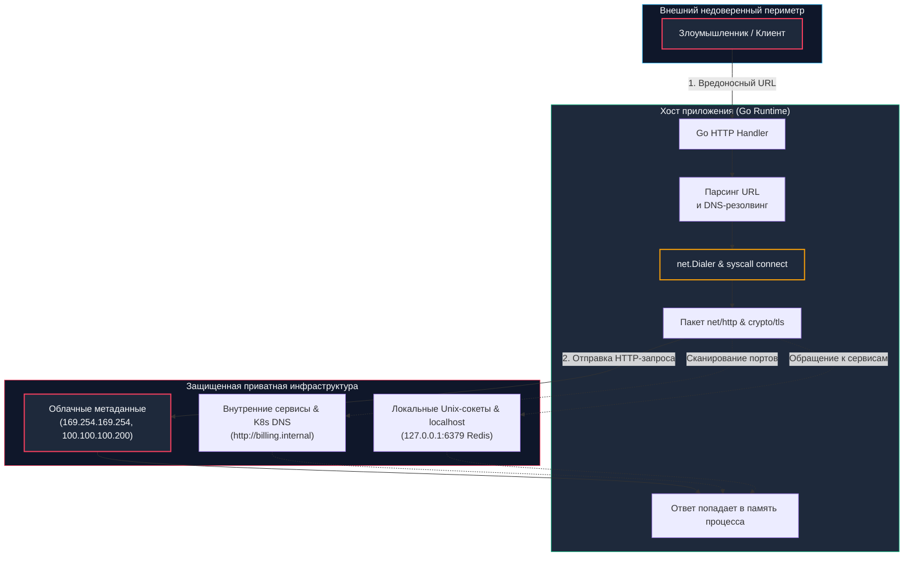

## Введение: Когда сервер становится прокси атакующего

В архитектуре распределенных систем существует классическая инженерная задача: серверу необходимо загрузить ресурс из внешнего мира по запросу пользователя. Типичные примеры — скачивание аватара по переданной ссылке, отправка Webhook-уведомления на сторонний адрес или валидация XML-схемы. 

Если эта функциональность спроектирована наивно, сервис открывает прямую дорогу для уязвимости **SSRF (Server-Side Request Forgery — подделка запроса на стороне сервера)**.

Суть проблемы кроется в концепции неявного доверия: сервер бэкенда физически находится внутри защищенного сетевого периметра компании (VPC, локальная сеть, приватный кластер Kubernetes). Внешний клиент не имеет прямого доступа к закрытым сервисам, однако он может заставить ваш Go-сервер сделать запрос *от своего имени*. Для внутренней сети этот исходящий сетевой пакет выглядит полностью легитимным.



Для разработчика на Go SSRF опасен не только доступом к внутренним API. Успешная эксплуатация позволяет:
- **Прочитать метаданные облачных провайдеров** (`169.254.169.254` в AWS EC2/GCP, `100.100.100.200` в Yandex Cloud), мгновенно скомпрометировав временные IAM-токены и ключи доступа к инфраструктуре.
- **Сканировать внутренние порты и сервисы**, составляя карту топологии сети предприятия.
- **Вызвать отказ в обслуживании (DoS)** через бесконечные редиректы, циклы или удержание открытых сетевых сокетов с таймаутами ядра.
- **Получить доступ к локальным unix-сокетам или `localhost` эндпоинтам** (Redis, Memcached, Docker daemon), не требующим пароля в доверенной петле обратной связи.

---

## Механика SSRF в рантайме Go: от резолвинга до syscall

В Go сетевые запросы обслуживаются высокоуровневым пакетом `net/http` и низкоуровневым примитивом `net`. Понимание того, как рантайм взаимодействует с ядром Linux, помогает осознать скрытые риски стандартных библиотечных абстракций.

### 1. Архитектура `http.Client` по умолчанию

Стандартный `http.DefaultClient` и вспомогательная функция `http.Get` исторически спроектированы для быстрого прототипирования: **они не имеют таймаутов вообще** и автоматически следуют за редиректами до 10 раз. В продакшене использование такого клиента для внешних ссылок — прямая дорога к аварии.

```go
package handlers

import (
	"net/http"
)

// ❌ Опасно: стандартный клиент без ограничений
func FetchURLBad(w http.ResponseWriter, r *http.Request) {
	target := r.URL.Query().Get("url")
	// 🔴 Нет общего таймаута, авто-редиректы до 10 шагов, нет валидации адресата
	resp, err := http.Get(target)
	if err != nil {
		http.Error(w, "failed to fetch url", http.StatusInternalServerError)
		return
	}
	defer resp.Body.Close()
	// ... обработка ответа
}
```

---

### 2. Под капотом: сетевой стек, планировщик и аллокации

Когда сервис вызывает `http.Client.Get(url)`, рантайм Go выполняет сложный конвейер операций:

1. **Парсинг и резолвинг DNS:**  
   `net.DefaultResolver.LookupIPAddr` вызывает либо системный `getaddrinfo` (через механизм `cgo`), либо использует встроенный pure-Go DNS-резолвер, читающий `/etc/resolv.conf`. Каждая операция поиска порождает аллокации в куче: срезы `[]byte` для буферов сокетов, структуры `IP`, `Addr` и списки адресов.
2. **Установление соединения (`syscall connect`):**  
   Метод `net.Dialer.DialContext` выполняет системный вызов `connect`. В ядре Linux при неблокирующем сокете этот вызов возвращает `EINPROGRESS`, и рантайм Go передает файловый дескриптор в сетевой поллер (`netpoll` на базе `epoll`). Горутина переходит в состояние ожидания `netpoll`, освобождая логический процессор `P` для исполнения других задач.
3. **TLS Handshake:**  
   Если запрошен протокол `https://`, сетевой стек инициирует TLS-рукопожатие в пространстве пользователя (`crypto/tls`). Рантайм аллоцирует буферы под парсинг цепочек X.509 сертификатов, ключи Диффи-Хеллмана и сессионные шифротексты.
4. **Чтение ответа:**  
   Функция `http.ReadResponse` буферизует заголовки и тело. Если разработчик забывает ограничить размер читаемого ответа через `io.LimitReader`, многогигабайтный ответ от вредоносного ресурса аллоцирует мегабайты памяти в куче, провоцирует взрывные циклы `Minor GC` и вытесняет процессорные кэш-линии L1/L2/L3.

---

> [!info] Под капотом: Влияние на планировщик и файловые дескрипторы
> **Истощение ресурсов ОС при SSRF:**  
> Если атакующий передаст адрес, находящийся в «чёрной дыре» маршрутизации (например, заблокированный IP `10.255.0.1:9999` или хост, сбрасывающий TCP SYN пакеты в тишину), сетевой стек ядра будет ожидать TCP-таймаута (по умолчанию в Linux от 60 до 120 секунд).  
> Горутина переходит в состояние ожидания, но ассоциированный файловый дескриптор сетевого сокета остается открытым в таблице дескрипторов процесса. При 1 000 таких одновременных запросов сервис стремительно упирается в лимит процесса `ulimit -n`, ядро возвращает ошибку `EMFILE (Too many open files)`, и сетевой слушатель `http.Server` перестает принимать любые входящие соединения пользователей. Это не CPU-буря, а незаметный, но фатальный паралич дескрипторов ОС.

---

## Идиоматичная защита: транспорт, редиректы и валидация

Эффективная защита от SSRF в Go не может быть реализована простой строковой проверкой URL перед вызовом. Защита обязана быть эшелонированной: строгая валидация протокола, низкоуровневая фильтрация IP-адресов в `DialContext` после DNS-резолвинга, контроль редиректов и жесткие таймауты на каждом этапе.

```go
package ssrf

import (
	"context"
	"fmt"
	"net"
	"net/http"
	"strings"
	"time"
)

// NewSecureHTTPClient создаёт клиент, гарантированно защищённый от SSRF и зависаний
func NewSecureHTTPClient() *http.Client {
	dialer := &net.Dialer{
		Timeout:   5 * time.Second,  // Таймаут на установление TCP-соединения
		KeepAlive: 30 * time.Second, // Поддержание Keep-Alive
		// DUALSTACK разрешает параллельный опрос IPv6 и IPv4
	}

	transport := &http.Transport{
		DialContext: func(ctx context.Context, network, addr string) (net.Conn, error) {
			// 1. Извлекаем хост и порт из адреса назначения
			host, port, err := net.SplitHostPort(addr)
			if err != nil {
				return nil, fmt.Errorf("split host port: %w", err)
			}

			// 2. Принудительно резолвим адрес перед вызовом системного сокета
			ips, err := net.DefaultResolver.LookupIPAddr(ctx, host)
			if err != nil {
				return nil, fmt.Errorf("dns lookup: %w", err)
			}

			// 3. 🔒 Проверяем каждый полученный IP-адрес на принадлежность к запрещенным диапазонам
			for _, ip := range ips {
				if isBlockedIP(ip.IP) {
					return nil, fmt.Errorf("blocked IP range: %s", ip.IP.String())
				}
			}

			// 4. Подключаемся напрямую к первому проверенному IP для защиты от DNS Rebinding
			targetAddr := net.JoinHostPort(ips[0].IP.String(), port)
			return dialer.DialContext(ctx, network, targetAddr)
		},
		TLSHandshakeTimeout:   5 * time.Second,
		ResponseHeaderTimeout: 5 * time.Second,
		ExpectContinueTimeout: 1 * time.Second,
		MaxIdleConns:          100,
		IdleConnTimeout:       90 * time.Second,
	}

	return &http.Client{
		Transport: transport,
		Timeout:   10 * time.Second, // 🔒 Жёсткий суммарный таймаут всего запроса
		CheckRedirect: func(req *http.Request, via []*http.Request) error {
			if len(via) >= 5 {
				return fmt.Errorf("stopped after 5 redirects")
			}
			// 🔒 Повторная проверка URL перед каждым переходом по редиректу
			if err := validateURL(req.URL.String()); err != nil {
				return fmt.Errorf("redirect blocked: %w", err)
			}
			return nil
		},
	}
}

// isBlockedIP проверяет, находится ли адрес в приватных, локальных или метаданных диапазонах
func isBlockedIP(ip net.IP) bool {
	// Петля обратной связи (127.0.0.0/8, ::1)
	if ip.IsLoopback() {
		return true
	}
	// Приватные подсети RFC 1918 (10.0.0.0/8, 172.16.0.0/12, 192.168.0.0/16)
	if ip.IsPrivate() {
		return true
	}
	// Канальные локальные адреса и облачные метаданные (169.254.0.0/16, fe80::/10)
	if ip.IsLinkLocalUnicast() || ip.IsLinkLocalMulticast() {
		return true
	}
	// Нормализация IPv4-mapped IPv6 (например, ::ffff:127.0.0.1)
	if ip4 := ip.To4(); ip4 != nil {
		return isBlockedIP(ip4)
	}
	return false
}

// validateURL проводит базовую проверку допустимости сетевой схемы
func validateURL(rawURL string) error {
	if !strings.HasPrefix(rawURL, "http://") && !strings.HasPrefix(rawURL, "https://") {
		return fmt.Errorf("only HTTP/HTTPS allowed")
	}
	return nil
}
```

---

## Подводные камни и векторы обхода

Реализация защиты от SSRF полна скрытых граблей, о которые регулярно спотыкаются разработчики:

1. **DNS Rebinding (Повторное связывание DNS):**  
   Атакующий регистрирует собственный домен `attacker.com` с TTL = 0 секунд. При первой проверке в приложении `LookupIPAddr` возвращает публичный IP (например, `1.2.3.4`), и валидация успешно проходит. Но пока клиент инициирует TCP-соединение, DNS-сервер атакующего возвращает `127.0.0.1` или IP облачных метаданных.  
   **Решение:** Как показано в коде выше, после DNS-резолвинга вызывайте `net.JoinHostPort` с конкретным проверенным `IP`, а не с исходным доменным именем! Для полной изоляции в production используют `http.Transport.TLSClientConfig` с указанием ServerName для корректного TLS SNI, либо выносят исходящий сетевой трафик в отдельный egress-прокси (sidecar Envoy) с изолированным DNS-кэшем.
2. **Экзотические форматы адресов:**  
   Хакеры используют нестандартные формы записи IP-адресов, чтобы обмануть регулярные выражения:
   - Шестнадцатеричный или восьмеричный IP: `http://0177.0.0.1` (восьмеричный 127.0.0.1).
   - Десятичный integer: `http://2130706433/` (эквивалент 127.0.0.1).
   - IPv4-mapped IPv6: `http://[0:0:0:0:0:ffff:127.0.0.1]` или `http://[::ffff:7f00:1]`.
   - Сервисы разрешения wildcard-доменов: `http://127.0.0.1.nip.io`.
   - Внедрение спецсимволов и нулевых байтов: `http://127.0.0.1%00.example.com`.  
   Стандартные парсеры `net/url` и `net` следуют строгим RFC, поэтому единственным надежным фильтром является преобразование строки через `net.ParseIP` и проверка свойств объекта `net.IP`.
3. **Опасные локальные схемы и протоколы:**  
   Попытки передачи URL вида `file:///etc/passwd`, `gopher://`, `dict://`. Стандартный `http.Client` блокирует не-HTTP схемы, однако при использовании низкоуровневых оберток, кастомного `RoundTripper` или системных утилит через `exec.Command` (например, `curl` или `ffmpeg`) необходимо строго запрещать любые схемы, кроме `http` и `https`.
4. **Повторное использование соединений (`Keep-Alive`):**  
   Пул соединений `http.Transport` кэширует TCP-сокеты. Если злоумышленник заставляет сервис обращаться к контролируемому хосту, сервер может удерживать соединение открытым. В сценариях работы с ненадежными источниками опция `DisableKeepAlives: true` устраняет риск загрязнения пула ценой дополнительных затрат на установку TCP/TLS-сессий.

---

> [!warning] Ловушка / Gotcha: Специфика IPv6 и метод ip.IsPrivate() в Go
> **`net.Dialer.LocalAddr` и IPv6:**  
> При проверке приватных сетей следует помнить, что диапазоны IPv6 отличаются от классического RFC 1918. В IPv6 приватными являются адреса Unique Local Addresses (`fc00::/7`), а адресом петли обратной связи — `::1`.  
> Функция `net.ParseIP` корректно обрабатывает обе спецификации, но метод `ip.IsPrivate()` в Go 1.21+ строго разграничивает форматы. Если адрес передан в виде IPv4-mapped IPv6 (`::ffff:192.168.1.1`), `ip.IsPrivate()` может повести себя неожиданно, если массив байт не приведен к 4-байтовому представлению через `ip4 := ip.To4()`. Всегда проверяйте адрес нормализованным!

---

> [!tip] Собеседование
> **Вопрос:** «Почему простой `strings.Contains(url, "localhost")` или вызов `ip.IsPrivate()` недостаточен для защиты от SSRF, и как Go обрабатывает IPv4-mapped IPv6 адреса?»  
> 
> **Ответ кандидата Senior-уровня:**  
> «1. **Неэффективность текстовых фильтров:** Строковые проверки легко обходятся URL-кодированием (`%6C%6F%63%61%6C%68%6F%73%74`), альтернативными доменами (DNS-туннели, `nip.io`), а также записью IP в виде десятичного целого числа (`2130706433` эквивалентно `127.0.0.1`).  
> 2. **Неполнота метода `IsPrivate()`:** Стандартный метод `ip.IsPrivate()` проверяет диапазоны RFC 1918 (`10.0.0.0/8`, `172.16.0.0/12`, `192.168.0.0/16`), но оставляет открытыми link-local адреса (`169.254.0.0/16`, где живут облачные метаданные AWS/GCP), loopback-диапазон (`127.0.0.0/8`), multicast и зарезервированные адреса.  
> 3. **Тонкость IPv4-mapped IPv6:** Go поддерживает IPv4-mapped IPv6 адреса (`::ffff:192.168.1.1`). Функция `net.ParseIP` возвращает 16-байтовый срез `net.IP`. Без предварительного вызова `ip.To4()` проверка `IsPrivate()` может вернуть `false` для адресов `::1` или `::ffff:127.0.0.1`, если логика валидации не учитывает вложенные представления.  
> 4. **Каноническая архитектура защиты:**  
>    - Проверка должна происходить внутри кастомного `DialContext` строго **после DNS-резолвинга**.  
>    - Валидируются флаги `IsLoopback/IsPrivate/IsLinkLocal` (а также `IsLinkLocalMulticast`).  
>    - Соединение устанавливается непосредственно по проверенному IP-адресу, исключая атаку Time-of-Check to Time-of-Use (DNS Rebinding)».

---

## Итог

1. **Опасность стандартного клиента:** `http.Client` в Go по умолчанию не имеет таймаутов и следует редиректам, что делает его уязвимым к SSRF и DoS без явной конфигурации.
2. **Сетевой стек и системные вызовы:** Сетевой стек рантайма (`net.Dialer`, `netpoll`, `epoll`) асинхронно обрабатывает соединения, но отсутствие таймаутов приводит к исчерпанию файловых дескрипторов и утечке горутин.
3. **Валидация на уровне транспорта:** Валидация IP-адресов должна происходить в `DialContext` после DNS-резолвинга, с обязательной проверкой `IsLoopback`, `IsPrivate`, `IsLinkLocalUnicast` и учётом IPv4-mapped IPv6 форматов.
4. **Контроль редиректов:** Редиректы требуют отдельной проверки (`CheckRedirect`), так как атакующий может изменить целевой адрес после первоначальной валидации.
5. **Эшелонированная архитектура:** Защита от SSRF — это комбинация строгого `http.Transport`, временных ограничений, пула соединений и многоуровневой валидации, встроенной в сетевой примитив, а не в бизнес-логику.

Как предотвратить выполнение вредоносных системных команд операционной системы, когда бэкенду необходимо взаимодействовать с утилитами хоста?  
В следующей лекции мы разберем: [[4. Command injection]].