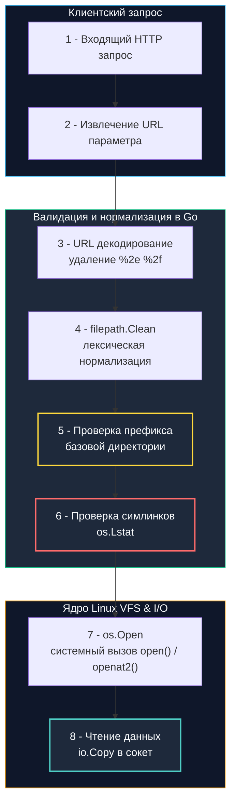

## Введение: выход за границы виртуальной файловой системы

В Unix-подобных операционных системах всё является файлом, а доступ к файловой системе строится вокруг единого древовидного графа inode. Когда бэкенд-приложение реализует функции загрузки аватаров, отдачи статических отчетов, экспорта PDF или чтения локализованных шаблонов, разработчик почти всегда оперирует концепцией «базовой доверенной директории» (например, `/var/app/uploads/`).

Но что произойдет, если пользователь вместо безобидного имени файла `report.pdf` передаст строку `../../../../etc/passwd`?

Если сервис склеит переданную строку с базовым путем без исчерпывающей проверки, возникает критическая уязвимость **Path Traversal (Обход путей каталога)**.

На уровне ядра операционной системы ядро не знает о концепции «бизнес-изоляции» вашего приложения. Когда процесс выполняет системный вызов `open()`, подсистема виртуальной файловой системы (VFS) ядра Linux последовательно обходит кэш записей каталогов (`dentry cache`). Встречая компоненты `.` (текущий каталог) и `..` (родительский каталог), ядро добросовестно переходит на шаг вверх по дереву каталогов, разрешает символические ссылки и проверяет только стандартные права доступа POSIX. Если прав процесса (`www-data` или `app-user`) достаточно для чтения файла, ядро вернет дескриптор, игнорируя границы папки `/uploads/`.



---

## Механика в Go: `filepath.Clean`, `filepath.Join` и их ограничения

Стандартная библиотека Go предоставляет функции `filepath.Clean` и `filepath.Join`. Начинающие разработчики часто ошибочно полагают, что вызов `filepath.Clean(userInput)` или `filepath.Join(baseDir, userInput)` гарантирует защиту от выхода за пределы каталога. 

Это опасное заблуждение. Функции пакета `path/filepath` выполняют исключительно **лексическую нормализацию** текстовой строки:
- Убирают повторяющиеся избыточные разделители (`//` -> `/`).
- Сворачивают относительные сегменты `./` и `../` до канонического строкового вида.
- Удаляют завершающие слэши.
- **Не разрешают символические ссылки** (symlinks) на реальной файловой системе.
- **Не проверяют физическое существование файла** или прав доступа.
- **Не защищают от обхода через двойное кодирование** (`%2e%2e%2f` или устаревшие UTF-8 оверлонги вроде `..%c0%af`), если декодирование произведено некорректно.

Если базовая папка равна `/var/app/data`, а пользователь передал `../../etc/passwd`, то `filepath.Join("/var/app/data", "../../etc/passwd")` честно вычислит лексический результат: `/var/etc/passwd`. Защита не сработала.

### Идиоматичный шаблон безопасного хендлера файлов в Go

Чтобы надежно запереть чтение файлов внутри целевого каталога, алгоритм обязан включать лексическую нормализацию, получение абсолютных путей, строгую проверку префикса и запрет символических ссылок:

```go
package filesec

import (
	"fmt"
	"net/http"
	"os"
	"path/filepath"
	"strings"
)

// SecureFileHandler безопасно отдаёт файлы из строго ограниченной директории
func SecureFileHandler(baseDir string) http.HandlerFunc {
	// 🔒 Абсолютный путь к базовой директории для надежных побайтовых сравнений
	absBaseDir, err := filepath.Abs(baseDir)
	if err != nil {
		panic(fmt.Sprintf("invalid base dir: %v", err))
	}

	return func(w http.ResponseWriter, r *http.Request) {
		requestPath := r.URL.Query().Get("file")
		if requestPath == "" {
			http.Error(w, "missing file parameter", http.StatusBadRequest)
			return
		}

		// 1 - Валидация нулевого байта: в Си/VFS null-байт обрезает строку пути
		if strings.Contains(requestPath, "\x00") {
			http.Error(w, "invalid characters", http.StatusBadRequest)
			return
		}

		// 2 - Лексическая очистка пути
		cleanPath := filepath.Clean(requestPath)

		// 3 - Сборка полного абсолютного пути
		fullPath := filepath.Join(absBaseDir, cleanPath)

		// 4 - 🔒 Жёсткая проверка префикса. Это ключевой этап программной защиты.
		// Добавляем PathSeparator, чтобы предотвратить атаку совпадения префикса имени папки:
		// /var/app/uploads_secret не должен матчиться на базу /var/app/uploads!
		expectedPrefix := absBaseDir + string(os.PathSeparator)
		if !strings.HasPrefix(fullPath, expectedPrefix) && fullPath != absBaseDir {
			http.Error(w, "forbidden path", http.StatusForbidden)
			return
		}

		// 5 - Проверка символических ссылок и метаданных через os.Lstat (не переходит по симлинкам!)
		info, err := os.Lstat(fullPath)
		if err != nil {
			if os.IsNotExist(err) {
				http.Error(w, "file not found", http.StatusNotFound)
				return
			}
			http.Error(w, "access denied", http.StatusForbidden)
			return
		}

		// Запрещаем открытие симлинков, ведущих за пределы песочницы
		if info.Mode()&os.ModeSymlink != 0 {
			http.Error(w, "symlinks not allowed", http.StatusForbidden)
			return
		}

		// Запрещаем прямой листинг директорий
		if info.IsDir() {
			http.Error(w, "directories not allowed", http.StatusForbidden)
			return
		}

		// 6 - Безопасная отдача файла клиенту
		http.ServeFile(w, r, fullPath)
	}
}
```

---

> [!info] Под капотом: Аллокации и производительность filepath.Clean
> **Аллокации памяти и Escape Analysis:**  
> Внутри рантайма `filepath.Clean` выделяет слайс байт, совершает два прохода по строке для сжатия слэшей и точек, преобразует результат в строку и возвращает ее. В силу правил Escape Analysis возвращаемая строка покидает фрейм стека и неизбежно аллоцируется в куче.  
> При обслуживании десятков тысяч файловых запросов в секунду постоянная нормализация путей генерирует непрерывный поток короткоживущего мусора, нагружающего `GC`. В высоконагруженных файловых шлюзах рекомендуется использовать пул буферов `sync.Pool`, `strings.Builder` с предвыделенной емкостью или кэшировать проверенные пары `(cleanPath, fullPath)` в потокобезопасной хэш-таблице `sync.Map`, если набор отдаваемых файлов статичен.

---

## Под капотом: syscalls, dentry cache и проблема TOCTOU

Даже идеальная пользовательская проверка путей через `filepath.Clean` и `os.Lstat` страдает от фундаментальной уязвимости многозадачных ОС: **Time-of-Check to Time-of-Use (TOCTOU)**.

Представьте временной промежуток между двумя системными вызовами:
1. Шаг проверки: Сервер вызывает `os.Lstat("/var/uploads/avatar.png")` и убеждается, что это обычный файл.
2. Интервал времени: Процесс Go уступает тред операционной системы другому процессу.
3. Атака гонки: Параллельный процесс атакующего (или эксплуатация race condition) удаляет `avatar.png` и мгновенно создает симлинк с тем же именем, указывающий на `/etc/shadow`.
4. Шаг использования: Сервер вызывает `os.Open("/var/uploads/avatar.png")` и передает содержимое суперсекретного файла наружу!

### Решение на уровне ядра: Linux 5.6+ и системный вызов `openat2`

В современных ядрах Linux для решения проблемы TOCTOU был разработан специализированный системный вызов `openat2` с набором флагов разрешения путей `RESOLVE_*`. Флаг `RESOLVE_BENEATH` заставляет ядро VFS проверять границы пути атомарно, прямо во время обхода `dentry cache`: если любой компонент пути пытается выйти выше переданного дескриптора базового каталога (включая попытки побега через симлинки), системный вызов немедленно завершается с ошибкой `EXDEV`.

В Go доступ к этим возможностям ядра реализуется через пакет `golang.org/x/sys/unix`:

```go
package filesec_unix

import (
	"fmt"
	"os"
	"path/filepath"

	"golang.org/x/sys/unix"
)

// OpenSecure открывает файл атомарно на уровне ядра без уязвимости к TOCTOU
func OpenSecure(baseDir, requestPath string) (*os.File, error) {
	absBase, err := filepath.Abs(baseDir)
	if err != nil {
		return nil, err
	}

	// 1. Открываем файловый дескриптор базовой доверенной директории
	dirFd, err := unix.Openat(unix.AT_FDCWD, absBase, unix.O_RDONLY|unix.O_DIRECTORY|unix.O_CLOEXEC, 0)
	if err != nil {
		return nil, fmt.Errorf("open base dir: %w", err)
	}
	defer unix.Close(dirFd)

	// 2. 🔒 Настраиваем флаги openat2 для атомарного удержания процесса внутри dirFd.
	// Поддерживается ядром Linux 5.6+.
	var how unix.OpenHow
	how.Flags = unix.O_RDONLY | unix.O_CLOEXEC
	// RESOLVE_BENEATH запрещает выход за пределы dirFd
	// RESOLVE_NO_SYMLINKS блокирует любые символические ссылки
	// RESOLVE_NO_MAGICLINKS блокирует магические ссылки (/proc/self/...)
	how.Resolve = unix.RESOLVE_BENEATH | unix.RESOLVE_NO_SYMLINKS | unix.RESOLVE_NO_MAGICLINKS

	// 3. Ядро атомарно резолвит путь относительно dirFd без риска гонки TOCTOU
	fd, err := unix.Openat2(dirFd, requestPath, &how)
	if err != nil {
		return nil, fmt.Errorf("openat2 failed: %w", err)
	}

	return os.NewFile(uintptr(fd), filepath.Base(requestPath)), nil
}
```

---

> [!warning] Ловушка / Gotcha: Ловушка http.FileServer и http.Dir
> **`http.FileServer` и скрытая уязвимость:**  
> Стандартный хендлер `http.FileServer(http.Dir("/uploads"))` примитивен: тип `http.Dir` реализует интерфейс `http.FileSystem`, транслируя URL напрямую в `os.Open`. Хотя `http.Dir` производит базовую санитизацию слэшей, некорректная комбинация с `http.StripPrefix` или обратными прокси может привести к тому, что URL, содержащий `/../../etc/passwd`, будет напрямую открыт через системный вызов `os.Open`.  
> Никогда не используйте `http.Dir` вслепую для каталогов с конфиденциальными файлами или динамической маршрутизацией. Всегда оборачивайте его в собственный `http.FileSystem` с переопределенным методом `Open(name)`, осуществляющим проверку `openat2` или валидацию префиксов.

---

> [!tip] Собеседование
> **Вопрос:** «Почему проверка `strings.Contains(path, "..")` считается крайне ненадежным и дилетантским способом защиты от Path Traversal, и как злоумышленник может ее обойти?»  
> 
> **Ответ кандидата Senior-уровня:**  
> «1. **Ложные срабатывания:** Простая подстроковая проверка `strings.Contains` сломает легитимные пути, содержащие две точки подряд в имени файла (например, `file..txt` или `archive..tar.gz`).  
> 2. **Обход через кодировки:** Входящий путь может содержать URL-кодирование (`%2e%2e%2f`), двойное кодирование (`%252e%252e%252f`) или экзотические альтернативные разделители пути в Windows (`\`). Если проверка на подстроку выполняется до декодирования, она пропустит вектор атаки; если после — может упасть на граничных условиях.  
> 3. **Архитектурный стандарт защиты:**  
>    - Полная нормализация через `filepath.Clean`.  
>    - Разрешение в абсолютный путь через `filepath.Abs`.  
>    - Строгая проверка префикса через `strings.HasPrefix(absolutePath, allowedBase + string(os.PathSeparator))`.  
> 4. **Аппаратная и ядерная изоляция:** На уровне операционной системы Linux 5.6+ для исключения race conditions (TOCTOU) применяется системный вызов `openat2` с директивой `RESOLVE_BENEATH`».

---

## Сравнение подходов: Go, PHP, C/C++

Взглянем на то, как архитектура языков программирования влияет на обработку путей:

| Аспект | Go | PHP | C / C++ |
|---|---|---|---|
| **Базовая защита** | `filepath.Clean` + `strings.HasPrefix` | `realpath()` + `strpos()` | `realpath()` или `openat()` |
| **Символические ссылки** | Требует явной проверки `os.Lstat` или `RESOLVE_NO_SYMLINKS` | `realpath` автоматически разрешает | `O_NOFOLLOW` в системном вызове `open()` |
| **TOCTOU mitigation** | `x/sys/unix.Openat2` с `RESOLVE_BENEATH` | Слабая (только в пространстве пользователя) | `openat()` + `fchdir()` или `openat2` |
| **Аллокации** | `filepath.Clean` создаёт новые строки в куче | Строки неизменяемы, аллоцируются при конкатенации | `strdup`, ручное управление памятью |

В Go преимущество заключается в строгой типизации и отсутствии «магии» вроде `include` или `require` с автоматическим резолвингом путей. Однако ответственность за валидацию полностью ложится на разработчика.

---

## Итог

1. **Суть уязвимости:** Path Traversal возникает, когда непроверенные пути передаются в `os.Open` или `http.FileServer`. Подсистема VFS ядра операционной системы слепо следует указаниям `..` и разрешает символические ссылки.
2. **Ограниченность лексической нормализации:** Функции `filepath.Clean` и `filepath.Join` не защищают от выхода за пределы корневой папки. Они лишь приводят строковое представление пути к каноническому виду.
3. **Пятиступенчатая валидация:** Надежная программная защита требует цепочки: проверка нулевого байта `\x00` -> `filepath.Clean` -> `filepath.Abs` -> проверка `strings.HasPrefix` с разделителем пути -> проверка симлинков через `os.Lstat`.
4. **Решение проблемы TOCTOU:** Гонка между проверкой файла и его открытием на уровне ядра Linux решается с помощью системного вызова `openat2` с флагом `RESOLVE_BENEATH` через пакет `golang.org/x/sys/unix`.
5. **Механическое сочувствие:** Нормализация путей создает аллокации строк в куче. В высоконагруженных сервисах кэшируйте валидированные пути в `sync.Map` и используйте пулы буферов для снижения нагрузки на `GC`.

Что происходит, когда сервис восстанавливает сложные объекты из бинарных или текстовых потоков данных, полученных из недоверенных источников?  
В следующей лекции мы разберем: [[6. Deserialization уязвимости]].