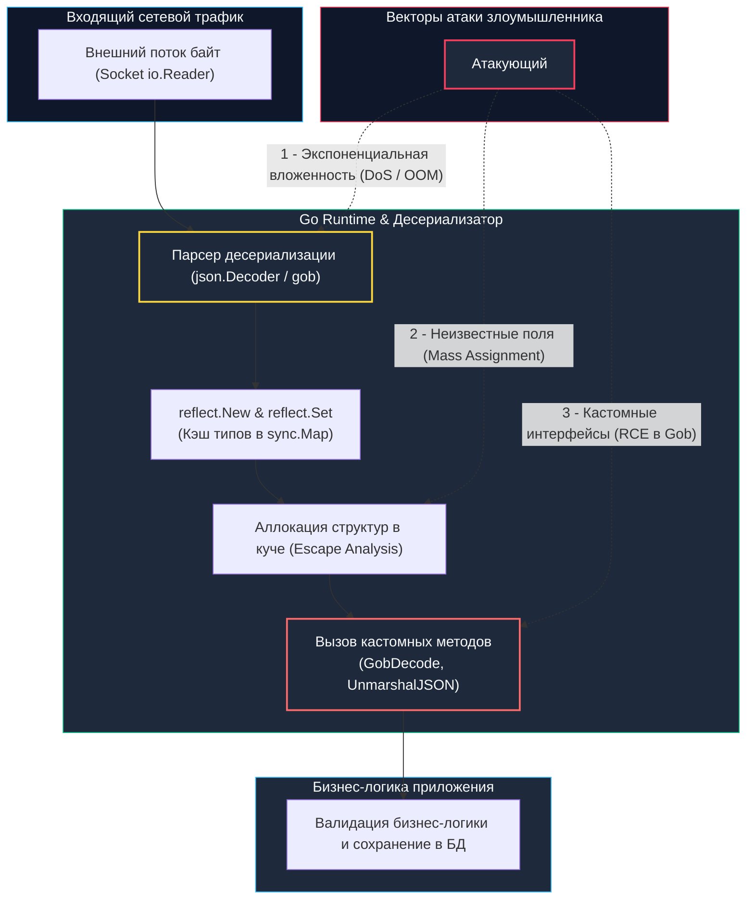

## Введение: Когда парсер данных становится исполнителем

В компьютерных науках сериализация — это процесс «замораживания» живого графа структур данных из оперативной памяти в плоский линейный поток байтов (JSON, XML, Protobuf, Gob). Десериализация — это процесс обратного «воскрешения» объектов из этого байтового потока.

В языках с развитой динамической рефлексией и полиморфизмом (Java, Python, PHP, Ruby) десериализация исторически является синонимом катастрофы. Знаменитые уязвимости с удаленным выполнением кода (RCE) через `__wakeup` в PHP, метод `readObject` в Java или библиотеку `pickle` в Python возникают потому, что сериализованный поток содержит не просто сырые данные, но и метаинформацию о типах классов. Парсер послушно инстанциирует произвольные классы из кодовой базы, запуская цепочки вызовов гаджетов (gadget chains) прямо в момент распаковки.

В Go ситуация фундаментально иная: благодаря строгой статической типизации, отсутствию динамической загрузки байт-кода и невозможности произвольного инстанцирования произвольных типов по строковому имени, классический вектор Java-style RCE в чистом Go отсутствует.

Однако иллюзия абсолютной безопасности обманчива. В Go риски десериализации смещаются в сторону:
1. **Катастрофического исчерпания ресурсов (DoS)**: миллиардные рекурсивные аллокации, парализующие `GC` и вызывающие `OOM Killer`.
2. **Логических инъекций и подмены состояний (Mass Assignment)** через нетипизированные структуры `map[string]any`.
3. **Скрытых вызовов произвольного кода** через реализацию библиотечных интерфейсов (`GobDecoder`, кастомные unmarshaler-хуки).



---

## Под капотом: отражение, куча и скрытые вызовы

Стандартные пакеты сериализации Go (`encoding/json`, `encoding/xml` и `encoding/gob`) опираются на пакет `reflect`. Чтобы осознавать накладные расходы и скрытые угрозы, рассмотрим внутренний конвейер вызова `Unmarshal`:

1. **Кэширование метаданных типов:**  
   При первом анализе структуры компилятор и рантайм генерируют дескриптор `reflect.Type`. В нем содержатся смещения полей структуры (struct offsets), строковые теги (tags) и правила выравнивания. Этот дескриптор вычисляется единожды и кэшируется внутри рантайма в потокобезопасной карте `sync.Map`.
2. **Рекурсивный обход и сопоставление полей:**  
   Парсер читает токен за токеном, находит соответствующее поле целевой структуры и задействует вызовы `reflect.ValueOf` и `reflect.Set`. Для глубоко вложенных объектов глубина рекурсии стека растет пропорционально вложенности документа.
3. **Неизбежные аллокации в куче (Heap Escape):**  
   Компилятор Go через механизм Escape Analysis не может предсказать размер и форму внешних входящих данных во время компиляции. Поэтому указатели, срезы (`slices`) и мапы (`maps`), заполняемые внутри `Unmarshal`, гарантированно «убегают» в кучу, порождая тысячи короткоживущих аллокаций.
4. **Скрытые диспетчеризации методов (Custom Hooks):**  
   Если целевой тип или его внутренние поля реализуют интерфейсы `Unmarshaler`, `GobDecoder` или `encoding.BinaryUnmarshaler`, парсер обязан передать управление их методам. Именно в этой точке пользовательский код берет на себя управление потоком исполнения.

---

## 1. JSON: Бомбы, глубина и `interface{}`

Сам по себе текстовый формат JSON пассивен и не содержит исполняемых инструкций. Однако его грамматика позволяет конструировать разрушительные нагрузки, бьющие по физическим ресурсам хоста:

### JSON-бомбы (Аналог Zip Bomb)
Злоумышленник формирует компактный текстовый документ размером всего в несколько десятков килобайт, содержащий экстремальную вложенность скобок:
`[[[[[[[[[[[[[[[[...]]]]]]]]]]]]]]]]`.  
Если приложение десериализует такой ввод в нетипизированный `map[string]any` или `[]any`, парсер запускает глубокую рекурсию. При глубине вложенности 30 уровней и коэффициенте ветвления 5 число узлов дерева стремится к $10^{21}$. Рантайм Go аварийно завершает работу с паникой `runtime: goroutine stack exceeds` (переполнение 1 ГБ стека горутины в 64-битных системах) либо сервер уничтожается ядром по `OOM Killer` из-за безудержного разрастания кучи.

### Массовое назначение (Mass Assignment)
Если разработчик использует `map[string]any` или применяет одну и ту же структуру как для внешнего HTTP API, так и для сущности базы данных, атакующий передает скрытые служебные поля: `is_admin: true`, `role: "superuser"`, `price: 0.0`. Если бэкенд без валидации передает эту структуру в ORM или SQL-запрос обновления, происходит несанкционированное повышение привилегий.

```go
package deserial

import (
	"encoding/json"
	"io"
	"net/http"
)

// SecureJSONHandler демонстрирует защиту от массового назначения и DoS-атак
func SecureJSONHandler(w http.ResponseWriter, r *http.Request) {
	// 🔒 1. Ограничение размера входящего потока байт.
	// 1 МБ достаточно для 99.9% легитимных JSON-пейлоадов.
	limitedReader := io.LimitReader(r.Body, 1<<20)

	// 🔒 2. Инициализация потокового декодера с запретом неизвестных полей
	decoder := json.NewDecoder(limitedReader)
	
	// DisallowUnknownFields пресекает Mass Assignment на корню:
	// если клиент передаст неизвестное поле (например, "is_admin"), декодер вернет ошибку!
	decoder.DisallowUnknownFields()

	// 🔒 3. Строго типизированное DTO без лишних системных полей
	var payload struct {
		ID    int64  `json:"id"`
		Name  string `json:"name"`
		Email string `json:"email"`
	}

	if err := decoder.Decode(&payload); err != nil {
		// Ошибка возвращается при: превышении лимита размера, наличии лишних полей или битом JSON
		http.Error(w, "invalid payload or unknown fields", http.StatusBadRequest)
		return
	}

	// Безопасная передача проверенного DTO в бизнес-логику...
}
```

---

> [!info] Под капотом: Почему DisallowUnknownFields работает быстро?
> **Эффективность `DisallowUnknownFields`:**  
> При вызове `decoder.DisallowUnknownFields()` парсер сверяет каждый входящий ключ JSON с предвычисленным кэшем полей целевой структуры. Если ключа нет в списке разрешенных, декодер мгновенно прерывает разбор и возвращает ошибку, **не выделяя память под значение**. Это предотвращает аллокацию тяжелых структур `any` в куче и полностью защищает сборщик мусора от лавинообразной нагрузки при отправке вредоносного запроса с тысячами фиктивных параметров.

---

## 2. Gob: `GobDecoder` и вектор RCE в Go

Пакет стандартной библиотеки `encoding/gob` — это высокопроизводительный бинарный кодек, разработанный специально для экосистемы Go. Он чрезвычайно эффективен при передаче структур через RPC между внутренними сервисами.

**Однако `encoding/gob` категорически запрещено использовать для десериализации данных, полученных от внешних недоверенных клиентов!**

Причина кроется в интерфейсе `gob.GobDecoder`. Если распаковываемый тип данных реализует метод `GobDecode([]byte) error`, пакет `encoding/gob` вызывает этот метод автоматически прямо во время парсинга:

```go
package rce_demo

// ⚠️ ОПАСНО: Структура, содержащая исполняемую логику в хуке десериализации
type UnsafeCacheItem struct {
	Key   string
	Value []byte
}

// GobDecode вызывается АВТОМАТИЧЕСКИ рантаймом при выполнении gob.Decode()
func (u *UnsafeCacheItem) GobDecode(data []byte) error {
	// 🔴 КРИТИЧЕСКИЙ РИСК: Если атакующий способен сформировать валидный поток gob,
	// десериализуемый в этот тип, любой находящийся здесь код выполнится в контексте процесса.
	// Здесь могут оказаться вызовы exec.Command, os.Remove, или обращение к сетевому сокету.
	return nil
}
```

---

> [!warning] Ловушка / Gotcha: Никогда не декодируйте gob от внешних клиентов
> **Отсутствие песочницы в пакете `gob`:**  
> Пакет `encoding/gob` не предоставляет встроенных механизмов изоляции или песочницы для интерфейса `GobDecoder`. Любой байт-поток, соответствующий спецификации формата, инициирует автоматический вызов методов ваших структур.  
> Для внешних публичных API используйте только форматы со строгой статической валидацией схемы (Protobuf или JSON). Обмен через `gob` допустим исключительно внутри доверенного контура микросервисов, скомпилированных одной версией Go и с жестким контролем сетевого периметра (mTLS).

---

## 3. XML: XXE и парсинг DTD

В старых реализациях и других языках программирования парсеры XML по умолчанию поддерживают обработку внешних сущностей DTD (Document Type Definition), что приводит к уязвимости **XXE (XML External Entity)**: через конструкцию `<!ENTITY xxe SYSTEM "file:///etc/passwd">` атакующий может читать локальные файлы или осуществлять SSRF-запросы.

В Go стандартный пакет `encoding/xml` защищен от XXE из коробки: начиная с Go 1.15, встроенный парсер категорически игнорирует директивы `<!DOCTYPE>` и внешние DTD-сущности. Однако будьте бдительны: при использовании сторонних библиотек (например, CGo-биндингов к `libxml2`) или при включении кастомных режимов `Strict` в некоторых сторонних парсерах поддержка DTD может активироваться. Всегда проверяйте конфигурации XML-декодеров на флаги `ExternalEntities` или `DTD`.

---

## Идиоматичная защита в рантайме Go

Надежная архитектура обработки внешних данных строится на четырех рубежах:

1. **Строгие DTO вместо `interface{}`:** Откажитесь от динамических мап `map[string]any` в публичных обработчиках. Использование жестких структур позволяет компилятору и линтерам проверять типы на этапе сборки, полностью исключая атаки класса Type Confusion и Mass Assignment.
2. **Лимиты на входе:** Всегда ограничивайте объем входящих данных. Обертка `io.LimitReader(r.Body, maxBytes)` или серверная директива `http.MaxBytesReader(w, r.Body, maxBytes)` (для `http.Server`) пресекает DoS-атаки до того, как парсер начнет аллоцировать память в куче.
3. **Контроль глубины вложенности:** В Go 1.24+ в декодеры добавлен механизм ограничения глубины `Decoder.MaxDepth`. В более ранних версиях для защиты от рекурсивных бомб используйте стриминговые SAX-подобные токены или сторонние проверенные библиотеки (например, `jsoniter` с настроенным лимитом глубины).
4. **Схемная валидация до десериализации:** Для сложных структур используйте отложенное чтение сырых срезов через `json.RawMessage` либо привлекайте валидаторы OpenAPI (`oapi-codegen`, `deepmap/oapi-codegen`), которые автоматически генерируют код строгой проверки контрактов запросов.

---

## Механическое сочувствие: давление на GC и аллокации

Десериализация — один из главных генераторов короткоживущего мусора в бэкенд-системах. Каждый вызов функции `json.Unmarshal`:
- Создает временные байтовые срезы `[]byte` для строковых литералов.
- Инициализирует служебные структуры пакета `reflect` для каждого поля.
- Создает промежуточные объекты для маппинга интерфейсов.

При входящем потоке в 50 000 RPS это транслируется в сотни мегабайт мусора в секунду! Частые фазы `Minor GC` вызывают остановки горутин (STW / GC preemption), сбрасывают процессорный кэш L1/L2 из-за непрерывного сканирования заголовков кучи и приводят к резкому росту задержки P99.

### Инженерные оптимизации:
- **Пул структур (`sync.Pool`):** Если структуры запросов содержат емкие срезы, используйте `sync.Pool` для переиспользования уже выделенной памяти.
- **Стриминг через `json.Decoder`:** Предпочитайте потоковый `json.NewDecoder(r.Body)` вместо `json.Unmarshal(data)`, так как декодер читает данные порциями из `io.Reader` и не аллоцирует монолитный гигантский буфер под все тело запроса.
- **Высокопроизводительные библиотеки:** В сервисах с жесткими требованиями к микросекундным задержкам применяйте оптимизированные кодеки: `go-json` (от автора `goccy`) или `sonic` (от `Bytedance`). Они задействуют JIT-компиляцию и SIMD-инструкции ассемблера для прямого разбора байт в обход тяжелой рефлексии, снижая аллокации памяти в разы. Однако помните, что сторонний код требует отдельного аудита безопасности (Threat Modeling).

---

> [!tip] Собеседование
> **Вопрос:** «Почему функция `json.Unmarshal` работает значительно медленнее и потребляет больше памяти, чем потоковый `json.Decoder` при обработке сетевых HTTP-запросов?»  
> 
> **Ответ кандидата Senior-уровня:**  
> «1. **Двойная аллокация и проход по памяти:** Функция `json.Unmarshal` требует готового среза байтов `[]byte`. Это вынуждает разработчика сначала прочитать весь поток сокета в память через `io.ReadAll` (монолитная аллокация в куче), а затем `Unmarshal` производит повторный проход по этому буферу для парсинга и валидации.  
> 2. **Потоковая обработка `json.Decoder`:** Метод `json.NewDecoder(r.Body)` работает напрямую с интерфейсом `io.Reader`. Он читает данные фиксированными чанками во внутренний буфер (обычно 512 байт или 4 КБ), заполняя поля структуры на лету. Это снижает пиковое потребление памяти и минимизирует нагрузку на сборщик мусора (`GC`).  
> 3. **Переиспользование внутреннего состояния:** Объект `json.Decoder` кэширует внутренние парсерные таблицы между последовательными вызовами `Decode`, тогда как `json.Unmarshal` при каждом запуске пересоздает структуры декодирования с нуля.  
> 4. **Архитектурный стандарт:** В HTTP-хендлерах всегда следует предпочитать `json.NewDecoder(r.Body)` в связке с `io.LimitReader` (или проверкой `MaxPayloadSize`) и `DisallowUnknownFields`».

---

## Итог

1. **Безопасность по сравнению с динамическими языками:** В Go статическая типизация и отсутствие динамического инстанцирования классов исключают классический вектор Java/PHP-style RCE при парсинге JSON.
2. **Опасность формата `gob`:** Пакет `encoding/gob` поддерживает интерфейс `GobDecoder`, методы которого исполняются автоматически при распаковке. `gob` категорически запрещено применять для данных из недоверенных источников.
3. **Защита от DoS и Mass Assignment в JSON:** Всегда ограничивайте объем входящих потоков через `io.LimitReader`, запрещайте лишние поля через `decoder.DisallowUnknownFields()` и используйте строго типизированные DTO вместо `map[string]any`.
4. **Механическое сочувствие к памяти:** Разбор JSON через `reflect` создает колоссальное давление на сборщик мусора. Используйте потоковый `json.Decoder`, задействуйте `sync.Pool` и оценивайте целесообразность SIMD-оптимизированных кодеков (`sonic`, `go-json`) в критических по задержкам узлах.

Как конкурентная природа Go и несинхронизированный доступ к разделяемым ресурсам могут стать источником критических уязвимостей в бизнес-логике?  
В следующей лекции мы разберем: [[7. Race condition как уязвимость]].