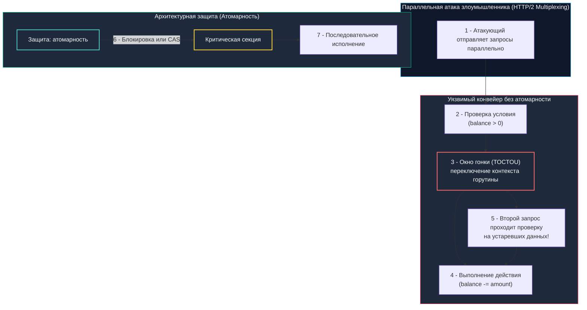

## Гонки состояний: от багов стабильности до векторов атак

В повседневной разработке состояние гонки (Race Condition) часто воспринимают как досадный дефект стабильности: редкий «плавающий» баг, приводящий к неожиданной панике или повреждению данных в памяти.

Однако в прикладной безопасности (AppSec) состояние гонки — это первоклассная уязвимость критического уровня. Она позволяет злоумышленнику целенаправленно эксплуатировать временное окно между проверкой условий безопасности и фактическим выполнением мутирующего действия. В англоязычной литературе этот класс атак называется **TOCTOU (Time-of-Check to Time-of-Use)**.

Представьте физическую модель: два человека с клонированными дебетовыми картами подходят к разным банкоматам в один и тот же момент времени. На счету лежит ровно $100. Если банковская система сначала проверяет остаток на обоих терминалах (`$100 >= $100` — проверка успешна на обоих), а затем с задержкой в несколько миллисекунд списывает средства, оба банкомата выдадут деньги. Злоумышленники получают $200, а баланс счета уходит в минус.

В многопоточном рантайме Go, где сотни тысяч легковесных горутин конкурируют за разделяемую память, структуры данных и соединения с внешними сервисами, грань между оптимистичной конкурентностью и фатальной дырой в безопасности определяется строгой дисциплиной синхронизации.



---

### Под капотом: кэш-когерентность, модель памяти и планировщик

Чтобы понимать природу гонок, необходимо опуститься на уровень кремния:
1. **Отсутствие единого мгновенного среза памяти:**  
   Каждое процессорное ядро оборудовано собственными сверхбыстрыми кэшами L1/L2. Изменения, внесенные ядром Core 0, физически оседают в его буфере записи (Store Buffer) и кэш-линиях. Аппаратный протокол когерентности кэшей (MESI или MOESI) гарантирует согласованность данных между ядрами через инвалидацию кэш-линий шины, однако эта синхронизация занимает десятки тактов процессора.
2. **Переупорядочивание инструкций (Out-of-Order Execution):**  
   Компилятор Go и конвейер процессора имеют право менять порядок чтения и записи в память, если это не нарушает логику внутри одного изолированного потока.
3. **Модель памяти Go (Go Memory Model):**  
   Рантайм гарантирует видимость изменений между параллельными горутинами **строго при наличии отношений Happened-Before**, устанавливаемых примитивами синхронизации: `sync.Mutex`, операциями пакета `sync/atomic`, коммуникацией через `channel` или отменой `context`. Если переменная модифицируется без барьеров памяти, другая горутина может бесконечно долго читать устаревшее значение (stale data) из своего локального кэша регистров.

---

### Гонки данных (Data Race) против логических гонок (Logical Race)

Важнейшее разграничение, которое часто упускают:
- **Гонка данных (Data Race):** Одновременный доступ двух горутин к одной ячейке памяти, где хотя бы одна операция — запись, без использования примитивов синхронизации. Гонка данных приводит к повреждению структур рантайма (сломанные указатели, паника `concurrent map read and map write`). Такие гонки безупречно выявляет встроенный инструмент `go run -race` на базе ThreadSanitizer (TSan).
- **Логическая гонка (Logical Race / TOCTOU):** Все переменные могут быть идеально защищены мьютексами или транзакциями, и `go run -race` не выдаст ни единого предупреждения! Однако между шагом «проверил» и шагом «применил» существует временной зазор в бизнес-логике, позволяющий обойти бизнес-правило.

---

### Классические сценарии уязвимостей в бэкенде

1. **TOCTOU в проверке баланса (Double-Spending):**  
   Чтение остатка `SELECT balance FROM accounts` -> проверка `if balance >= amount` -> списание `UPDATE accounts SET balance = balance - amount`. Если параллельные HTTP-запросы приходят одновременно, оба читают старый баланс до его списания. Итог: двойное расходование средств, отрицательный баланс и прямая финансовая потеря.
2. **Обход Rate Limiting (Превышение квот):**  
   Код вида `if counter < limit { counter++ }` без атомарности. Десять одновременных сетевых запросов считывают `counter = 9`, успешно проходят условие и дружно инкрементируют счетчик, допуская превышение лимита в разы.
3. **Эскалация привилегий через кэш состояния:**  
   Права пользователя кэшируются в `sync.Map` с длительным TTL. Если администратор блокирует учетную запись или понижает привилегии, активные горутины продолжают читать старое состояние из кэша до истечения TTL, сохраняя доступ к закрытым эндпоинтам.

---

### Идиоматичные паттерны защиты в Go

#### 1. Атомарные операции для счётчиков и флагов

Для примитивных типов данных (счетчики, статусные флаги) использование тяжелых мьютексов избыточно. Пакет `sync/atomic` предоставляет типобезопасные типы (`atomic.Int64`, `atomic.Bool`). На аппаратном уровне они транслируются в машинные инструкции процессора с префиксом `LOCK` (например, `LOCK XADD` или `LOCK CMPXCHG` на архитектуре x86), которые выполняют операцию атомарно прямо на системной шине и в кэше процессора:

```go
package ratelimit

import (
	"context"
	"errors"
	"sync"
	"sync/atomic"
	"time"
)

// AtomicRateLimiter реализует потокобезопасный счётчик с атомарными операциями
type AtomicRateLimiter struct {
	limit     int64
	counter   atomic.Int64
	resetTime time.Time
	mu        sync.Mutex // Используется исключительно для редкой синхронизации временного слота
}

func (r *AtomicRateLimiter) Allow(ctx context.Context) error {
	// 🔒 Атомарный инкремент и получение нового значения за один неделимый такт
	current := r.counter.Add(1)
	if current <= r.limit {
		return nil
	}

	// Сброс счётчика при переходе в новый временной интервал
	r.mu.Lock()
	defer r.mu.Unlock()

	if time.Now().After(r.resetTime) {
		r.counter.Store(0) // 🔒 Атомарный сброс счетчика
		r.resetTime = time.Now().Add(time.Minute)
		return nil
	}

	return errors.New("rate limit exceeded")
}
```

---

#### 2. Блокировки и транзакции базы данных

Когда изменяемое состояние распределено по нескольким сущностям, локальные примитивы Go (`atomic`, `sync.Mutex`) бессильны защитить систему в кластерном окружении, где работают десятки реплик микросервиса. Защита обязана переноситься на уровень транзакций базы данных:

```go
package payments

import (
	"context"
	"database/sql"
	"fmt"
)

// TransferWithLock реализует защиту от double-spend через транзакцию и SELECT FOR UPDATE
func TransferWithLock(ctx context.Context, db *sql.DB, fromID, toID int64, amount int64) error {
	// Использование строгого уровня изоляции транзакции
	tx, err := db.BeginTx(ctx, &sql.TxOptions{Isolation: sql.LevelSerializable})
	if err != nil {
		return fmt.Errorf("begin tx: %w", err)
	}
	defer tx.Rollback()

	// 🔒 FOR UPDATE накладывает эксклюзивную блокировку на строку баланса в БД.
	// Любая параллельная транзакция замрёт на чтении этой строки до завершения нашей транзакции!
	var balance int64
	err = tx.QueryRowContext(ctx,
		"SELECT balance FROM accounts WHERE id = $1 FOR UPDATE", fromID,
	).Scan(&balance)
	if err != nil {
		return fmt.Errorf("read balance: %w", err)
	}

	if balance < amount {
		return fmt.Errorf("insufficient funds")
	}

	// Списание средств
	_, err = tx.ExecContext(ctx,
		"UPDATE accounts SET balance = balance - $1 WHERE id = $2",
		amount, fromID,
	)
	if err != nil {
		return fmt.Errorf("update balance: %w", err)
	}

	// Зачисление получателю
	_, err = tx.ExecContext(ctx,
		"UPDATE accounts SET balance = balance + $1 WHERE id = $2",
		amount, toID,
	)
	if err != nil {
		return fmt.Errorf("credit balance: %w", err)
	}

	return tx.Commit()
}
```

---

#### 3. Каналы и паттерн "Owner Goroutine"

В сложных акторных моделях отличной альтернативой мьютексам выступает идиома Go: *«Не общайтесь, разделяя память; разделяйте память, общаясь»*. За критическое состояние отвечает единственная горутина-владелец (Owner Goroutine), а все остальные компоненты общаются с ней через каналы. Это исключает гонки на уровне архитектуры языка.

---

> [!warning] Ловушка / Gotcha: Ложная экономия на sync.Map
> **Ограничения `sync.Map` в бизнес-логике:**  
> Структура `sync.Map` оптимизирована для сценариев, где набор ключей стабилен, а операции чтения многократно превышают операции записи (кэши типов, дескрипторы). Методы `LoadOrStore` и `LoadAndDelete` атомарны сами по себе, но они **не образуют транзакционной пары**.  
> Если бизнес-логика делает `val, ok := m.Load(key)`, затем вычисляет новое состояние и вызывает `m.Store(key, newVal)`, между вызовами возникает окно гонки. Другая горутина успеет перезаписать значение, что приведет к логической ошибке.  
> **Решение:** Для сложной бизнес-логики с условиями используйте классический `sync.Mutex` с обычной картой `map`, либо `atomic.Pointer` с циклом `CompareAndSwap` (CAS) для создания lock-free структур данных.

---

> [!tip] Собеседование
> **Вопрос:** «Почему флаг компиляции `-race` (`go run -race` / `go test -race`) не гарантирует отсутствие уязвимостей состояния гонки в эксплуатируемом коде?»  
> 
> **Ответ кандидата Senior-уровня:**  
> «1. **Различие между Data Race и Race Condition:** Детектор TSan отслеживает конфликты несинхронизированного доступа к памяти. Он принципиально не видит высокоуровневые логические гонки (TOCTOU), где доступ к переменной защищен мьютексом, но само бизнес-решение принято на основе устаревших данных.  
> 2. **Накладные расходы:** TSan увеличивает потребление памяти в 5–10 раз и замедляет выполнение в 2–20 раз. Из-за этого детектор гонок невозможно держать включенным в продакшене.  
> 3. **Аппаратные модели памяти:** Гонки проявляются под специфическими профилями нагрузки или зависят от архитектуры процессора (слабая модель памяти ARM с переупорядочиванием чтений/записей против относительно строгой TSO-модели x86).  
> 4. **Комплексная защита:** Надежная устойчивость требует threat modeling на этапе проектирования, написания стресс-тестов с сотнями параллельных горутин, а также выноса критических блокировок на уровень СУБД (`SELECT FOR UPDATE`, оптимистичные блокировки OCC с версионированием строк) или распределенных замков (Redis `SETNX`, etcd)».

---

## Механическое сочувствие: цена синхронизации

Примитивы синхронизации не бесплатны для процессора и планировщика Go:

- **Атомарные инструкции (`sync/atomic`):**  
  Префикс `LOCK` принудительно сбрасывает Store Buffer процессора и заставляет протокол MESI перевести соответствующую кэш-линию в состояние Modified/Exclusive. При высокой конкуренции между ядрами возникает эффект "Cache Ping-Pong" — кэш-линия непрерывно пересылается по межъядерной шине от одного ядра к другому, увеличивая задержку доступа к памяти в 10–50 раз.
- **Мьютексы (`sync.Mutex`):**  
  В Go мьютекс адаптируется к нагрузке. Сначала горутина пытается захватить мьютекс в коротком спин-локе (активное ожидание на CPU). Если замок не освобождается, рантайм вызывает `futex(FUTEX_WAIT)`, что блокирует тред ОС (`M`), вызывает `syscall` и переключение контекста. Планировщик отвязывает тред от логического процессора `P`, а пробуждение через `futex(FUTEX_WAKE)` требует полноценного переключения контекста ядра.
- **Каналы (`chan`):**  
  Под капотом канала лежит структура `runtime.hchan`, защищенная собственным внутренним мьютексом. Небуферизованные каналы при несовпадении скоростей отправителя и получателя переводят горутины в состояние ожидания, что отражается в `pprof` в виде заблокированных горутин.

### Инженерные рекомендации:
- Держите критические секции микроскопическими: никогда не выполняйте сетевой ввод-вывод или парсинг JSON внутри `mu.Lock()`.
- Используйте `sync.RWMutex`, если соотношение чтений к записям составляет 90/10 или выше.
- Применяйте библиотеку `golang.org/x/sync/singleflight` для подавления эффекта Dogpiling (одновременного шквала запросов к медленной БД).
- Мониторьте `mutex profile` через `runtime.SetMutexProfileFraction` для выявления горячих точек.

---

## Итог

1. **Гонки состояний как уязвимость:** Race condition в AppSec — это эксплуатация временного окна TOCTOU между проверкой прав или баланса и их фактическим изменением.
2. **Ограничения детектора гонок:** Флаг `go run -race` ловит только гонки данных на уровне памяти, но бессилен против архитектурных и логических гонок бизнес-логики.
3. **Механическое сочувствие:** Атомарные операции вызывают инвалидацию кэш-линий и Cache Ping-Pong, а конкуренция за мьютексы приводит к системным вызовам `futex` и переключению контекстов.
4. **Распределенный контекст:** В микросервисных кластерах локальные примитивы Go не защищают систему от параллельных запросов на разные реплики. Используйте транзакции СУБД (`SELECT ... FOR UPDATE`), оптимистичные блокировки с версионированием или распределенные координаторы.
5. **Выбор инструментов:** `sync/atomic` — для простых числовых метрик; `sync.Mutex` — для сложных структур внутри процесса; каналы — для последовательной обработки акторами; транзакции БД — для финансовых и критических данных.

Мы завершили детальный разбор уязвимостей и переходим к следующему фундаментальному блоку — **Безопасность API**.  
В следующей лекции мы изучим правила валидации: [[1. Валидация входных данных]].