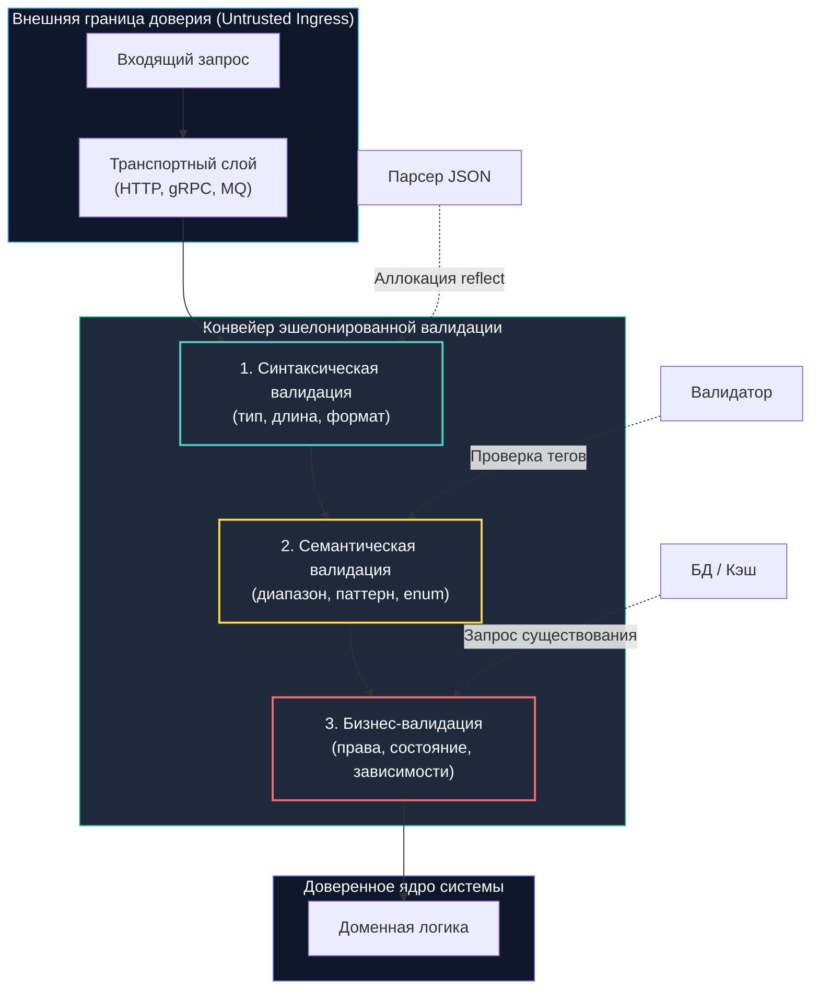

## Архитектурный контракт: валидация как граница доверия

В реальной инженерной практике программа, принимающая сетевой ввод без предварительной строгой проверки, подобна океанскому лайнеру, вышедшему в открытое море с распахнутыми водонепроницаемыми переборками. Один-единственный некорректный байт, отрицательный баланс или неожиданный null-символ способны затопить всю бизнес-логику домена.

Валидация входных данных — это не хаотичный набор операторов `if` в HTTP-хендлере, а фундаментальный архитектурный контракт на внешней границе доверия системы. Любые входящие данные — будь то JSON-тело HTTP-запроса, бинарное gRPC-сообщение, событие из очереди брокера (RabbitMQ, Kafka) или загруженный файл — по умолчанию считаются враждебными.

В экосистеме Go, где строгая статическая типизация и вытесняющая многозадачность горутин требуют безупречного управления памятью, пропуск некорректных данных приводит не просто к ошибкам бизнес-логики, а к паникам в горутинах, повреждениям структур рантайма и критическим уязвимостям.

Правильно спроектированный слой валидации работает как многоступенчатый фильтр: он отсекает невалидный трафик за минимальное число тактов CPU до передачи управления в тяжелые доменные сервисы, полностью защищая ядро приложения от мусорных аллокаций, давления на сборщик мусора (`GC`) и векторов SQL/NoSQL-инъекций.



---

## Уровни валидации и механика рантайма Go

Надежная архитектура разделяет проверку данных на три независимых изолированных уровня, каждый из которых обладает своей стоимостью исполнения:

1. **Синтаксическая валидация (Well-formedness):**  
   Проверка соответствия типов данных, длины строк, формата полей и отсутствия запрещенных символов. Выполняется мгновенно сразу после первичного парсинга байтов на стеке или в буфере.  
   *Пример:* поле `email` обязано содержать символ `@`, поле `age` должно парситься в целое число в диапазоне `int32`.
2. **Семантическая валидация (Context-Free Rules):**  
   Проверка допустимости значений в контексте предметной области без обращения к внешнему состоянию.  
   *Пример:* дата начала акции не может быть позже даты ее завершения; переданная роль `role` должна строго входить в закрытый список допустимых значений перечисления; валюта `currency` обязана совпадать с кодом стандарта ISO 4217.
3. **Бизнес-логическая валидация (Stateful Rules):**  
   Проверка данных относительно текущего состояния хранилищ и других подсистем.  
   *Пример:* пользователь с данным `email` еще не существует в базе данных; текущий остаток на счете достаточен для списания; запрошенный товар физически есть на складе. Этот уровень требует дорогостоящих сетевых вызовов к СУБД или кэшу и запускается **строго после** успешного прохождения синтаксического и семантического этапов.

---

### Под капотом: рефлексия, кэширование типов и GC

В сообществе Go широко распространены декларативные библиотеки валидации на базе структурных тегов (`go-playground/validator`, `gookit/validate`). При вызове метода `validator.ValidateStruct(req)` рантайм выполняет скрытую работу:

1. **Загрузка и кэширование `reflect.Type`:**  
   При первом анализе структуры рантайм компилирует карту ее полей, тегов (`validate:"required,email"`) и типов данных. Результат кэшируется в глобальной потокобезопасной карте `sync.Map`.
2. **Итерация и создание `reflect.Value`:**  
   Для каждого поля структуры вызывается метод `reflect.Value.Field(i)`. Рантайм создает временный дескриптор, указывающий на фактическое значение в памяти процесса.
3. **Динамический диспетчинг функций-валидаторов:**  
   Вызовы сигнатур вида `func(fl validate.FieldLevel) bool` производятся через интерфейсную таблицу методов (`itable`).

### Скрытая цена рефлексивной валидации:
- **Давление на Escape Analysis:** Дескрипторы `reflect.Value` и аргументы интерфейсов не могут быть размещены компилятором на стеке вызова. Они вытесняются в кучу, порождая при нагрузке в 20 000–50 000 RPS гигантский поток короткоживущего мусора, что провоцирует непрерывные циклы `Minor GC`.
- **Промахи кэша CPU (Cache Misses):** Метаданные типов и поля структур разбросаны в виртуальной памяти произвольным образом. Аппаратный префетчер процессора не способен эффективно предзагружать данные в кэш-линии L1/L2, что увеличивает время выполнения проверок.
- **Невозможность инлайнинга:** Компилятор Go `gc` принципиально не может заинлайнить вызов через указатель интерфейса, заставляя процессор выполнять косвенный переход по таблице `itable`.

---

> [!info] Под капотом: Почему кодогенерация быстрее рефлексии?
> **Статическая валидация против `reflect`:**  
> Инструменты со статической кодогенерацией (например, `oapi-codegen`, `makiuchi-d/valid`) или написанные вручную методы `Validate() error` компилируются в прямой машинный код. Компилятор Go `gc` отлично инлайнит такие проверки, выстраивает эффективные деревья ветвлений (Branch Prediction) и оставляет все промежуточные переменные в регистрах процессора и на стеке.  
> Это снижает аллокации в куче до круглого нуля и повышает Cache Hit Rate процессора. В высоконагруженных шлюзах (10k+ RPS) кодогенерация или прямые методы валидации дают колоссальный выигрыш в задержке P99.

---

## Идиоматичные паттерны валидации в Go

### 1. Паттерн Fail-Fast против агрегации ошибок

Во внутренних межсервисных RPC-вызовах оптимален принцип Fail-Fast: возвращайте первую же ошибку (`return err`). Однако в публичных API для фронтенда пользователю необходимо вернуть исчерпывающий список всех некорректных полей формы за один запрос:

```go
package validation

import (
	"fmt"
	"strings"
)

// ValidationError содержит словарь полей с описаниями ошибок
type ValidationError struct {
	Errors map[string]string
}

func (e *ValidationError) Error() string {
	if len(e.Errors) == 0 {
		return "validation succeeded"
	}
	var msgs []string
	for field, err := range e.Errors {
		msgs = append(msgs, fmt.Sprintf("%s: %s", field, err))
	}
	return strings.Join(msgs, "; ")
}

type CreateUserRequest struct {
	Email string
	Age   int
}

// ValidateUser выполняет синтаксическую и семантическую проверку без использования reflect
func ValidateUser(req *CreateUserRequest) error {
	verr := &ValidationError{Errors: make(map[string]string)}

	if req.Email == "" {
		verr.Errors["email"] = "required"
	} else if !isValidEmail(req.Email) {
		verr.Errors["email"] = "invalid format"
	}

	if req.Age < 0 || req.Age > 150 {
		verr.Errors["age"] = "must be between 0 and 150"
	}

	if len(verr.Errors) > 0 {
		return verr
	}
	return nil
}

func isValidEmail(email string) bool {
	// Базовая проверка структуры без тяжелого регулярного выражения
	return strings.Contains(email, "@") && strings.Contains(email, ".")
}
```

---

### 2. Контекстно-зависимая валидация

Правила валидации могут динамически изменяться в зависимости от роли вызывающего субъекта или флага окружения. В Go контекст выполнения передается через первый аргумент `context.Context` или явные параметры, исключая глобальные переменные:

```go
package validation

import (
	"context"
	"fmt"
)

// ValidateRole проверяет допустимость назначения роли с учетом привилегий инициатора
func ValidateRole(ctx context.Context, role string, isAdmin bool) error {
	allowedRoles := []string{"viewer", "editor"}
	if isAdmin {
		allowedRoles = append(allowedRoles, "admin", "superadmin")
	}

	for _, r := range allowedRoles {
		if role == r {
			return nil
		}
	}
	return fmt.Errorf("role %q is not permitted", role)
}
```

---

## Механическое сочувствие: CPU, кэш и регулярные выражения

Проверка текстовых строк традиционно возлагается на регулярные выражения. В Go стандартный пакет `regexp` использует алгоритмический движок **RE2**, спроектированный Робом Пайком и Рассом Коксом.

Фундаментальное свойство RE2 — строго линейное время сопоставления $O(n)$ от длины входящей строки. В отличие от движков PCRE (Perl, PHP, Python, Java), RE2 **принципиально исключает катастрофический откат (backtracking)**, делая Go-сервисы абсолютно неуязвимыми для атак ReDoS (Regular Expression Denial of Service). Платой за эту гарантию является отсутствие поддержки lookahead/lookbehind и обратных ссылок (backreferences).

### Физика работы regex на процессоре:
- **Компиляция автомата:** Вызов `regexp.MustCompile` строит NFA/DFA графы состояний в куче. Компиляция обязана выполняться строго один раз на этапе инициализации приложения (в глобальных переменных или через `sync.Once`).
- **Байтовый обход и локальность кэша:** Метод `regex.MatchString` последовательно сканирует байты строки, поддерживая кэш-локальный доступ к памяти. Однако для тривиальных проверок префиксов и суффиксов простые библиотечные вызовы `strings.HasPrefix`, `strings.HasSuffix` или `strings.Contains` работают в 50–100 раз быстрее регулярных выражений, так как компилируются в высокоэффективные ассемблерные инструкции векторного сравнения (AVX2/NEON).

---

> [!warning] Ловушка / Gotcha: Коварство len(str), Unicode и null-байты
> **Байты против рун:**  
> Классическая ошибка разработчиков — проверка длины строки через функцию `len(str)`. В языке Go `len()` возвращает число **байтов**, а не визуальных символов!  
> Символ эмодзи `"👋"` занимает ровно 4 байта. Если база данных ограничивает поле `VARCHAR(10)`, то строка из 3 эмодзи (12 байт) вызовет ошибку записи или усечение данных.  
> **Решение:**  
> 1. Используйте функцию `utf8.RuneCountInString(str)` для подсчета реальных символов (рун).  
> 2. Фильтруйте нулевые байты `\x00` до валидации — в Си-библиотеках и ядре Linux null-байт обрезает строку.  
> 3. Применяйте Unicode-нормализацию через пакет `golang.org/x/text/unicode/norm` (`norm.NFC.String()`), чтобы символы с диакритическими знаками имели однозначное бинарное представление.  
> 4. Помните о двойном URL-кодировании (`%252e%252f` -> `%2e%2f` -> `../`), требующем аккуратного декодирования через `net/url`.

---

## Сравнение подходов: Go против PHP и C#

Взглянем на различия в философии валидации:

| Аспект | Go | PHP (Laravel / Symfony) | C# (ASP.NET Core) |
|---|---|---|---|
| **Механизм** | Явные вызовы, кодогенерация, теги + `reflect` | Атрибуты/массивы правил, приведение типов на лету | Атрибуты `DataAnnotations`, валидация в middleware |
| **Производительность** | Высокая (статика/кодогенерация) или средняя (reflect) | Средняя (динамический рантайм, JIT-оптимизации) | Высокая (скомпилированные выражения, Expression Trees) |
| **Обработка ошибок** | Явное возвращение `error`, накопление в структуре | Коллекция `Validator`, инъекция в модель | `ModelState`, автоматический `400 Bad Request` |
| **Безопасность** | Строгая типизация, RE2, явный контроль | Риск type juggling, слабые сравнения `==` | Строгая типизация, но возможны проблемы с nullable |

В Go отсутствует «магия» фреймворков, которая скрытно валидирует структуру до вызова обработчика. Разработчик явно контролирует момент проверки, что полностью устраняет неожиданные побочные эффекты.

---

> [!tip] Собеседование
> **Вопрос:** «Как правильно организовать валидацию динамического JSON-документа, в котором ключи неизвестны заранее, а формат вложенного объекта зависит от типа сущности?»  
> 
> **Ответ кандидата Senior-уровня:**  
> «1. **Использование `json.RawMessage`:** Вместо распаковки в нетипизированный `map[string]any` определяем структуру-контейнер с полем-дискриминатором (`"type": "user" | "company"`) и полем сырых байт:  
> ```go
> type Envelope struct {
>     Type    string          `json:"type"`
>     Payload json.RawMessage `json:"payload"`
> }
> ```  
> 2. **Двухфазный парсинг:** Сначала парсим только поле-маркер через `json.Unmarshal` в структуру `Envelope`. Захват `json.RawMessage` происходит без выделения динамических структур.  
> 3. **Ветвление схем:** В операторе `switch envelope.Type` распаковываем `Payload` в строго типизированное DTO соответствующей сущности (User, Company) также через `json.Unmarshal`.  
> 4. **Преимущества для рантайма:** Исключаются рекурсивные аллокации интерфейсов `any`, память выделяется предсказуемо под конкретный тип, а валидация выполняется статическими методами без рефлексии. В спецификациях OpenAPI это соответствует директивам `oneOf` и `discriminator`».

---

## Итог

1. **Валидация как граница доверия:** Валидация — это архитектурный фильтр, разделяющий внешний транспортный контур и изолированную доменную модель. Внешние данные всегда враждебны.
2. **Три уровня проверки:** Четко разграничивайте синтаксическую, семантическую и бизнес-логическую валидацию. Никогда не делайте сетевые запросы в БД, пока не проверены длина и формат полей.
3. **Механическое сочувствие к памяти:** Библиотеки с тегами и `reflect` создают скрытую нагрузку на кучу и сборщик мусора. Для высоконагруженных систем отдавайте предпочтение статической кодогенерации или рукописным методам.
4. **Безопасность строк:** Движок RE2 защищает сервис от атак ReDoS. Помните, что `len()` в Go возвращает число байтов, а не символов — используйте `utf8.RuneCountInString` и нормализацию `norm.NFC`.
5. **Идиоматичный подход:** Fail-fast для внутренних RPC-сервисов, накопление среза ошибок для клиентских форм, явная передача `context.Context` и отказ от неявной магии фреймворков.

Как защитить сервис от перегрузки, если злоумышленник начинает бомбардировать API тысячами валидных запросов в секунду?  
В следующей лекции мы детально разберем: [[2. Rate limiting]].