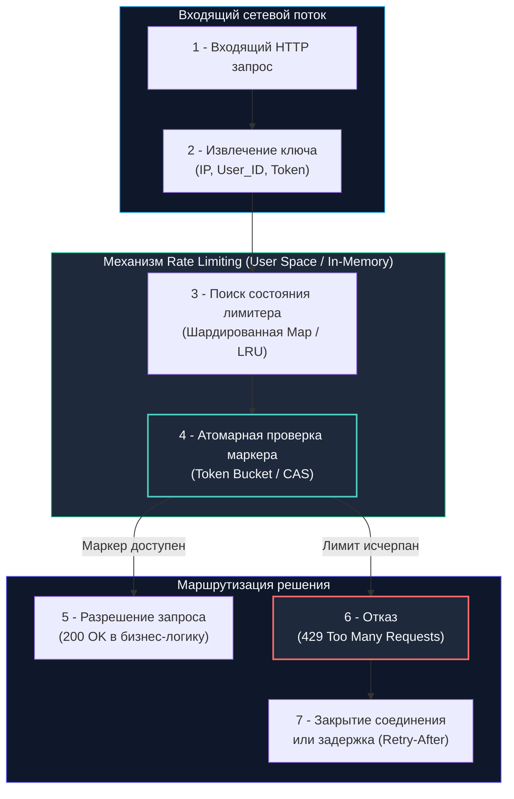

## Архитектурный щит: от алгоритмов к машинным инструкциям

В проектировании распределенных систем ограничение частоты запросов (**Rate Limiting**) часто недооценивают, сводя его к банальной «защите от спама» или фильтрации парсеров.

На самом деле Rate Limiter — это первый и самый главный рубеж обеспечения отказоустойчивости (Resilience) и гарантии соглашений об уровне обслуживания (SLA). В высоконагруженном Go-бэкенде он работает как гидротехнический шлюз: отсекает избыточный шквал трафика до того, как сетевые пакеты заставят рантайм аллоцировать память под JSON-структуры, запускать парсинг и занимать драгоценные сокеты соединений с базой данных.

Для разработчика уровня Senior/Lead выбор алгоритма ограничения — это не абстрактное математическое упражнение, а прямое управление физическими ресурсами сервера:
- Частотой взаимных блокировок мьютексов (`sync.Mutex contention`).
- Паттернами движения кэш-линий процессора между ядрами L1/L2 (Cache Ping-Pong).
- Количеством короткоживущих объектов, выбрасываемых в кучу под ноги сборщику мусора (`GC`).
- Числом системных вызовов к сетевому стеку ядра Linux (`syscall write`/`read`) при обращении к распределенным хранилищам.



---

## Алгоритмы и их стоимость в рантайме

Выбор алгоритма диктует компромисс между точностью учета, расходом оперативной памяти и задержкой (latency) на критическом пути:

1. **Фиксированное окно (Fixed Window):**  
   Счетчик сбрасывается по астрономическому таймеру (например, в начале каждой минуты). Предельно прост и дешев в реализации, но страдает от критического порока: допускает двойной всплеск трафика (Burst) на стыке окон, когда клиент присылает лимит в конце 59-й секунды и еще один лимит в начале 00-й секунды.
2. **Лог скользящего окна (Sliding Window Log):**  
   Для каждого клиента сохраняется срез временных меток каждого запроса (`time.Time`). Алгоритм идеален математически, но катастрофически дорог по памяти: хранение тысяч меток и их постоянная фильтрация создают лавинообразные аллокации в куче и тяжелое давление на `GC`.
3. **Корзина маркеров (Token Bucket):**  
   Виртуальная корзина пополняется маркерами (токенами) с постоянной фиксированной скоростью до максимальной емкости (burst). Каждый запрос забирает 1 маркер. Если корзина пуста — запрос отвергается. Алгоритм идеально сглаживает средний трафик, позволяя клиенту совершать контролируемые краткосрочные всплески.
4. **Утекающее ведро (Leaky Bucket):**  
   Запросы помещаются в FIFO-очередь фиксированного размера и извлекаются с постоянной скоростью. Полностью устраняет любые пики нагрузки, однако при переполнении очереди запросы отбрасываются, а буферизация увеличивает сквозную задержку (latency) сервиса.

В стандартной расширенной библиотеке Go де-факто стандартом является реализация Token Bucket в пакете `golang.org/x/time/rate`.

---

### Под капотом `golang.org/x/time/rate`

Внутренняя структура `rate.Limiter` содержит следующие поля:
- `tokens float64` — текущее расчетное количество доступных токенов.
- `last time.Time` — момент времени последнего пересчета состояния.
- `limit Limit` — скорость пополнения токенов в секунду.
- `mu sync.Mutex` — блокировка для синхронизации параллельных вызовов.

Когда горутина вызывает метод `Allow()` или `Wait()`, рантайм производит строгую последовательность шагов:
1. Захватывает мьютекс `mu.Lock()`.
2. Вычисляет прошедшее время `now - last` (через `now.Sub(last)`).
3. Пересчитывает баланс маркеров: `tokens += elapsed * float64(limit)`. Если токены превышают емкость корзины, значение усекается до максимума.
4. Проверяет наличие маркеров: если `tokens >= 1.0`, происходит списание `tokens--`, обновляется `last = now`, освобождается `mu.Unlock()`, и возвращается `true`.

---

> [!info] Под капотом: Проблема Cache Line Bouncing при высокой конкуренции
> **Аппаратная деградация мьютекса под нагрузкой:**  
> Когда сотни горутин на многоядерном сервере (например, 64 ядра AMD EPYC или Intel Xeon) одновременно вызывают `Allow()` у единственного глобального экземпляра `*rate.Limiter`, они начинают бешено конкурировать за один и тот же `sync.Mutex`.  
> Протокол аппаратной кэш-когерентности процессора (MESI) при каждой попытке захвата замка переводит строку кэша (Cache Line 64 байта), содержащую `mu` и поля `tokens/last`, в состояние `Invalid` во всех остальных ядрах. Возникает эффект «Cache Ping-Pong» (или Cache Line Bouncing): ядра процессора непрерывно гоняют эту кэш-линию по межсокетным шинам (QPI / UPI / Infinity Fabric), вместо того чтобы читать ее мгновенно из L1/L2.  
> Время захвата блокировки взлетает с 10–20 наносекунд до 500–1000 наносекунд! Горутины выстраиваются в очередь в состоянии `mutex wait`, планировщик Go начинает лихорадочно плодить системные треды ОС (`M`), вызывая троттлинг и деградацию производительности всего сервиса.

---

## Идиоматичная реализация и оптимизация contention

Чтобы избежать узкого горлышка глобального мьютекса, на практике применяют **шардирование лимитеров** (Sharded Rate Limiter) по ключу клиента (IP-адрес, User ID или API-токен).

Для локального rate limiting на множество ключей нельзя создавать один глобальный лимитер: требуется маппинг `ключ -> лимитер`. Стандартный `map[string]*rate.Limiter` + `sync.Mutex` создает критическую точку contention. Решение: шардирование лимитеров или `sync.Map` с `LoadOrStore`, либо атомарные счетчики для простых сценариев.

Каждый клиент получает собственный изолированный экземпляр `*rate.Limiter`. Благодаря этому горутины, обрабатывающие запросы разных пользователей, работают с непересекающимися адресами памяти и независимыми мьютексами:

```go
package ratelimit

import (
	"net/http"
	"sync"
	"time"

	"golang.org/x/time/rate"
)

// MultiLimiter управляет отдельными изолированными лимитерами для каждого клиентского ключа
type MultiLimiter struct {
	mu       sync.RWMutex
	limiters map[string]*rate.Limiter
	r        rate.Limit
	burst    int
	ttl      time.Duration
}

// NewMultiLimiter инициализирует пул лимитеров с заданным рейтом и burst
func NewMultiLimiter(r rate.Limit, burst int, ttl time.Duration) *MultiLimiter {
	return &MultiLimiter{
		limiters: make(map[string]*rate.Limiter),
		r:        r,
		burst:    burst,
		ttl:      ttl,
	}
}

// getLimiter возвращает существующий лимитер либо лениво создает новый (Double-Checked Locking)
func (m *MultiLimiter) getLimiter(key string) *rate.Limiter {
	m.mu.RLock()
	l, ok := m.limiters[key]
	m.mu.RUnlock()

	if ok {
		return l
	}

	m.mu.Lock()
	defer m.mu.Unlock()

	// Повторная проверка после захвата эксклюзивного write-lock
	if l, ok = m.limiters[key]; ok {
		return l
	}

	l = rate.NewLimiter(m.r, m.burst)
	m.limiters[key] = l
	return l
}

// Middleware ограничивает частоту входящих запросов по сетевому IP-адресу клиента
func (m *MultiLimiter) Middleware(next http.Handler) http.Handler {
	return http.HandlerFunc(func(w http.ResponseWriter, r *http.Request) {
		key := r.RemoteAddr
		l := m.getLimiter(key)

		// Проверяем доступность маркера за O(1)
		if !l.Allow() {
			http.Error(w, "429 Too Many Requests", http.StatusTooManyRequests)
			return
		}
		next.ServeHTTP(w, r)
	})
}
```

---

> [!warning] Ловушка / Gotcha: Утечка памяти в MultiLimiter
> **Бесконечный рост мапы в куче:**  
> Если клиенты обращаются с динамических IP-адресов или передают уникальные одноразовые токены, мапа `limiters` будет непрерывно пополняться новыми ключами. В Go рантайм никогда автоматически не удаляет неиспользуемые элементы карты — память под них навсегда оседает в куче, приводя к постепенной утечке сотен мегабайт оперативной памяти.  
> **Инженерные решения:**  
> 1. Использовать `sync.Map` с фоновой процедурой периодической очистки.  
> 2. Внедрить TTL-инвалидацию: фоновая горутина-уборщик раз в несколько минут обходит структуру и удаляет лимитеры, к которым не было обращений дольше `ttl`.  
> 3. Для критических нагрузок применять LRU-кэш фиксированного объема (например, `hashicorp/golang-lru`), где каждый слот хранит указатель `*rate.Limiter`. При заполнении кэша старые записи вытесняются автоматически, жестко ограничивая верхнюю границу потребления памяти процессом.

---

## Распределённое ограничение: Redis, Lua и сетевые вызовы

Локальный лимитер в памяти процесса идеален по скорости, но бессилен в горизонтально масштабируемом кластере: запрос от одного и того же клиента последовательно попадает на разные поды в Kubernetes, и каждая реплика считает лимит независимо.

Для глобальной согласованности состояние лимитера выносят во внешнее сверхбыстрое хранилище — **Redis**.

Чтобы избежать сетевых задержек и исключить гонки состояний (Race Conditions), логику проверки Token Bucket упаковывают в атомарный **Lua-скрипт**, исполняемый на стороне единственного ядра Redis без необходимости использования тяжелых транзакций `MULTI/EXEC`:

```lua
-- Атомарный Lua-скрипт для Redis (Token Bucket с фиксированным окном)
local key = KEYS[1]
local limit = tonumber(ARGV[1])
local window = tonumber(ARGV[2])
local current = redis.call("GET", key)

if current and tonumber(current) >= limit then
    return 0 -- Лимит исчерпан: Отказ
end

redis.call("INCR", key)
if current == nil then
    redis.call("EXPIRE", key, window)
end
return 1 -- Запрос разрешен
```

На стороне Go вызов этого скрипта через клиентскую библиотеку `go-redis` или `redigo` выполняется атомарно:

```go
package ratelimit

import (
	"context"
	"fmt"

	"github.com/redis/go-redis/v9"
)

type RedisLimiter struct {
	client *redis.Client
}

// Allow атомарно исполняет Lua-скрипт в Redis за один сетевой round-trip
func (r *RedisLimiter) Allow(ctx context.Context, key string) (bool, error) {
	// 🔒 Пайплайнинг и atomic eval в одном сетевом системном вызове к Redis
	res, err := r.client.Eval(ctx, luaScript, []string{key}, 10, 60).Int()
	if err != nil {
		return false, fmt.Errorf("redis eval: %w", err)
	}
	return res == 1, nil
}
```

### Механическое сочувствие к сетевому вводу-выводу:
Каждый распределенный вызов `Allow()` физически включает в себя:
1. Сериализацию параметров в бинарный протокол Redis RESP.
2. Системный вызов `syscall write` в сетевой сокет.
3. Сетевой раунд-трип (Round-Trip Time — от 0.1 мс на localhost до 1–5 мс внутри кластера датацентра).
4. Системный вызов `syscall read` ответа из сетевого буфера.
5. Парсинг ответа и аллокацию структуры `redis.Result`.

При нагрузке в 50 000 RPS обращение к внешнему Redis для каждого HTTP-запроса порождает **100 000 системных вызовов в секунду**, перегружая системный сетевой поллер (`netpoll`) и планировщик горутин.

**Архитектурное решение:** Применяйте гибридную двухэшелонную схему:
- Первый эшелон: сверхбыстрый локальный `rate.Limiter` в памяти инстанса Go, отсекающий грубый DoS-флуд за считанные наносекунды.
- Второй эшелон: распределенный Redis с локальным микрокэшированием результатов на 1–2 секунды для точной квоты аккаунта.

---

## Сравнение подходов: Go, Java, PHP

Взглянем на реализацию ограничения частоты запросов в разных технологических стеках:

| Аспект | Go | Java (Resilience4j / Spring) | PHP (Laravel / Redis) |
|---|---|---|---|
| **Модель исполнения** | User Space, `x/time/rate`, атомики | Фреймворковые `Limiter`, AOP-интерсепторы | Middleware, прямое делегирование в Redis |
| **Конкурентность** | Горутины, `sync.Mutex`, `atomic` | Потоки ОС, `CompletableFuture`, `ReentrantLock` | Блокирующие воркеры PHP-FPM, общее состояние отсутствует |
| **Аллокации памяти** | Полный ручной контроль, `sync.Pool` | Нагрузка на GC поколений, JIT-компиляция | Новый процесс/сборка мусора на каждый входящий запрос |
| **Распределённость** | Явная интеграция с Redis / Etcd | Spring Cloud Gateway, встроенные провайдеры | Жесткая привязка к внешнему кэшу, stateless-модель |

В Go разработчик избавлен от неявной магии фреймворков и держит в руках полный контроль над аллокациями и примитивами синхронизации.

---

> [!tip] Собеседование
> **Вопрос:** «Почему использование `time.Ticker` или функций `time.Sleep` категорически неприемлемо для реализации Rate Limiting в высоконагруженных Go-сервисах, и как пакет `golang.org/x/time/rate` решает проблему ожидания без создания фоновых таймеров?»  
> 
> **Ответ кандидата Senior-уровня:**  
> «1. **Проблема таймеров и очередей:** Создание `time.Ticker` выделяет внутреннюю структуру таймера в рантайме Go и создает канал. При наличии 100 000 уникальных клиентов создание 100 000 тикеров перегрузит планировщик таймеров рантайма, создавая тысячи горутин и аллокаций `time.Timer`, что быстро исчерпает оперативную память.  
> 2. **Блокировки через `time.Sleep`:** Вызов `time.Sleep` блокирует горутину, увеличивая время удержания сетевого сокета и раздувая задержку P99.  
> 3. **Ленивое вычисление (Lazy Evaluation):** Пакет `rate.Limiter` математически гениален: он вообще не использует фоновые горутины или тикеры! При вызове `Allow()` лимитер просто смотрит на `time.Now()` и мгновенно пересчитывает число маркеров за O(1). Если маркеров нет — он немедленно возвращает `false`.  
> 4. **Неблокирующее ожидание `Wait()`:** Для сценариев плавного ожидания метод `Wait()` использует связку `context.Context` с точным расчетом времени задержки через `sync.Cond`, исключая холостые спин-локи процессора».

---

## Итог

1. **Фундамент отказоустойчивости:** Rate Limiting — это архитектурный шлюз, предохраняющий внутренние базы данных, сборщик мусора и память сервиса от лавинообразной деградации.
2. **Алгоритмический выбор:** Token Bucket (`golang.org/x/time/rate`) — золотой стандарт для REST/gRPC API, сочетающий предсказуемую пропускную способность со способностью выдерживать кратковременные всплески (Burst).
3. **Механическое сочувствие:** Конкуренция за единственный мьютекс вызывает Cache Line Bouncing и сбросы процессорного кэша. Для сотен тысяч клиентов используйте шардирование мапы и LRU-кэши с вытеснением.
4. **Предотвращение утечек памяти:** Контроль жизненного цикла структур лимитеров (TTL, LRU, инвалидация) критичен для предотвращения утечек памяти в `map[string]*Limiter`.
5. **Распределенный контур:** В микросервисных кластерах глобальные лимиты контролируются через Redis с атомарными Lua-скриптами. Чтобы минимизировать 100k системных вызовов в секунду, стройте двухуровневую гибридную защиту.
6. **Отказ от таймеров:** Никогда не используйте `time.Ticker` для лимитеров. Полагайтесь на ленивые математические вычисления разницы временных меток.

Как контролировать кросс-доменные запросы браузера и корректно настроить заголовки CORS, не открыв при этом доступ к API всему интернету?  
В следующей лекции мы детально разберем: [[3. CORS]].