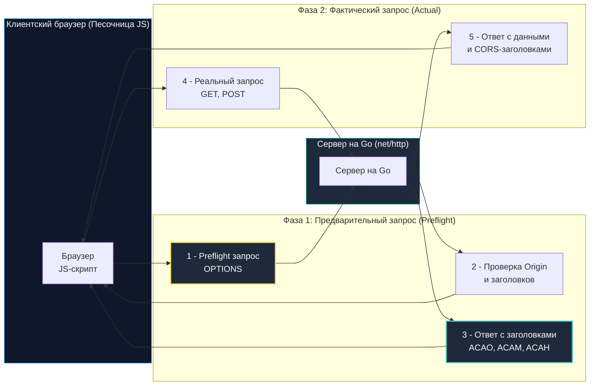

## Архитектура перекрестного домена: от Same-Origin Policy к HTTP-заголовкам

На заре зарождения Всемирной паутины инженеры Netscape сформулировали один из важнейших принципов безопасности браузера: **Same-Origin Policy (SOP — политика одинакового источника)**. Суть ее предельно проста: скрипт, загруженный со страницы `bank.com`, имеет право отправлять сетевые запросы и читать данные только и исключительно с домена `bank.com`. Попытка обратиться к `evil.com` или даже к поддомену `api.bank.com` жестко пресекалась браузером.

Однако современная веб-разработка давно переросла эту модель. Типичное веб-приложение представляет собой Single Page Application (SPA), развернутое на CDN (`app.example.com`), которое обращается к REST/gRPC API на `api.example.com` и загружает медиафайлы с `s3.cloud-storage.com`.

Чтобы разрешить легитимное взаимодействие между разными доменами без потери безопасности, консорциум W3C разработал спецификацию **CORS (Cross-Origin Resource Sharing — совместное использование ресурсов между разными источниками)**.

### Главный парадокс CORS

Для каждого бэкенд-инженера на Go критически важно усвоить базовый парадокс:  
**CORS — это не защита вашего сервера, это защита клиента!**

Сервер Go не «отклоняет» и не «сбрасывает» сетевые соединения при отсутствии заголовков CORS. Он послушно читает TCP-сокет, парсит JSON, выполняет бизнес-логику и возвращает код `200 OK`. Но когда браузер пользователя получает ответ и видит, что сервер не прислал разрешающий заголовок `Access-Control-Allow-Origin`, именно **браузер блокирует доступ JavaScript-кода к телу ответа**.

Любые консольные утилиты вроде `curl`, Postman, Python-скрипты или бэкенд-серверы полностью игнорируют CORS, так как они не являются браузерами и не подчиняются Same-Origin Policy.



---

### Механика работы и типы запросов

Браузер строго разделяет все кросс-доменные запросы на две фундаментальные категории:

1. **Простые запросы (Simple Requests):**  
   Запросы с методами `GET`, `HEAD` или `POST`, у которых заголовки ограничены стандартными безопасными полями (`Accept`, `Accept-Language`, `Content-Language`), а заголовок `Content-Type` принимает только три значения:
   - `text/plain`
   - `multipart/form-data`
   - `application/x-www-form-urlencoded`  
   Такие запросы браузер отправляет на сервер сразу, без предупреждения. Если в ответе сервера отсутствует заголовок `Access-Control-Allow-Origin` со значением вызывающего домена, браузер выбрасывает ошибку в консоль и скрывает ответ от скрипта.
2. **Предварительные запросы (Preflight Requests):**  
   Если запрос использует методы `PUT`, `DELETE`, `PATCH`, кастомные заголовки (например, `Authorization`, `X-Request-ID`) или заголовок `Content-Type: application/json`, браузер **не имеет права отправлять его сразу**.  
   Сначала браузер отправляет легковесный зондирующий запрос с методом `OPTIONS`. Сервер должен ответить, перечислив разрешенные методы (`Access-Control-Allow-Methods`) и заголовки (`Access-Control-Allow-Headers`). Только получив одобрение, браузер отправляет основной payload.

---

### Идиоматичная реализация в Go

В стандартной библиотеке Go пакет `net/http` намеренно не содержит встроенной «магии» CORS. Разработчик обязан реализовать логику через Middleware либо подключить проверенную библиотеку (например, `rs/cors`).

#### Паттерн безопасного Middleware без лишних аллокаций:

```go
package cors

import (
	"net/http"
	"strings"
)

// CORSMiddleware реализует обработку кросс-доменных запросов по строгому белому списку
func CORSMiddleware(allowedOrigins []string) func(http.Handler) http.Handler {
	// Pre-compile map for O(1) lookup: предкомпиляция для быстрого поиска без аллокаций
	allowed := make(map[string]bool, len(allowedOrigins))
	for _, o := range allowedOrigins {
		allowed[strings.ToLower(o)] = true
	}

	return func(next http.Handler) http.Handler {
		return http.HandlerFunc(func(w http.ResponseWriter, r *http.Request) {
			origin := r.Header.Get("Origin")

			// Если это кросс-доменный запрос (присутствует заголовок Origin)
			if origin != "" {
				// Проверка белого списка. Не используйте * с Credentials!
				if _, ok := allowed[strings.ToLower(origin)]; ok {
					w.Header().Set("Access-Control-Allow-Origin", origin)
				}

				w.Header().Set("Access-Control-Allow-Methods", "GET, POST, PUT, DELETE, OPTIONS")
				w.Header().Set("Access-Control-Allow-Headers", "Content-Type, Authorization")

				// Кэширование результата Preflight (в секундах)
				// Уменьшает количество OPTIONS запросов на клиенте
				w.Header().Set("Access-Control-Max-Age", "3600")

				// Обработка Preflight запроса
				if r.Method == http.MethodOptions {
					w.WriteHeader(http.StatusNoContent) // 204 No Content
					return
				}

				// Для простых запросов заголовки уже установлены, 
				// продолжаем цепочку обработки
			}

			next.ServeHTTP(w, r)
		})
	}
}
```

---

### Под капотом: влияние на производительность и соединения

Реализация CORS на бэкенде имеет ощутимую цену в терминах ресурсов процессора и сетевого стека:

1. **Задержка сети (Latency Penalty):**  
   Каждый Preflight-запрос `OPTIONS` добавляет полный сетевой Round-Trip Time (RTT) к вызову API. В эпоху HTTP/1.1 это парализовало загрузку SPA, так как браузер держал лимит в 6 одновременных TCP-соединений на домен. В протоколах HTTP/2 и HTTP/3 благодаря мультиплексированию фреймов в едином TCP/QUIC-соединении ситуация улучшилась, но задержка RTT на мобильных сетях (50–150 мс) никуда не исчезает. Директива `Access-Control-Max-Age: 3600` заставляет браузер кэшировать результат preflight на 1 час, снижая трафик.
2. **Парсинг заголовков и аллокации:**  
   Вызов `r.Header.Get("Origin")` в Go выполняет канонизацию строки ключа через `textproto.CanonicalMIMEHeaderKey` и поиск в хэш-мапе `http.Header` (`map[string][]string`). При 50 000 RPS постоянный доступ к мапе создает микроскопическое, но измеримое давление на кэш-линии CPU.
3. **Разгрузка Go-сервера на уровне Ingress:**  
   Поскольку запрос `OPTIONS` не несет бизнес-логики, в высоконагруженных архитектурах обработку `OPTIONS` полностью делегируют обратному прокси или балансировщику (Nginx, HAProxy, Envoy). Прокси возвращает статус 204 с CORS-заголовками прямо из памяти веб-сервера, не передавая холостой запрос в Go-приложение и экономя горутины и аллокации `http.Request`.

---

> [!info] Под капотом: Почему Access-Control-Allow-Origin: * опасен с куки?
> **Конфликт Wildcard и учетных данных:**  
> Если клиенту требуется передавать в кросс-доменном запросе сессионные куки или заголовки базовой аутентификации, клиентский скрипт выставляет `credentials: 'include'`. В ответ сервер обязан прислать заголовок `Access-Control-Allow-Credentials: true`.  
> Спецификация CORS категорически **запрещает использовать маску `*`** в комбинации с `Credentials: true`.  
> **Механика браузерной блокировки:**  
> Если браузер видит заголовки `Access-Control-Allow-Origin: *` и `Access-Control-Allow-Credentials: true` одновременно, он блокирует выполнение запроса с ошибкой. Это защита от кражи персональных данных: сайт `evil.com` не должен иметь права отправлять авторизованные запросы на ваш бэкенд от лица пользователя.  
> **Решение:** Сервер обязан зеркально отражать конкретный `Origin` из заголовка запроса (строго после его верификации по белому списку разрешенных доменов).

---

### Ловушки и уязвимости (Gotchas)

1. **Невалидированное отражение Origin (Null / Insecure Echo):**  
   Грубейшая ошибка начинающих разработчиков — автоматическое копирование входящего `Origin` в ответ:
   ```go
   // ❌ КАТАСТРОФИЧЕСКИ ОПАСНО
   w.Header().Set("Access-Control-Allow-Origin", r.Header.Get("Origin"))
   ```
   В такой конфигурации любой фишинговый сайт `evil.com` может делать AJAX-запросы к вашему API, читать конфиденциальные ответы и воровать данные пользователей. Всегда проверяйте домен по строгому белому списку (Allowlist).
2. **Ловушка кэширования браузером:**  
   Если вы изменили конфигурацию разрешенных заголовков или методов на сервере, браузер разработчика может продолжать падать с ошибками из-за старого кэша `Access-Control-Max-Age`. Для чистой отладки сетевых контрактов всегда используйте утилиту `curl -v` — она не сохраняет состояние и показывает сырые HTTP-заголовки ответа.
3. **Wildcards в заголовках:**  
   Хотя современные браузеры (начиная с Chrome 76+) поддерживают маску `Access-Control-Allow-Headers: *` для Preflight-запросов, в продакшене рекомендуется явно декларировать список разрешенных заголовков (`Authorization, Content-Type, X-Request-ID`) для обратной совместимости со старыми корпоративными клиентами.

---

> [!tip] Собеседование
> **Вопрос:** «Вы видите ошибку CORS в консоли инструментов разработчика в браузере, но при этом во вкладке Network статус запроса отображается как 200 OK. Почему JavaScript не может прочитать полученные данные?»  
> 
> **Ответ кандидата Senior-уровня:**  
> «1. Запрос физически дошел до Go-сервера, бэкенд его успешно обработал и вернул полезную нагрузку с кодом 200 OK.  
> 2. Однако сервер забыл выставить заголовок `Access-Control-Allow-Origin` со значением домена страницы, с которой был отправлен запрос.  
> 3. Песочница браузера (Same-Origin Policy) проверила заголовки ответа и в целях безопасности наложила запрет на передачу тела ответа в JavaScript-контекст страницы.  
> 4. Это наглядно демонстрирует аксиому: CORS защищает клиента от вредоносных сайтов, а не сервер от нежелательных запросов».

---

> [!warning] Ловушка / Gotcha: Запросы OPTIONS и порядок Middleware
> **OPTIONS и аутентификация:**  
> Предварительные запросы `OPTIONS` по спецификации W3C **никогда не содержат заголовков аутентификации** (нет Bearer-токена в `Authorization`, нет сессионных кук).  
> Если в вашей цепочке middleware middleware аутентификации (JWT/OAuth) стоит **раньше** CORS-обработчика, то на каждый preflight-запрос `OPTIONS` сервер будет отвечать ошибкой `401 Unauthorized`. Браузер посчитает проверку проваленной и вообще не отправит основной запрос!  
> **Железное правило:** CORS-middleware обязан стоять **самым первым** в конвейере HTTP-обработчиков сервиса, немедленно возвращая статус 204 No Content на все запросы `OPTIONS` без проверки авторизации.

---

## Итог

1. **Клиентская природа CORS:** CORS — это механизм браузерной изоляции Same-Origin Policy. Сервер не блокирует запросы сам, а лишь декларирует права доступа через заголовки ответа.
2. **Две фазы взаимодействия:** Простые запросы выполняются сразу; запросы с телом JSON, методом PUT/DELETE или кастомными заголовками требуют предварительного `OPTIONS` Preflight-запроса.
3. **Безопасность Credentials:** Комбинация `Access-Control-Allow-Origin: *` и `Credentials: true` запрещена стандартом. Допустимо только явное отражение проверенного Origin из белого списка.
4. **Оптимизация задержки:** Заголовок `Access-Control-Max-Age` кэширует результаты preflight-проверки в браузере, устраняя лишние сетевые RTT. Для сверхнагруженных API обработку `OPTIONS` выносят на Nginx или Envoy.
5. **Порядок Middleware:** Обработчик CORS обязан находиться на самом входе в пайплайн обработки HTTP, строго до любых проверок аутентификации и сессий.

Как организовать аутентификацию Machine-to-Machine и ограничить доступ к сервису с помощью криптографически стойких API-ключей?  
В следующей лекции мы разберем: [[4. API keys]].