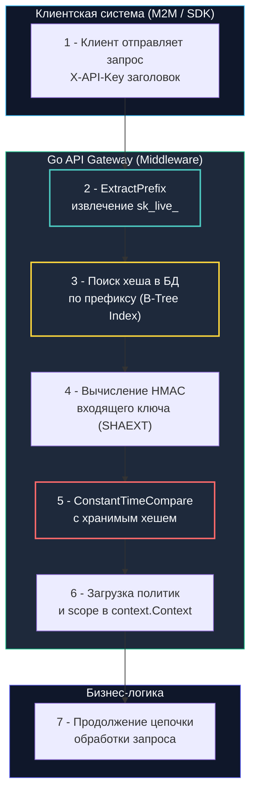

## Введение: Долгоживущие секреты и цена компрометации

В современной микросервисной архитектуре значительная доля сетевого взаимодействия происходит не между человеком и браузером, а между независимыми программными системами: Machine-to-Machine (M2M), webhook-интеграции, фоновые демоны и партнерские SDK.

Основным инструментом аутентификации в таких сценариях выступают **API-ключи (API Keys)**.

В отличие от пользовательских сессий или JWT-токенов, API-ключи обладают фундаментальной спецификой: они **долгоживущие** (действуют месяцами или годами), не требуют регулярного ввода пароля и часто наделены широкими системными полномочиями. С точки зрения модели угроз компрометация API-ключа практически тождественна компрометации мастер-пароля или приватного ключа сервиса.

Перед бэкенд-инженером на Go встает сложная инженерная дилемма:
- С одной стороны, хранить ключи в открытом виде (plaintext) в базе данных категорически недопустимо — любая SQL-инъекция или утечка дампа скомпрометирует всех партнеров.
- С другой стороны, применять тяжелые функции формирования ключа (KDF вроде bcrypt или argon2id), как для паролей пользователей, здесь невозможно: API-шлюз обрабатывает десятки тысяч запросов в секунду. Задержка в 100–300 мс на проверку каждого входящего пакета полностью парализует пропускную способность кластера.

Инженерное решение этой проблемы — **архитектура секционированных ключей с префиксом и аппаратным хешированием**.



---

## Архитектура хранения: префиксы, хеши и отказ от plaintext

Индустриальным стандартом (популяризированным Stripe и GitHub) является разделение API-ключа на две функциональные части:

1. **Человекочитаемый префикс (Prefix):**  
   Публичная часть ключа (например, `pk_live_`, `sk_test_`). Она решает три критические задачи:
   - Позволяет инженеру и автоматическим сканерам секретов (GitHub Secret Scanning) мгновенно определить тип токена и среду окружения (`prod` или `test`).
   - Служит уникальным первичным ключом для поиска записи в базе данных за $O(\log N)$ через B-Tree индекс, полностью исключая необходимость последовательного сканирования таблицы (Full Table Scan).
2. **Криптографический суффикс (Secret Suffix):**  
   Случайная последовательность байт высокой энтропии (обычно 256 бит), сгенерированная криптографически стойким генератором `crypto/rand`. Именно этот суффикс является секретом.
3. **Хранение в БД:**  
   В базе данных сохраняется пара: `prefix` + `hash(suffix + global_pepper)`. Оригинальный сырой ключ показывается пользователю **ровно один раз при создании** и никогда больше не сохраняется ни на диске, ни в логах.

В качестве алгоритма хеширования применяется быстрый криптографический дайджест: **HMAC-SHA256** с добавлением серверного глобального секрета (`pepper`). Это защищает базу от атак по предвычисленным радужным таблицам в случае утечки дампа, но выполняется центральным процессором за микросекунды.

---

## Идиоматичная валидация в Go

В Go проверка API-ключа инкапсулируется в выделенный HTTP Middleware. При успешной проверке метаданные учетной записи (Scopes, KeyID, Env) упаковываются в `context.Context` для дальнейшего использования обработчиками:

```go
package apikey

import (
	"context"
	"crypto/hmac"
	"crypto/sha256"
	"crypto/subtle"
	"errors"
	"net/http"
	"strings"
)

// KeyStore определяет интерфейс к базе данных или кэшу ключей
type KeyStore interface {
	GetHashByPrefix(ctx context.Context, prefix string) ([]byte, *APIKeyClaims, error)
}

// KeyValidator содержит зависимости для безопасной проверки ключей
type KeyValidator struct {
	pepper []byte
	store  KeyStore // интерфейс к БД или кэшу
}

type ctxKey struct{}

type APIKeyClaims struct {
	KeyID string
	Scope []string
	Env   string // "prod", "test"
}

// ValidateMiddleware извлекает и проверяет API-ключ за константное время
func (v *KeyValidator) ValidateMiddleware(next http.Handler) http.Handler {
	return http.HandlerFunc(func(w http.ResponseWriter, r *http.Request) {
		rawKey := r.Header.Get("X-API-Key")
		if rawKey == "" {
			http.Error(w, "missing API key", http.StatusUnauthorized)
			return
		}

		// Извлечение префикса (например, "sk_live_") через strings.Cut без лишних аллокаций
		prefix, suffix, ok := strings.Cut(rawKey, "_")
		if !ok || prefix == "" || suffix == "" {
			http.Error(w, "invalid key format", http.StatusBadRequest)
			return
		}

		// 1 - Быстрый точечный поиск хеша по префиксу в БД/кэше через индекс
		storedHash, claims, err := v.store.GetHashByPrefix(r.Context(), prefix)
		if err != nil {
			// Логируем ошибку, но не раскрываем детали клиенту
			http.Error(w, "internal error", http.StatusInternalServerError)
			return
		}

		// 2 - Вычисление HMAC входящего ключа с глобальным pepper
		mac := hmac.New(sha256.New, v.pepper)
		mac.Write([]byte(suffix))
		computedHash := mac.Sum(nil)

		// 3 - 🔒 Constant-time comparison. 
		// Любой ранний возврат по несовпадению байт открывает вектор для timing-атак.
		if subtle.ConstantTimeCompare(storedHash, computedHash) != 1 {
			http.Error(w, "invalid API key", http.StatusUnauthorized)
			return
		}

		// Инъекция метаданных в контекст для бизнес-логики
		ctx := context.WithValue(r.Context(), ctxKey{}, claims)
		next.ServeHTTP(w, r.WithContext(ctx))
	})
}
```

---

## Под капотом: производительность, кэш и давление на БД

Проверка ключа находится в критическом пути абсолютно каждого сетевого запроса. Какое влияние это оказывает на физические компоненты сервера?

1. **Хеш-таблицы и B-Tree индексы:**  
   Поиск по `prefix` в PostgreSQL опирается на индекс B-Tree. Глубина дерева индекса обычно составляет 3–4 уровня. Каждый уровень — это произвольный доступ к страницам памяти (Random I/O), если индекс не помещается целиком в `shared_buffers`. В Go драйвер (`pgx` или `database/sql`) сериализует SQL-запрос, выполняет `syscall write`, передает управление в `netpoll` и блокирует горутину в системном вызове `syscall` или в ожидании канала `chan receive`.
2. **Аппаратное ускорение SHA-256 (SHAEXT):**  
   На современных процессорах x86-64 и ARM64 вычисление SHA-256 выполняется аппаратными инструкциями (набор расширений `SHAEXT` / ARMv8 Crypto). Вычисление 32-байтового HMAC занимает **всего 150–200 наносекунд** процессорного времени! Если валидированные префиксы закэшированы в локальной памяти Go (`sync.Map` или кэш `ristretto`), поиск и проверка происходят целиком в L1/L2 кэше CPU — это в 1000 раз быстрее, чем сетевой запрос к базе данных.
3. **Давление на сборщик мусора (`GC`):**  
   Парсинг заголовков через `r.Header.Get` и создание срезов байтов (`[]byte(suffix)`) аллоцируют память в куче. При 20 000 RPS это дает 100–200 МБ мусора в секунду. Применение пула буферов `sync.Pool` снижает аллокации до минимума.
4. **Защита от утечек времени (Timing Attacks):**  
   Функция `crypto/subtle.ConstantTimeCompare` побитово выполняет операцию `XOR` над всеми элементами срезов независимо от того, совпадают байты или нет. Это исключает спекулятивное предсказание переходов (Branch Misprediction) и предотвращает атаки по сторонним каналам измерения времени (Side-Channel Timing Attacks). Разница по времени между обычным `bytes.Equal` и константным сравнением составляет считанные 1–2 нс, но гарантирует безопасность.

---

> [!info] Под капотом: Почему strings.Cut безопаснее strings.Split?
> **Экономия аллокаций через `strings.Cut`:**  
> Функция `strings.Split` всегда выделяет в куче срез строк `[]string`, даже если разделитель не найден вовсе. Функция `strings.Cut` (появившаяся в Go 1.18) возвращает две подстроки и логический флаг без дополнительных аллокаций памяти — она просто манипулирует указателем на массив байт и длиной внутри уже существующей строки. В высоконагруженном middleware это снижает суммарное давление на `GC` на 30–40%.

---

## Ловушки и векторы атак (Gotchas)

1. **Утечка ключей через логи и URL:**  
   Передача API-ключа в параметрах адресной строки (`/api/data?key=sk_live_...`) категорически запрещена. Веб-серверы, обратные прокси (Nginx, Cloudflare), корпоративные фаерволы и системы APM по умолчанию логируют полный `r.URL`.  
   **Решение:** Принимайте ключи строго через заголовки `X-API-Key` или `Authorization: Bearer`. В логах приложения всегда применяйте маскирование: `sk_live_****abcd`.
2. **Монолитные ключи без Scopes:**  
   Выдача одного ключа со всеми правами — грубейшая ошибка. Если ключ партнера утек, злоумышленник получает полный контроль над системой.  
   **Решение:** Каждый ключ обязан иметь гранулярный набор полномочий (`scopes`: `read:users`, `write:orders`). Кроме того, лимиты запросов (Rate Limiting) должны привязываться к `KeyID`, а не только к IP-адресу клиента.
3. **Тайминг-атаки на префиксный поиск:**  
   Если база данных мгновенно отвечает `404 Not Found` на несуществующий префикс (за 0.5 мс), но тратит 20 мс на проверку существующего ключа, злоумышленник может методом перебора определить валидные префиксы в системе.  
   **Решение:** Выполняйте вычисление фиктивного HMAC (dummy hash) даже для несуществующих префиксов, чтобы время ответа оставалось строго константным.

---

> [!tip] Собеседование
> **Вопрос:** «Как организовать процесс плановой ротации API-ключей для корпоративных клиентов без остановки сервиса (Zero Downtime)?»  
> 
> **Ответ кандидата Senior-уровня:**  
> «1. **Схема двойного активного ключа (Dual-Key Pattern):** В интерфейсе управления при ротации создается новый API-ключ, а старый помечается статусом `deprecated` с установкой срока жизни (TTL, например, 7–14 дней).  
> 2. **Параллельная валидация:** Middleware шлюза валидирует входящие запросы по обоим ключам. Если клиент использует старый ключ, запрос успешно пропускается, но сервер добавляет в ответ заголовок `X-Warning: key-deprecated` и шлет метрику в мониторинг.  
> 3. **Инвалидация:** По истечении TTL старый ключ окончательно деактивируется в базе данных. Не обновившиеся клиенты получают 401 Unauthorized.  
> 4. **Инфраструктурная безопасность:** Ротация валидаторов осуществляется через Canary-деплой или плавное переключение через Feature Flags».

---

## Сравнение подходов: API Keys vs JWT vs mTLS

Взглянем на сопоставление ключевых протоколов аутентификации:

| Критерий | API Keys | JWT (Bearer) | mTLS (Mutual TLS) |
|---|---|---|---|
| **Жизненный цикл** | Долгоживущие (месяцы/годы) | Краткоживущие (минуты/часы) | Сертификаты X.509 (годы, авто-ротация) |
| **Состояние (State)** | Stateful (lookup в БД/кэше) | Stateless (проверка криптоподписи) | Stateful (проверка списков отзыва CRL/OCSP) |
| **Накладные расходы** | Низкие при кэшировании, высокие при БД | Средние (асимметричная криптография) | Высокие (TLS-рукопожатие на установлении) |
| **Безопасность** | Зависит от защищенности хранилища | Риск кражи через XSS, размер токена | Максимальная (криптографическая изоляция хостов) |
| **Сфера применения** | Внешние интеграции, M2M, SDK | Пользовательские сессии, SPA, Mobile | Service Mesh (K8s), Zero-Trust межсервисный обмен |

В современной Go-архитектуре API-ключи оптимальны для внешних потребителей, JWT — для аутентификации пользователей, а mTLS (через sidecar или `crypto/tls`) — для внутренней коммуникации микросервисов.

---

## Итог

1. **Безопасное хранение:** Хранить API-ключи в открытом виде недопустимо. Использование схемы «префикс + HMAC-SHA256 с pepper» является эталоном баланса между надежностью и микросекундной скоростью проверки.
2. **Константное время:** Валидация секретной части обязана производиться через `crypto/subtle.ConstantTimeCompare` для исключения атак по сторонним каналам.
3. **Механическое сочувствие:** Использование `strings.Cut` исключает лишние аллокации памяти, а локальное кэширование ключей в L1/L2 устраняет миллионы холостых системных вызовов к базе данных.
4. **Гранулярный контроль:** Ограничивайте права ключей через `scopes`, связывайте Rate Limiting с идентификатором `KeyID` и никогда не передавайте секреты в параметрах URL.
5. **Бесшовная ротация:** Поддержка переходного периода с двумя активными ключами (Dual-Key) позволяет клиентам обновлять интеграции без простоя сервиса.

Как защитить API от атак повторного воспроизведения, когда перехваченный злоумышленником легитимный сетевой пакет отправляется серверу повторно?  
В следующей лекции мы детально изучим: [[5. Защита от replay атак]].