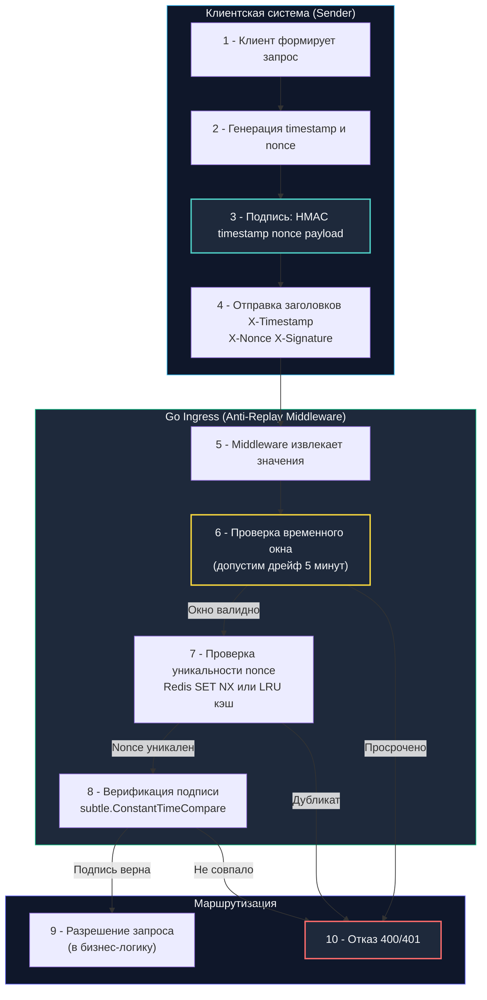

## Архитектура защиты: от одноразовых номеров к криптографическим подписям

В теории компьютерных сетей существует фундаментальный постулат: шифрование гарантирует конфиденциальность и целостность данных в канале, но само по себе не защищает от фактора времени.

Представьте физическую модель: злоумышленник перехватывает зашифрованный сетевой пакет с командой: «Списать $1 000 со счета Алисы в пользу Боба». Даже если злоумышленник не знает закрытых ключей и не может расшифровать или подделать содержимое пакета, что мешает ему просто сохранить этот легитимный пакет и отправить его на сервер еще 500 раз подряд? Если сервер наивно обрабатывает каждый валидный пакет, Боб станет богачом, а счет Алисы опустеет.

Эта угроза называется **Replay-атакой (Атакой повторного воспроизведения)**.

В распределенных API, интеграционных вебхуках (Payment Webhooks, GitHub Webhooks) и системах межсервисного взаимодействия (M2M) защита от повторов строится на строгой комбинации трех криптографических примитивов:
1. **Временного окна (Timestamp)** — ограничивает срок годности сообщения в физическом времени.
2. **Одноразового номера (Nonce)** — гарантирует абсолютную уникальность каждого запроса.
3. **Криптографической привязки (HMAC Signature)** — делает timestamp и nonce неделимой частью подписанной полезной нагрузки.



---

## Механизмы защиты и их комбинация

Эффективная защита от повторного воспроизведения невозможна, если исключить хотя бы один компонент триады:

1. **Временное окно (Timestamp):**  
   Клиент прикладывает текущее время Unix в секундах или миллисекундах. Сервер сверяет его со своим системным временем через `time.Now()`. Если разница между часами клиента и сервера превышает допустимый порог (обычно 1–5 минут), запрос мгновенно отклоняется. Это сужает временное окно жизни перехваченного сетевого пакета.
2. **Одноразовый номер (Nonce — Number used ONCE):**  
   Криптографически стойкий случайный идентификатор высокой энтропии (UUIDv4 или 128 бит случайных байт), генерируемый клиентом на каждый отдельный запрос. Сервер сохраняет этот идентификатор во временном хранилище ровно на длительность временного окна (5 минут). Попытка повторно использовать уже встречавшийся `nonce` пресекается как атака.
3. **Криптографическая подпись (Signature):**  
   Timestamp и nonce включаются в строку подписи, по которой вычисляется дайджест HMAC-SHA256 от тела запроса. Это лишает злоумышленника возможности манипулировать временем: изменить timestamp или сгенерировать свежий nonce невозможно без знания общего секрета, так как итоговая подпись станет невалидной.

**Почему разделение критично?**
- Без nonce атакующий может повторить запрос сотни раз *внутри* разрешенного 5-минутного окна.
- Без timestamp сервер был бы вынужден хранить все nonce за всю историю существования системы, что приведет к бесконечному расходу оперативной памяти.
- Без подписи атакующий может просто подставить текущее время и новый nonce, обойдя все фильтры.

---

## Идиоматичная реализация в Go

В Go защита от replay-атак оформляется в виде Middleware. Он извлекает заголовки, проверяет допустимый дрейф часов, атомарно регистрирует `nonce` и сверяет HMAC-подпись за константное время:

```go
package replay

import (
	"context"
	"crypto/hmac"
	"crypto/sha256"
	"crypto/subtle"
	"net/http"
	"strconv"
	"time"
)

// NonceStore определяет интерфейс атомарного сохранения одноразовых номеров с TTL
type NonceStore interface {
	Store(ctx context.Context, nonce string, ttl time.Duration) (bool, error)
}

// AntiReplayMiddleware проверяет входящий сетевой запрос на попытку повтора
type AntiReplayMiddleware struct {
	secret     []byte
	window     time.Duration
	maxDrift   time.Duration
	nonceStore NonceStore // интерфейс для сохранения nonce с TTL
}

func NewAntiReplayMiddleware(secret []byte, window, maxDrift time.Duration, store NonceStore) *AntiReplayMiddleware {
	return &AntiReplayMiddleware{
		secret:     secret,
		window:     window,
		maxDrift:   maxDrift,
		nonceStore: store,
	}
}

func (m *AntiReplayMiddleware) ServeHTTP(next http.Handler) http.Handler {
	return http.HandlerFunc(func(w http.ResponseWriter, r *http.Request) {
		tsStr := r.Header.Get("X-Timestamp")
		nonce := r.Header.Get("X-Nonce")
		signature := r.Header.Get("X-Signature")

		if tsStr == "" || nonce == "" || signature == "" {
			http.Error(w, "missing anti-replay headers", http.StatusBadRequest)
			return
		}

		// 1 - Парсинг и проверка допустимого временного окна
		reqTime, err := strconv.ParseInt(tsStr, 10, 64)
		if err != nil {
			http.Error(w, "invalid timestamp", http.StatusBadRequest)
			return
		}

		now := time.Now().Unix()
		// Проверяем как устаревание запроса, так и забегание часов клиента вперед
		if now-reqTime > int64(m.window.Seconds()) || now-reqTime < -int64(m.maxDrift.Seconds()) {
			http.Error(w, "request expired or clock skew too large", http.StatusUnauthorized)
			return
		}

		// 2 - Атомарная проверка nonce. SET NX гарантирует, что только первый запрос пройдёт.
		ok, err := m.nonceStore.Store(r.Context(), nonce, m.window)
		if err != nil {
			http.Error(w, "nonce check failed", http.StatusInternalServerError)
			return
		}
		if !ok {
			// Повторное появление того же самого nonce сигнализирует о Replay-атаке
			http.Error(w, "replay attempt detected", http.StatusConflict)
			return
		}

		// 3 - Верификация подписи: привязываем timestamp и nonce к полезной нагрузке
		mac := hmac.New(sha256.New, m.secret)
		mac.Write([]byte(tsStr))
		mac.Write([]byte(nonce))
		// В реальном коде здесь также хешируется тело запроса r.Body
		expected := mac.Sum(nil)

		// 🔒 Сравнение в константном времени для исключения атак по времени
		if subtle.ConstantTimeCompare([]byte(signature), expected) != 1 {
			http.Error(w, "invalid signature", http.StatusUnauthorized)
			return
		}

		next.ServeHTTP(w, r)
	})
}
```

---

## Под капотом: время, атомарность и давление на память

Реализация антиповтора затрагивает самые низкоуровневые механизмы ядра ОС и рантайма Go:

1. **Быстрое время ядра Linux через VDSO:**  
   Функция `time.Now()` в современном Linux не совершает полноценного переключения контекста ядра. Она обращается к механизму **VDSO (Virtual Dynamic Shared Object)**, вызывая `clock_gettime(CLOCK_REALTIME)` прямо из пространства пользователя. Это занимает считанные 10–30 наносекунд. Однако разработчик обязан учитывать рассинхронизацию часов (Clock Skew / NTP Drift) между серверами клиентов и шлюза, закладывая безопасный допуск в 30–60 секунд.
2. **Атомарность сохранения Nonce в распределенном кластере:**  
   В распределенных системах `NonceStore` реализуется через Redis с помощью команды `SET key value NX PX <ttl>`. Флаг `NX` (Not eXists) атомарно записывает ключ только в том случае, если его еще нет в базе. Вся операция выполняется в одном потоке Redis без риска гонки состояний. На уровне Go это один вызов сокета (`syscall write/read`). При 10 000 RPS это генерирует 10 000 сетевых запросов в секунду. Для оптимизации применяют локальный кэш (`sync.Map` или `ristretto`) с TTL-инвалидацией на стороне Go-процесса.
3. **Память и сборщик мусора (`GC`):**  
   Хранение nonce в оперативной памяти без строгой очистки гарантированно приводит к линейной утечке памяти: Go-рантайм никогда автоматически не удаляет старые ключи из мапы. Решение: использование LRU-кэшей с ограниченной емкостью или фоновых горутин с тикером, очищающих устаревшие слоты, что защищает процесс от срабатывания `OOM Killer`.
4. **Константное время и конвейер процессора:**  
   Функция `crypto/subtle.ConstantTimeCompare` побайтово выполняет побитовые инструкции `XOR` и `OR`, не используя условных переходов (`JNE`/`JE`). Конвейер процессора исполняет строго фиксированное количество инструкций независимо от входных данных, стабилизируя предсказатель ветвлений (Branch Predictor) и полностью блокируя атаки по измерению времени ответа.

---

> [!warning] Ловушка / Gotcha: Гонка условий при проверке nonce в локальном кэше
> **Ловушка RWMutex при проверке уникальности:**  
> Если разработчик использует обычную карту `map[string]bool` с замком `sync.RWMutex`, он часто пишет уязвимый код:  
> `mu.RLock()` -> проверяем `if seen[nonce]` -> `mu.RUnlock()` -> `mu.Lock()` -> записываем `seen[nonce] = true` -> `mu.Unlock()`.  
> Между снятием `RLock` и захватом `Lock` возникает фатальное временное окно (TOCTOU). Два параллельных запроса с одинаковым nonce могут одновременно пройти проверку существования и оба примениться в системе!  
> **Решение:** Использовать атомарные операции хранилища. В Redis это `SET NX`. В локальном Go-коде — `sync.Map` не подходит, так как `LoadOrStore` не возвращает флаг "было ли значение уже записано ранее" для TTL-инвалидации. Правильный паттерн: `singleflight.Group` для дедупликации параллельных запросов или `atomic.Pointer` с lock-free алгоритмами, либо делегирование проверки в распределённое хранилище с гарантированной атомарностью.

---

> [!tip] Собеседование
> **Вопрос:** «В чем принципиальная архитектурная разница между Idempotency Key (ключом идемпотентности) и Anti-Replay Nonce, и почему их нельзя заменять друг другом?»  
> 
> **Ответ кандидата Senior-уровня:**  
> «1. **Цель и поведение:**  
>    - **Idempotency Key** гарантирует, что повторный запрос с тем же ключом вернет **тот же самый закэшированный результат**, но не выполнит мутирующее действие повторно. Он спасает от сетевых разрывов и таймаутов на клиенте.  
>    - **Anti-Replay Nonce** гарантирует, что сетевой запрос **ни при каких условиях не будет обработан дважды**. Повторное предъявление того же nonce расценивается как атака и немедленно отклоняется с ошибкой `409 Conflict` или `401 Unauthorized`.  
> 2. **Время жизни (TTL):**  
>    - Idempotency Key живет долго: от 24 часов до нескольких недель, чтобы клиент мог безопасно повторить операцию после восстановления связи.  
>    - Nonce живет экстремально мало: ровно столько, сколько длится допустимое окно дрейфа времени (1–5 минут).  
> 3. **Реализация в Go:**  
>    - Idempotency часто реализуется через `redis SETNX` с долгим TTL и хранением ответа.  
>    - Anti-Replay — через короткоживущий `SETNX` (или `SET NX PX`) в связке с криптографической подписью HMAC, связывающей nonce с телом запроса и меткой времени».

---

## Итог

1. **Триада защиты от Replay:** Надежная защита требует одновременного присутствия Timestamp (ограничение времени), Nonce (уникальность) и Signature (криптографическая привязка к телу).
2. **Атомарность превыше всего:** Регистрация Nonce обязана быть атомарной (`SET NX` в Redis). Разделение проверки и записи через `RWMutex` создает окно гонки TOCTOU.
3. **Механическое сочувствие к рантайму:** Получение времени через `time.Now()` опирается на быстрый VDSO в Linux (~10–30 нс). Учитывайте рассинхронизацию NTP между хостами.
4. **Управление памятью:** При локальном хранении nonce используйте структуры с жестким лимитом емкости (LRU) и TTL-инвалидацией во избежание деградации сборщика мусора и `OOM`.
5. **Константное время:** Сверка криптографических подписей всегда должна выполняться через `crypto/subtle.ConstantTimeCompare`, исключая утечки информации по времени выполнения инструкций.

Как обеспечить браузерную защиту на уровне транспортных заголовков HTTP и предотвратить MIME-сниффинг, встраивание во фреймы и утечки реферера?  
В следующей лекции мы разберем: [[6. Secure headers]].