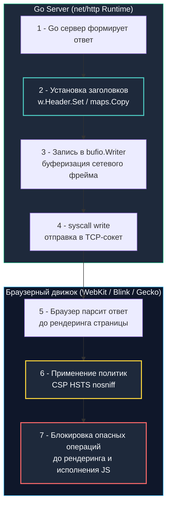

## HTTP-заголовки как политики безопасности на границе доверия

В повседневной веб-разработке легко поддаться иллюзии, будто сервер обладает абсолютной властью над тем, как будут отображаться и исполняться его данные. Однако как только HTTP-пакет ответа покидает сетевой интерфейс и сокет закрывается, данные попадают во враждебную и неконтролируемую среду — удаленный браузер пользователя.

Как серверная система может принудительно заставить браузер соблюдать строгие правила гигиены?

Ответом служат **Secure HTTP Headers (Заголовки безопасности HTTP)**. Это не декоративные метаданные для отладки, а декларативные директивы операционной системы браузера. Браузер парсит эти директивы в момент получения первого сетевого фрейма ответа и применяет жесткие ограничения *до* того, как начнется рендеринг DOM-дерева или исполнение JavaScript.

Для Go-разработчика понимание механики заголовков безопасности — это не просто знание строковых констант, а глубокое понимание устройства буферизации `net/http`, эффективного сжатия HPACK в HTTP/2 и HTTP/3, а также предотвращения утечек памяти при работе с хэш-таблицами заголовков.



---

## Ключевые заголовки и механизм enforcement

Каждый заголовок решает узкую задачу изоляции клиентского окружения:

1. **`Strict-Transport-Security (HSTS)`:**  
   Принудительно переводит все последующие сетевые обращения браузера к домену строго на протокол HTTPS на указанный период (`max-age`). Браузер локально кэширует это правило. При любой попытке пользователя ввести `http://...` браузер совершает внутренний редирект на `https://` еще **до открытия TCP-соединения**, полностью исключая вектор атак Man-in-the-Middle (SSL-stripping).
2. **`Content-Security-Policy (CSP)`:**  
   Мощнейший инструмент защиты от XSS. Это декларативный белый список доверенных источников для загрузки скриптов, стилей, фреймов, шрифтов и медиа. Если злоумышленник внедрил вредоносный тег `<script src="https://evil.com/xss.js">`, браузер откажется загружать файл, выбросит ошибку `Refused to load` в консоль и отправит телеметрию на указанный в директивах `report-uri`/`report-to` эндпоинт.
3. **`X-Content-Type-Options: nosniff`:**  
   Запрещает браузеру производить автоматическое определение типа контента (MIME-sniffing). Браузер обязан строго следовать типу, объявленному в заголовке `Content-Type`. Без этого заголовка браузеры могли попытаться интерпретировать загруженный пользователем текстовый файл `.txt` с JS-кодом как исполняемый скрипт при неверной отдаче сервером.
4. **`Referrer-Policy`:**  
   Регулирует передачу адреса источника запроса в заголовке `Referer`. Значение `strict-origin-when-cross-origin` передает полный URL только внутри одного домена, а при кросс-доменных переходах скрывает путь и query-параметры (где могут случайно оказаться приватные токены сброса пароля или ID сессий).
5. **`Permissions-Policy`:**  
   Ограничивает доступ страницы и встраиваемых `iframe` к аппаратным API устройства (камера, микрофон, геолокация, датчики движения). Полностью заменяет устаревший заголовок `Feature-Policy`.

---

> [!info] Под капотом: Почему устаревшие X- заголовки считаются deprecated?
> **Эволюция стандартов IETF и W3C:**  
> Префиксы `X-` (`X-XSS-Protection`, `X-Frame-Options`, `X-Content-Type-Options`) исторически использовались для экспериментальных возможностей конкретных браузеров. Согласно RFC 6648, стандартизированные заголовки обязаны избавляться от приставки `X-`.  
> - Заголовок `X-XSS-Protection` официально признан устаревшим и вредоносным: встроенные эвристические фильтры Internet Explorer и старого Chrome приводили к ложным срабатываниям и сами становились вектором для кражи данных. Современные браузеры (Chrome 78+, Safari 16+, Firefox) полностью игнорируют его.  
> - Заголовок `X-Frame-Options` успешно вытеснен более гибкой директивой `Content-Security-Policy: frame-ancestors 'self' https://trusted.com`, позволяющей задавать список доверенных родителей для встраивания. Оставлять устаревшие заголовки имеет смысл исключительно для поддержки антикварных браузеров.

---

## Под капотом: HTTP/2 HPACK, bufio и syscall write

В Go обработка заголовков возложена на пакет `net/http`. При каждом вызове `w.Header().Set(key, value)` рантайм манипулирует структурой `http.Header`, которая под капотом является картой `map[string][]string`.

В высоконагруженных шлюзах это порождает скрытую цену:
1. **Аллокации в куче на каждый запрос:**  
   Карта `http.Header` аллоцируется лениво. Каждый вызов метода `Set` или `Add` аллоцирует слайс строк `make([]string, 1)` или выполняет операцию `append`. При потоке в 50 000 RPS ручная установка 7–10 заголовков на каждый запрос выбрасывает в кучу сотни тысяч мелких объектов в секунду, перегружая сборщик мусора (`GC`).
2. **Сжатие HPACK в протоколах HTTP/2 и HTTP/3:**  
   Протокол HTTP/2 сжимает заголовки алгоритмом HPACK, используя статическую таблицу стандартных заголовков и динамическую таблицу для пользовательских значений. Стандартные заголовки (`HSTS`, `nosniff`, `CSP`) один раз упаковываются во фрейм `HEADERS` и передаются с минимальным оверхедом. Однако в протоколе HTTP/1.1 сжатие отсутствует: чрезмерно раздутые заголовки увеличивают размер первого TCP-пакета ответа, а промежуточные прокси-серверы могут аварийно разорвать соединение с ошибкой при превышении лимита размера заголовков (традиционно 8 КБ).
3. **Буферизация `bufio.Writer` и системные вызовы:**  
   Заголовки ответа сериализуются во внутренний буфер `bufio.Writer` структуры `*http.response`. Вызов `next.ServeHTTP(w, r)` не отправляет данные в сокет немедленно. Буфер сбрасывается в ядро через системный вызов `syscall.Write` (в Linux) или `WriteFile` (в Windows) только в момент первого вызова `w.WriteHeader()` или `w.Write()`. Любая попытка изменить заголовки *после* первой записи тела ответа будет проигнорирована Go-сервером или приведет к предупреждению в логах.

### Идиоматичный паттерн: Пул предвычисленных заголовков

Чтобы избежать лавинообразных аллокаций памяти в куче, в высоконагруженных Go-сервисах предкомпилируют базовый набор заголовков один раз через `sync.Once`:

```go
package security

import (
	"net/http"
	"sync"
)

// precomputedHeaders инициализируется один раз, исключая аллокации мапы на каждый запрос
var precomputedHeaders http.Header
var initHeaders sync.Once

func getSecureHeaders() http.Header {
	initHeaders.Do(func() {
		precomputedHeaders = make(http.Header, 7)
		precomputedHeaders.Set("Strict-Transport-Security", "max-age=63072000; includeSubDomains; preload")
		precomputedHeaders.Set("X-Content-Type-Options", "nosniff")
		precomputedHeaders.Set("X-Frame-Options", "DENY") // Legacy, но полезно для старых браузеров
		precomputedHeaders.Set("Referrer-Policy", "strict-origin-when-cross-origin")
		precomputedHeaders.Set("Permissions-Policy", "camera=(), microphone=(), geolocation=()")
		precomputedHeaders.Set("Content-Security-Policy", "default-src 'self'; script-src 'self'; object-src 'none'")
	})
	return precomputedHeaders
}

// SecureHeadersMiddleware эффективно применяет политики безопасности
func SecureHeadersMiddleware(next http.Handler) http.Handler {
	return http.HandlerFunc(func(w http.ResponseWriter, r *http.Request) {
		headers := getSecureHeaders()

		// 🔒 Прямое копирование в ответный writer.
		// В Go 1.21+ maps.Copy или ручной цикл эффективнее, чем w.Header().Set() в цикле,
		// так как избегает повторных поисков в хеш-таблице и аллокаций слайсов.
		for key, values := range headers {
			for _, value := range values {
				w.Header().Add(key, value)
			}
		}

		next.ServeHTTP(w, r)
	})
}
```

---

## Ловушки и архитектурные риски (Gotchas)

1. **CSP `unsafe-inline` и динамические Nonce:**  
   Использование директивы `'unsafe-inline'` в секции `script-src` полностью умножает на ноль всю пользу CSP, позволяя злоумышленнику беспрепятственно выполнять внедренный JS-код. Единственный правильный путь для динамических приложений — генерация криптографически стойкого `nonce` на каждый HTTP-запрос с помощью `crypto/rand` и передача его в заголовке `script-src 'nonce-...';` и теге `<script nonce="...">`. Помните: кэширование HTML-страниц с CSP ломает эту защиту, так как nonce обязан быть одноразовым!
2. **Ловушка HSTS Preload List:**  
   Установка `max-age=31536000` (1 год) или `max-age=63072000` (2 года) с `includeSubDomains` и подача заявки в глобальный реестр HSTS Preload List (встроенный в ядро Chromium, Safari и Firefox) является **необратимым решением**. Если какой-либо внутренний поддомен компании временно не сможет получить валидный TLS-сертификат, пользователи вообще не смогут открыть ресурс. Исключение домена из Preload-списка занимает от нескольких месяцев до полугода. Тестируйте политику с `max-age=0` и `report-only` перед продакшен-деплоем.
3. **Переполнение буфера заголовков и ошибка HTTP 431:**  
   Сложные политики CSP с перечислением сотен внешних аналитических сервисов могут раздуть размер заголовка ответа до десятков килобайт. Прокси-серверы (Nginx, Cloudflare) и балансировщики по умолчанию ограничивают размер заголовков (часто лимитом 8–16 КБ). В результате клиенты получают ошибку `431 Request Header Fields Too Large` или сбой `ERR_RESPONSE_HEADERS_TOO_BIG`. Оптимизация: выносить длинные списки доменов в отдельные конфигурационные эндпоинты или использовать `frame-src` вместо `default-src` с гранулярным контролем.
4. **Порядок Middleware в цепочке вызовов:**  
   Middleware установки защитных заголовков обязан находиться **на самом верху стека HTTP-обработчиков**. Если middleware аутентификации или бизнес-логика выбросит панику или завершит запрос статусом `500 Internal Server Error` до применения политик безопасности, браузер получит страницу ошибки без заголовков изоляции, открывая простор для Clickjacking и других атак. Используйте глобальный `http.Server.Handler` или `chi`/`gorilla` роутер на верхнем уровне.

---

> [!tip] Собеседование
> **Вопрос:** «Как браузер обрабатывает политику CSP в контексте HTTP/2 Server Push и директив prefetch/preload, и почему Go-разработчику важно учитывать это при оптимизации доставки контента?»  
> 
> **Ответ кандидата Senior-уровня:**  
> «1. **Применение политик к Push-ресурсам:** Механизм HTTP/2 Server Push позволяет бэкенду отправить ресурсы клиенту до получения явного запроса. Однако браузер применяет CSP к push-фреймам по тем же строгим правилам: если ресурс отправлен сервером, но его домен или тип не разрешен директивами `script-src` или `style-src`, браузер немедленно отбросит полученный push-фрейм.  
> 2. **Интерфейс `http.Pusher` в Go:** В стандартной библиотеке Go push инициируется через проверку интерфейса: `if pusher, ok := w.(http.Pusher); ok { pusher.Push(...) }`. Если бэкенд пушит ресурсы, запрещенные CSP, сервер генерирует бесполезный сетевой трафик и попусту забивает сокет.  
> 3. **Синхронизация контуров:** Все ресурсы, передаваемые через Server Push или предзагрузку `<link rel="preload">`, обязаны быть жестко согласованы с CSP. Несоответствие приводит к всплеску предупреждений CSP-violations и паразитной нагрузке на эндпоинты `report-uri`».

---

## Итог

1. **Декларативная изоляция:** Secure HTTP Headers — это директивы безопасности для песочницы браузера, применяемые до начала отрисовки страницы и выполнения пользовательского кода.
2. **Отказ от легаси:** Устаревшие заголовки `X-XSS-Protection` и `X-Frame-Options` вытеснены современными и гранулярными стандартами `CSP` (`frame-ancestors`), `Permissions-Policy` и `Referrer-Policy`.
3. **Механическое сочувствие:** Преинициализация карты `http.Header` через `sync.Once` устраняет сотни тысяч мусорных аллокаций в куче при высоких RPS. Учитывайте буферизацию `bufio.Writer` — заголовки нельзя менять после первого `w.Write()`.
4. **Осторожность с HSTS Preload:** Включение HSTS с предзагрузкой необратимо ломает доступ к поддоменам без TLS. Тестируйте политики постепенно.
5. **Верхний эшелон:** Security Headers Middleware всегда размещается на самом входе в пайплайн обработки HTTP, защищая даже страницы системных ошибок `500` и `404`.

Мы полностью завершили блок безопасности API. Впереди нас ждет масштабный инженерный раздел: **Инфраструктура и секреты**.  
В следующей лекции мы разберем: [[1. Secrets management]].