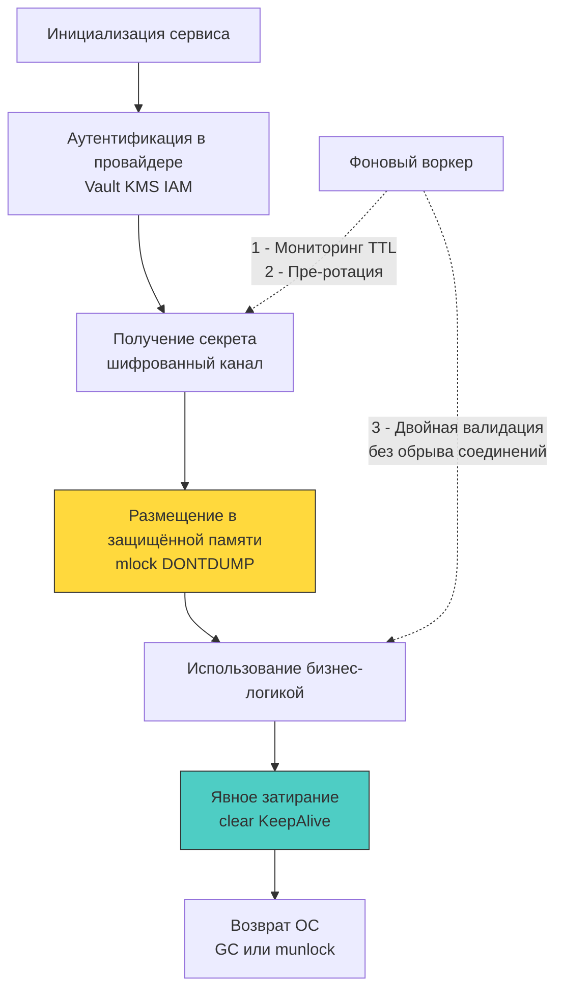

## Философия управления секретами: от `.env` к динамическим идентичностям

В программировании есть ошибки, которые приводят к падению сервиса с `panic`, а есть архитектурные привычки, которые тихо распахивают двери посторонним. Секреты — пароли к базам данных, приватные ключи RSA/Ed25519, API-токены и криптографические мастер-ключи — это не просто параметры конфигурации вроде тайм-аута HTTP-клиента или номера TCP-порта. Если порт или тайм-аут можно опубликовать на первой полосе утренней газеты без какого-либо риска, то единичная утечка приватного ключа превращает всю систему распределённой безопасности в карточный домик.

Исторически индустрия бэкенд-разработки привыкла к переменным окружения (`ENV`) и локальным `.env` файлам, популяризированным методологией «The Twelve-Factor App». Однако с точки зрения устройства современных операционных систем и рантайма Go хранение секретов в переменных окружения — это опаснейший архитектурный антипаттерн. Переменные окружения глобальны для процесса, автоматически наследуются всеми дочерними процессами, открыты для чтения в псевдофайловой системе ядра (`/proc/<pid>/environ`), логируются сборщиками метрик и беззащитно утекают при снятии дампов памяти.

В надежных высоконагруженных системах на Go управление секретами опирается на три фундаментальных инженерных принципа:
1. **Никаких секретов в статических конфигурациях** (бинарники, репозиторий, `.env`). Исходный код и артефакты сборки публичны по своей природе; секрет не должен соприкасаться с ними даже на этапе локальной разработки.
2. **Динамическая доставка и краткосрочный жизненный цикл**. Секреты загружаются в рантайме по защищенным каналам, валидируются и автоматически ротируются без перезапуска сервисов.
3. **Минимизация времени жизни в памяти**. Чувствительные байты должны находиться в оперативной памяти (RAM) ровно столько, сколько требуется для выполнения криптографической операции, после чего обязаны быть гарантированно затерты физическими нулями.



---

## Под капотом ОС и рантайма: где на самом деле живут секреты

Чтобы понять, почему наивные подходы к безопасности терпят фиаско, необходимо взглянуть на путь байтов с точки зрения ядра Linux и виртуальной памяти. 

Когда приложение вызывает `os.Getenv("DB_PASSWORD")`, рантайм Go обращается к таблице окружения процесса (либо через системный вызов `getenv`, либо напрямую к переменным окружения, переданным ядром при вызове `execve` и скопированным в `libc`/`vDSO`). Вектор `environ` изначально размещается ядром на верхушке пользовательского стека процесса. 

Каковы физические последствия этого размещения?
- **Псевдофайловая система `/proc`:** Любой процесс, работающий с тем же UID или обладающий привилегиями суперпользователя (`root`, `CAP_SYS_PTRACE`), может прочитать содержимое памяти процесса через `/proc/<pid>/environ`. Злоумышленник или скомпрометированный соседний процесс в контейнере получает все ключи одной командой `cat`.
- **Наследование через `fork`/`clone`:** При порождении дочернего процесса таблицы дескрипторов и окружение копируются. Запущенная сторонней библиотекой безобидная утилита диагностики неожиданно получает в свое распоряжение секреты базы данных.
- **Вытеснение в Swap-раздел:** Если операционная система испытывает нехватку физических страниц RAM (Memory Pressure), демон `kswapd` сбрасывает страницы виртуальной памяти процесса на диск (в раздел подкачки или swap-файл). Даже если процесс завершится, незашифрованный секрет останется на физическом накопителе (SSD/NVMe) в открытом виде (plaintext), где его можно прочитать судебными утилитами анализа накопителей.
- **Аварийные дампы ядра (Core Dumps):** При панике рантайма (`panic`), получении сигнала `SIGSEGV` или `SIGABRT` операционная система генерирует core dump — полный слепок виртуальной памяти процесса. Если в ядре не вызван `prctl(PR_SET_DUMPABLE, 0)`, дамп ядра сохраняется на диск и нередко автоматически отправляется во внешние системы мониторинга (Crashlytics, Sentry, ELK).

В рантайме Go картина осложняется работой сборщика мусора (`GC`) и компилятора:
1. Строки (`string`) и срезы (`[]byte`), куда считываются секреты, почти неизбежно совершают побег в кучу (Escape Analysis).
2. Сборщик мусора Go (`GC`) при освобождении памяти лишь помечает спаны в `mheap` как свободные. Он **не перезаписывает освобождаемые блоки нулями** ради экономии процессорных тактов.
3. Секретный токен продолжает лежать в свободной памяти процесса вплоть до тех пор, пока этот спан не будет перевыделен под другой объект. Если атакующий воспользуется уязвимостью Heartbleed-типа или получит срез кучи через `pprof/heap`, он легко извлечет секрет с помощью тривиального поиска по регулярным выражениям.

---

## Идиоматичные паттерны загрузки и защиты памяти в Go

Настоящая защита секретов в пользовательском пространстве требует прямого взаимодействия с подсистемой виртуальной памяти ядра Linux через системные вызовы `mlock` и `madvise`, а также защиты от чрезмерной оптимизации компилятора.

Рассмотрим реализацию защищенного буфера `SecureBuffer`, гарантирующего изоляцию криптографического материала:

```go
package secrets

import (
	"crypto/subtle"
	"fmt"
	"runtime"
	"syscall"
)

// SecureBuffer представляет защищённый буфер в памяти
type SecureBuffer struct {
	data []byte
	size int
}

// NewSecureBuffer аллоцирует буфер и блокирует его в памяти
func NewSecureBuffer(size int) (*SecureBuffer, error) {
	// Аллокация выровненного буфера
	buf := make([]byte, size)
	
	// mlock предотвращает вытеснение страниц в swap
	if err := syscall.Mlock(buf); err != nil {
		return nil, fmt.Errorf("mlock failed: %w", err)
	}
	
	// MADV_DONTDUMP исключает страницу из core dump (Linux 2.6.16+)
	syscall.Madvise(buf, syscall.MADV_DONTDUMP)
	
	return &SecureBuffer{data: buf, size: size}, nil
}

// Fill безопасно копирует данные и затирает буфер при выходе
func (b *SecureBuffer) Fill(source []byte) error {
	if len(source) > b.size {
		return fmt.Errorf("source exceeds buffer capacity")
	}
	copy(b.data, source)
	return nil
}

// Wipe гарантирует обнуление и разблокировку
func (b *SecureBuffer) Wipe() {
	if b.data == nil {
		return
	}
	// clear встроен в Go 1.21+. Компилятор встраивает цикл обнуления.
	clear(b.data)
	runtime.KeepAlive(b.data) // Запрещает Dead Store Elimination
	syscall.Munlock(b.data)   // Возвращает страницу ОС для управления
	b.data = nil
}

// ConstantCompare безопасное сравнение без раннего возврата
func (b *SecureBuffer) ConstantCompare(other []byte) bool {
	if len(other) != b.size {
		return false
	}
	return subtle.ConstantTimeCompare(b.data, other) == 1
}
```

> [!info] Под капотом
> **Почему `runtime.KeepAlive` обязателен после `clear()`?**  
> Компилятор Go — великолепный оптимизатор. Анализируя граф потока управления (SSA), он применяет проход Dead Store Elimination (DSE). Если буфер `b.data` зануляется функцией `clear()`, но после этого нигде больше не читается и немедленно освобождается, оптимизатор компилятора вполне логично решает: «Зачем тратить такты процессора на запись нулей в память, к которой больше никто не обратится?» — и просто вырезает машинные инструкции обнуления!  
> В результате секрет так и остается лежать в памяти. Вызов `runtime.KeepAlive(slice)` (или `runtime.KeepAlive(b.data)`) сообщает компилятору, что срез физически жив вплоть до этой точки. В production-сборках без флагов отключения оптимизаций (`-gcflags="-l -N"`) такой вызов является обязательным криптографическим стандартом.

---

## Жизненный цикл, ротация и нулевой downtime

Статическая загрузка секрета при старте приложения (в функциях `init()` или начале `main()`) неизбежно влечет за собой архитектурную хрупкость: чтобы обновить пароль к базе данных или скомпрометированный токен, инженеры вынуждены проводить полный перезапуск кластера. В распределенных сервисах с высокими требованиями к SLA это недопустимо.

Индустриальный стандарт — **асинхронная ротация с двойной валидацией (Dual Active Verification)**:
1. При старте сервис загружает первичный секрет `SecretVersion: v1`.
2. Фоновый воркер периодически опрашивает секретное хранилище (Vault, AWS Secrets Manager) на предмет выпуска новой версии ключа.
3. При обнаружении версии `v2` воркер атомарно обновляет указатель в оперативной памяти с помощью `atomic.Pointer` или `sync/atomic.Value`.
4. Драйверы соединений и мидлвари применяют двойную проверку: для новых операций сразу используется `v2`, а при возникновении ошибок валидации разрешается временный фоллбэк на `v1` в рамках так называемого grace-period (от 5 до 15 минут). Это дает распределенному кластеру время плавно переключить все узлы без разрыва активных сетевых соединений.
5. По завершении grace-period версия `v1` безопасно инвалидируется и гарантированно затирается в памяти.

```go
package secrets

import (
	"sync"
	"sync/atomic"
	"time"
)

// RotatingSecret хранит активную и предыдущую версии секрета
type RotatingSecret struct {
	current    atomic.Pointer[SecureBuffer]
	previous   atomic.Pointer[SecureBuffer]
	graceEnd   time.Time
	mu         sync.RWMutex // Для защиты graceEnd
}

func (r *RotatingSecret) Rotate(newSecret *SecureBuffer, gracePeriod time.Duration) {
	old := r.current.Swap(newSecret)
	if old != nil {
		r.previous.Store(old)
		r.mu.Lock()
		r.graceEnd = time.Now().Add(gracePeriod)
		r.mu.Unlock()
	}
}

func (r *RotatingSecret) GetActive() *SecureBuffer {
	r.mu.RLock()
	now := time.Now()
	expired := now.After(r.graceEnd)
	r.mu.RUnlock()
	
	if expired {
		prev := r.previous.Swap(nil)
		if prev != nil {
			prev.Wipe() // Окончательное уничтожение
		}
	}
	
	return r.current.Load()
}
```

---

## Ловушки и архитектурные антипаттерны

1. **Неконтролируемое логирование и распределенная трассировка:**  
   Популярные веб-фреймворки и логгеры (`gin`, `chi`, `otel`) автоматически фиксируют входящие HTTP-заголовки. Достаточно разработчику передать секрет в заголовке `Authorization` или нестандартном токене `X-Api-Key`, как данные мгновенно оседают в централизованных индексах Elasticsearch, Grafana Loki или Datadog.  
   **Решение:** Обязательный централизованный `redactMiddleware`, маскирующий чувствительные поля с помощью `strings.Replacer` до отправки записи в буфер логгера.
2. **Наследование окружения в `os/exec`:**  
   По умолчанию `exec.Command` передает дочернему процессу копию всего окружения текущего процесса (`os.Environ()`). Если ваш Go-сервис хранил в переменных окружения мастер-пароль `DB_PASS`, то любая вызываемая через CLI утилита (например, `imagemagick` или `tar`) получает этот пароль.  
   **Решение:** Всегда явно очищайте или переопределяйте переменные: `cmd.Env = nil` или формируйте строгий белый список только необходимых параметров.
3. **Паники, `recover()` и необработанные дампы памяти:**  
   Когда сервис падает в результате `panic` (даже если затем отрабатывает `recover()`), рантайм разворачивает стек. Если в стековых кадрах присутствовали строковые литералы с секретами, они навсегда останутся в незашифрованном файле core dump.  
   **Решение:** Настройка ядра `sysctl kernel.core_pattern=/dev/null` на production-нодах, флаг рантайма `runtime/debug.SetCrashDump(false)` (когда применимо), а также заблаговременная изоляция буферов с секретами через `MADV_DONTDUMP`.
4. **Неосторожное использование библиотек конфигураций и рефлексии:**  
   Библиотеки вроде `viper` или `dotenv` парсят файлы конфигурации, преобразуют их структуры через рефлексию и бессрочно удерживают копии данных в куче. Они не предназначены для секретов.  
   **Решение:** Используйте прямые SDK секретных хранилищ либо библиотеки уровня `go-cloud/secrets`, которые абстрагируют доступ, но гарантируют отсутствие бессрочного plaintext-кэширования в памяти.

---

> [!tip] Собеседование
> **Вопрос:** Как безопасно передавать секреты в контейнерную среду (Kubernetes), и почему сущность `Secret` в K8s по умолчанию не является криптографически защищённой?  
> **Ответ:**  
> 1. **Миф о секретах K8s:** Сущность `Secret` в Kubernetes по умолчанию хранится в хранилище `etcd` в открытом текстовом виде, закодированном через base64. Кодирование base64 — это просто схема сериализации бинарных данных в ASCII, а вовсе не шифрование! Любой пользователь с RBAC-правами на `get secrets` или прямым доступом к диску мастера может прочитать секрет за долю секунды.  
> 2. **Эшелонированная защита:** Корректный подход требует включения шифрования `etcd` на уровне всего кластера (`--encryption-provider-config` с использованием KMS-провайдера), ужесточения RBAC и интеграции с внешними хранилищами (HashiCorp Vault, AWS Secrets Manager, Google Secret Manager).  
> 3. **Отказ от переменных окружения:** Внутри подов секреты не должны пробрасываться через `env`. Надежный паттерн — монтирование через Secrets Store CSI Driver в тома оперативной памяти `tmpfs` с ограничением прав доступа `0400` либо использование sidecar-контейнера, передающего секрет через локальный IPC со включенным `mlock`.  
> 4. **Идиоматика Go:** На уровне исходного кода это означает категорический отказ от `os.Getenv` в продакшене и переход на динамические SDK-клиенты с поддержкой фоновой ротации и очистки памяти.

---

## Итог

1. Переменные окружения и файлы `.env` архитектурно небезопасны: они наследуются дочерними процессами, просачиваются в логи, попадают в дампы ядра и доступны локальным процессам через виртуальную файловую систему ядра `/proc`.
2. В рантайме Go секреты совершают побег в кучу. Сборщик мусора `GC` не затирает освобожденную память нулями, а страницы виртуальной памяти могут быть вытеснены ядром в swap. Защита требует связки системных вызовов `mlock`, `MADV_DONTDUMP` и обязательного зануления через `clear()` с фиксацией указателя через `runtime.KeepAlive()`.
3. Надежный жизненный цикл опирается на динамическую доставку по TLS, асинхронную ротацию с поддержкой grace-period (двойная валидация) и атомарную замену указателей `atomic.Pointer` для обеспечения нулевого времени простоя (Zero Downtime).
4. Логирование входящих HTTP-заголовков, трассировка OpenTelemetry и запуск дочерних утилит через `os/exec` — главные скрытые векторы утечки секретов. Обязательны централизованная маскировка и строгий контроль `cmd.Env` и `exec.Env`.
5. Современная индустрия движется от статически прописанных секретов к динамическим криптографическим идентичностям (Workload Identity, SPIFFE/SPIRE, роли IAM), где эфемерные токены генерируются налету и умирают вместе с вызвавшим их контекстом.

[[2. Vault и альтернативы]]