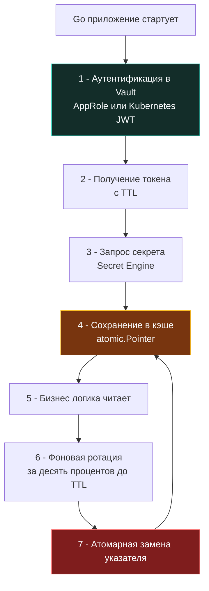

## Архитектура централизованного хранения и доставки

В реальном мире никто не хранит драгоценности в ящике офисного стола только потому, что до него легко дотянуться рукой. Точно так же и в распределённых серверных архитектурах секреты — пароли к базам данных, мастер-ключи шифрования, приватные сертификаты и токены внешних платежных шлюзов — не могут лежать в открытых файлах конфигурации, репозиториях Git или переменных окружения операционной системы. Им необходим строгий, полностью автоматизированный жизненный цикл: динамическая генерация по требованию, криптографическая аренда (lease) с ограничением по времени, детальный сквозной аудит доступа и немедленный отзыв скомпрометированных ключей.

Программный комплекс HashiCorp Vault давно заслужил статус стандарта де-факто в корпоративной инфраструктуре. Однако опытный инженер на Go должен воспринимать Vault не как «магический черный ящик с REST API», а как высоконадежную, но распределенную сетевую систему со своими накладными расходами, алгоритмом распределенного консенсуса, моделью аренды и жесткими пределами пропускной способности. Если приложение будет обращаться в сетевое хранилище за паролем при каждом входящем HTTP-запросе, сеть превратится в непреодолимое бутылочное горлышко, а задержки (latency) устремятся в бесконечность.



---

### Под капотом Vault: Seal, Unseal и хранилище

Архитектура безопасности самого Vault строится на бескомпромиссном принципе нулевого доверия (Zero Trust) к собственному физическому хранилищу:
- **Состояние Sealed (Запечатан):** При старте или перезагрузке процесса узел Vault находится в состоянии `Sealed`. Все данные на физическом диске надежно зашифрованы мастер-ключом. Сам мастер-ключ не хранится на диске в открытом виде — он разделен на несколько независимых частей с использованием математической схемы разделения секрета Шамира (`Shamir's Secret Sharing`). 
- **Процедура Unseal (Распечатывание):** Чтобы перевести сервер в рабочее состояние, доверенные администраторы (или автоматический механизм Auto-unseal через облачный KMS) обязаны предоставить кворум частей (например, 3 из 5). Vault собирает мастер-ключ исключительно в оперативной памяти с включенным `mlock`. Если атакующий украдет физический диск или образ виртуальной машины с узлом Vault, без кворума ключей данные останутся нечитаемым криптографическим шумом.
- **Движок консенсуса и Secret Engines:** Внутри себя Vault опирается на распределенный журнал консенсуса `raft` (или `consul` в качестве бэкенда). Алгоритм Raft обеспечивает строгую репликацию состояния между лидерами и последователями.

Когда клиентское приложение на Go запрашивает секрет:
1. Клиент проходит аутентификацию через настроенный метод Auth Method (AppRole, Kubernetes, JWT, AWS IAM).
2. Vault возвращает кратковременный клиентский токен с жестко заданным временем жизни TTL.
3. При запросе к движку Secret Engine (KV v2, Database, PKI) Vault не просто отдает значение, а генерирует динамический Lease (аренду) с персональным сроком действия.
4. По истечении срока аренды (TTL) секрет автоматически инвалидируется в Vault. Если это динамический секрет (например, временная учетная запись PostgreSQL), Vault самостоятельно выполняет команду `DROP ROLE` в целевой базе данных.

Для Go-разработчика это означает, что Vault — это **stateful сетевой сервис с высокой латентностью** (RTT сетевого вызова составляет от 2 до 50 мс против сотен пикосекунд при чтении из регистров CPU или кэша L1). Синхронные запросы к Vault на каждый чих бизнес-логики гарантированно уничтожат пропускную способность сервиса. Единственное верное решение — локальное кэширование в оперативной памяти с атомарной ротацией.

---

## Идиоматичная интеграция в Go: кэширование и атомарная ротация

Прямой вызов `vault-client.Read(path)` в теле HTTP-обработчика — грубейшая архитектурная ошибка. Грамотный паттерн строится на трех китах: однократная первичная загрузка при старте, упреждающее фоновое обновление по таймеру и атомарный обмен указателями `atomic.Pointer` для чтения без блокировок мьютексами в горячем пути исполнения.

```go
package vaultsec

import (
	"context"
	"fmt"
	"sync"
	"sync/atomic"
	"time"

	"github.com/hashicorp/vault/api"
)

// CachedSecret безопасно хранит и обновляет секреты из Vault
type CachedSecret struct {
	path        string
	value       atomic.Pointer[[]byte]
	client      *api.Client
	refreshTTL  time.Duration
	mu          sync.Mutex // Защита от thundering herd при обновлении
	cancelRenew context.CancelFunc
}

// NewCachedSecret инициализирует кэшированный секрет
func NewCachedSecret(client *api.Client, path string, initialTTL time.Duration) *CachedSecret {
	cs := &CachedSecret{
		path:       path,
		client:     client,
		refreshTTL: initialTTL * 9 / 10, // Обновляем за 10 процентов до истечения
	}
	cs.value.Store(nil)
	return cs
}

// Start запускает фоновую ротацию. Должен вызываться один раз при старте сервиса.
func (cs *CachedSecret) Start(ctx context.Context) error {
	ctx, cancel := context.WithCancel(ctx)
	cs.cancelRenew = cancel

	// Первичная загрузка
	if err := cs.load(ctx); err != nil {
		return fmt.Errorf("initial load: %w", err)
	}

	go cs.renewLoop(ctx)
	return nil
}

func (cs *CachedSecret) renewLoop(ctx context.Context) {
	ticker := time.NewTicker(cs.refreshTTL)
	defer ticker.Stop()

	for {
		select {
		case <-ctx.Done():
			return
		case <-ticker.C:
			if err := cs.load(ctx); err != nil {
				// Логирование ошибки. Старый секрет остаётся активным до следующего тика.
				// Это trade-off между доступностью и свежестью данных.
				continue
			}
		}
	}
}

// load атомарно заменяет значение секрета
func (cs *CachedSecret) load(ctx context.Context) error {
	cs.mu.Lock()
	defer cs.mu.Unlock()

	secret, err := cs.client.Logical().ReadWithContext(ctx, cs.path)
	if err != nil || secret == nil {
		return fmt.Errorf("vault read %s: %w", cs.path, err)
	}

	data, ok := secret.Data["data"].(map[string]any)
	if !ok {
		return fmt.Errorf("invalid secret structure at %s", cs.path)
	}

	val, ok := data["password"].(string)
	if !ok {
		return fmt.Errorf("missing password field in %s", cs.path)
	}

	buf := []byte(val)
	// Атомарная замена. Читатели не блокируются и не видят частично записанных данных.
	cs.value.Store(&buf)
	return nil
}

// Get возвращает текущую копию секрета. Вызывающий обязан затереть []byte после использования.
func (cs *CachedSecret) Get() []byte {
	ptr := cs.value.Load()
	if ptr == nil {
		return nil
	}
	// Возвращаем копию, чтобы избежать гонки при ротации
	res := make([]byte, len(*ptr))
	copy(res, *ptr)
	return res
}

// Stop освобождает ресурсы
func (cs *CachedSecret) Stop() {
	if cs.cancelRenew != nil {
		cs.cancelRenew()
	}
}
```

---

### Механическое сочувствие: сеть, TLS и давление на GC

Когда приложение взаимодействует с внешним кластером Vault, в игру вступают аппаратные ресурсы машины и тонкие настройки рантайма Go:

1. **HTTP/2 и переиспользование пула соединений:**  
   По умолчанию клиент Vault взаимодействует с сервером по протоколу HTTP/2 поверх TLS. Стандартный клиент `net/http` в Go поддерживает мультиплексирование потоков в одном TCP-сокете, что кардинально экономит вызовы ядра `syscall connect` и ресурсы таблицы соединений (`conntrack`). Однако стандартный `http.Client` по умолчанию держит `MaxIdleConns` равным 2. В высоконагруженных микросервисах это приводит к постоянному закрытию и повторному открытию сокетов. Обязательно настраивайте собственный `http.Transport` с параметрами `MaxIdleConns: 100+` и `IdleConnTimeout: 60s`, иначе ОС захлебнется в исчерпании файловых дескрипторов и застрявших сокетах в состоянии `TIME_WAIT`.
2. **Накладные расходы TLS-сессий и такты CPU:**  
   Полноценное TLS 1.3 рукопожатие (Handshake) с асимметричной криптографией на эллиптических кривых требует 1–3 миллисекунды процессорного времени. Последующие запросы в рамках постоянного соединения используют кэшированные тикеты сессий (Session Tickets, ~0.1 мс). При одновременной ротации сотен секретов десятками сервисов неумелое управление сессиями способно вызвать резкий скачок потребления CPU. Убедитесь, что `tls.Config.SessionTicketsDisabled = false` (значение по умолчанию) и используются общие ключи шифрования тикетов (`TicketKeys`) на стороне балансировщика.
3. **Аллокации кучи и давление на сборщик мусора (`GC`):**  
   Каждый вызов `client.Logical().Read` распаковывает объемный JSON-ответ, порождая промежуточные `map[string]any`, интерфейсные боксы и срезы `[]byte`. Если делать это на каждый входящий HTTP-запрос при 10 000 RPS, куча Go будет заполняться сотнями мегабайт мусора в секунду, вызывая частые фазы Stop-The-World в `GC`. Локальный кэш на базе `atomic.Pointer` сокращает частоту этих аллокаций ровно до одного раза за весь жизненный цикл аренды (TTL, обычно раз в час). Вызов `Get()` возвращает защитную копию слайса, чтобы бизнес-логика работала в изолированной памяти, а устаревший оригинал мог быть штатно утилизирован рантаймом.
4. **Блокировка страниц в физической памяти:**  
   Для сверхчувствительных мастер-ключей и корневых токенов рекомендуется фиксировать память буфера через `syscall.Mlock`. Однако при развертывании в контейнерах (Docker или Kubernetes) вызов вернет ошибку `EPERM`, если контейнеру явно не выданы привилегии ядра `--cap-add=IPC_LOCK` и не настроен лимит памяти подкачки `ulimit -l` (`RLIMIT_MEMLOCK`).

---

> [!warning] Ловушка / Gotcha
> **Thundering Herd при истечении TTL**  
> Если 100 подов вашего микросервиса стартовали одновременно и получили секреты с одинаковым TTL (например, ровно на 1 час), то через 54 минуты все 100 инстансов одновременно ринутся в Vault за обновлением. Этот эффект «громоподобного стада» (Thundering Herd) мгновенно перегрузит API Vault, сработают инфраструктурные лимиты `rate_limit`, и большинство запросов упадет по таймауту.  
> **Решение:**  
> 1. Упреждающее обновление: в коде задействован `time.Ticker` с расчётом `refreshTTL = TTL * 0.9` (за 10% до истечения срока аренды).  
> 2. Джиттеризация (Jitter): добавьте к интервалу случайное псевдослучайное смещение: `refreshTTL += time.Duration(rand.Int63n(int64(TTL / 10)))`. Это равномерно размажет пиковую нагрузку по временной шкале.  
> 3. Изоляция внутри процесса: используйте паттерн `singleflight` или локальный мьютекс `sync.Mutex` (как в нашем примере), чтобы параллельные горутины одного инстанса не дублировали сетевой запрос к Vault.

---

## Альтернативы и сравнение подходов

Не существует универсального серебряного инструмента. Архитектурный выбор зависит от целевой среды развертывания, требований к сетевой латентности и зрелости инфраструктурной команды.

| Подход | Механика работы | Плюсы | Минусы | Влияние на Go-рантайм |
|--------|----------------|-------|--------|----------------------|
| **HashiCorp Vault** | Централизованный сервис, динамические секреты, leases | Аудит, авто-ротация, динамические креды БД/PKI | Высокая латентность, сложность эксплуатации, SPOF без кластера | Требует кэширования, тонкой настройки HTTP-пулов, обработки таймаутов |
| **AWS/GCP Secrets Manager** | Облачный managed-сервис, API-доступ через SDK | Нативная интеграция IAM, SLA, автоматическое шифрование | Vendor lock-in, ограничение RPS на чтение, платный вызов API | SDK создаёт аллокации, требуется локальный кэш. Ротация через Cloud Functions |
| **SOPS + Age/GPG** | Статическое шифрование файлов `yaml`/`json` в репозитории | Stateless, GitOps-совместимо, нулевая латентность | Нет динамической ротации, ручное управление ключами, аудит в Git | Чтение файла при старте, `os.ReadFile` аллоцирует буфер. Быстро, но статично |
| **SPIFFE/SPIRE** | Workload Identity, автоматическая выдача X.509/SVID | Zero-trust, mTLS из коробки, отсутствие статических секретов | Высокий порог входа, сложность настройки, требует sidecar/agent | `crypto/tls` получает динамические сертификаты. Требует ротации `tls.Config` в рантайме |

---

> [!tip] Собеседование
> **Вопрос:** Почему в современных микросервисных архитектурах на Go наблюдается устойчивый тренд на отказ от статических секретов в пользу Workload Identity (SPIFFE, AWS IAM Roles for Service Accounts)?  
> **Ответ:**  
> 1. **Проблема статических секретов:** Любые статические токены и пароли требуют ручного или полуавтоматического распространения, сложного процесса ротации и механизма отзыва. В случае утечки требуется авральный деплой и ручная инвалидация во всех сопутствующих системах.  
> 2. **Суть концепции Workload Identity:** Доступ криптографически привязывается непосредственно к контексту выполнения процесса (его PID, пространству имен Linux, учетной записи K8s ServiceAccount). Сервис аутентифицируется через короткоживущие JWT-токены или X.509 сертификаты, автоматически выпускаемые платформой оркестрации.  
> 3. **Влияние на Go-стек:** Это знаменует фундаментальный переход от вызовов `os.Getenv` или `vault.Read` к инициализации сетевых клиентов `grpc.Dial` или `http.Client` с динамически обновляемым `tls.Config` через обратный вызов `GetClientCertificate`. Поверхность атаки снижается до нуля (секрет вообще не хранится в памяти приложения в виде статического токена), но требует интеграции с платформенными механизмами (K8s ServiceAccountTokenProjection, локальный SPIRE Agent).  
> 4. **Производственный нюанс рантайма Go:** Механизм соединений Go требует потокобезопасной замены `tls.Config` в пуле соединений `http.Client` или gRPC connection pool. Прямая перезапись поля `TLSClientConfig` в `http.Transport` после инициализации первого соединения либо проигнорируется, либо приведет к состоянию гонки (Race Condition). Для динамической ротации TLS-сертификатов на лету необходимо использовать `http.Transport.DialTLSContext` или кастомные `CredentialsBundle` в gRPC.

---

## Итог

1. HashiCorp Vault кардинально решает задачу управляемого жизненного цикла секретов, но привносит сетевую задержку и архитектурную сложность. Синхронные обращения к Vault на каждый бизнес-запрос недопустимы в высоконагруженных системах.
2. Идиоматичная интеграция в Go требует обязательного локального кэширования с атомарной заменой через `atomic.Pointer`, упреждающей фоновой ротации за 10% до истечения TTL, джиттеризации интервалов обновления и строгой защиты от эффекта Thundering Herd.
3. Полноценное использование HTTP/2 мультиплексирования, настройка пулов свободных соединений `http.Transport` и контроль TLS-сессий критически важны для защиты от исчерпания файловых дескрипторов ОС и предотвращения скачков нагрузки на CPU.
4. Нагрузка на сборщик мусора Go (`GC`) минимизируется за счет локального кэширования, исключающего непрерывный парсинг JSON-ответов. В средах с повышенными требованиями к секретности буферы изолируются через `syscall.Mlock` и `syscall.Madvise(syscall.MADV_DONTDUMP)`.
5. Современная индустриальная парадигма планомерно вытесняет централизованные секреты концепцией Workload Identity (SPIFFE/SPIRE, OIDC, IAM Roles), где эфемерные криптографические идентичности выдаются на основе среды выполнения процесса, сводя площадь атаки к абсолютному минимуму.

[[3. Хранение ключей]]