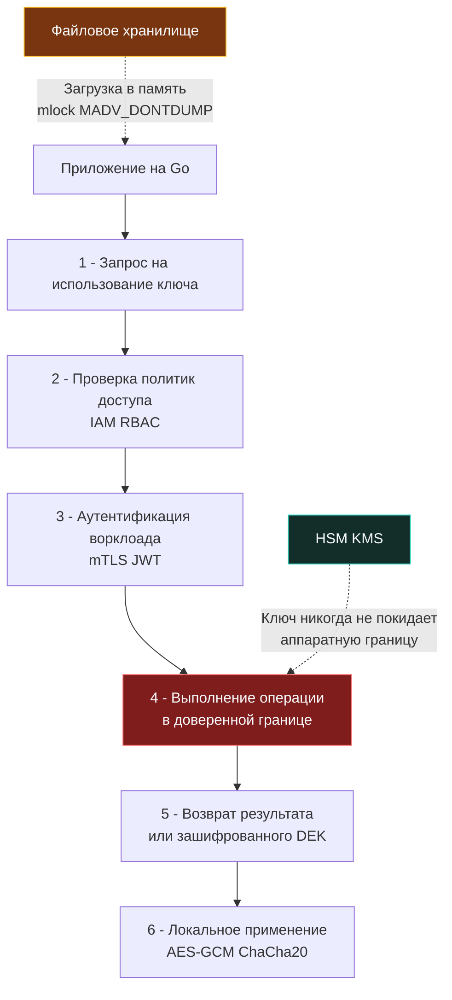

## Архитектура хранения: от аппаратных модулей до файловой системы

Криптографический ключ — это не просто секретная строка с длинным сроком жизни. Это математический объект строгой размерности, непосредственно участвующий в базовых операциях шифрования, формирования цифровой подписи и проверки целостности. Если скомпрометированный пароль пользователя или сессионный токен можно за долю секунды аннулировать в базе данных, то утечка мастер-ключа шифрования означает мгновенную компрометацию всех накопленных данных за всю историю системы. При этом «просто сменить ключ» уже не получится: потребуется колоссальная по времени и накладным расходам операция решифрования (re-encryption) терабайтов или петабайтов информации в хранилищах.

Для инженера и архитектора бэкенда на Go проектирование подсистемы хранения ключей начинается с осознания трех принципиальных уровней доверия: аппаратного (HSM), облачного (KMS) и программного (файловая система и память процесса). Каждый из них задает свои фундаментальные компромиссы между профилем производительности (латентность операций), финансовой стоимостью и степенью защиты от компрометации на уровне железа и операционной системы.



---

### Уровни доверия и механизмы изоляции

1. **HSM (Hardware Security Module):**  
   Специализированное физическое устройство с изолированным криптографическим сопроцессором, сертифицированным по строгим стандартам FIPS 140-2/3 Level 3 (или Level 4). Корневые ключи генерируются непосредственно внутри аппаратного кристалла с помощью физического генератора истинно случайных чисел (TRNG) и физически не могут покинуть защищенную границу чипа. Все операции подписи и шифрования выполняются внутри устройства. Попытка физического вскрытия корпуса, температурного взлома или анализа излучений шины приводит к мгновенному аппаратному обнулению памяти (zeroization). Это «золотой стандарт» для банковских транзакций, платежных шлюзов и государственных систем.
2. **Cloud KMS (Key Management Service):**  
   Управляемый облачный сервис (AWS KMS, GCP KMS, Yandex Cloud KMS). Долгоживущие ключи Key Encryption Keys (KEK) хранятся в распределенных пулах мультитенантных HSM облачного провайдера. Приложение взаимодействует с KMS исключительно по сетевому протоколу через API методов `Encrypt/Decrypt/Sign`. Провайдер гарантирует строгую изоляцию на основе политик IAM, а само приложение никогда не получает сырой закрытый ключ KEK в открытом виде.
3. **Программное хранение (Software Key Storage):**  
   Ключи хранятся в локальной файловой системе в виде PEM/PKCS#8 файлов с жесткими атрибутами доступа `0600`, зашифрованных репозиториев (SOPS, git-crypt) или считываются из защищенных томов. Вся ответственность за изоляцию памяти, предотвращение сброса страниц в swap и своевременную зачистку ложится исключительно на рантайм Go и код разработчика. Это единственный вариант для полностью изолированных on-premise контуров или edge-устройств без стабильного подключения к облачной инфраструктуре.

---

## Под капотом ОС и рантайма Go: память, swap и дампы

Когда приложение на Go загружает криптографический ключ из файла в память процесса, данные проходят по цепочке системных вызовов ядра, каждый шаг которой несет скрытые риски:

1. **Аллокация и Escape Analysis:**  
   Вызов `os.ReadFile` считывает содержимое файла в буфер `[]byte`. Из-за передачи буфера через интерфейсы или возврата из функции компилятор почти гарантированно направляет срез в кучу (Heap Escape). Рантайм Go выделяет память блоками через `mheap` и не дает никаких гарантий относительно физической непрерывности страниц или их изоляции от соседних структур данных.
2. **Вытеснение в Swap-раздел:**  
   Ядро Linux управляет виртуальной памятью страницами по 4 КБ. Если демон `kswapd` фиксирует дефицит физической памяти (Memory Pressure), неактивные анонимные страницы процесса сбрасываются на накопитель. Оказавшись в swap-разделе, байты ключа оседают на пластинах HDD или ячейках NAND SSD в открытом виде (plaintext) и останутся там даже после завершения процесса и перезагрузки сервера.
3. **Аварийные дампы ядра (Core Dump):**  
   При панике программы (`panic`), получении сигнала `SIGSEGV` или при снятом лимите ядра `ulimit -c unlimited` ядро сбрасывает слепок виртуальной памяти в файл. Если злоумышленник получит доступ к дампу ядра, все ключи, когда-либо находившиеся в куче, будут извлечены тривиальным парсингом ASN.1 структур.
4. **Сборщик мусора (`GC`):**  
   Когда объект выходит из области видимости, фаза Sweep сборщика мусора лишь возвращает спан в пул доступных аллокаций. **Память физически не перезаписывается нулями**. Ключ продолжает находиться в свободных ячейках памяти вплоть до момента, пока они не будут перезаписаны новыми данными.

Чтобы гарантировать безопасность на уровне операционной системы, требуются системные вызовы ядра `mlock` (запрет выгрузки страниц в swap) и `madvise` с флагом `MADV_DONTDUMP` (исключение страниц из core dump). В экосистеме Go для этого используется низкоуровневый пакет `golang.org/x/sys/unix`:

```go
package keymanager

import (
	"crypto/x509"
	"encoding/pem"
	"fmt"
	"os"
	"runtime"

	"golang.org/x/sys/unix"
)

// SecureKey представляет ключ, загруженный в защищённую память
type SecureKey struct {
	data []byte
}

// LoadKeyFromFile безопасно загружает PEM-ключ с блокировкой памяти
func LoadKeyFromFile(path string) (*SecureKey, error) {
	f, err := os.Open(path)
	if err != nil {
		return nil, fmt.Errorf("open key file: %w", err)
	}
	defer f.Close()

	// Проверка прав доступа на уровне ОС
	stat, err := f.Stat()
	if err != nil {
		return nil, fmt.Errorf("stat file: %w", err)
	}
	if stat.Mode().Perm() != 0600 {
		return nil, fmt.Errorf("insecure file permissions: want 0600, got %o", stat.Mode().Perm())
	}

	data, err := os.ReadFile(path)
	if err != nil {
		return nil, fmt.Errorf("read file: %w", err)
	}

	// Блокировка страницы в RAM
	if err := unix.Mlock(data); err != nil {
		return nil, fmt.Errorf("mlock failed: %w", err)
	}

	// Исключение из core dump
	unix.Madvise(data, unix.MADV_DONTDUMP)

	return &SecureKey{data: data}, nil
}

// ParsePrivateKey распаковывает PEM и затирает сырые данные
func (k *SecureKey) ParsePrivateKey() (any, error) {
	block, _ := pem.Decode(k.data)
	if block == nil {
		return nil, fmt.Errorf("invalid PEM format")
	}

	// Парсинг занимает память, но мы обязаны затереть сырую PEM-строку
	// после успешного парсинга, так как она содержит ключ в открытом виде
	key, err := x509.ParsePKCS8PrivateKey(block.Bytes)
	if err != nil {
		return nil, fmt.Errorf("parse PKCS8: %w", err)
	}

	// Затирание исходного буфера
	clear(k.data)
	runtime.KeepAlive(k.data)

	return key, nil
}

// Wipe гарантирует обнуление и разблокировку
func (k *SecureKey) Wipe() {
	if k.data == nil {
		return
	}
	clear(k.data)
	runtime.KeepAlive(k.data)
	unix.Munlock(k.data)
	k.data = nil
}
```

---

## KMS и Envelope Encryption: паттерн промышленного стандарта

Пересылать гигабайты пользовательских данных по сети в облачный KMS для шифрования — архитектурное самоубийство: сетевой оверхед, квоты провайдера (обычно лимит payload составляет 1–4 КБ на один сетевой вызов) и астрономические счета за каждый API-запрос быстро разрушат систему.

Индустриальный стандарт решения этой задачи — **Envelope Encryption (Конвертное шифрование)**:
1. Приложение обращается в KMS с запросом: «Сгенерируй новый сессионный ключ шифрования данных (Data Encryption Key, DEK)».
2. KMS генерирует симметричный ключ (например, AES-256), шифрует его своим аппаратным мастер-ключом KEK и возвращает приложению две сущности: открытый сессионный ключ `PlaintextDEK` и зашифрованный ключ `EncryptedDEK`.
3. Приложение локально на процессоре (с использованием аппаратных инструкций AES-NI) за микросекунды шифрует большой объем данных открытым `PlaintextDEK` через высокоскоростные шифры `crypto/aes` или `golang.org/x/crypto/chacha20`.
4. Сразу после шифрования открытый `PlaintextDEK` **гарантированно затирается нулями в памяти**.
5. Зашифрованные данные упаковываются в «конверт» вместе с `EncryptedDEK` и сохраняются в базу данных или S3.
6. При чтении выполняется обратный процесс: приложение отправляет компактный `EncryptedDEK` в KMS, получает расшифрованный `PlaintextDEK`, расшифровывает полезную нагрузку на локальном CPU и немедленно стирает ключ из памяти.

```go
package envelope

import (
	"context"
	"crypto/aes"
	"crypto/cipher"
	"crypto/rand"
	"fmt"
	"io"
)

// KMSClient абстракция для работы с облачным провайдером
type KMSClient interface {
	GenerateDataKey(ctx context.Context) (plaintext, encrypted []byte, err error)
	Decrypt(ctx context.Context, encrypted []byte) ([]byte, error)
}

// EncryptData реализует конвертное шифрование
func EncryptData(ctx context.Context, kms KMSClient, plaintext []byte) ([]byte, []byte, error) {
	// 1 - Получение DEK от KMS
	plainDEK, encryptedDEK, err := kms.GenerateDataKey(ctx)
	if err != nil {
		return nil, nil, fmt.Errorf("kms generate key: %w", err)
	}
	
	// Дефер для гарантированного затирания DEK в памяти
	defer func() {
		clear(plainDEK)
	}()

	// 2 - Локальное шифрование данных через AES-GCM
	block, err := aes.NewCipher(plainDEK)
	if err != nil {
		return nil, nil, fmt.Errorf("aes init: %w", err)
	}

	aesGCM, err := cipher.NewGCM(block)
	if err != nil {
		return nil, nil, fmt.Errorf("gcm init: %w", err)
	}

	nonce := make([]byte, aesGCM.NonceSize())
	if _, err := io.ReadFull(rand.Reader, nonce); err != nil {
		return nil, nil, fmt.Errorf("nonce gen: %w", err)
	}

	// Seal возвращает nonce + ciphertext + tag
	ciphertext := aesGCM.Seal(nil, nonce, plaintext, nil)
	
	// 3 - Возврат: зашифрованные данные + зашифрованный DEK
	return ciphertext, encryptedDEK, nil
}
```

---

> [!warning] Ловушка / Gotcha
> **Неявное копирование ключей в стеке**  
> При передаче среза `[]byte` в стандартные криптографические функции вроде `aes.NewCipher` или `hmac.New` компилятор Go может создавать временные копии структур или массивов в стековом кадре вызываемой горутины. Когда функция завершается, указатель стека (`RSP`) сдвигается обратно, но байты в стеке **не очищаются**. Следующая горутина, выделяющая этот же участок стековой памяти под обычные переменные, может непреднамеренно прочитать старые фрагменты криптографического ключа.  
> **Решение:** Для высокозащищённых сценариев используйте вспомогательные утилиты уровня `crypto/internal` или явно обнуляйте все локальные буферы и промежуточные массивы через встроенную функцию `clear()`. Никогда не передавайте криптографические ключи в виде строк (`string`) — строки в Go иммутабельны, их байты аллоцируются в куче без возможности явного затирания, и они будут дрейфовать по страницам памяти до тех пор, пока их случайно не утилизирует рантайм.

---

> [!tip] Собеседование
> **Вопрос:** В чём принципиальная архитектурная разница между KMS и HSM, и почему облачные KMS не вытеснили аппаратные HSM в строго регулируемых отраслях?  
> **Ответ:**  
> 1. **Аппаратная изоляция против мультитенантности:** HSM — это физический выделенный криптографический сервер, имеющий строгие физические и логические границы защиты (сертификация FIPS 140-2/3 Level 3/4). Мастер-ключи генерируются внутри чипа и аппаратными барьерами защищены от утечки наружу. Облачный KMS — это распределенный программный сервис, использующий общий пул HSM для тысяч клиентов (мультитенантность). Границы изоляции в KMS обеспечиваются логикой программного слоя авторизации IAM.  
> 2. **Регуляторные требования:** Стандарты PCI-DSS, финтех и государственные регламенты часто законодательно требуют исключительного физического владения криптографическим модулем и гарантированной защиты от side-channel атак (атак по сторонним каналам тайминга и энергопотребления процессора). Облачные мультитенантные KMS таких физических гарантий дать не могут.  
> 3. **Влияние на код в Go:** Работа с облачным KMS элементарна — используются официальные HTTP/gRPC SDK, требующие лишь настройки пулов соединений и обработки сетевых задержек. Интеграция же с аппаратным HSM часто вынуждает разработчиков подключаться по стандарту `PKCS#11` через механизм `cgo`. Это влечет за собой утрату чистой статической сборки Go, усложняет кросс-компиляцию, снижает производительность из-за переключения контекста между стеками C и Go и требует ручного мониторинга утечек памяти в C-куче.

---

## Итог

1. Безопасное хранение криптографических ключей опирается на многоуровневую модель: физические модули HSM, облачные сервисы KMS или программное хранение с жестким контролем прав доступа `0600` и защитой памяти.
2. В рантайме Go байты ключей легко совершают побег в кучу, сборщик мусора `GC` не затирает освобожденные структуры, а ядро операционной системы способно сбросить неактивные страницы в swap-раздел. Защита требует связки вызовов `unix.Mlock`, `unix.Madvise(data, unix.MADV_DONTDUMP)` и обязательного зануления через `clear()` с вызовом `runtime.KeepAlive()`.
3. Паттерн Envelope Encryption (Конвертное шифрование) признан индустриальным стандартом: долгоживущий KEK хранится в защищенной границе KMS, а локальные данные шифруются одноразовыми сессионными ключами DEK через аппаратные инструкции процессора AES-NI, снижая сетевую задержку и затраты на инфраструктуру.
4. Неявные копии ключей в стеке горутин и использование неизменяемого типа `string` представляют реальную угрозу утечки. Работа с криптографией в Go должна вестись исключительно через байтовые срезы с гарантированным обнулением.
5. Интеграция с KMS строится на стандартных сетевых клиентах Go, тогда как подключение к специализированным HSM через `PKCS#11` на базе `cgo` требует понимания накладных расходов перехода границы C/Go и ручного управления неуправляемой памятью.

[[4. Безопасность Docker]]