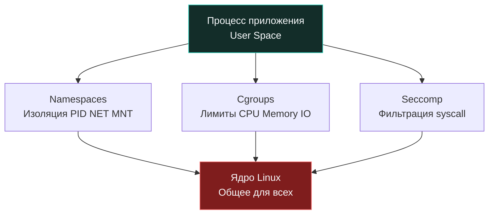

## Контейнеризация как граница доверия

В среде разработчиков до сих пор бытует опасное заблуждение: контейнеры Docker часто называют «легковесными виртуальными машинами». Однако с точки зрения низкоуровневой архитектуры операционных систем и информационной безопасности это фундаментально ложная аналогия. Виртуальная машина запускает собственное независимое ядро операционной системы поверх аппаратного гипервизора (KVM, Xen, Hyper-V) со строгой изоляцией процессорных инструкций (VT-x, AMD-V). Контейнер же не эмулирует аппаратное обеспечение и не имеет своего ядра. Это самый обычный процесс пространства пользователя (User Space) Linux, который делит единое ядро хоста со всеми остальными процессами, но ограничен четырьмя платформенными барьерами: `namespaces`, `cgroups`, `capabilities` и `seccomp`.

Для Senior/Lead инженера на Go понимание этой механики критично: контейнер — это не крепость, а тонкая перегородка из гипсокартона внутри общего здания ядра Linux. Любая брешь в конфигурации изоляции, непредусмотренное поведение планировщика Go или уязвимость в системных вызовах ядра превращает видимость изоляции в фикцию.



---

### 1. Архитектура изоляции: namespaces, cgroups и ядро

Механизм контейнеризации в Linux активируется при создании процесса через системные вызовы `clone()` (с флагами изоляции) или `unshare()`. Ядро выделяет процессу изолированные пространства имен (Namespaces):

- `PID Namespace`: Управляет видимостью дерева процессов. Внутри контейнера ваше Go-приложение искренне считает себя PID 1 (инициализатор контейнера), однако в таблице процессов хостового ядра это рядовой тред с обычным высоким номером вроде PID 14205.
- `NET Namespace`: Полностью изолирует сетевой стек. Процесс получает персональные виртуальные сетевые интерфейсы (`veth`), собственные таблицы маршрутизации, локальные правила `iptables` и независимые сокеты.
- `MNT Namespace`: Изолирует точки монтирования файловой системы. Контейнер видит лишь собранный слоеный пирог UnionFS (драйверы overlay2 или устаревший aufs). Прямой доступ к служебным каталогам хоста `/proc` и `/sys` жестко ограничен или подменен виртуальными заглушками.
- `UTS/IPC/User Namespaces`: Обеспечивают изоляцию сетевого имени хоста (hostname), очередей межпроцессного взаимодействия (POSIX/SysV IPC) и отображение идентификаторов пользователей (UID/GID хоста в UID/GID контейнера).

Ключевой вывод безопасности: **Namespaces не являются криптографической границей**. Они скрывают ресурсы от случайного просмотра, но не спасают от вредоносного кода при наличии уязвимостей ядра или избыточных Linux Capabilities. Если контейнеру опрометчиво выдана привилегия `CAP_SYS_ADMIN`, скомпрометированный процесс может выполнить обратное монтирование дисковых разделов хоста прямо внутрь своего MNT namespace, мгновенно вырвавшись из контейнера на свободу (Container Escape).

---

### 2. Go-рантайм в контейнере: планировщик и лимиты ресурсов

Планировщик рантайма Go (модель `G-M-P`) спроектирован для выжимания максимальной производительности из многоядерного кремния. Количество логических процессоров `P`, определяемое переменной `GOMAXPROCS`, напрямую задает количество одновременно работающих системных тредов ОС (`M`), исполняющих горутины.

Исторически (вплоть до версий Go 1.24/1.25) рантайм при старте определял доступное число CPU тривиальным чтением псевдофайла `/proc/cpuinfo` или системным вызовом `sysconf(_SC_NPROCESSORS_ONLN)`. На 64-ядерном сервере bare-metal рантайм Go инициализировал `GOMAXPROCS = 64`. Но если оркестратор (Kubernetes) выделил контейнеру жесткий лимит cgroups в 2 ядра (`cpu.max = "200000 100000"`), планировщик Linux (CFS) применял жесткий троттлинг: исчерпав двухъядерную квоту за первые 20 миллисекунд периода, 64 треда Go впадали в принудительный сон до следующего периода CFS. Результат — катастрофический рост latency (хвостовые задержки p99) и непредсказуемая деградация производительности.

Эту проблему решает библиотека `go.uber.org/automaxprocs` (а также нативная интеграция в современных версиях Go), которая парсит интерфейс `cgroups v2` (файл `cpu.max` или `/sys/fs/cgroup/cpu.cfs_quota_us`) и корректирует `GOMAXPROCS` в точном соответствии с выделенными долями CPU.

```go
package main

import (
	"log"
	"os"
	"runtime/debug"

	_ "go.uber.org/automaxprocs" // Автоматически настраивает GOMAXPROCS по cgroups
)

func init() {
	// Чтение лимита памяти из cgroups v2 (примерный путь)
	memLimitBytes := readCgroupMemoryLimit()
	if memLimitBytes > 0 {
		// Устанавливаем лимит на 10-15 процентов ниже, чтобы оставить запас рантайму
		debug.SetMemoryLimit(int64(float64(memLimitBytes) * 0.85))
		log.Printf("Set GOMEMLIMIT to %d bytes", int64(float64(memLimitBytes)*0.85))
	}
}

func readCgroupMemoryLimit() int64 {
	// В продакшене используется специализированный пакет типа github.com/KimMachineGun/automemlimit
	// Здесь упрощённая логика для демонстрации
	return 0
}

func main() {
	// Бизнес-логика
}
```

**Влияние на память и сборщик мусора (`GC`):**  
Подсистема памяти cgroups ограничивает максимальный объем RAM через параметр `memory.max`. Когда контейнер приближается к лимиту, ядро начинает агрессивно вытеснять страницы, а рантайм Go может получать сигналы `SIGBUS` или ошибки `ENOMEM` при попытке аллокаций. Если суммарная память процесса превышает установленный порог, ядро Linux включает OOM Killer (Out Of Memory Killer), который мгновенно прибивает процесс сигналом `SIGKILL` (код 137). Никакие блоки `defer` и graceful shutdown не успевают сработать!  
Если в приложении не настроен лимит рантайма `GOMEMLIMIT`, сборщик мусора Go ориентируется на `GOGC=100` и продолжает удваивать кучу, провоцируя вмешательство ядра. Корректная инженерная конфигурация (например, через `automemlimit` или явный вызов `debug.SetMemoryLimit`) устанавливает лимит памяти Go на 15–20% ниже жесткого лимита контейнера. Тогда рантайм Go агрессивно запускает цикл сборки мусора заранее, не доводя контейнер до расстрела со стороны OOM Killer ядра.

---

### 3. Системные вызовы и seccomp-фильтры

По умолчанию Docker накладывает на изолированные процессы фильтр системных вызовов `seccomp` (Secure Computing Mode). Seccomp компилирует правила фильтрации в байткод ядра eBPF/cBFP, проверяя каждый системный вызов на входе в ядро.

Рантайм Go — чрезвычайно сложная система, взаимодействующая с ядром через сотни системных вызовов:
- `epoll_create1`, `epoll_ctl`, `epoll_wait` — сердце сетевого поллера `netpoll`.
- `mmap`, `madvise`, `munmap` — управление виртуальными страницами аллокатора памяти и `GC`.
- `futex` — низкоуровневая реализация мьютексов (`sync.Mutex`, `sync.Cond`) в пространстве ядра.
- `clone3`, `rt_sigprocmask` — порождение системных потоков ОС под управлением планировщика горутин.
- `getrandom` — аппаратный сбор энтропии для генератора случайных чисел `crypto/rand`.

Если применить к контейнеру с Go чрезмерно жесткий белый список вызовов (например, профиль `syscall-whitelist`), разрешающий только примитивные `read/write/open`, приложение мгновенно рухнет с сигналом `SIGSYS` при первой же попытке рантайма инициализировать сетевой поллер или выделить память. Стандартный профиль Docker (`default.json`) сбалансирован и разрешает вызовы, необходимые рантайму Go. Однако в изолированных банковских контурах формируют кастомные seccomp-профили, жестко запрещающие опасные вызовы ядра: `mount`, `ptrace`, `unshare`, `personality`, `kexec_load`.

> [!info] Под капотом
> **Почему `mlock` и `MADV_DONTDUMP` требуют дополнительных прав?**  
> Системные вызовы `mlock()` (блокировка страниц в RAM для предотвращения сброса в swap) и `madvise()` с флагом `MADV_DONTDUMP` (исключение буфера из аварийных дампов ядра при `panic`) по умолчанию ограничены лимитом `ulimit -l` для непривилегированных процессов. Внутри контейнера попытка выполнить эти вызовы завершится ошибкой ядра `EPERM`.  
> Чтобы ваше Go-приложение могло защищать криптографические ключи в оперативной памяти, контейнеру необходимо явно выдать возможность ядра `--cap-add=IPC_LOCK` либо скорректировать лимиты хоста `limits.conf` и параметр ядра `sysctl vm.max_map_count`. В противном случае незашифрованные секреты могут оказаться в swap-разделе хоста или в незащищенном файле core dump.

---

### 4. Идиоматичный Dockerfile для Go

Безопасность контейнера начинается задолго до рантайма — на этапе формирования образа в Dockerfile. Двухэтапные сборки (Multi-stage builds) и микроскопические базовые образы (`distroless` или минимальный `alpine` без командного процессора `/bin/sh`) сводят площадь атаки (Attack Surface) к теоретическому минимуму.

```dockerfile
# 1 - Этап сборки
FROM golang:1.22-alpine AS builder
WORKDIR /src
COPY go.mod go.sum ./
RUN go mod download
COPY . .
# Статическая сборка без CGO. Исключает зависимости от libc и уязвимости в ней.
RUN CGO_ENABLED=0 GOOS=linux go build -ldflags="-s -w -extldflags '-static'" -o /app/server ./cmd/server

# 2 - Финальный образ
FROM gcr.io/distroless/static-debian12:nonroot
WORKDIR /app
COPY --from=builder /app/server .

# 🔒 Запрет изменения файловой системы
USER 1000:1000
ENTRYPOINT ["/app/server"]
```

При запуске в `docker run` или секции `securityContext` манифеста Kubernetes используйте принцип наименьших привилегий:

```bash
docker run --read-only \
           --cap-drop ALL \
           --security-opt=no-new-privileges:true \
           --tmpfs /tmp \
           myapp:latest
```

Разбор защитных флагов:
- `--read-only`: Корневая файловая система монтируется только на чтение. Злоумышленник, даже получив возможность исполнения кода, физически не сможет перезаписать бинарник `/app/server` или скачать троянский скрипт.
- `--cap-drop ALL`: Сбрасывает все без исключения привилегии Linux Capabilities. Процесс лишается возможности вызывать привилегированные функции ядра.
- `--security-opt=no-new-privileges:true`: Ядро гарантирует, что вызовы `execve` никогда не повысят привилегии процесса через бинарники с битами setuid/setgid (например, через системный `sudo` или `su`).
- `--tmpfs /tmp`: Временные файлы и сокеты размещаются в оперативной памяти (RAM) и бесследно исчезают при остановке контейнера, не затрагивая диск.

---

### 5. Ловушки и векторы атак

1. **Эскалация привилегий через `/proc`:**  
   Даже если контейнер запущен с флагом `--cap-drop ALL`, некорректно изолированный псевдокаталог `/proc` может позволить прочитать переменные окружения соседних сервисов (`/proc/1/environ`), открытые дескрипторы сокетов (`/proc/1/fd`) или параметры ядра (`/proc/sys/kernel`). Категорически избегайте проброса хостовых директорий `/proc` и `/sys` внутрь контейнера, монтируйте только минимально необходимый изолированный `rootfs` без доступа к хостовому `/proc`.
2. **CGO и уязвимости динамических библиотек:**  
   Сборка с `CGO_ENABLED=1` динамически линкует рантайм Go с системными библиотеками C (`glibc` или `musl`). Любая критическая уязвимость в реализации `libc` (вспомним исторические эксплойты вроде `GHOST` или `Pwnkit`) автоматически становится уязвимостью вашего Go-сервиса. Сборка с `CGO_ENABLED=0` производит полностью самодостаточный статический исполняемый файл ELF, исключая зависимости от сторонних `.so` библиотек, хотя и отключает в некоторых случаях `netgo` и низкоуровневые профилировщики на базе `cgo`.
3. **DoS-атаки на процессор и температурный троттлинг:**  
   Если в конфигурации контейнера не заданы лимиты `cpu.cfs_quota_us` и `memory.limit`, вредоносный входящий запрос может загнать рантайм Go в бесконечный цикл вычислений, загрузив 100% всех физических ядер сервера и вызвав отказ в обслуживании (Denial of Service) для всех соседних контейнеров на ноде.
4. **Слив секретов в стандартные потоки вывода (stdout/stderr):**  
   Демон Docker (`dockerd`) перехватывает все байты из `stdout/stderr` и сохраняет их на хостовом накопителе в каталоге `/var/lib/docker/containers/...` для утилиты `docker logs`. Если ваше приложение пишет в лог неотфильтрованные дампы структур с секретами или трассировки стека, эти данные оседают на диске хоста в открытом виде.

---

> [!tip] Собеседование
> **Вопрос:** Почему запуск Go-приложения с флагом `--privileged` в Kubernetes или Docker считается критической архитектурной ошибкой, даже если код сервиса не использует пакет `os/exec`?  
> **Ответ:**  
> 1. **Анатомия флага `--privileged`:** Этот флаг полностью отключает все механизмы изоляции: ядро выдает контейнеру все возможные capabilities, отключает фильтрацию `seccomp` и профили `AppArmor`/`SELinux`, пробрасывает все физические блочные устройства из `/dev` хоста и деактивирует флаг `no-new-privileges`.  
> 2. **Угроза Escape-атаки:** Контейнер превращается в обычный root-процесс хоста. Любая уязвимость повреждения памяти в рантайме Go, стандартных парсерах или уязвимой сторонней зависимости позволяет злоумышленнику смонтировать корневой диск хоста (`mount /dev/sda1 /mnt`) и получить полный контроль над физическим сервером или всей нодой кластера Kubernetes.  
> 3. **Архитектурная альтернатива:** Руководствоваться принципом минимальных привилегий: выдавать точечные capabilities (например, `CAP_NET_BIND_SERVICE`, только если сервер обязан слушать порты ниже 1024), включать `readOnlyRootFilesystem: true`, принудительно задавать `runAsNonRoot: true` и изолировать межсервисный трафик политиками `NetworkPolicy`. Для взаимодействия со специализированным оборудованием используются Kubernetes `devicePlugin` или CSI-драйверы, а не прямое монтирование хостового каталога `/dev`.

---

## Итог

1. Контейнеры изолируют процессы средствами ядра Linux (`namespaces`, `cgroups`, `capabilities` и `seccomp`), но не являются криптографической границей и делят общее ядро хоста.
2. Рантайм Go обязан синхронизироваться с квотами cgroups через `automaxprocs` и параметр `GOMEMLIMIT`, предотвращая разрушительный CPU-троттлинг планировщика и аварийное завершение процесса от рук OOM Killer.
3. Фильтры `seccomp` отсекают опасные системные вызовы (`mount`, `ptrace`), однако стандартные профили контейнеризации уже настроены для поддержки сетевого поллера (`epoll`) и аллокатора Go.
4. Идиоматичная промышленная сборка требует отключения CGO (`CGO_ENABLED=0`), статической линковки бинарника, использования минимальных базовых образов `distroless` и запуска от непривилегированного пользователя с флагами `--cap-drop ALL` и `--read-only`.
5. Использование флага `--privileged` и бесконтрольный доступ к файловым системам хоста аннулируют изоляцию, превращая любую локальную уязвимость приложения в полный захват инфраструктурного кластера.

[[5. Supply chain атаки]]