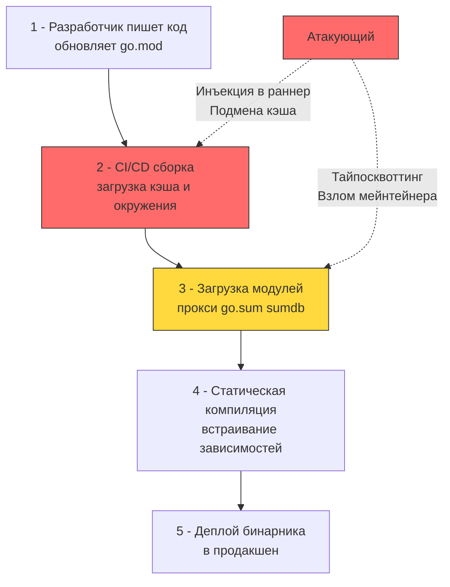

## Введение: Цепочка поставок как расширенная поверхность атаки

В классической парадигме безопасности инженеры привыкли тщательно защищать собственный код: валидировать входные HTTP-параметры, параметризовать SQL-запросы, оборачивать конкурентные структуры мьютексами. Однако в современной распределенной разработке ваш собственный код составляет едва ли 5–10% от общего объема логики, исполняемой на процессоре. Остальные 90–95% — это сторонние библиотеки, транзитивные зависимости, сборочные раннеры CI/CD и вспомогательные утилиты генерации кода.

Атака на цепочку поставок (Supply Chain Attack) фундаментально переносит вектор компрометации с периметра приложения непосредственно в процесс сборки и поставки зависимостей. В экосистеме Go эта проблема стоит особенно остро из-за краеугольного архитектурного принципа языка — **статической линковки**. Любая сторонняя библиотека, втянутая командой `go mod download`, во время компиляции намертво вваривается компилятором прямо в тело итогового бинарного файла ELF. В отличие от динамических библиотек (`.so` / `.dll`), в Go невозможно провести «горячую замену» скомпрометированного модуля на сервере без полной перекомпиляции и повторного деплоя всего сервиса.



---

### Под капотом: как Go разрешает и верифицирует модули

Механизм модулей Go (`go mod`), появившийся в Go 1.11 и ставший каноническим, изначально проектировался вокруг строгих криптографических гарантий целостности артефактов. Когда вы выполняете `go mod download` или запускаете `go build`, под капотом разворачивается многоступенчатый протокол проверки:

1. **Запрос к прокси-серверу (`GOPROXY`):**  
   Инструментарий Go обращается к настроенному прокси (по умолчанию `https://proxy.golang.org,direct`). Прокси возвращает `.zip` архив с исходным кодом модуля и служебный файл `.info` с мета-версией коммита.
2. **Вычисление криптографического дайджеста:**  
   Рантайм распаковывает архив в памяти и вычисляет контрольную сумму SHA-256 по детерминированному алгоритму хеширования содержимого всех файлов модуля.
3. **Проверка по глобальной базе контрольных сумм (Checksum DB):**  
   Полученный хеш отправляется на верификацию в `sum.golang.org` (или приватный сум-сервер компании). В основе `sumdb` лежит прозрачное криптографическое дерево Меркла (Certificate Transparency-подобная архитектура). База данных возвращает доказательство включения записи, что полностью исключает возможность атаки Man-in-the-Middle (MITM) или подмены содержимого архива недобросовестным публичным прокси.
4. **Сверка с локальным файлом `go.sum`:**  
   Хеш сверяется с записью в локальном файле `go.sum`. Если хеши совпадают, модуль распаковывается в локальный кэш `GOMODCACHE`.

На уровне операционной системы каталог `GOMODCACHE` по умолчанию располагается по пути `$GOPATH/pkg/mod`. Если этот дисковый кэш используется совместно несколькими неизолированными раннерами CI/CD (например, общий shared volume в Kubernetes), злоумышленник, получивший доступ к одному из раннеров, может модифицировать файлы в кэше. Поскольку тулчейн Go считает уже распакованный модуль в `pkg/mod` априори проверенным, последующие сборки подтянут внедренную закладку без повторного обращения к сети!

---

### Основные векторы атак на цепочку поставок

1. **Тайпосквоттинг (Typosquatting) и Namespace Confusion:**  
   Злоумышленники регистрируют модули с именами, визуально неотличимыми от сверхпопулярных библиотек: например, `github.com/sirupson/logrus` вместо легитимного `github.com/sirupsen/logrus`. Разработчик, набирающий `go get` вручную или копирующий строку из неофициального туториала, втягивает вредоносный репозиторий в `go.mod`.
2. **Компрометация учетной записи мейнтейнера:**  
   Взлом аккаунта автора популярной утилиты через фишинг или перехват токена GitHub. Злоумышленник публикует легитимный релиз с бэкдором (например, v1.8.4). Поскольку файл `go.sum` фиксирует хеш только для уже зафиксированных версий, автоматическое обновление зависимостей в CI подтянет вредоносный релиз, снабженный валидным хешем в `sumdb`.
3. **Глубокий статический анализ через AST и `govulncheck`:**  
   Традиционные сканеры безопасности уязвимостей (вроде Trivy или Snyk) часто работают поверхностно: они просто сопоставляют версии из `go.mod` с базой CVE, порождая бесконечный шум ложных срабатываний (False Positives). Официальный инструмент `govulncheck` работает принципиально иначе: он строит полный граф вызовов приложения, парсит абстрактное синтаксическое дерево (AST) и проверяет, **достижим ли уязвимый символ** (функция или метод) из точки входа `main()`. Если уязвимая функция никогда не вызывается вашим кодом, бинарник признается безопасным.
4. **Отравление окружения сборки (CI/CD Poisoning):**  
   Инъекция вредоносного кода непосредственно в пайплайн: подмена переменной `GOPROXY`, модификация `go.mod` налету скриптами раннера, использование недоверенных Docker-образов с предустановленным модифицированным компилятором `go` или использование отравленных кэшированных директорий `pkg/mod`.

---

### Идиоматичная защита в Go

Архитектура надежной защиты цепочки поставок строится на герметичности сборки, бескомпромиссной верификации кэша и исключении непроверенных сетевых запросов.

```bash
# 1 - Интеграция govulncheck в CI/CD пайплайн
# Устанавливаем последнюю версию анализатора
go install golang.org/x/vuln/cmd/govulncheck@latest

# 2 - Сканирование проекта на достижимые уязвимости
# Инструмент автоматически читает go.mod, строит граф вызовов и сверяет с vuln.go.dev
govulncheck ./...

# 3 - Верификация локального кэша против sumdb
# Гарантирует, что распакованные модули в GOMODCACHE не были изменены
go mod verify
```

> [!info] Под капотом
> **Почему `go mod vendor` безопаснее для CI?**  
> Команда `go mod vendor` полностью выгружает исходный код всех зависимостей в локальный подкаталог `vendor/` вашего репозитория. При выполнении компиляции флаг `go build -mod=vendor` указывает тулчейну полностью игнорировать сетевые прокси `GOPROXY` и системный кэш `GOMODCACHE`. Сборка становится 100% герметичной, детерминированной и автономной. Это полностью устраняет риск сетевых атак, поломок публичных прокси и недоступности репозиториев в закрытых контурах. Обратная сторона медали: разрастание размера репозитория Git и необходимость проведения аудита кода внутри каталога `vendor/`.

---

### Ловушки и архитектурные риски

1. **Директива `replace` в `go.mod`:**  
   Директива часто применяется для локальной отладки библиотек: `replace github.com/my/lib => ../local-lib`. Опасность заключается в том, что для локального пути компилятор Go **полностью обходит проверку Checksum DB**. Если директива `replace` случайно попадает в основную production-ветку репозитория, вы полностью лишаетесь криптографической защиты целостности модуля.
2. **Ошибки в переменных `GONOSUMDB` и `GONOSUMCHECK`:**  
   Данные переменные предназначены для отключения верификации в `sum.golang.org` для закрытых корпоративных репозиториев. Грубая ошибка в маске шаблона (например, указание `GONOSUMDB=github.com/*` вместо точного пути `github.com/mycompany/*`) распахивает дыру безопасности, отключая криптографическую проверку для всех публичных библиотек с GitHub.
3. **Статическая линковка и радиус поражения (Blast Radius):**  
   Сборка с `CGO_ENABLED=0` формирует монолитный бинарник. Если критическая уязвимость обнаруживается в низкоуровневом криптографическом модуле `golang.org/x/crypto` или сетевом клиенте `github.com/redis/go-redis`, никакой «горячий патч» ОС не поможет. Требуется полный цикл перекомпиляции и выкатки нового артефакта, что налагает строгие требования к автоматизации CI/CD и непрерывному мониторингу базы `vuln.go.dev`.
4. **Воспроизводимость сборки (Reproducible Builds):**  
   По умолчанию компилятор `go build` встраивает в исполняемый файл метаданные системы контроля версий и абсолютные пути к исходным файлам на диске сборочной машины (`-buildvcs=true`). Это не только раскрывает внутреннюю структуру окружения разработки, но и нарушает побитовую воспроизводимость бинарника на разных машинах. Для обеспечения безопасности и независимого аудита используйте флаги очистки путей: `go build -trimpath -buildvcs=false`.

---

> [!tip] Собеседование
> **Вопрос:** В чём фундаментальная разница между файлами `go.mod` и `go.sum`, и почему одного `go.mod` категорически недостаточно для защиты от атак на цепочку поставок?  
> **Ответ:**  
> 1. **Декларация против доказательства:** Файл `go.mod` носит чисто декларативный характер. Он сообщает тулчейну, *какие* минимальные версии семантического версионирования требуются проекту, но не содержит никаких криптографических гарантий неизменности их исходного кода.  
> 2. **Криптографический якорь `go.sum`:** Файл `go.sum` содержит строгие криптографические контрольные суммы SHA-256 для каждого архива модуля и каждого сопутствующего `go.mod`. Это гарантирует, что на любой машине будут скомпилированы ровно те же самые байты.  
> 3. **Роль публичного нотариуса `sum.golang.org`:** Без `go.sum` и Checksum DB любой скомпрометированный прокси-сервер или сетевой перехватчик мог бы отдать модифицированный `.zip` архив с бэкдором. При первой загрузке зависимости Go запрашивает запись из неизменяемого дерева Меркла `sum.golang.org` и фиксирует ее в `go.sum`. При последующих сборках локальный `go.sum` защищает от любых изменений в удаленном репозитории.

---

## Итог

1. Атаки на цепочку поставок переносят удар с бизнес-кода на зависимости и сборочную инфраструктуру. Из-за статической линковки компилятор Go намертво встраивает код библиотек в бинарник, делая невозможной горячую замену на сервере.
2. Триада `GOPROXY` + `sum.golang.org` + `go.sum` обеспечивает криптографический контроль целостности зависимостей, предотвращая подмену кода через публичные реестры.
3. Инструмент `govulncheck` проводит статический анализ AST и строит граф вызовов, отсекая шум недостижимых CVE и выявляя реальные уязвимости в коде.
4. Использование `go mod vendor` и сборки с флагом `go build -mod=vendor` обеспечивает полную герметичность и детерминированность артефактов без сетевых зависимостей на этапе CI.
5. Забытые директивы `replace`, некорректные `GONOSUM*` паттерны (например, в `GONOSUMDB`) и отсутствие флага `-trimpath` — ключевые инженерные недочеты, подрывающие безопасность конвейера сборки.

[[6. Dependency vulnerabilities]]