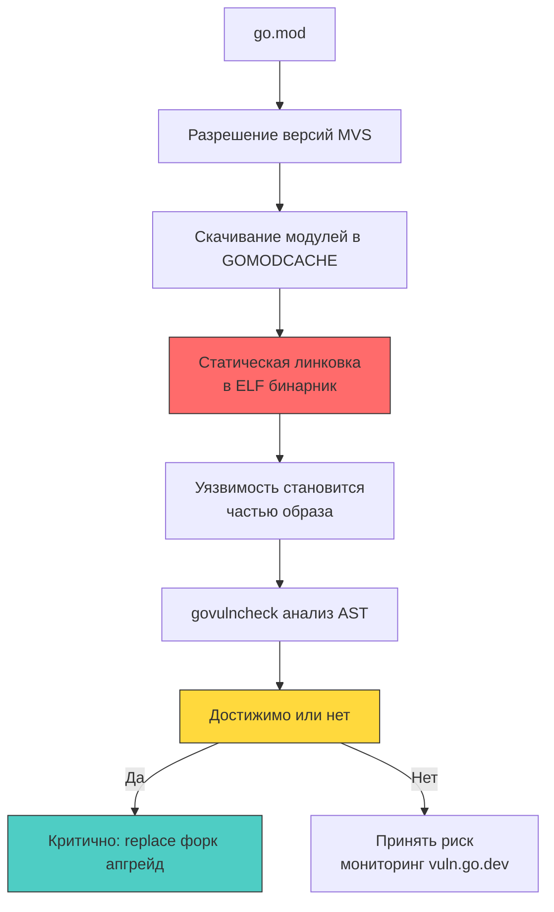

## Статическая линковка и радиус поражения

В интерпретируемых языках и средах с динамической загрузкой (Python, PHP, Node.js) внешние зависимости загружаются, анализируются и линкуются динамически в рантайме. Если в стороннем пакете обнаруживается брешь, системный администратор зачастую может обновить разделяемую библиотеку (`.so` / `.dll`) или подменить файл скрипта прямо на диске production-сервера. В мире Go архитектурная модель в корне иная: компилятор собирает сторонние пакеты на этапе компиляции и намертво вваривает их машинный код непосредственно в структуру секций ELF-бинарника.

Это означает фундаментальную вещь: любая уязвимость в транзитивной зависимости — будь то популярный сетевой клиент `github.com/redis/go-redis`, библиотека сериализации или криптографический модуль `golang.org/x/crypto` — мгновенно перестает быть «проблемой внешнего вендора» и становится неотъемлемой частью вашего собственного скомпилированного артефакта. Никакой горячий патч невозможен в принципе. Радиус поражения (Blast Radius) охватывает весь бинарник целиком. Единственный способ ликвидировать угрозу — перепроверить граф вызовов, пересобрать проект из исходников, провести полный цикл сквозного тестирования и раскатать обновленный образ на всех вычислительных узлах.

Для ведущих инженеров и системных архитекторов понимание того, как тулчейн Go разрешает версии, исследует абстрактные синтаксические деревья (AST) и изолирует уязвимые ветки исполнения, критично не только для поддержания жестких SLA, но и для соответствия строгим отраслевым стандартам безопасности (PCI-DSS, SOC2, ГОСТ Р 57580).



---

### 1. Механика разрешения зависимостей: MVS и минимализм

В основе системы управления модулями Go лежит алгоритм **Minimal Version Selection (MVS)**, спроектированный Рассом Коксом. Большинство пакетных менеджеров в других языках (таких как NPM, Cargo или Pip) следуют стратегии максимизации SemVer: при сборке они по умолчанию пытаются затянуть самую свежую «совместимую» мажорную или минорную версию из реестра. 

Go поступает с точностью до наоборот: алгоритм MVS выбирает **минимальную версию**, которая удовлетворяет явным требованиям всех модулей в графе `go.mod`.
- **Инженерный выигрыш:** MVS обеспечивает потрясающую детерминированность. Вы никогда не получите внезапный «тихий» апдейт библиотеки прямо во время ночного CI-билда только потому, что автор зависимости выпустил минорный релиз. Поверхность атаки минимизируется: скрытые изменения логики не попадут в сборку автоматически.
- **Архитектурный нюанс:** Если две независимые транзитивные зависимости требуют разные версии одного и того же пакета (например, библиотека `A` требует `v1.2.0`, а библиотека `B` — `v1.4.0`), MVS выбирает максимальную из явно запрошенных версий (`v1.4.0`). В результате уязвимая версия может быть подтянута косвенно. Чтобы распутать сложный клубок транзитивных связей, тулчейн Go предоставляет незаменимые диагностические утилиты `go mod why` (объясняет, почему данный пакет включен в сборку) и `go mod graph` (выводит полную матрицу ребер графа зависимостей).

---

### 2. Анализ достижимости: как работает `govulncheck`

Наивные сканеры безопасности первого поколения обычно действуют примитивно: они сопоставляют список имен и версий пакетов из `go.mod` с публичной базой CVE. Это приводит к так называемому «синдрому волчьей тревоги» (Alert Fatigue). Если в модуле `x/net/html` найдена критическая уязвимость переполнения стека при парсинге поврежденных HTML-тегов, но ваш микросервис является чистым JSON REST API и никогда не вызывает функции парсинга HTML, реального риска для системы нет.

Официальный анализатор от команды Go — **`govulncheck`** — решает эту проблему через глубокий статический анализ исходного кода:
1. Загружает модули из локального кэша `GOMODCACHE` и формирует полный граф типов и импортов.
2. Парсит абстрактные синтаксические деревья (AST) всех используемых пакетов.
3. Строит статический граф вызовов (Call Graph) всего приложения, отслеживая поток управления от корневой функции `main()`.
4. Сверяет известные уязвимые сигнатуры функций из базы `vuln.go.dev` с фактически достижимыми путями выполнения в графе вызовов.

Если уязвимый метод физически не может быть вызван из точки входа вашей программы, `govulncheck` помечает уязвимость вердиктом `Not reachable`. Это избавляет инженерную команду от паники и позволяет сосредоточить ресурсы на исправлении действительно опасных, достижимых уязвимостей.

> [!info] Под капотом
> **Почему анализ интерфейсов Go сложен для статического анализатора?**  
> В Go полиморфизм строится на неявной реализации интерфейсов (Duck Typing). Когда код вызывает метод через интерфейсный тип (например, `io.Reader.Read`), точка назначения вызова не привязана к конкретной структуре в момент компиляции: фактический тип диспетчеризуется динамически через таблицу `itab` в рантайме.  
> Чтобы не пропустить скрытые вызовы, `govulncheck` применяет алгоритмы Rapid Type Analysis (RTA) и эвристический анализ указателей, пытаясь предсказать все возможные конкретные типы. Однако при наличии в коде пустых интерфейсов `interface{}` / `any` и динамических вызовов через пакет `reflect`, статический анализатор выбирает консервативную стратегию безопасности и помечает путь как `Potentially reachable`, сигнализируя о необходимости ручного аудита.

---

### 3. Стратегии исправления: `replace`, форк и явный апгрейд

Когда аудит выявил критическую достижимую уязвимость, архитектор выбирает одну из трех проверенных стратегий ликвидации угрозы:

1. **Прямой апгрейд зависимостей (`go get package@vX.Y.Z`):**  
   Идеальный сценарий, когда автор модуля оперативно выпустил патч. Вызов `go mod tidy` автоматически актуализирует манифест `go.mod` и криптографические контрольные суммы в `go.sum`.
2. **Директива `replace` в `go.mod`:**  
   Спасительный круг, когда официальный мейнтейнер медлит с релизом или забросил репозиторий. Директива `replace` перенаправляет компилятор на доверенный форк команды: `replace github.com/vuln/lib => github.com/company/jwx-patch v2.0.1-fix`. Тулчейн полностью игнорирует оригинальный код и компилирует исправленную версию.
3. **Локальный форк и вложенный модуль (`internal/pkg`):**  
   Радикальный шаг для критически важных сервисов: исходный код проблемного пакета копируется прямо в каталог `internal/pkg`, патчится вручную и исключается из внешней цепочки поставок. Вы получаете 100% контроль над кодом, но берете на себя бремя его пожизненного сопровождения.

```go
// Пример go.mod с временным патчем через replace
module github.com/company/secure-api

go 1.22

require (
	github.com/golang-jwt/jwt/v5 v5.2.0
)

// 🔒 Явная замена уязвимой транзитивной зависимости
replace github.com/lestrrat-go/jwx/v2 => github.com/company/jwx-patch v2.0.1-fix
```

---

### 4. Под капотом: влияние уязвимостей на рантайм и память

Статическая сборка влечет за собой прямое присутствие машинных инструкций всех зависимостей в секциях `.text`, `.rodata` и `.data` результирующего бинарного файла ELF. Даже если компилятор исключил некоторые функции на этапе Dead Code Elimination, неиспользуемые структуры данных и метаданные типов нередко оседают в исполняемом файле, раздувая его размер и оставаясь доступными для исследования через дизассемблеры (`objdump`, IDA Pro, Ghidra).

На стыке железа, рантайма и операционной системы возникают специфические системные риски:
- **Неконтролируемое расширение пространства системных вызовов (Syscall Exposure):**  
   Транзитивная библиотека, о функционале которой вы даже не подозревали, может инициировать системные вызовы ядра `syscall` (например, открывать файлы через `open` или слушать сокеты через `connect`). Если профиль безопасности seccomp в Docker был настроен слишком широко, уязвимый пакет может беспрепятственно эксплуатировать эти системные каналы.
- **Разрушение безопасности памяти при использовании CGO:**  
   Если сторонняя библиотека использует `cgo` для связки с C-библиотеками, любые классические ошибки повреждения памяти в C-коде (Use-After-Free, Double Free, переполнение стека) мгновенно пробивают защиту Go. Они вызывают падения с `SIGSEGV`, коррумпируют кучу рантайма и открывают вектор для удаленного исполнения произвольного кода (RCE), минуя проверки Escape Analysis и барьеры сборщика мусора.
- **Давление на сборщик мусора (GC Pressure):**  
   Уязвимости типа Denial of Service в сторонних парсерах (JSON, XML, Protobuf) нередко заключаются в генерации бесконечного числа мелких аллокаций памяти при обработке некорректных структур данных. Это вызывает тяжелейшие фазы `Stop-The-World` в `GC`, исчерпание физической RAM и падение контейнера от OOM Killer.

---

> [!warning] Ловушка / Gotcha
> **Неявные обновления через `go mod tidy`**  
> При локальной разработке инженер выполняет команду `go mod tidy`. Тулчейн Go автоматически разрешает граф зависимостей и может обновить версии транзитивных пакетов в `go.mod`. В среде CI/CD, где переменные `GOPROXY` или содержимое кэша могут отличаться от рабочей машины разработчика, тулчейн подтянет новые версии библиотек, которые не прошли процедуру внутреннего аудита и могут содержать критические регрессии безопасности.  
> **Решение:** Изменения в `go.mod` и `go.sum` должны проходить обязательный Code Review безопасности наравне с бизнес-кодом. В пайплайнах CI всегда запускайте `go mod verify` и используйте `go mod vendor` для обеспечения детерминизма. В корпоративных сетях весь внешний трафик к репозиториям должен принудительно направляться через изолированные зеркала (Athens, JFrog Artifactory), отсекающие непроверенные пакеты.

---

> [!tip] Собеседование
> **Вопрос:** Как грамотно поступить с критической уязвимостью в популярной транзитивной библиотеке, если ее открытый мейнтейнер не отвечает на issue и не выпускает исправленный релиз уже больше месяца?  
> **Ответ:**  
> 1. **Проверка реальной достижимости:** Немедленно запустить `govulncheck ./...`. Если уязвимый метод недостижим из `main()`, задокументировать факт принятия риска (Risk Acceptance), зарегистрировать тикет в трекере безопасности и поставить пакет на постоянный мониторинг базы `vuln.go.dev`.  
> 2. **Оперативный форк и директива `replace`:** Если уязвимость достижима, создать внутренний форк репозитория в корпоративном Git, самостоятельно наложить патч и переопределить зависимость в `go.mod` через директиву `replace`. Зафиксировать полученный хеш в `go.sum`.  
> 3. **Архитектурный рефакторинг:** Рассмотреть возможность отказа от стороннего API в пользу стандартных пакетов экосистемы Go (`crypto/*`, `net/http`, `encoding/json`), которые проходят строжайший аудит команды языка.  
> 4. **Удаление из графа:** В долгосрочной перспективе полностью исключить зависимость из проекта с помощью команд `go mod edit -droprequire` и `go mod tidy`, навсегда разорвав скомпрометированное звено в цепочке поставок.

---

## Итог

1. Статическая линковка компилятора Go физически встраивает сторонние библиотеки в результирующий бинарный файл, делая невозможным применение горячих патчей и требуя полной пересборки артефакта.
2. Алгоритм Minimal Version Selection (MVS) обеспечивает предсказуемость сборки и исключает самопроизвольные обновления зависимостей, однако требует пристального аудита транзитивных модулей через `go mod graph` и `go mod why`.
3. Анализатор `govulncheck` кардинально снижает уровень информационного шума: он исследует абстрактные синтаксические деревья (AST) и граф вызовов, выявляя только реально достижимые уязвимости.
4. Проверенные стратегии устранения уязвимостей включают своевременный апгрейд пакетов, временную подмену через директиву `replace` на проверенный форк и локальную изоляцию модулей в `internal/pkg`.
5. Использование сторонних библиотек с `cgo` ликвидирует гарантии типобезопасности памяти Go, а уязвимые парсеры способны парализовать сборщик мусора `GC` и вызвать отказ в обслуживании (DoS).

[[1. Security testing]]