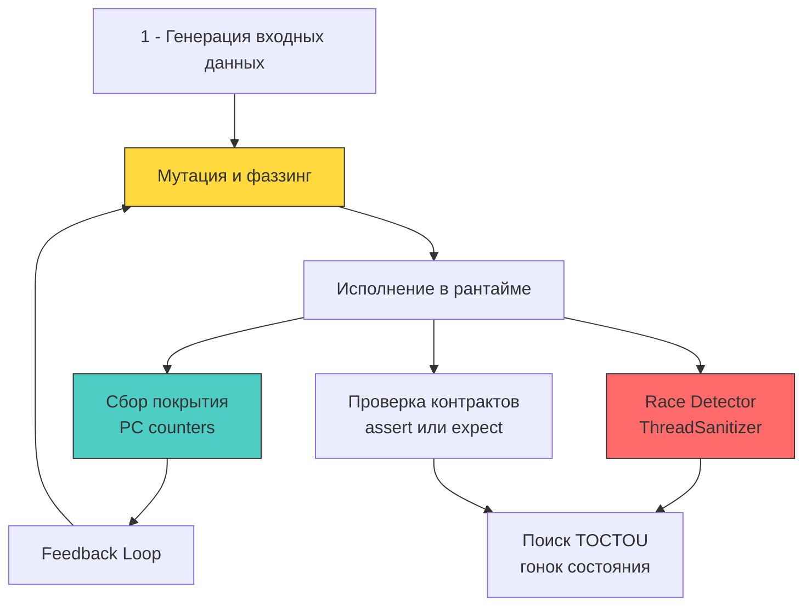

## От позитивных сценариев к модели противника

Большинство инженеров пишут тесты как любящие родители: они проверяют идеальные «солнечные» сценарии (Happy Path), когда пользователь аккуратно заполняет форму валидным email-адресом, вводит пароль из восьми символов и нажимает кнопку ровно один раз. Традиционное модульное тестирование отвечает на вопрос: «Работает ли система так, как задумал автор?». 

Тестирование безопасности (Security Testing) строится на диаметрально противоположном мировоззрении — **модели противника (Adversarial Thinking)**. Мы смотрим на программу глазами злоумышленника, вооруженного ломом, кувалдой и генератором случайных последовательностей байтов, задавая вопрос: «Что произойдет с регистрами процессора, виртуальной памятью и планировщиком Go, если на вход подать мегабайт нулевых байтов, разрушенный UTF-8, запустить тысячу одновременных запросов для провокации состояния гонки (Race Condition) или намеренно исчерпать файловые дескрипторы?».

Для Senior/Lead инженера безопасность не может быть разовым предрелизным аудитом раз в полгода. Она обязана быть непрерывной частью конвейера сборки и разработки. В экосистеме Go для этого есть первоклассный арсенал низкоуровневых инструментов: встроенный в компилятор coverage-guided фаззинг, детектор гонок ThreadSanitizer, стресс-тесты конкурентности и статические анализаторы AST.



---

### 1 - Фаззинг в Go: libFuzzer и coverage feedback под капотом

Начиная с версии Go 1.18, фаззинг (Fuzzing) интегрирован непосредственно в стандартный тулчейн и пакет `testing`. Механика фаззера Go опирается на архитектуру libFuzzer с мутациями, управляемыми покрытием кода (Coverage-guided Fuzzing). Движок не просто заваливает программу случайным белым шумом (наивный «слепой» фаззинг), а исследует ландшафт ветвлений вашего кода.

**Как это работает на уровне машинного кода:**  
Когда вы запускаете `go test -fuzz=Fuzz`, компилятор `gc` с флагом `-fuzz` внедряет в каждую точку ветвления функции инструкции сбора трассировки. На уровне ассемблера в начало каждого базового блока компилятор вставляет хук `__sanitizer_cov_trace_pc_guard`, который инкрементирует ячейку в разделяемой битовой карте счетчиков программного счетчика (PC counters).  
Если очередная случайная мутация байтов заставляет процессор выполнить инструкцию `JMP`/`JNE` по ранее неисследованной ветке, фаззер фиксирует увеличение покрытия (New Edge), сохраняет эту удачную входную мутацию в локальный корпус `testdata/fuzz` и использует ее как базовый шаблон для последующих поколений мутаций.

Однако сбор покрытия имеет свою физическую цену: постоянные атомарные операции вроде `LOCK cmpxchg` создают просадку производительности (~3–10x оверхед по CPU) и вызывают непрерывную инвалидацию строк кэша (Cache Line Bouncing) между ядрами процессора.

```go
package auth_test

import (
	"testing"
	"yourapp/auth"
)

func FuzzVerifyToken(f *testing.F) {
	// Сидируем фаззер валидными и полу-валидными данными для ускорения поиска путей
	f.Add([]byte("valid.token.structure.here"))
	f.Add([]byte("short"))
	f.Add(make([]byte, 0))

	f.Fuzz(func(t *testing.T, data []byte) {
		// Фаззинг не должен вызывать паник или сегфолтов даже на мусоре
		// Мы проверяем, что функция всегда возвращает результат или корректную ошибку
		_, err := auth.VerifyToken(data)
		
		// Ошибка допустима, главное - детерминизм и отсутствие крахов рантайма
		if err != nil {
			return
		}
		
		// Если ошибка nil, структура токена должна проходить все внутренние инварианты
		// Это защищает от состояния, когда уязвимость «молча» пропускает невалидные данные
	})
}
```

> [!info] Под капотом
> **Почему фаззинг не ловит логические уязвимости?**  
> Coverage-guided фаззер спроектирован для выявления падений рантайма (`panic`), разыменования нулевых указателей (`nil pointer dereference`), выхода за границы слайсов и бесконечных циклов, съедающих процессор. Но фаззер абсолютно слеп к смыслу бизнес-логики.  
> Если функция проверки прав доступа `CheckPermission(role, resource)` содержит грубейшую логическую дыру и всегда возвращает `true` при значении `role="admin"`, фаззер сочтет это идеальным выполнением: ветка исполнена, паники нет, результат вернулся штатно. Для отлова логических дефектов фаззинг необходимо комбинировать с проверкой математических инвариантов (Property-Based Testing) и ручным моделированием векторов атак.

---

### 2 - Race Detector и тестирование TOCTOU

Флаг `go test -race` активирует специализированный инструментарий компилятора, основанный на алгоритме ThreadSanitizer (TSan). Детектор гонок динамически отслеживает порядок синхронизации памяти (Happens-Before отношения) между горутинами. Для каждого байта реальной памяти TSan выделяет так называемую «теневую память» (Shadow Memory), объем которой превышает размер исходных данных в 4–16 раз!

При каждом чтении или записи памяти процессор выполняет проверки в теневой памяти, регистрируя идентификатор треда, счетчик тактов и факт удержания мьютексов. Если две горутины обращаются к одной ячейке памяти без барьеров памяти, и хотя бы одно обращение является записью — TSan мгновенно фиксирует Data Race и печатает стек-трейс обеих горутин.

В контексте безопасности это главный инструмент выявления уязвимостей типа **TOCTOU (Time-of-Check to Time-of-Use)**. В конкурентном коде наивная проверка лимитов перед операцией почти всегда уязвима, если между чтением и записью нет атомарности. Обычные табличные тесты выполняются последовательно и никогда не выявят подобную брешь; требуется агрессивный параллельный стресс-тест:

```go
func TestRateLimitRace(t *testing.T) {
	rl := ratelimit.NewAtomicLimiter(100, time.Minute)
	var wg sync.WaitGroup
	allowed := int32(0)

	// Эмуляция 1000 параллельных запросов без синхронизации вызовов
	for i := 0; i < 1000; i++ {
		wg.Add(1)
		go func() {
			defer wg.Done()
			// Если лимитер содержит гонку, счётчик превысит 100
			if rl.Allow() {
				atomic.AddInt32(&allowed, 1)
			}
		}()
	}
	wg.Wait()

	if allowed > 100 {
		t.Errorf("logical race condition: allowed %d requests, hard limit is 100", allowed)
	}
}
```

**Механическое сочувствие к оборудованию:**  
ThreadSanitizer перехватывает атомарные инструкции процессора (`atomic`) и системные вызовы ядра `futex`. Из-за работы с колоссальной теневой памятью тест с флагом `-race` потребляет в 5–10 раз больше тактов CPU и в 10–20 раз больше оперативной памяти. На виртуальных сборочных машинах CI с лимитом RAM в 1–2 ГБ запуск тестов с `-race` гарантированно приведет к аварийному завершению процесса от рук Linux OOM Killer. Запускайте тесты на узлах с объемом памяти `>=4GB` RAM либо используйте изолированный запуск для высококонкурентных пакетов.

---

### 3 - Table-driven tests с adversarial payloads

Табличные тесты (Table-driven Tests) — идиоматический канон языка Go. В тестировании безопасности таблицы наполняются специальными вредоносными нагрузками (Adversarial Payloads): последовательностями для обхода каталогов, инъекциями SQL, векторами XSS, null-байтами, поврежденными UTF-8 последовательностями и невалидными формами нормализации Unicode.

Золотое правило проверки безопасности: **тест обязан проверять не только факт возврата ошибки, но и абсолютное отсутствие побочных эффектов (Side Effects)**. Злоумышленник может получить ошибку валидации уже после того, как сервис успел отправить сетевой запрос к внешней базе или изменить состояние объекта в кэше! Для контроля изоляции используются моки, проверка вызовов и вспомогательные фикстуры `httptest.NewRecorder`.

```go
func TestInputSanitization(t *testing.T) {
	tests := []struct {
		name    string
		payload string
		wantErr bool
	}{
		{"SQL Injection", "admin' OR 1=1--", true},
		{"Path Traversal", "../../etc/passwd", true},
		{"Null Byte", "file.txt\x00.log", true},
		{"Unicode Normalization", "caf\u0065\u0301", false}, // Допустимо, если нормализуется
	}

	for _, tt := range tests {
		t.Run(tt.name, func(t *testing.T) {
			err := sanitizeInput(tt.payload)
			if (err != nil) != tt.wantErr {
				t.Errorf("sanitizeInput() error = %v, wantErr %v", err, tt.wantErr)
			}
			// Проверка отсутствия сайд-эффектов: моки БД не должны вызываться
			if !tt.wantErr {
				// assertDBNotCalled(t)
			}
		})
	}
}
```

---

### 4 - Интеграция в CI/CD и gating-пайплайн

Тесты безопасности приносят реальную пользу только тогда, когда они превращены в бескомпромиссные автоматические шлагбаумы (Quality Gates) в пайплайне непрерывной интеграции:

1. **Фаззинг в Pull Request:**  
   Запуск `go test -fuzz=FuzzXxx -fuzztime=60s` на каждом открытом PR. За 60 секунд фаззер успевает прогнать сотни тысяч мутаций, опираясь на накопленный корпус в `testdata/fuzz`. При обнаружении паники или непредвиденного поведения сборка немедленно завершается с ошибкой (`exit code 1`), а вызвавший падение ввод сохраняется в артефактах сборки.
2. **Контроль регрессий состояния гонки:**  
   Команда `go test -race ./...` должна обязательно выполняться при слиянии веток в `main`. Любая пропущенная гонка данных в ядре сервиса — потенциальная уязвимость отказа в обслуживании или утечки привилегий.
3. **Статические блокировщики сборки:**  
   Утилиты `govulncheck` и `gosec` запускаются как обязательные шаги конвейера. Обнаружение подтвержденных достижимых уязвимостей с уровнем `moderate` и выше блокирует развертывание сервиса.
4. **Динамический анализ (DAST) на Staging-контуре:**  
   После успешного деплоя в тестовый контур специализированные сканеры вроде OWASP ZAP или `nuclei` атакуют запущенный стенд серией реальных сетевых эксплойтов, проверяя корректность настройки CORS, CSP и заголовков защиты.

> [!warning] Ловушка / Gotcha
> **Сборщик мусора во время фаззинга**  
> Фаззер генерирует колоссальное количество вызовов в секунду. Если тестируемая функция выполняет аллокации памяти в куче, сборщик мусора Go (`GC`) переходит в режим паники, устраивая частые паузы Stop-The-World для зачистки сотен мегабайт мусора. В результате фаззер тратит 90% тактов процессора на сборку мусора, а не на генерацию мутаций. Более того, эти искусственные паузы рассинхронизируют параллельное исполнение и могут маскировать скрытые состояния гонки.  
> **Решение:** Для интенсивных фаззинг-тестов оптимизируйте буферы с помощью пулов `sync.Pool`, запускайте бенчмарки с диагностической переменной `GODEBUG=gctrace=1` для оценки давления на кучу и четко ограничивайте время выполнения параметром `-fuzztime`.

---

> [!tip] Собеседование
> **Вопрос:** Как в Go тестировать устойчивость криптографического кода к timing-атакам (атакам по сторонним каналам времени исполнения), учитывая недетерминизм рантайма и влияние GC?  
> **Ответ:**  
> 1. **Проблема прямого замера:** Измерять наносекунды вызовом `time.Now()` в Go бессмысленно: паузы `GC` STW, вытесняющий планировщик горутин (G-M-P), системные прерывания ядра Linux и троттлинг частоты CPU создают колоссальный шум, скрывающий разницу в единицы тактов процессора.  
> 2. **Математическая гарантия константного времени:** Промышленный подход требует применения доказанных алгоритмов константного времени на уровне процессорных инструкций: использование `crypto/subtle.ConstantTimeCompare`, исключение условных переходов (`if/else`), зависящих от секретных байтов, и отказ от табличного поиска с секретными индексами (предотвращение Cache Timing Attacks).  
> 3. **Эмпирическая методика тестирования (Box-Jenkins / Welch t-test):**  
>    - Полностью отключить сборщик мусора на время замера: `debug.SetGCPercent(-1)`.  
>    - Зафиксировать текущую горутину на физическом ядре CPU: `runtime.LockOSThread()`.  
>    - Запустить функцию 100 000 раз для двух разных классов входных данных (например, валидный HMAC и невалидный HMAC с ошибкой в первом байте).  
>    - Провести статистический анализ гистограммы распределения времени (t-критерий Стьюдента). Если распределения статистически различимы с доверительной вероятностью p < 0.001, алгоритм уязвим.  
> 4. **Инженерный вывод:** В реальном production-коде лучший способ защиты от timing-атак — никогда не изобретать собственные криптографические функции, а полагаться исключительно на стандартные пакеты `crypto/*`, написанные на оптимизированном ассемблере без ветвлений.

---

## Итог

1. Тестирование безопасности переключает инженерное мышление с проверки функциональности (Happy Path) на моделирование противника (Adversarial Testing) и проверку поведения рантайма под деструктивной нагрузкой.
2. Встроенный фаззинг в Go (механизм `testing/fuzz`) опирается на coverage-guided мутации и отслеживание счетчиков базовых блоков через хук `__sanitizer_cov_trace_pc_guard`. Он безупречно находит паники и повреждения памяти, но слеп к логическим дефектам бизнес-логики.
3. Детектор `go test -race` использует теневую память ThreadSanitizer для отлова гонок данных, требуя повышенных объемов RAM (от 4 ГБ). Логические уязвимости типа TOCTOU требуют специализированных многопоточных стресс-тестов.
4. Табличные тесты должны проектироваться с использованием вредоносных нагрузок (SQLi, path traversal, null bytes, unicode) и контролировать отсутствие побочных эффектов при получении ошибок.
5. Автоматизированные Quality Gates в CI/CD (ограниченный по времени фаззинг, проверка на гонки, статический аудит `govulncheck` и `gosec`, DAST на staging) гарантируют надежность системы на каждом этапе жизненного цикла.

[[2. Static analysis]]