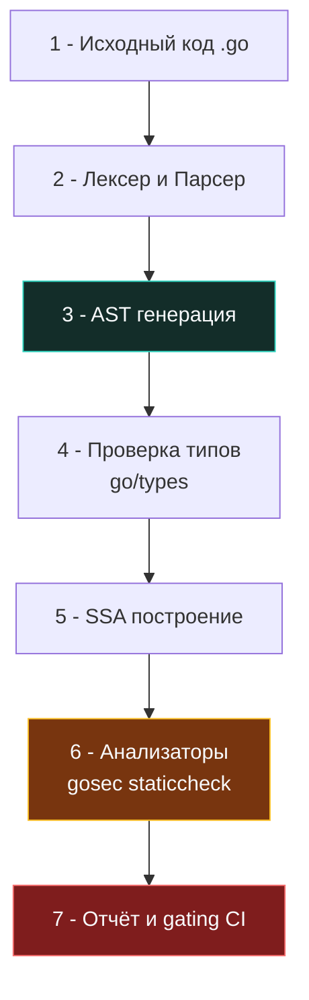

## Введение: AST, SSA и граница компиляции

В языках программирования с динамической природой и поздним связыванием (JavaScript, Python, Ruby) инструменты анализа безопасности часто вынуждены работать в рантайме или эмулировать поведение виртуальной машины. В экосистеме Go архитектурный фундамент иной: статическая типизация и строгая модель компиляции позволяют производить глубокий семантический аудит кода задолго до того, как первый байт бинарного файла будет загружен в память.

Статический анализ (Static Application Security Testing, SAST) в Go — это не примитивная проверка отступов линтером вроде `gofmt`. Это математически строгий разбор исходного кода на уровне абстрактных синтаксических деревьев (AST), графов типов и формы единичного присваивания (Static Single Assignment, SSA). Анализатор исследует траектории движения данных (Data Flow), точки ветвления потока управления (Control Flow) и границы доверия непосредственно на этапе сборки. Это гарантирует абсолютный нулевой оверхед в production-рантайме: проверки выполняются один раз на машине разработчика или сборочном сервере CI/CD, отсекая потенциальные уязвимости еще до рождения артефакта.

Однако статический анализ сталкивается с фундаментальными ограничениями теории вычислений (в частности, теоремой Райса и проблемой останова Тьюринга): невозможно создать алгоритм, способный со 100% точностью предсказать поведение произвольной программы без ложных срабатываний (False Positives) или ложных пропусков (False Negatives). Для Senior/Lead инженера понимание механики работы компилятора Go позволяет настраивать правила линтеров так, чтобы ловить реальные дефекты безопасности, не парализуя работу команды бесконечным шумом.



---

### Механика работы: от парсера до SSA

Все современные инструменты статического анализа в Go опираются на унифицированный платформенный фреймворк `go/analysis`. Конвейер анализатора в точности повторяет фазы фронтенда официального компилятора `gc`:

1. **Загрузка и разрешение пакетов (`go/packages`):**  
   Инструмент обращается к утилите `go list -json`, собирая полный граф зависимостей проекта, флаги компиляции и пути к исходникам. На уровне операционной системы это инициирует порождение дочерних процессов, серию системных вызовов `open/read` и считывание сотен `.go` файлов в буферы памяти.
2. **Лексический анализ и построение AST (`go/parser`, `go/ast`):**  
   Поток текстовых лексем преобразуется в иерархическое дерево синтаксических узлов: `ast.File` (файл целиком), `ast.FuncDecl` (декларация функции), `ast.CallExpr` (вызов метода). Каждый узел хранит точные координаты байтового смещения (`token.Pos`), что позволяет в отчетах указывать точные номера строк и колонок вплоть до конкретного символа.
3. **Разрешение и проверка типов (`go/types`):**  
   Пакет связывает текстовые идентификаторы переменных с их физическими объявлениями, рассчитывает размеры структур с учетом паддинга и выравнивания памяти, а также разрешает таблицы методов интерфейсов. Это **самая прожорливая по памяти фаза**: строится гигантский денормализованный граф структур `types.Object` и `types.Type`, удерживаемый в куче вплоть до полного завершения анализа пакета.
4. **Генерация формы SSA (`golang.org/x/tools/go/ssa`):**  
   Для проведения глубокого анализа данных AST-дерево компилируется в форму единичного присваивания (Static Single Assignment). В SSA каждая переменная именуется и получает значение ровно один раз. Сложные условные конструкции `if/else`, циклы и `switch` превращаются в плоский граф потока управления (Control Flow Graph, CFG), состоящий из базовых блоков, соединенных ребрами переходов с $\phi$-функциями (phi-nodes). Это позволяет алгоритмически точно отслеживать распространение констант, выявлять мертвый код и следить за распространением недоверенных пользовательских данных (Taint Analysis).

> [!info] Под капотом
> **Почему анализаторы потребляют много RAM в CI?**  
> Пакет `go/types` строит денормализованный граф всех типов приложения и всех его транзитивных зависимостей. Для крупного корпоративного монолита это сотни тысяч мелких объектов в куче. Указатели между структурами разбросаны по виртуальному адресному пространству хаотично, что вызывает регулярные промахи мимо аппаратных кэшей процессора L1/L2/L3 при рекурсивном обходе графа (Pointer Chasing).  
> На сервере сборочного конвейера CI с лимитом в 4 ГБ RAM такой объем мелких аллокаций вводит сборщик мусора Go (`GC`) в режим постоянного стресса, замедляя прогон пайплайна на 30–50% из-за пауз STW.  
> **Решение:** Настраивайте инкрементальный запуск (`golangci-lint run --new-from-rev`), используйте жесткий лимит рантайма `GOMEMLIMIT` и кэшируйте результаты работы `go/packages` между сборочными шагами.

---

### Ключевые инструменты и их архитектура

В индустриальной разработке на Go применяется эшелонированный набор анализаторов, каждый из которых специализируется на своем срезе надежности:

1. **`gosec` (Go Security Checker):**  
   Специализированный сканер шаблонов уязвимостей безопасности. Он осуществляет быстрый обход AST по фиксированным правилам-паттернам: поиск жестко зашитых паролей (Hardcoded Credentials), конструирование небезопасных SQL-запросов через конкатенацию строк, слабые генераторы случайных чисел (`math/rand` вместо `crypto/rand`), ошибки конфигурации TLS и уязвимости обхода путей (Path Traversal). Работает молниеносно, так как не тратит время на тяжелое построение SSA-формы.
2. **`staticcheck`:**  
   Академически глубокий семантический анализатор. Строит SSA-представление для выявления мертвого и недостижимого кода, гонок данных, некорректного использования каналов и `sync.WaitGroup`, а также утечек контекстов `context.Context`.
3. **`govulncheck`:**  
   Официальный анализатор от команды Go. Исследует статический граф вызовов приложения для выявления **достижимости** уязвимых функций из базы `vuln.go.dev`.
4. **`nilaway` / `nilness`:**  
   Анализаторы разыменования нулевых указателей. В Go паника `panic: runtime error: invalid memory address or nil pointer dereference` в теле HTTP-обработчика — частый вектор DoS-атак на отказ в обслуживании сервиса. Эти утилиты исследуют SSA-граф, доказывая безопасность разыменования указателей.

```yaml
# .golangci-lint.yml: оптимизированная конфигурация для CI
run:
  timeout: 5m
  modules-download-mode: readonly
  go: "1.22"

linters-settings:
  gosec:
    config:
      G104: false # Отключаем шумные проверки, которые ловит staticcheck
      G304: true  # File path traversal
      G401: true  # Use of weak crypto
      G501: true  # Blocklisted import MD5
  
  staticcheck:
    checks:
      - all
      - "-SA1019" # Разрешаем deprecated временно, если есть миграционный план

linters:
  enable:
    - gosec
    - staticcheck
    - errcheck
    - govet
    - bodyclose # Закрывает ли http.Response.Body

issues:
  exclude-rules:
    - path: "_test\\.go"
      linters:
        - gosec
        - staticcheck
  max-issues-per-linter: 0
  max-same-issues: 0
```

---

### Идиоматичная разработка кастомного анализатора

Когда типовых правил безопасности недостаточно, стандартный фреймворк `go/analysis` позволяет легко написать собственный анализатор уровня предприятия и бесшовно подключить его к `golangci-lint` или утилите `go vet`:

```go
package main

import (
	"go/ast"
	"go/types"

	"golang.org/x/tools/go/analysis"
	"golang.org/x/tools/go/analysis/passes/inspect"
	"golang.org/x/tools/go/ast/inspector"
)

// noTimeoutHTTPChecker ищет вызовы http.Get без context или timeout
var Analyzer = &analysis.Analyzer{
	Name: "notimeouthttp",
	Doc:  "checks for http.Get/Post calls without explicit context or timeout",
	Run:  run,
	Requires: []*analysis.Analyzer{inspect.Analyzer},
}

func run(pass *analysis.Pass) (any, error) {
	insp := pass.ResultOf[inspect.Analyzer].(*inspector.Inspector)

	nodeFilter := []ast.Node{(*ast.CallExpr)(nil)}

	insp.Preorder(nodeFilter, func(n ast.Node) {
		call := n.(*ast.CallExpr)
		
		// Проверяем, что это селектор (http.Get)
		sel, ok := call.Fun.(*ast.SelectorExpr)
		if !ok {
			return
		}
		
		// Проверяем пакет http и методы Get/Post
		pkgName, ok := sel.X.(*ast.Ident)
		if !ok || pkgName.Name != "http" {
			return
		}
		if sel.Sel.Name != "Get" && sel.Sel.Name != "Post" && sel.Sel.Name != "PostForm" {
			return
		}

		// Проверяем сигнатуру: http.Get не принимает context
		// Это архитектурная ошибка в Go 1.7+
		pass.Reportf(call.Pos(), "http.%s is blocking without timeout, use http.NewRequestWithContext", sel.Sel.Name)
	})

	return nil, nil
}
```

---

> [!warning] Ловушка / Gotcha
> **Отражение (reflect) и unsafe как слепые зоны**  
> Статический анализатор работает строго со статическими графами AST и типами времени компиляции. Использование рефлексии (`reflect.Value.Call()`) или манипуляций с низкоуровневой памятью через `unsafe.Pointer` полностью разрушает статическую модель данных компилятора. Анализатор не способен отследить, какая функция будет динамически вызвана через reflect-интерфейс, и не видит псевдонимов ячеек памяти, созданных через `unsafe`.  
> **Решение:** Категорически избегайте слепого доверия статическим анализаторам в кодовой базе с интенсивным использованием `reflect` или `cgo`. Для таких модулей обязательны динамические тесты, фаззинг и ручной аудит безопасности. В `golangci-lint` подавляйте ложные предупреждения директивой `//nolint` только точечно с обязательным обоснованием в комментарии, никогда не отключая правила глобально.

---

### Под капотом: влияние на планировщик и файловый I/O

Запуск линтеров в CI/CD — это тяжелейший стресс-тест для дисковой подсистемы ввода-вывода (I/O) и процессорных ядер сервера. Утилита `golangci-lint` запускает десятки независимых анализаторов параллельно, используя пул горутин на базе `errgroup`. Каждый анализатор:
- Непрерывно считывает файлы `.go` с диска через системные вызовы ядра `open` и `read`.
- Инициирует `go list` для разрешения дерева внешних зависимостей.
- Аллоцирует миллионы временных синтаксических структур в оперативной памяти.

Если в конфигурации CI не настроено кэширование, каждый коммит запускает полную перекомпиляцию всего графа пакетов. Для эффективной работы пайплайна необходимо кэшировать директории `~/.cache/go-build` и `~/.cache/golangci-lint`.

Ключевые оптимизации для ускорения анализа:
- Запуск с флагом `--new-from-rev=HEAD~1` в Pull Request для сканирования только дельты измененного кода.
- Исключение автогенерированного кода через параметры `run.skip-dirs` и `skip-files` (файлы `*_gen.go`, `mock_*`).
- Изоляция сборочных тегов через `build-tags`, исключающая тестовые файлы `_test.go` из тяжелых статических прогонов.

---

> [!tip] Собеседование
> **Вопрос:** Почему утилита `govulncheck` не фиксирует уязвимость в сторонней зависимости, хотя эта библиотека явно объявлена в файле `go.mod` и числится уязвимой в базах CVE?  
> **Ответ:**  
> 1. **Анализ реальной достижимости:** В отличие от примитивных сканеров версий, `govulncheck` выполняет глубокий семантический анализ графа вызовов. Если ваш проект импортирует уязвимый пакет, но исполняемый код `main()` никогда не обращается к конкретной уязвимой функции или методу этой библиотеки, анализатор классифицирует уязвимость как `Not reachable` (недостижимую).  
> 2. **Борьба с ложными срабатываниями:** Это принципиальное архитектурное достоинство Go-тулчейна, избавляющее инженеров от бесконечной рутины обновления библиотек ради «спящих» CVE, которые не несут эксплуатационной угрозы.  
> 3. **Детальная диагностика:** Для просмотра полного графа вызовов и понимания причин вердикта достаточно запустить сканер с флагом подробного вывода: `govulncheck -show verbose ./...`.  
> 4. **Инженерный нюанс:** Помните, что из-за статической линковки машинный код уязвимой зависимости все равно физически присутствует в секциях бинарного файла. Если злоумышленник сможет обойти поток управления (например, через уязвимость рефлексии `reflect` или манипуляцию с памятью), недостижимый код теоретически может быть активирован. Поэтому вердикт `Not reachable` — это инструмент приоритизации задач безопасности, а не повод навечно забыть об обновлении библиотеки.

---

## Итог

1. Статический анализ в Go опирается на AST, систему типов `go/types` и форму SSA, гарантируя высокую семантическую точность выявления дефектов при нулевом оверхеде в production-рантайме.
2. Инструменты безопасности решают разные специализированные задачи: `gosec` быстро ищет шаблоны уязвимостей в AST, `staticcheck` проводит глубокий анализ потока управления через SSA, а `govulncheck` отсекает шум по принципу реальной достижимости кода.
3. Низкоуровневые механизмы `reflect` и пакет `unsafe` создают слепые зоны для статических анализаторов, требуя обязательной компенсации фаззингом и динамическими тестами.
4. Для предотвращения деградации CI-пайплайнов необходимы жесткий контроль памяти `GOMEMLIMIT`, кэширование каталогов `~/.cache/golangci-lint` и сканирование только измененных файлов через `--new-from-rev`.
5. Фреймворк `go/analysis` предоставляет мощную базу для написания собственных анализаторов уровня предприятия, позволяя автоматически пресекать архитектурные нарушения в кодовой базе.

[[3. Логирование и аудит]]