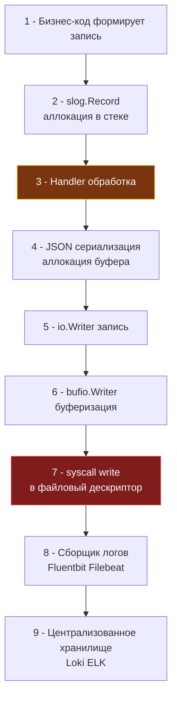

## Фундамент безопасного логирования: от отладки к аудит-контролю

В практике начинающих разработчиков логирование часто воспринимается как примитивный инструмент отладки: хаотичные вызовы `fmt.Printf`, разбросанные по коду для проверки «дошла ли горутина до этой строчки». Однако в промышленном бэкенде высокой доступности логирование — это ключевой компонент архитектуры наблюдаемости (Observability) и безопасности (AppSec). В производственной системе журнал выполняет две принципиально разные миссии: **детектирование инцидентов** в реальном времени (Security Information and Event Management, SIEM) и **юридический аудит** для расследования атак постфактум.

Классическая архитектурная ошибка заключается в смешивании технической диагностики сервиса, сбора числовых метрик и журнала безопасности в единую неструктурированную текстовую кашу. Это не только многократно раздувает затраты на сетевой трафик и хранилища (Elasticsearch, Grafana Loki), порождая бесполезный шум в системах оповещения, но и приводит к катастрофическим утечкам чувствительных данных пользователей (PII) и криптографических секретов через сторонние библиотеки.



---

### Механика записи: syscall, буферизация и влияние на планировщик

С точки зрения операционной системы Linux любая операция записи строки в файл или стандартный вывод (`stdout`) — это системный вызов ядра `write(fd, buf, count)`. Переход через границу привилегий процессора (`Ring 3 -> Ring 0`) требует смены стека, сохранения регистров и проверки прав в ядре. Если ядро сбрасывает данные в дисковый кэш страниц (Page Cache), вызов завершается быстро. Но если кэш переполнен или файловый дескриптор открыт с синхронными флагами `O_SYNC`/`O_DSYNC`, поток процессора принудительно блокируется ядром до физической фиксации блоков на контроллере SSD/NVMe.

В стандартной библиотеке Go тип `os.File` по умолчанию **не имеет буферизации**. Каждый наивный вызов `log.Printf` или `slog.Info` порождает синхронный `syscall.Write`. При нагрузке в 10 000 RPS это означает 10 000 системных вызовов в секунду! Планировщик Go видит, что системный поток `M` застрял в блокирующем вызове ядра, переводит горутину в состояние `blocked`, отцепляет логический процессор `P` и создает новый тред ОС (`M`). В результате начинается лавинообразное порождение потоков ядра, бесконечные переключения контекста, деградация кэшей CPU и резкий скачок хвостовой задержки P99.

**Архитектурное решение:** Обязательная пользовательская буферизация вывода через `bufio.NewWriter` или потокобезопасный кольцевой буфер `io.Writer`. Связка из буферизированного писателя и пула повторно используемых байтовых срезов `sync.Pool` снижает частоту системных вызовов в сотни раз, полностью устраняя задержки дискового ввода-вывода из горячего пути обработки сетевых запросов.

---

### log/slog под капотом: аллокации, GC и escape analysis

Стандартный пакет `log/slog`, появившийся в Go 1.21, спроектирован вокруг интерфейса `slog.Handler`. При формировании события вызовом `Info(msg, key, val...)` стандартный обработчик `JSONHandler` выполняет следующие шаги:
1. Создает легковесную структуру `slog.Record` непосредственно на стеке текущей горутины. Это предотвращает побег базовой записи в кучу.
2. Вызывает метод `handler.WithAttrs` или `handler.Handle`, выделяя байтовый буфер `[]byte` под JSON-сериализацию.
3. Задействует встроенный кодировщик JSON (или кастомный потоковый сериализатор). Если разработчик передает аргументы в виде свободных структур `map[string]any` или интерфейсов, данные проходят через механизм `reflect`, что **гарантирует Escape Analysis** и аллокацию памяти в куче (`Heap Allocation`).

**Влияние на сборщик мусора (`GC`):**  
При интенсивном потоке запросов миллионы мелких буферов JSON и боксированных интерфейсов непрерывно засоряют область памяти молодых объектов (молодое поколение, аналог `gen0`). Сборщик мусора Go вынужден запускать частые фазы очистки (`Minor GC`). Несмотря на субмиллисекундные паузы фазы Stop-The-World в рантайме Go, непрерывная фоновая работа марк-воркеров (`GC Pacer`) отбирает до 25% ресурсов CPU у рабочих горутин, разрушая SLA сервиса.

> [!info] Под капотом
> **Почему `slog.Any(key, value)` убивает производительность?**  
> Конструктор `slog.Any` принимает пустой интерфейс `interface{}` (`any`). На уровне машинного представления компилятор упаковывает аргумент в структуру `eface` (пара указателей: `_type*` на описание типа в RTTI и `unsafe.Pointer` на сами данные).  
> При формировании лога `JSONHandler` не может применить статическую оптимизацию и вынужден вызывать рефлексию `reflect` для инспекции полей. Рефлексия динамически аллоцирует память в куче, запрещает инлайнинг функций компилятором и увеличивает время обработки записи в 5–10 раз.  
> **Идиоматичная замена:** Всегда используйте строго типизированные конструкторы: `slog.Int64`, `slog.String`, `slog.Bool`, `slog.Duration`. Они передают примитивные значения напрямую в регистры процессора, упаковываются в `slog.Record` без кучевых аллокаций и сериализуются без участия `reflect`. Это снижает общее давление на `GC` на 40–60% в высоконагруженных API.

---

### Безопасность данных: санитизация и предотвращение инъекций

Журналы приложений — излюбленный источник информации для злоумышленников. Небрежное логирование неизбежно приводит к утечке персональных данных пользователей (PII), сессионных JWT-токенов, паролей и номеров платежных карт прямо в централизованные индексы.

Кроме того, классические текстовые логи уязвимы к атаке **Log Forging (инъекция переводов строк)**. Если сервис наивно записывает ввод пользователя через строковую конкатенацию, злоумышленник может передать в поле `email` строку с символом перевода строки:
```text
admin@corp.com\n2026/09/18 12:00:00 [CRITICAL] Authentication bypassed for user admin
```
Анализатор логов воспримет вторую строчку как подлинное системное событие безопасности критического уровня, что приведет к фальсификации аудита и ложному срабатыванию дежурной смены SOC.

Архитектурная безопасность журнала строится на трех правилах:
1. **Строго структурированный формат (JSON):** Стандартный JSON автоматически экранирует любые символы перевода строки (`\n` превращается в безопасную экранированную последовательность `\\n`), гарантируя, что одно событие всегда занимает ровно одну строку.
2. **Централизованный `slog.Handler` с редукцией (Redaction):** Обработчик перехватывает атрибуты до сериализации и заменяет чувствительные ключи (`password`, `token`, `authorization`, `email`, `secret`) на маску `***REDACTED***`.
3. **Строгий Allowlist полей:** В аудит попадают только явно разрешенные поля модели, все остальные нетипизированные атрибуты отбрасываются.

```go
package securelog

import (
	"context"
	"log/slog"
	"strings"
)

// RedactingHandler маскирует чувствительные поля до сериализации
type RedactingHandler struct {
	slog.Handler
	redactKeys map[string]bool
	mask       string
}

func NewRedactingHandler(h slog.Handler, keys []string) *RedactingHandler {
	redact := make(map[string]bool, len(keys))
	for _, k := range keys {
		redact[strings.ToLower(k)] = true
	}
	return &RedactingHandler{Handler: h, redactKeys: redact, mask: "***REDACTED***"}
}

func (h *RedactingHandler) Handle(ctx context.Context, r slog.Record) error {
	// Проходим по всем атрибутам записи. Это происходит в горячем пути.
	r.Attrs(func(a slog.Attr) bool {
		if h.redactKeys[strings.ToLower(a.Key)] {
			r.AddAttrs(slog.String(a.Key, h.mask))
		}
		return true // Продолжаем обход
	})
	return h.Handler.Handle(ctx, r)
}

// WithAttrs оборачивает вызов для корректной работы групп и вложенных хендлеров
func (h *RedactingHandler) WithAttrs(attrs []slog.Attr) slog.Handler {
	// Упрощённо: в продакшене нужно применять редукцию и к новым attrs
	return &RedactingHandler{
		Handler:    h.Handler.WithAttrs(attrs),
		redactKeys: h.redactKeys,
		mask:       h.mask,
	}
}
```

---

### Аудит и неизменяемость: криптографические цепи

Журнал аудита безопасности (Audit Trail) принципиально отличается от операционных логов ошибок: он служит юридическим доказательством действий пользователей и администраторов в системе. Аудит обязан отвечать на четыре вопроса: **КТО** совершил действие, **ЧТО** было сделано, **КОГДА** произошла операция и **КАКОВ** был результат.

Требования к аудиту:
- **Идемпотентность:** Повторная отправка записи не должна искажать аналитические отчеты.
- **Обязательные контекстные атрибуты:** `user_id`, `role`, IP-клиента (`ip`), заголовок `user_agent`.
- **Сквозная трассировка:** Наличие глобального `trace_id` для сквозного сопоставления с метриками и спанами OpenTelemetry.
- **Гарантия неизменяемости (Append-only & Tamper-evidence):** Каждая запись аудита должна содержать криптографический хеш предыдущей записи (хеш-цепь, Hash Chain), исключая возможность незаметного удаления или модификации строк скомпрометированным администратором.

В коде на Go журнал аудита выносится в изолированный поток исполнения, пишущий в защищенный файл с системными флагами `O_APPEND|O_WRONLY|O_CREATE` (например, `os.OpenFile(..., os.O_APPEND|os.O_WRONLY|os.O_CREATE, 0600)`) или транслирующий события в распределенный брокер очередей (Apache Kafka, NATS JetStream).

> [!warning] Ловушка / Gotcha
> **Блокировка горячего пути синхронным аудитом**  
> Если инженер вызывает синхронную запись аудита в базу данных (`db.Exec`) или выполняет внешний сетевой запрос (`http.Post`) прямо внутри HTTP-мидлвари, любая сетевая задержка внешней базы приведет к зависанию клиентского запроса, а сбой хранилища аудита вернет пользователю ошибку `500 Internal Server Error`.  
> Аудит безопасности никогда не должен становиться синхронным барьером для транзакционной бизнес-логики!  
> **Решение:** Проектируйте асинхронный конвейер на базе каналов: `make(chan AuditEvent, 1024)`. Фоновая горутина считывает события из канала и пакетами сбрасывает их в хранилище. Если буфер канала переполнен из-за аварии сети, событие сбрасывается с немедленным инкрементом аварийной метрики `audit_events_dropped_total`, но бизнес-операция клиента завершается успешно.

---

### Идиоматичная реализация высокопроизводительного логгера

Ниже приведена надежная промышленная реализация безопасного логгера, сочетающая маскирование секретов, JSON-форматирование и потокобезопасную буферизацию системных вызовов:

```go
package securelog

import (
	"context"
	"io"
	"log/slog"
	"os"
	"sync"
)

// SetupLogger конфигурирует безопасный и производительный логгер
func SetupLogger(output io.Writer, level slog.Leveler, redactKeys []string) *slog.Logger {
	// Буферизация для снижения syscall
	bufWriter := io.Writer(output)
	if _, ok := output.(*os.File); ok {
		bufWriter = &syncWriter{
			w:   output,
			buf: make([]byte, 0, 4096),
			mu:  &sync.Mutex{},
		}
	}

	// JSON формат, оптимальный для парсинга и защиты от инъекций
	jsonHandler := slog.NewJSONHandler(bufWriter, &slog.HandlerOptions{
		Level:     level,
		AddSource: true, // Для дебага, в продакшене часто false для снижения размера
	})

	// Оборачиваем в редуктор
	handler := NewRedactingHandler(jsonHandler, redactKeys)

	return slog.New(handler)
}

// syncWriter реализует потокобезопасный буферизированный writer
type syncWriter struct {
	w   io.Writer
	buf []byte
	mu  *sync.Mutex
}

func (sw *syncWriter) Write(p []byte) (int, error) {
	sw.mu.Lock()
	defer sw.mu.Unlock()

	if len(sw.buf)+len(p) > cap(sw.buf) {
		if _, err := sw.w.Write(sw.buf); err != nil {
			return 0, err
		}
		sw.buf = sw.buf[:0]
	}

	sw.buf = append(sw.buf, p...)
	if len(sw.buf) >= 4096 { // Сброс по достижении лимита
		n, err := sw.w.Write(sw.buf)
		sw.buf = sw.buf[:0]
		return n, err
	}
	return len(p), nil
}
```

---

### Ловушки и вопросы с собеседований

1. **Log Injection через управляющие символы в JSON:**  
   Широко распространено заблуждение, будто формат JSON на 100% защищает от инъекций. Однако если входящее поле содержит нулевой байт `\u0000` или специальные ANSI-последовательности терминала, парсеры и коллекторы логов (Fluentd, Filebeat, Logstash) могут аварийно завершить работу или обрезать строку. Всегда используйте стандартный `encoding/json` сериализатор, который корректно экранирует управляющие коды, и валидируйте корректность UTF-8 перед фиксацией записи.
2. **Эволюция логгеров в Go: `slog` против `zap` и `logrus`:**  
   Популярная в прошлом библиотека `logrus` признана архитектурно устаревшей: она непрерывно аллоцирует структуры `Entry` в куче и обильно использует рефлексию. Фреймворк `uber-go/zap` долгое время лидировал по скорости благодаря Zero-allocation API и пулам буферов. Однако в версиях Go 1.22+ стандартный `log/slog` практически догнал `zap` по пропускной способности за счет компиляторных оптимизаций `JSONHandler`. Для новых микросервисов `slog` является безоговорочным стандартом, устраняющим лишние внешние зависимости.
3. **Асинхронные буферы и потеря логов при панике:**  
   При возникновении непредвиденной паники (`panic`) или вызове `os.Exit(1)` буферизованные в памяти строки логов могут не успеть сброситься на диск. Обязательно регистрируйте `defer log.Flush()` в главной функции или используйте перехват сигналов ОС (`os/signal`) для плавного завершения (Graceful Shutdown) с принудительным сбросом буферов.
4. **Контекст vs Аргументы: передача метаданных:**  
   Попытка передачи `trace_id` через `context.Value` и оборачивание контекста `context.WithValue` на каждом этапе порождает избыточные аллокации в куче. В высоконагруженных API предпочтительно передавать идентификатор трассировки первым аргументом либо использовать `slog.With()` на уровне middleware, создавая один дочерний логгер на запрос.

---

> [!tip] Собеседование
> **Вопрос:** Как принципиально отличается архитектура логирования в Go от моделей PHP (Monolog) или Java (Logback/Log4j2), и почему Go требует явной пользовательской буферизации?  
> **Ответ:**  
> 1. **Модель процессов PHP:** В классическом PHP запрос исполняется в изолированном контексте (Shared-Nothing). Библиотека `Monolog` пишет синхронно, а буферизация происходит на уровне `php://output` или веб-сервера (PHP-FPM), сбрасывающего буферы операционной системы при завершении жизненного цикла скрипта.  
> 2. **Асинхронные аппендеры Java:** В корпоративной экосистеме Java логгеры `Logback` и `Log4j2` содержат тяжелые встроенные асинхронные подсистемы на базе кольцевых lock-free буферов (LMAX Disruptor), берущие управление фоновыми потоками на себя.  
> 3. **Философия ввода-вывода Go:** В языке Go тип `os.File` является тончайшей оберткой над системным вызовом `write(2)`. Рантайм принципиально не скрывает накладные расходы под «невидимой» магией фреймворка. Архитектура логирования строится на явном интерфейсе `io.Writer`. Инженер самостоятельно решает, где применить `bufio`, где выделить `sync.Pool`, а куда подключить сокет распределенного брокера. Это обеспечивает тотальный контроль над аллокациями и поведением планировщика, требуя при этом безупречной инженерной дисциплины.

---

## Итог

1. Логирование в Go опирается на конвейер интерфейса `io.Writer`. Отсутствие буферизации приводит к постоянным блокирующим вызовам ядра `syscall write`, перегрузке планировщика потоков и деградации P99 латентности.
2. Пакет `log/slog` обеспечивает высокую производительность за счет стековой аллокации `slog.Record`, однако неаккуратное использование `slog.Any` порождает динамическую рефлексию `reflect`, разрушая кэши CPU и создавая тяжелое давление на сборщик мусора `GC`.
3. Защита от утечки конфиденциальных данных достигается использованием структурированного формата JSON, валидацией UTF-8 и централизованным маскированием полей через кастомный `slog.Handler`.
4. Журнал аудита должен проектироваться как асинхронный, идемпотентный и защищенный от модификаций поток (хеш-цепи). Переполнение очередей аудита ни в коем случае не должно блокировать основной бизнес-процесс приложения.
5. Высокопроизводительный логгер в Go балансирует между глубиной собираемой информации, затратами процессорного времени и объемом передаваемого I/O-трафика, используя сквозной `trace_id` для быстрой корреляции с инцидентами.

[[4. Incident response]]