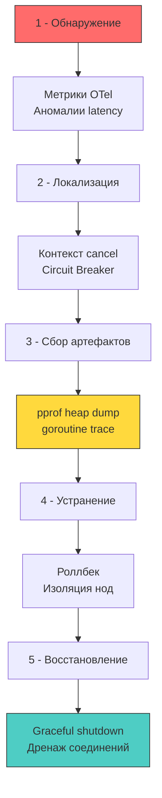

## Инцидент-менеджмент в высоконагруженном Go-бэкенде

Реагирование на инциденты безопасности и сбои (Incident Response, IR) в распределенных высоконагруженных системах — это не хаотичное «тушение пожара на проде» дрожащими руками. Это строгий инженерный алгоритм локализации, сохранения улик, изоляции скомпрометированных узлов и восстановления штатной работы. В критической ситуации каждая минута простоя сервиса или продолжающейся эксфильтрации данных оборачивается миллионными финансовыми потерями и разрушением репутации компании.

В экосистеме Go реагирование на инциденты обладает уникальной технической спецификой:
- **Отсутствие виртуальной машины:** Бинарник исполняется непосредственно на голом железе или в легковесном контейнере, взаимодействуя с ядром через системные вызовы.
- **Статическая линковка:** Нельзя подменить скомпрометированную `.so`-библиотеку на лету.
- **Встроенная интроспекция рантайма:** Планировщик `G-M-P`, аллокатор памяти и сборщик мусора предоставляют беспрецедентные возможности для оперативной криминалистики на живой системе (Live Forensics) через стандартный тулчейн `pprof`.
- **Высокая цена ошибки:** Неумелое использование профилировщика под аварийной нагрузкой может окончательно добить задыхающийся сервис, вызвав катастрофический каскадный отказ всей инфраструктуры.



---

### Под капотом рантайма: что происходит во время инцидента

Когда сервис подвергается DoS-атаке, эксплойту переполнения или сталкивается с критической утечкой ресурсов, внутренние механизмы рантайма Go начинают взаимодействовать с ядром Linux по жестким физическим законам:

1. **Утечка горутин (Goroutine Leak) и системные лимиты ядра:**  
   Сборщик мусора Go (`GC`) принципиально **не собирает зависшие горутины**. Горутина остается активным объектом в памяти до тех пор, пока ее корневая функция не завершится или не запаникует. Каждая горутина стартует с крошечным стеком в 2 КБ, но при необходимости способна динамически разрастаться вплоть до 1 ГБ.  
   Если из-за дефекта конкурентности или зависших сокетов в процессе скапливаются десятки тысяч брошенных горутин, процесс упирается в системные лимиты операционной системы `RLIMIT_NPROC` (максимальное число потоков) или лимит виртуальных областей памяти `vm.max_map_count`. При попытке породить новый поток ядро возвращает ошибку `EAGAIN` на системный вызов `clone`, что приводит к мгновенному параличу всего рантайма.
2. **Паника рантайма и раскрутка стека:**  
   Вызов `panic` прерывает нормальное исполнение текущей горутины, последовательно исполняет все отложенные вызовы `defer` в стековых кадрах и, если паника не была перехвачена функцией `recover()`, немедленно завершает работу **всего процесса целиком**. В этом фундаментальное архитектурное отличие Go от Java (где исключение изолировано внутри одного потока) или PHP (где падение запроса уничтожает лишь один воркер).
3. **Сборщик мусора под экстремальным давлением (GC Thrashing):**  
   При атаках типа десериализационной бомбы (JSON/XML Bomb) или лавинообразных утечках памяти аллокатор стремительно захватывает арены в `mheap`. Сборщик мусора переходит в панический режим, мобилизуя рабочие горутины на помощь сборке (GC Mark Assist). В Go 1.19+ параметр `debug.SetMemoryLimit` заставляет рантайм упреждающе отдавать свободные страницы ядру до срабатывания OOM Killer, открывая спасительное временное окно в 10–30 секунд для снятия дампов и упорядоченного завершения работы.

> [!info] Под капотом
> **Почему `pprof` в момент инцидента может добить процесс?**  
> Запрос к эндпоинту `/debug/pprof/heap` или принудительный вызов `runtime.GC()` перед фиксацией слепка кучи требует кратковременной глобальной остановки мира (Stop-The-World). Если рантайм уже находится в состоянии острой нехватки памяти или борется с взаимными блокировками мьютексов, фаза STW может растянуться на секунды!  
> В этот период сетевой поллер `netpoll` полностью прекращает обработку сокетов ядра, клиентские TCP-соединения рвутся по таймауту, а балансировщики нагрузки (Nginx, Envoy, K8s Ingress) исключают ноду из пула живых инстансов, перенаправляя лавину трафика на соседние серверы.  
> **Железное правило IR:** Снимайте диагностические дампы только **после изоляции ноды** и снятия с нее боевого входящего трафика! Для мгновенной диагностики на живом проде посылайте процессу сигнал `SIGQUIT` — ядро рантайма немедленно сбросит полные стеки всех горутин в `stderr` без инициализации паники.

---

## Live Forensics в Go: инструменты и механика

В мире Go разработчики избавлены от необходимости запускать тяжелые внешние утилиты уровня `jstack`/`jmap` или анализировать многогигабайтные дампы ядра операционной системы (Core Dumps). Все инструменты глубокой интроспекции уже встроены непосредственно в стандартный рантайм.

### 1 - `net/http/pprof` и структура рантайма

Эндпоинты стандартного профилировщика обращаются напрямую к ключевым структурам данных рантайма:
- `goroutine`: Итерирует глобальный массив `allg` (связный список всех дескрипторов горутин `g`), агрегируя их по текущим состояниям (`running`, `runnable`, `syscall`, `waiting`).
- `heap`: Сканирует арены аллокатора `mheap`, вычисляя объем реально используемой памяти и отсекая мусорные указатели.
- `mutex` и `block`: Извлекают статистику блокировок и конкурентных задержек из системных профилей `runtime.mutexprofile` и `runtime.blockprofile`.

Все операции выполняются в пространстве пользователя (User Space). В продакшене эндпоинты `pprof` ни в коем случае не должны смотреть в публичный интернет — их защищают авторизацией `BasicAuth` или изолируют на внутреннем порту sidecar-контейнера (`localhost`).

### 2 - Programmatic Dumps и `runtime/debug`

Для автоматического сбора улик в критический момент можно использовать программные вызовы `runtime/pprof.Lookup("goroutine").WriteTo(w, 2)` или низкоуровневый `debug.WriteHeapDump(fd)`. Однако помните: вызов `WriteHeapDump` блокирует процесс на все время линейной записи дампа на диск. Надежный паттерн — асинхронный сброс через конвейер `io.Pipe` с фоновой отправкой в объектное хранилище S3:

```go
package incident

import (
	"context"
	"log/slog"
	"net/http"
	"os"
	"runtime/pprof"
	"time"
)

// CaptureDumps безопасно снимает дампы горутин и хипа
func CaptureDumps(ctx context.Context, dir string) error {
	// 1 - Принудительный GC для очистки мусора перед снимком хипа
	// Это снижает размер дампа, но вызывает STW. Использовать только в IR.
	// runtime.GC() 

	for _, name := range []string{"goroutine", "heap", "mutex", "block"} {
		prof := pprof.Lookup(name)
		if prof == nil {
			continue
		}

		f, err := os.CreateTemp(dir, name+"-*.pprof")
		if err != nil {
			return err
		}

		// Запись с детализацией 2 (полные стек-трейсы)
		if err := prof.WriteTo(f, 2); err != nil {
			f.Close()
			return err
		}
		f.Close()
		slog.InfoContext(ctx, "profile captured", "name", name, "file", f.Name())
	}
	return nil
}
```

---

## Graceful Shutdown и изоляция повреждённых компонентов

В момент аварии инстинктивное желание «прибить зависший процесс» командой `kill -9` (`SIGKILL`) губительно: оборвутся активные банковские транзакции, повредятся локальные файлы базы данных, а буферы логов в оперативной памяти будут потеряны без следа.

Индустриальный стандарт управления жизненным циклом — плавное завершение работы (Graceful Shutdown) через `context.Context` и метод `http.Server.Shutdown()`:

```go
package server

import (
	"context"
	"log/slog"
	"net/http"
	"os"
	"os/signal"
	"syscall"
	"time"
)

func RunWithGracefulShutdown(srv *http.Server, timeout time.Duration) {
	ctx, stop := signal.NotifyContext(context.Background(), syscall.SIGINT, syscall.SIGTERM)
	defer stop()

	go func() {
		<-ctx.Done()
		slog.Info("shutdown signal received, draining connections")
		
		shutdownCtx, cancel := context.WithTimeout(context.Background(), timeout)
		defer cancel()

		if err := srv.Shutdown(shutdownCtx); err != nil {
			slog.Error("graceful shutdown failed", "err", err)
			// Fallback: принудительное завершение, если drain не успел
			os.Exit(1)
		}
	}()

	if err := srv.ListenAndServe(); err != http.ErrServerClosed {
		slog.Error("server crashed", "err", err)
		os.Exit(1)
	}
}
```

**Механическое сочувствие к сетевому стеку:**  
Метод `srv.Shutdown()` немедленно закрывает слушающий сокет (Listener) ядра, переставая принимать новые SYN-пакеты. Для всех активных клиентских соединений посылается сигнал завершения чтения `EOF` и выставляются заголовки `Connection: close`. Горутины обработчиков получают сигнал отмены через `r.Context().Done()`.  
Если бизнес-логика игнорирует отмену контекста, процесс зависнет на интервал `timeout` и будет жестко уничтожен оркестратором (Kubernetes) по сигналу `SIGKILL`. Это приводит к потере несохраненных логов в `bufio`, повреждению структур кэша и зависанию сокетов в состоянии `FIN_WAIT`.

---

## Архитектура Observability для IR

Инструменты профилирования бесполезны, если инцидент не был вовремя зафиксирован системами мониторинга. Надежный наблюдаемый контур сервиса на Go строится на четырех компонентах:

1. **Метрики времени выполнения (Prometheus):**  
   - `http_requests_total`, `http_request_duration_seconds` (скорость и задержка бизнес-операций).  
   - `go_goroutines` (количество живых горутин в рантайме).  
   - `go_memstats_heap_inuse_bytes` (объем реально занятой памяти кучи).  
   - `process_cpu_seconds_total` (утилизация процессорного времени ядром и пользователем).
2. **Распределенная трассировка (OpenTelemetry):**  
   Сквозной `trace_id` пробрасывается через древовидную иерархию `context.Context` и сетевые HTTP-заголовки `traceparent` (стандарт W3C). Это позволяет мгновенно локализовать узел, на котором произошел сбой в распределенной цепочке микросервисов.
3. **Структурированное логирование (`log/slog`):**  
   Формат JSON, обязательные поля `level`, `msg`, `trace_id`, `user_id`. Журнал аудита физически отделяется от технического лога.
4. **Автоматизированный алертинг (AlertManager / PagerDuty):**  
   Правила PromQL детектируют всплески ошибок и аномалии хвостовой задержки, инициируя автоматические сценарии локализации.

---

> [!warning] Ловушка / Gotcha
> **`recover()` без проброса контекста и метрик**  
> Распространенный антипаттерн в Go: разработчик оборачивает HTTP-хендлер конструкцией `defer recover()`, которая молча проглатывает панику, выводит короткую строку через `fmt.Println` и возвращает клиенту код `500 Internal Server Error`.  
> В результате критический сбой рантайма (разыменование `nil pointer dereference` или выход за границы среза `out of bounds`, вызванные вредоносным пейлоадом) остается невидимым для систем мониторинга до тех пор, пока база данных не окажется поврежденной. Без сохранения `stacktrace` и `trace_id` инцидент практически невозможно расследовать.  
> **Решение:** Обработчик паники обязан формировать структурированную запись `slog.ErrorContext` с полным дампом стека через `runtime.Stack`, инкрементировать аварийную метрику `app_panics_total{label="handler_name"}` и при обнаружении критических повреждений (OOM, нарушение инвариантов безопасности) инициировать контролируемый перезапуск пода через `os.Exit(1)`.

---

> [!tip] Собеседование
> **Вопрос:** Как в `pprof` безошибочно отличить реальную утечку памяти от штатного поведения сборщика мусора Go, и какие метрики рантайма анализируются в первую очередь при инциденте?  
> **Ответ:**  
> 1. **Диагностика профиля Heap:** Анализировать срез живых объектов (`inuse_space`), а не суммарно выделенных (`alloc_space`). Если после каждого полного цикла сборки мусора пилообразный график потребления памяти не возвращается к базовой линии, а ступенчато растет — в приложении присутствует реальная утечка памяти (Memory Leak).  
> 2. **Ключевые метрики рантайма:**  
>    - `go_memstats_heap_alloc_bytes`: объем активных объектов в куче.  
>    - `go_memstats_next_gc_bytes`: динамический порог запуска следующей фазы сборщика мусора.  
>    - `go_gc_duration_seconds`: длительность пауз сборщика мусора.  
>    - `go_goroutines`: общее число зарегистрированных горутин.  
> 3. **Корреляция с `GOMEMLIMIT`:** Лимит памяти рантайма `GOMEMLIMIT` обязан быть настроен на 15–20% ниже жесткого лимита памяти cgroups в контейнере. Если `heap_inuse` приближается к `GOMEMLIMIT`, рантайм начнет непрерывные циклы сборки, резко взвинчивая загрузку CPU.  
> 4. **План действий дежурного инженера:** Немедленно оценить показатель `go_goroutines`. Если количество горутин превышает 10 000 и непрерывно растет — налицо утечка горутин или взаимная блокировка в сетевом поллере `netpoll` или мьютексе `sync.Mutex`. Экстренно снять дамп горутин `goroutine pprof`, изолировать проблемную ноду от входящего сетевого трафика и выполнить откат (Rollback) на предыдущую стабильную версию.

---

## Сравнение подходов: Go, Java, PHP

| Аспект | Go | Java (Spring Boot) | PHP (Laravel/Symfony) |
|--------|----|-------------------|------------------------|
| **Forensics** | `pprof` over HTTP, `SIGQUIT`, `runtime` introspection | `jstack`, `jmap`, `hs_err_pid.log`, APM agents | Логи веб-сервера, `coredump`, `xdebug` (dev) |
| **Crash Impact** | Весь процесс падает при `panic` без `recover` | Исключение в треде, JVM продолжает работу | Запрос умирает, PHP-FPM worker перезапускается |
| **Memory IR** | Heap dump лёгкий (текст/protobuf), быстрый анализ | Дамп десятки ГБ, требует `MAT`/`JProfiler`, долгий анализ | Нет дампов состояния, только состояние после рестарта |
| **Shutdown** | `context` + `http.Server.Shutdown()`, явный drain | `ApplicationListener` на `ContextClosedEvent` | Синхронный цикл запроса, нет состояния между вызовами |
| **Runtime Control** | `GOMEMLIMIT`, `GOMAXPROCS`, `SetMaxThreads` | `JVM args` (`-Xmx`, `-XX:+UseG1GC`), MBeans | `php.ini` (`memory_limit`, `max_execution_time`) |

---

## Итог

1. Инцидент-менеджмент в высоконагруженных системах на Go опирается на четкое понимание внутренних механизмов рантайма: планировщика `G-M-P`, аллокатора `mheap` и поведения `GC` под стрессом.
2. Встроенные средства криминалистики (`net/http/pprof`, `runtime/debug`) обеспечивают глубокую интроспекцию процесса, однако их запуск на горячей ноде под нагрузкой способен вызвать тяжелый `Stop-The-World` и добить сервис. Снятие дампов допустимо только после изоляции узла от сетевого трафика.
3. Корректный `Graceful shutdown` через связку `context.WithTimeout` и `http.Server.Shutdown` обязателен для предотвращения потери данных в буферах, корректного завершения транзакций и штатного закрытия сетевых сокетов.
4. Наблюдаемость строится на гармоничной связке метрик Prometheus, трассировок OpenTelemetry и структурированных логов `slog`.
5. Конструкция `recover()` должна служить надежным барьером с обязательным логированием полного стека через `runtime.Stack`, пробросом `trace_id` и инкрементом аварийных счетчиков метрик.

[[5. Итоги раздела. Security mindset]]