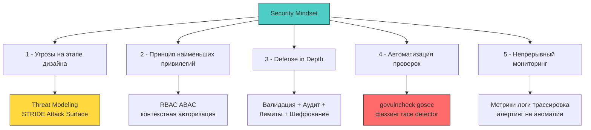
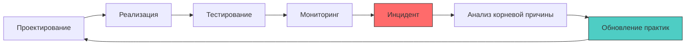

## Безопасность как образ мышления, а не чек-лист

Завершая наш фундаментальный курс по безопасности распределенных бэкенд-систем на языке Go, необходимо зафиксировать главный мировоззренческий сдвиг: **безопасность — это не отдельная фича, которую можно спешно «дописать перед релизом», и не формальный чек-лист для галочки на код-ревью. Это непрерывный образ инженерного мышления (Security Mindset), определяющий каждый выбор архитектора: от разметки структур в памяти до проектирования межсервисного взаимодействия.**

Для разработчика уровня Senior/Lead это означает бесповоротный переход от наивной реактивной модели («выкатим прод, а если взломают — напишем хотфикс») к проактивной инженерной культуре («спроектируем систему так, чтобы уязвимость не могла возникнуть математически и аппаратно»). В экосистеме Go, где строгий компилятор и статическая типизация отсекают колоссальные классы классических уязвимостей еще на этапе компиляции, этот переход естественен. Однако здесь кроется главная ментальная ловушка: **типобезопасность компилятора не равна безопасности приложения**.



---

### Ключевые принципы, которые должны стать рефлексами

1. **Данные извне враждебны по умолчанию (Zero Trust to Input):**  
   Любой байтовый поток, пересекающий периметр процесса (тело HTTP-запроса, gRPC-сообщение, полезная нагрузка из очереди Kafka, заголовок или путь к файлу), должен считаться вредоносным оружием до тех пор, пока не доказано обратное. В Go это реализуется через строгие DTO-структуры, включение `DisallowUnknownFields` в JSON-декодере, лимитирование объема через `http.MaxBytesReader` и контекстную санитизацию. Подробнее: [[1. Валидация входных данных]].
2. **Разделяй и властвуй (Аутентификация против Авторизации):**  
   Аутентификация (AuthN: «Кто вы такой?») и авторизация (AuthZ: «Имеете ли вы право выполнить эту операцию над этим ресурсом?») — принципиально разные доменные слои с независимыми векторами атак. Смешивание их в единой невнятной HTTP-мидлвари неизбежно порождает уязвимости обхода доступа (BOLA/IDOR). В Go идиоматичен шаблон: проверка идентичности (AuthN) в общем транспорте, а проверка прав (AuthZ) — глубоко на уровне предметной области с передачей контекста. Подробнее: [[4. Аутентификация vs авторизация]].
3. **Секреты не живут в кодовой базе и открытой памяти:**  
   Переменные окружения, файлы `.env` и жестко зашитые строковые токены — опаснейший технический долг, приводящий к компрометации при первом же аварийном дампе ядра или утечке логов. Индустриальный стандарт — динамические провайдеры (HashiCorp Vault, Cloud KMS), защита памяти от свопа и дампов (`mlock`, `MADV_DONTDUMP`) и гарантированное обнуление буферов через `clear()` с предотвращением оптимизаций компилятора вызовом `runtime.KeepAlive`. Подробнее: [[1. Секреты и управление секретами]].
4. **Криптография — это математический контракт, не терпящий самодеятельности:**  
   Никогда не изобретайте собственные шифры. Стандартная библиотека `crypto` языка Go предоставляет эталонные, аудированные реализации современных алгоритмов (AES-GCM, ChaCha20-Poly1305, Ed25519, HMAC-SHA256). Однако малейшая ошибка в композиции примитивов — повторное использование счетчика (Nonce Reuse), генерация слабой псевдослучайной энтропии или наивное сравнение токенов через оператор `==` вместо константного `crypto/subtle.ConstantTimeCompare` — полностью аннулирует криптографическую стойкость. Подробнее: [[3. Криптография под капотом]].
5. **Конкурентность — это не только параллелизм, но и поверхность атаки:**  
   Оптимистичные архитектуры без должной синхронизации порождают уязвимости состояния гонки типа TOCTOU (Time-of-Check to Time-of-Use), утечки данных между горутинами и DoS-атаки на планировщик. Флаг сборки `-race` (ThreadSanitizer), атомарные примитивы `atomic`, дедупликатор `singleflight` и строгая дисциплина работы с `context.Context` — обязательные инструменты защиты конкурентного кода. Подробнее: [[7. Гонки состояний как уязвимость]].

---

### Преимущества и ответственность экосистемы Go

Язык Go создавался инженерами Bell Labs с глубоким механическим сочувствием к оборудованию, приоритетом простоты, надежности и типобезопасности памяти. Это наделяет платформу уникальными преимуществами в сфере AppSec, но накладывает на архитектора строгую персональную ответственность:

| Особенность | Преимущество для безопасности | Ответственность разработчика |
|-------------|------------------------------|-----------------------------|
| **Garbage Collector** | Нет use-after-free, buffer overflow через ручное управление памятью | Чувствительные данные остаются в куче до сбора; требуется явное затирание |
| **Статическая типизация + компиляция** | Многие уязвимости отлавливаются на этапе сборки | Динамические конструкции (`interface{}`, `reflect`) обходят компилятор — требуют особого контроля |
| **Стандартная библиотека криптографии** | Аудированные реализации, меньше «велосипедов» | Неправильная композиция примитивов (nonce, key management) ломает защиту |
| **Простота синтаксиса** | Код легче аудировать и ревьювить | Отсутствие «магии» означает, что вся логика безопасности должна быть явной и документированной |
| **Встроенные инструменты профилирования** | Live forensics через `pprof`, `trace`, `race detector` | Инструменты требуют защиты (auth на `/debug`), а их использование в момент инцидента может усугубить ситуацию |

> [!info] Под капотом
> **Почему «безопасность по умолчанию» в Go — это опасный миф?**  
> Компилятор Go безупречно защищает от классических ошибок повреждения памяти (Memory Corruption) в безопасном подмножестве языка, но абсолютно беззащитен перед дефектами проектирования и логическими уязвимостями.  
> Вспомните стандартную библиотеку: глобальный `http.DefaultClient` не имеет таймаутов на сетевой I/O, старый генератор `math/rand` полностью детерминирован и предсказуем, запуск утилит через `os/exec` по умолчанию слепо наследует все переменные окружения процесса, а `json.Unmarshal` способен аллоцировать память без ограничений при разборе гигантских массивов.  
> Безопасность в Go — это не автоматический результат выбора языка, а плод осознанной инженерной дисциплины и знания поведения рантайма под капотом.

---

### Практический чек-лист для ежедневной работы

Сделайте эти двенадцать правил неотъемлемой частью процесса проектирования, код-ревью и выкатки сервисов:

```markdown
## Security Checklist (ежедневный)
- [ ] Все пользовательские данные валидируются на входе (allowlist, не blocklist)
- [ ] Ошибки не раскрывают внутреннюю структуру системы или чувствительные данные
- [ ] Чувствительные данные не логируются (или маскируются через кастомный `slog.Handler`)
- [ ] Контекст авторизации проверяется перед каждым доступом к ресурсу
- [ ] Нет хардкода секретов, токенов, паролей в коде или `go:embed`
- [ ] Используется `crypto/subtle.ConstantTimeCompare` для сравнения секретов
- [ ] Таймауты настроены для всех внешних вызовов (БД, HTTP, Redis)
- [ ] Rate limiting реализован для публичных эндпоинтов
- [ ] Зависимости проверены на уязвимости (`govulncheck`, `osv-scanner`)
- [ ] Debug-эндпоинты (`/debug/pprof`) отключены или защищены в продакшене
- [ ] Контейнер запускается с `--cap-drop ALL`, `--read-only`, от непривилегированного пользователя
- [ ] Логи структурированы (JSON), содержат `trace_id` и защищены от инъекций
```

---

### Непрерывный цикл улучшения: от инцидента к архитектуре

Безопасность в распределенных системах — это не разовый спринт, а непрерывная петля обратной связи (Continuous Feedback Loop):



1. **Проектирование (Threat Modeling):**  
   Моделируйте угрозы по методологии STRIDE еще до написания первой строчки кода. Задайте вопрос: «Что сломается на уровне ядра или сети, если входящий поток данных будет полностью сформирован атакующим?».
2. **Реализация (Secure Coding):**  
   Пишите код с жестким соблюдением принципа наименьших привилегий. Применяйте идиоматичные конструкции Go для безопасного управления памятью и конкурентными примитивами.
3. **Тестирование (Quality Gates):**  
   Внедряйте `govulncheck`, `gosec`, coverage-guided фаззинг и ThreadSanitizer в CI/CD конвейер. Пишите негативные тесты с вредоносными нагрузками (Adversarial Payloads).
4. **Мониторинг (Observability):**  
   Настраивайте алерты на аномалии низкоуровневых метрик рантайма (`go_goroutines`, `http_request_duration_seconds`, `auth_failures`). Обогащайте структурированные логи `trace_id`.
5. **Инцидент (Incident Response):**  
   Действуйте по готовому регламенту: изолируйте узлы, снимайте дампы интроспекции рантайма и выполняйте откат (Rollback). Проводите разбор корневых причин (Post-Mortem) без поиска персонально виновных (Blameless Culture).
6. **Обновление практик (Continuous Hardening):**  
   Превращайте каждый инцидент в новые автоматизированные правила линтеров, обновляйте чек-листы и усиливайте архитектурные барьеры.

---

> [!tip] Собеседование
> **Вопрос:** Как аргументированно объяснить техническому руководству или бизнесу, что «добавить безопасность потом перед релизом» технически невозможно без полной переработки архитектуры?  
> **Ответ:**  
> 1. **Аналогия со строительной инженерией:** Невозможно возвести многоэтажный дом, а затем «быстро добавить сейсмоустойчивость» — она закладывается в глубину фундамента и марку бетона. Пристроить балкон после сдачи объекта можно, но изменить фундамент без сноса здания физически невозможно.  
> 2. **Масштаб архитектурного рефакторинга:** Покажите реальные технические последствия: если HTTP-обработчики изначально спроектированы без сквозной передачи `context.Context` для трассировки и авторизации, добавление контроля прав доступа постфактум потребует изменения сигнатур десятков функций, переписывания сотен модульных тестов и взлома обратной совместимости API.  
> 3. **Экономический закон стоимости дефекта (Boehm’s Curve):** Устранение архитектурной ошибки на этапе проектирования стоит условный $1. На этапе разработки — $10. На этапе тестирования — $100. Устранение же уязвимости в продакшене под реальной эксплуатацией обходится в 1000–10 000 раз дороже с учетом компенсаций клиентам, простоев бизнеса и штрафов регуляторов.  
> 4. **Прагматичный компромисс:** Предложите бизнесу поэтапное внедрение эшелонированной защиты (Defense in Depth), начав с высокоприоритетных векторов по модели OWASP Top 10 и автоматизации базовых проверок в CI/CD без замедления поставки фич.

---

### Финал: безопасность как профессиональная ответственность

В заключение — фундаментальная мысль, которая должна стать внутренним компасом каждого инженера:

> **Безопасность — это не то, что вы механически добавляете в код. Это то, как вы непрерывно думаете о коде.**

Каждый раз, когда вы создаете новую функцию, запускаете горутину или объявляете сетевой эндпоинт, задавайте себе простые, но беспощадные вопросы:
- Что произойдет с тактами процессора и кучей рантайма, если этот параметр будет контролировать изощренный противник?
- Какие данные попадут в кэш, файлы журналов, трассировку — и кто сможет их прочитать?
- Как система поведет себя при отказе внешнего сервиса, исчерпании файловых дескрипторов или сетевом шторме?
- Можно ли протестировать этот код на устойчивость к намеренному злоупотреблению?

В экосистеме Go у вас есть все необходимые инструменты промышленного уровня: строгая статическая типизация, надежная криптография, встроенный фаззинг, детектор гонок и глубокая интроспекция рантайма. Но любые инструменты бессильны без инженерной культуры и дисциплины их применения.

Безопасность — это бесконечный путь непрерывного совершенствования, а не конечная станция. Продолжайте ставить под сомнение «очевидные» решения, изучайте поведение машины на стыке компилятора и ядра, и пишите системы, которые не подведут ни при каких обстоятельствах.

---

[[1. Secrets management]]