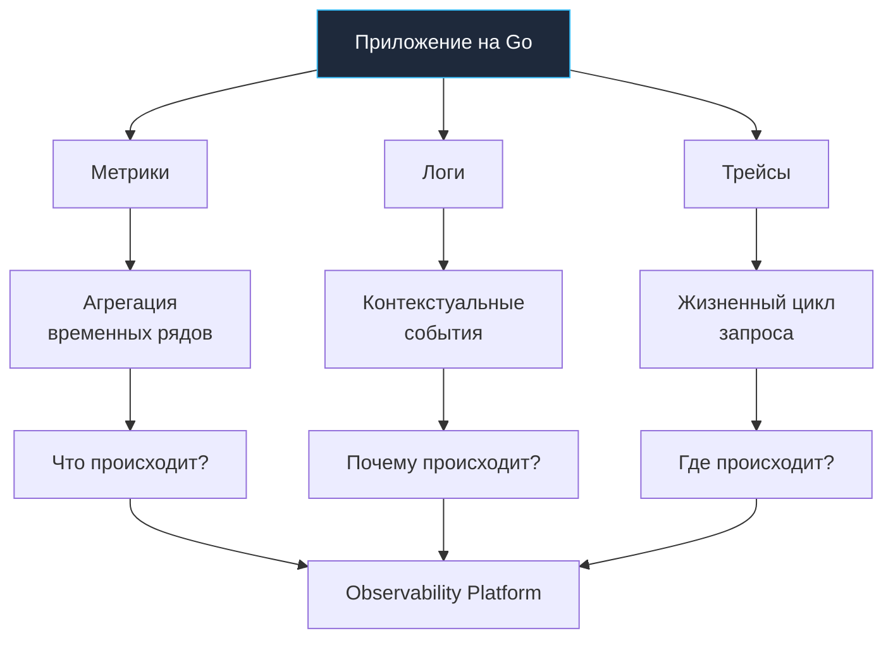

## От мониторинга к наблюдаемости

В эпоху классических монолитных приложений на PHP, Java или C# парадигма поиска неисправностей была предельно прямолинейной: если сервер возвращал ошибку `500 Internal Server Error`, дежурный инженер подключался по SSH к единственной виртуальной машине и открывал текстовый лог-файл через `tail -f`. Ошибка находилась в нескольких строчках выше, а стек вызовов был непрерывен и детерминирован.

Однако в современной реальности распределенных микросервисов, контейнеризации Kubernetes и параллельного рантайма Go старый подход терпит сокрушительное фиаско. Когда единый пользовательский клик порождает каскад из сотен RPC-вызовов через десятки независимых контейнеров, эфемерных подов и очередей сообщений, линейного журнала больше не существует. Более того, в распределенной системе отказы редко бывают бинарными (работает / упало). Они проявляются как деградация хвостовых задержек (Tail Latency), частичные таймауты, каскадные блокировки мьютексов и плавающие сетевые коллизии.

Вы физически не можете предсказать все возможные режимы отказа и заранее развесить алерты на каждую внештатную ситуацию. Здесь на смену пассивному наблюдению приходит фундаментальная инженерная дисциплина — **Observability (Наблюдаемость)**.

---

### Определение: Monitoring vs Observability

Хотя в повседневной речи термины «мониторинг» и «наблюдаемость» часто используют как синонимы, с точки зрения системной архитектуры между ними пролегает концептуальная пропасть.

**Мониторинг** — это сбор, агрегация и отображение заранее определенных показателей. Это процесс получения ответов на вопросы, которые вы сформулировали *до* того, как система была запущена в эксплуатацию (известные неизвестные, Known Unknowns).
- *Типовые вопросы:* «Какова утилизация CPU на узле?», «Каков процент HTTP 5xx ответов?», «Сколько запросов в секунду обрабатывает сервис (RPS)?».
- *Инструменты:* Zabbix, Prometheus alerts, статичные дашборды Grafana.
- *Архитектурный предел:* Мониторинг превосходно сигнализирует о факте поломки («Здоровье системы ухудшилось»), но абсолютно беспомощен при выяснении глубинных *причин* аномального поведения в распределенном графе.

**Наблюдаемость (Observability)** — это внутреннее свойство системы, определяющее, насколько полно и точно вы можете восстановить текущее внутреннее состояние сервиса, опираясь исключительно на анализ его внешних артефактов телеметрии: метрик, структурированных событий и распределенных трейсов.
- *Ключевая цель:* Получение ответов на вопросы, о существовании которых вы даже не подозревали до возникновения аномалии (неизвестные неизвестные, Unknown Unknowns).
- *Пример исследования:* «Почему именно у пользователей из региона X с мобильным клиентом версии 3.2 при оплате через шлюз Y транзакции завершаются с задержкой в 4 секунды, хотя все микросервисы рапортуют HTTP 200 OK?».

> [!tip] Собеседование
> **Вопрос:** В чем фундаментальная разница между классическим мониторингом и наблюдаемостью?  
> **Ответ:** Мониторинг отвечает на вопрос «**ЧТО** сломалось?» (Known Unknowns) на основе заранее заданных порогов и правил. Наблюдаемость отвечает на вопрос «**ПОЧЕМУ** и **ГДЕ** это произошло?» (Unknown Unknowns). Наблюдаемость позволяет интерактивно исследовать поведение системы в момент инцидента методом последовательного выдвижения и проверки гипотез, не требуя повторного деплоя нового кода с дополнительными отладочными логами.

---

### Происхождение термина

Слово «наблюдаемость» пришло в компьютерные науки из математической теории управления (Control Theory), сформулированной Рудольфом Калманом в 1960 году:
> *Динамическая система называется наблюдаемой, если ее текущее внутреннее состояние в любой момент времени может быть точно вычислено на основе знания ее внешних выходов на конечном интервале времени.*

Применительно к распределенным бэкендам на Go это означает: телеметрия сервиса (метрики, логи, спаны) обязана быть спроектирована так, чтобы любая внутренняя аномалия — будь то утечка горутин, деградация аллокатора памяти или блокировка потока ввода-вывода — немедленно отражалась во внешних данных без необходимости гадать на кофейной гуще.

---

## Mechanical Sympathy: Цена слепоты

С точки зрения низкоуровневой работы операционной системы Linux и микроархитектуры процессора, сервис без сквозной наблюдаемости представляет собой абсолютно непроницаемый «черный ящик».

1. **Процессор, Syscalls и планировщик Go:**  
   Если высоконагруженный сервис резко снижает пропускную способность, поверхностная метрика «Requests Per Second» зафиксирует лишь падение трафика. Но какова физическая первопричина?  
   Возможно, в коде возникла жесткая конкуренция за мьютекс (`sync.Mutex contention`), из-за чего системные треды ядра (`M`) ушли в системный вызов `futex`, а логические процессоры (`P`) простаивают, пока горутины (`G`) копятся в очередях планировщика. Без специализированных профилей горутин и планировщика вы будете оптимизировать алгоритмы, пока проблема кроется в блокировках ядра.
2. **Память и сборщик мусора (`GC`):**  
   Go — компилируемый язык с автоматическим управлением памятью через параллельный трехцветный марк-свип сборщик мусора. Резкий рост времени отклика сервиса (P99/P99.9 latency) может быть вызван не дефектами сетевого стека, а тем, что фоновый процесс `GC Pacer` принудительно привлекает рабочие горутины к разметке памяти (Mark Assist) или увеличивает длительность пауз Stop-The-World (STW). Без детальных метрик кучи (`mheap`, аллокации в секунду) и трейсинга сборщика мусора любая попытка оптимизации превращается в стрельбу вслепую.

Наблюдаемость в Go — это искусство связать абстрактную высокоуровневую бизнес-транзакцию (например, клик «Купить») с низкоуровневыми физическими процессами на кристалле: выделением страниц памяти ядра, конкуренцией за кэш-линии L1/L2/L3 и системными вызовами `epoll`.

---

### Три столпа Observability

Полноценная платформа телеметрии опирается на три взаимодополняющих источника данных (Three Pillars of Observability):

1. **Метрики (Metrics):** Числовые значения, агрегированные по временным интервалам (Time Series). Они предельно компактны, дешевы в передаче и хранении, что делает их идеальным инструментом для построения графиков и триггеров алертинга в реальном времени. Метрики отвечают на вопрос: **«Что происходит прямо сейчас?»** (например: рост потребления RAM, всплеск 5xx ошибок).
2. **Логи (Logs):** Дискретные структурированные текстовые записи о свершившихся событиях, снабженные временными метками. Они предоставляют богатый семантический контекст произошедшего. Логи отвечают на вопрос: **«Почему произошло конкретное событие?»** (например: подробный stack trace паники, текст ошибки отказа платежного шлюза). В промышленном Go стандартом является структурированный JSON-формат.
3. **Трейсы (Traces):** Записи сквозного пути единичного запроса сквозь распределенный граф микросервисов, баз данных и очередей. Трейсы отвечают на вопрос: **«Где возникло узкое место (Bottleneck)?»** (в каком конкретно звене цепочки из 15 сервисов запрос потерял 800 миллисекунд).

---

## Go и Observability: Особенности языка

Архитектурные свойства рантайма Go создают как уникальные преимущества, так и специфические инженерные вызовы:

1. **Встроенные инструменты `expvar` и `pprof`:**  
   В отличие от большинства других языков, Go поставляется с глубокой интроспекцией «из коробки». Пакет `net/http/pprof` позволяет снимать слепки кучи, профили CPU, блокировок мьютексов и трассировки планировщика прямо на работающем production-сервере через стандартный HTTP-эндпоинт. Пакет `expvar` предоставляет легковесный механизм публикации счетчиков в формате JSON.
2. **Анонимность горутин и контекст выполнения:**  
   В операционной системе каждый поток имеет уникальный числовой идентификатор TID. В рантайме Go горутины намеренно лишены публичного идентификатора (Goroutine ID скрыт в приватных структурах `g` ради защиты от опасных паттернов Thread-Local Storage). Это создает сложность для сквозной трассировки. Решением является передача контекста через `context.Context`, который протаскивает идентификатор трассировки (Trace ID / Span ID) через все уровни абстракции и стек вызовов.
3. **Стандартизация структурированного логирования (`log/slog`):**  
   Начиная с Go 1.21, стандартная библиотека включает высокопроизводительный пакет `log/slog`. Это устранило многолетнюю фрагментацию экосистемы между сторонними логгерами (`zap`, `logrus`, `zerolog`) и заложило единый фундамент для генерации структурированных событий для Loki, Elasticsearch и ClickHouse.

> [!warning] Ловушка / Gotcha
> **Слепое логирование (Uncontrolled Logging)**  
> Разработчики, перешедшие из динамических языков или Java/PHP, часто приносят пагубную привычку оборачивать каждую операцию в шаблон «логировать абсолютно всё» (`try...catch...log` или повсеместный `log.Printf`). В высоконагруженном Go-сервисе с тысячами RPS это приводит к мгновенной деградации:
> - Стандартная запись в `stdout` или файл — это системный вызов `write(2)` и блокировка мьютекса ввода-вывода.
> - Формирование нетипизированных JSON-структур через рефлексию (`reflect`) провоцирует массовый побег данных в кучу (Heap Escape), нагружая `GC`.
> - Потоки логов забивают дисковую подсистему и перегружают сеть сборочных агентов.
> 
> **Решение:** Применяйте жесткие уровни логирования (Debug/Info/Warn/Error), используйте семплирование (логирование только процента успешных операций при сохранении 100% ошибок) и асинхронную буферизацию вывода.

---

## Практика System Design

При проектировании надежного бэкенда на Go необходимо руководствоваться принципом **Instrumentation First**: код должен быть инструментирован метриками, логами и спанами непосредственно в процессе написания бизнес-логики, а не пришиваться впопыхах после первого ночного падения продакшена.

Канонический архитектурный пайплайн сбора телеметрии строится по пятислойной схеме:
1. **Инструментирование (Instrumentation):** Исходный код приложения внедряет вызовы OpenTelemetry SDK для генерации спанов, метрик и структурированных логов.
2. **Сбор (Collection):** Локальный легковесный агент (sidecar-контейнер или DaemonSet в Kubernetes) забирает данные по push- или pull-модели, разгружая приложение.
3. **Обработка (Processing):** OpenTelemetry Collector выполняет фильтрацию, дедупликацию, маскирование чувствительных данных (PII) и адаптивное семплирование.
4. **Хранение (Storage):** Данные распределяются по специализированным базам данных временных рядов и событий: Prometheus / VictoriaMetrics — для метрик; Loki / ClickHouse / Elasticsearch — для структурированных логов; Jaeger / Tempo — для распределенных трейсов.
5. **Визуализация и алертинг (Visualization):** Единый интерфейс Grafana связывает метрики, логи и трейсы воедино через сквозные ссылки по `trace_id`.

---

## Итог

1. Observability — это фундаментальное свойство распределенной системы, позволяющее понимать ее внутренние состояния на основе анализа внешних телеметрических выходов.
2. Мониторинг фокусируется на проверке заранее известных индикаторов здоровья (Known Unknowns), тогда как наблюдаемость позволяет интерактивно исследовать непредвиденные аномалии (Unknown Unknowns) без перекомпиляции кода.
3. Три столпа телеметрии (Метрики, Логи, Трейсы) решают разные задачи: метрики отвечают на вопрос «Что происходит?», логи — «Почему это происходит?», а трейсы — «Где находится узкое место?».
4. Язык Go предоставляет богатый арсенал встроенных средств интроспекции (`expvar`, `pprof`, `log/slog`), однако требует явной дисциплины проброса метаданных через `context.Context` из-за отсутствия публичных Goroutine ID.
5. Инструментирование телеметрией должно закладываться в архитектуру сервиса на начальном этапе проектирования (Instrumentation First), защищая систему от слепого логирования и неконтролируемых накладных расходов.

[[2. Метрики vs логи vs трейсы]]