## Выбор инструмента для диагностики

В архитектурной практике начинающие инженеры нередко совершают классическую ошибку: пытаются применить один знакомый инструмент для решения диаметрально противоположных задач. Например, включают подробнейшее логирование каждого шага программы, а затем пытаются в реальном времени парсить терабайты текстовых файлов с помощью регулярных выражений, чтобы построить графики сетевого трафика. Результат такого подхода предсказуем: деградация пропускной способности сервиса из-за дискового ввода-вывода, перегрузка сборщика мусора и колоссальные счета за хранение логов в облаке.

Наблюдаемость (Observability) держится на трех фундаментальных китах: **Метриках**, **Логах** и **Трейсах** (The Three Pillars of Observability). Каждый из этих инструментов обладает уникальной физической природой, разной стоимостью с точки зрения аппаратных ресурсов машины (CPU, RAM, I/O) и строго очерченной областью применимости.

Сравним их через призму System Design и Mechanical Sympathy — с точки зрения процессора, операционной системы и сети.

---

## 1. Метрики (Metrics): Агрегированные числа

Метрика — это числовое значение, отражающее состояние системы или суммарное количество событий, агрегированных за определенный интервал времени. Это предельная форма сжатия информации.

*   **Пример:** «За последние 60 секунд микросервис заказов обработал 500 запросов со значением задержки на 99-м перцентиле (p99 latency) в 200 мс».
*   **Суть:** Временные ряды (Time Series). Непрерывный поток числовых замеров, привязанных к меткам времени (Timestamp). Агрегация значений происходит локально прямо в памяти процесса вашего приложения или во внешнем агенте сбора (Prometheus Pushgateway, Node Exporter).

```mermaid
flowchart LR
    classDef process  fill:#1e293b,stroke:#38bdf8,stroke-width:1px,color:#f8fafc
    classDef success  fill:#064e3b,stroke:#34d399,stroke-width:1px,color:#f8fafc
    classDef error    fill:#7f1d1d,stroke:#f87171,stroke-width:1px,color:#f8fafc
    classDef warning  fill:#78350f,stroke:#fbbf24,stroke-width:1px,color:#f8fafc
    classDef entry    fill:#1e3a5f,stroke:#38bdf8,stroke-width:2px,color:#f8fafc
    classDef aux      fill:#334155,stroke:#64748b,stroke-width:1px,color:#f8fafc
    classDef system   fill:#312e81,stroke:#a78bfa,stroke-width:1px,color:#f8fafc
    classDef data     fill:#132d29,stroke:#2dd4bf,stroke-width:1px,color:#f8fafc
    classDef network  fill:#881337,stroke:#fb7185,stroke-width:1px,color:#f8fafc
    classDef accent   fill:#1e1b4b,stroke:#818cf8,stroke-width:1px,color:#f8fafc
    subgraph A["Метрики"]
        direction TB
        A1["Формат: Числа"]:::process
        A2["Хранение: Дешево"]:::process
        A3["Кардиальность: Низкая"]:::process
    end

    subgraph B["Логи"]
        direction TB
        B1["Формат: Текст/JSON"]:::process
        B2["Хранение: Дорого"]:::process
        B3["Кардиальность: Высокая"]:::process
    end

    subgraph C["Трейсы"]
        direction TB
        C1["Формат: Дерево вызовов"]:::process
        C2["Хранение: Средне/Дорого"]:::process
        C3["Гранулярность: Запрос"]:::entry
    end

    D["Инцидент"] -->|"Что сломалось?"| A
    A -->|"Почему ошибка?"| B
    A -->|"Где задержка?"| C
```

---

### Mechanical Sympathy: Почему метрики дешевы?

Метрики являются самым легковесным и экономичным видом телеметрии:
1.  **Оперативная память и процессор:** Простейший счетчик (Counter) в Go — это неделимая атомарная операция над 64-битным целым числом (`atomic.AddUint64`). На уровне ассемблера x86-64 это одна инструкция процессора `LOCK XADD`, выполняемая за несколько наносекунд без обращения к операционной системе.
2.  **Гистограммы и горячий путь (Hot Path):** Гистограммы (Histogram) в клиенте Prometheus оперируют числами с плавающей точкой, но все бакеты интервалов предвыделены в памяти заранее. Инкремент бакета не порождает аллокаций в куче, не вызывает Escape Analysis и полностью прозрачен для сборщика мусора (`GC`).
3.  **Сетевой трафик и сжатие на диске:** Вместо передачи по сети миллиона отдельных событий приложение отдает скрейперу компактный текстовый или Protocol Buffers срез (например, `http_requests_total{status="200"} 1000000`). Базы данных временных рядов (Prometheus TSDB, VictoriaMetrics) используют алгоритм сжатия Gorilla (дельта-дельта кодирование меток времени и XOR-сжатие значений с плавающей точкой), сжимая одну запись всего до 1–2 байт на диске.

> [!warning] Ловушка / Gotcha
> **High Cardinality (Взрыв кардинальности меток)**  
> Метрики остаются дешевыми ровно до тех пор, пока количество уникальных комбинаций меток (labels) невелико. Если разработчик добавит в метрику `http_requests_total` лейбл `user_id` или `email`, то при базе в 1 000 000 пользователей в базе данных Prometheus мгновенно образуется миллион независимых временных рядов (Time Series).  
> - **Последствия:** Каждый временной ряд требует собственного кольцевого буфера в RAM. Память TSDB мгновенно исчерпывается, вызывая OOM Killer (Out of Memory).  
> - **Инженерное правило:** Метрики категорически не предназначены для хранения высококардинальных идентификаторов (user_id, IP-адреса, токены). Используйте исключительно компактные дискретные множества с фиксированным числом значений (status code, endpoint name, region, method).

---

## 2. Логи (Logs): Контекст и события

Лог — это дискретная текстовая или бинарная запись о свершившемся факте с точной временной меткой. Это первичные, «сырые» данные без предварительного агрегирования.

*   **Пример:** `2023-10-27 10:00:01 ERROR user_id=123 failed to connect to db: connection refused`.
*   **Суть:** Непрерывный поток событий (Event Stream).

---

### Mechanical Sympathy: Почему логи дороги?

В отличие от метрик, обработка логов многократно дороже по ресурсам:
1.  **Аллокации и нагрузка на GC:** Формирование записи лога в рантайме Go (особенно при использовании архаичного `fmt.Printf` или тяжелого `json.Marshal` через рефлексию) создает временные строковые объекты и слайсы в куче. При 20 000 RPS логгер производит сотни мегабайт мусора в секунду, вызывая частые паузы Stop-The-World.
2.  **Блокировки ввода-вывода (I/O Syscalls):** Запись каждого сообщения на диск или в Unix-сокет — это системный вызов `write(2)`. Без буферизации системный тред Go блокируется ядром, вынуждая планировщик порождать новые системные потоки `M`.
3.  **Объем дискового хранилища:** Объем логов растет строго линейно вместе с входящим трафиком (O(N)). Если метрики занимают фиксированное дисковое пространство независимо от того, пришел 1 запрос или 10 000, то логи при всплеске трафика способны за минуты переполнить файловую систему.

В современном Go стандартный пакет `log/slog` (начиная с версии Go 1.21) минимизирует аллокации за счет стековой упаковки `slog.Record` и типизированных атрибутов, но системная цена дискового и сетевого вывода все равно остается доминирующей.

---

## 3. Трейсы (Traces): Путь запроса

Трейс фиксирует сквозную траекторию выполнения одного конкретного бизнес-запроса через все микросервисы, базы данных, внешние API и очереди сообщений. Трейс представляет собой ориентированное ациклическое дерево интервалов времени — **Спанов (Spans)**.

*   **Пример:** Пользовательский запрос вошел в API Gateway -> перешел в сервис аутентификации -> обратился в PostgreSQL -> вызвал платежный шлюз -> вернул ответ. Общая длительность составила 150 мс, из которых 120 мс ушло на блокировку в базе данных.
*   **Суть:** Граф вызовов (Call Graph) в распределенной среде.

---

### Mechanical Sympathy: Стоимость трейсинга

Трейсинг — самый мощный, но одновременно самый ресурсоемкий инструмент телеметрии:
1.  **Распространение контекста (Context Propagation):** Чтобы связать этапы обработки в единый трейс, идентификатор трассировки (Trace ID) и идентификатор родительского спана (Parent Span ID) должны непрерывно пробрасываться через границы функций, горутины, HTTP-заголовки (стандарт W3C Trace Context) и метаданные gRPC. В Go это требует дисциплинированной передачи `context.Context` первым аргументом во всех функциях цепочки.
2.  **Сериализация и буферизация:** Каждый спан — это структура в памяти с метками времени, атрибутами, событиями и статусом. Перед отправкой в распределенное хранилище (Jaeger, Grafana Tempo) спаны сериализуются в Protocol Buffers и отправляются пачками по gRPC.
3.  **Семплирование (Sampling):** Из-за высокой стоимости трассировки сервисы редко сохраняют 100% трейсов. Индустриальным стандартом является **Head-based sampling** (решение о трассировке принимается на входе в систему случайно, например для 1% или 5% запросов) или **Tail-based sampling** (решение принимается на уровне коллектора: сохраняются 100% ошибочных и аномально медленных запросов, а рядовые успешные операции отбрасываются).

---

> [!tip] Собеседование
> **Вопрос:** Как на архитектурном уровне связать Метрики, Логи и Трейсы воедино?  
> **Ответ:** Единым связующим звеном выступает **Trace ID**.  
> 1. На входе в распределенную систему API Gateway генерирует уникальный 128-битный Trace ID.  
> 2. Trace ID помещается в `context.Context` и пробрасывается через всю цепочку сетевых вызовов.  
> 3. Структурированный логгер (`slog`) извлекает Trace ID из контекста и автоматически добавляет его в каждую запись лога.  
> 4. В метриках используется механизм **Exemplars** (поддерживается в Prometheus и OpenTelemetry). Экземпляр связывает конкретное измерение на графике задержки (например, скачок гистограммы до 2.5 секунд) с точным идентификатором Trace ID.  
> 
> В интерфейсе Grafana это дает бесшовный сценарий: инженер видит всплеск на графике метрик -> в 1 клик по Exemplar переходит в детальный распределенный Трейс -> из трейса переходит к точным Логам проблемного шага.

---

## Сравнительная таблица

### Когда что использовать?

| Сценарий | Инструмент | Почему? |
| :--- | :--- | :--- |
| **Настройка алерта** «Сервис упал» | **Метрики** | Дешевле всего проверить статус `up` или рост ошибок `rate(500)`. |
| **Поиск причины ошибки** для конкретного пользователя | **Логи** | Метрика скажет «есть ошибки», но только в логе будет `stack trace` и `user_id`. |
| **Оптимизация производительности** | **Трейсы** | Метрика покажет высокую latency, но только трейс покажет, что 90% времени ушло на N+1 запрос в БД. |
| **Анализ трендов** за месяц | **Метрики** | Логи за месяц хранить дорого и сложно агрегировать. |

---

## Итог

1. Метрики, логи и трейсы не заменяют, а органично дополняют друг друга, решая разные задачи на разных масштабах времени и детализации.
2. **Метрики** обеспечивают непрерывное обнаружение аномалий (Anomaly Detection) при минимальных накладных расходах на память процессора и дисковое хранилище.
3. **Трейсы** позволяют локализовать географию сбоя и выявить узкие места (Root Cause Analysis) в распределенном графе микросервисов.
4. **Логи** предоставляют детальный семантический контекст для отладки конкретных исключительных ситуаций (Debugging).
5. Проброс Trace ID через `context.Context` и поддержка Prometheus Exemplars объединяют все три столпа телеметрии в единую сквозную аналитическую систему.

[[3. Три столпа observability]]