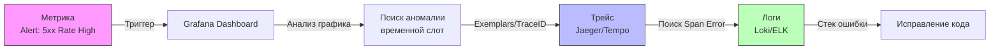

## Синергия данных

В архитектурной теории и маркетинговых презентациях концепция **«Три столпа observability»** (The Three Pillars of Observability), популяризированная инженерами компании Honeycomb и Черити Мейджорс (Charity Majors), давно стала отраслевым каноном. Однако многие инженерные команды попадают в наивную ловушку «инструментального фетишизма»: они разворачивают Prometheus для сбора метрик, кластер Loki/Elasticsearch для хранения логов и распределенный Jaeger/Tempo для трассировки, после чего искренне считают, что наблюдаемость достигнута.

На практике три разрозненных хранилища телеметрии, не связанные между собой общими идентификаторами — это всего лишь три разрозненные кучи неструктурированного мусора. Настоящая наблюдаемость рождается не из наличия трех отдельных инструментов, а из **междоменной корреляции данных (Cross-domain Correlation)**. Столпы держат надежный свод инфраструктуры только тогда, когда между ними выстроена жесткая кристаллическая решетка взаимных ссылок.

Разберем, как эта синергия устроена на уровне протоколов, ядра Linux и рантайма языка Go.

---

## Жизненный цикл инцидента: Взаимодействие столпов

Представьте реальный боевой сценарий: в 14:23 дежурный инженер получает высокоприоритетный алерт: «Резкий всплеск процента HTTP 500 ошибок в платежном сервисе». Как в идеальной инженерной системе должны взаимодействовать три столпа?



1.  **Метрики (Фаза обнаружения):**  
    Метрики выполняют роль системы раннего предупреждения (Radar Warning). Они дешевы, непрерывно агрегируются и сигнализируют о факте аномалии во времени: *«В 14:23:10 задержка на 99-м перцентиле подскочила с 40 мс до 3.8 секунд, а число ошибок rate(500) превысило критический порог в 5%»*.
2.  **Трейсы (Фаза локализации):**  
    Используя временной слот и фильтр по статусу, инженер мгновенно переходит к распределенным трейсам. Трейс визуализирует топологию выполнения запроса и отвечает на вопрос *«Где именно произошел сбой?»*. В графе вызовов отчетливо видно: из 3.8 секунд задержки ровно 3.75 секунды пришлись на спан `db_query` при обращении к шарду PostgreSQL.
3.  **Логи (Фаза точной диагностики):**  
    В спане зафиксирован уникальный идентификатор `trace_id`. Инженер выполняет точечный запрос в систему логирования по этому конкретному ключу. Перед глазами появляется единственная строка журнала со всеми деталями ошибки: `connection refused` или `deadlock detected: Process 4124 waits for ShareLock on transaction 89124`.

Время локализации первопричины инцидента (MTTR — Mean Time To Resolution) сокращается с мучительных часов слепого блуждания по логам до 30 секунд.

---

## Техническая реализация связей в Go

Чтобы цепочка корреляции работала безупречно, телеметрия должна быть сцеплена криптографически детерминированными ключами на уровне исходного кода. В экосистеме Go универсальным транспортом метаданных сквозного контекста является стандартный `context.Context`.

### 1. Trace Context Propagation (Стандарт W3C)

Стандарт W3C Trace Context регламентирует передачу распределенного контекста через бинарные или строковые протоколы. При поступлении входящего HTTP-запроса мидлварь извлекает стандартизированные заголовки:
- `traceparent`: строка вида `00-4bf92f3577b34da6a3ce929d0e0e4736-00f067aa0ba902b7-01` (версия, 128-битный Trace ID, 64-битный Parent Span ID, флаги трассировки).
- `tracestate`: вспомогательные пары «ключ-значение» конкретных вендоров систем мониторинга.

OpenTelemetry SDK в Go инкапсулирует эти структуры непосредственно в `context.Context`. От инженера требуется непреложная дисциплина: **Trace ID — это первичный ключ наблюдаемости**, и контекст обязан явно передаваться во все порождаемые горутины, вызовы баз данных и сетевые клиенты.

---

### 2. Structured Logging with Context

Начиная с версии Go 1.21, стандартная библиотека предлагает логгер `log/slog`. Чтобы связать логи с трейсами без ручной вставки метаданных в каждую строчку, обработчик логов (`slog.Handler`) должен автоматически извлекать текущий `TraceID` и `SpanID` прямо из переданного контекста.

```go
// Правильный подход: Логгер сам вытаскивает TraceID из ctx
logger.InfoContext(ctx, "Processing payment", "amount", 100)

// Вывод будет содержать автоматически подставленный trace_id:
// {"time":"2026-09-18T14:23:10Z","level":"INFO","msg":"Processing payment","trace_id":"4bf92f3577b34da6a3ce929d0e0e4736","amount":100}
```

Это гарантирует, что ни один разработчик в команде не забудет прикрепить `trace_id` вручную.

---

### 3. Exemplars: Связь Метрик и Трейсов

**Exemplars (Экземпляры)** — передовая технология корреляции, ставшая стандартом в Prometheus и OpenTelemetry. Exemplar представляет собой прямую ссылку на конкретный Trace ID, прикрепленную к отдельному числовому измерению гистограммы или счетчика.

В клиенте Prometheus для Go запись измерения выполняется с привязкой контекста:

```go
// Пример использования exemplars в клиенте Prometheus
histogram.ObserveWithExemplar(duration, prometheus.Labels{
    "traceID": traceIDFromContext(ctx),
})
```

**В чем архитектурный прорыв?**  
На дашборде Grafana график гистограммы задержки покрывается россыпью кликабельных точек (Exemplars). Увидев единичный выброс latency до 4 секунд, инженер кликает на конкретную точку графика — и Grafana мгновенно распахивает панель Jaeger/Tempo с трейсом именно этого медленного запроса!

> [!info] Под капотом
> **Как Exemplars обходят проблему High Cardinality?**  
> В структуре базы данных Prometheus TSDB добавление уникального идентификатора (например, Trace ID) в обычные метки (`labels`) приводит к немедленному OOM, так как каждая метка порождает новый независимый временной ряд (Time Series).  
> Экземпляры (Exemplars) хранятся в специальном кольцевом буфере в оперативной памяти **отдельно от индекса временных рядов**. Они не раздувают индексную таблицу инвертированных списков (Inverted Index Postings). Prometheus сохраняет лишь ограниченное число последних замеров на каждый бакет гистограммы, обеспечивая мгновенный переход к трейсам при нулевом влиянии на кардинальность базы.

---

## Четвертый столп: Профилирование (Profiling)

Хотя в академической литературе принято говорить о трех столпах, в мире компилируемых языков с автоматическим управлением памятью и легковесными потоками (таких как Go) современная индустрия выделяет обязательный **четвертый столп: Continuous Profiling (Непрерывное профилирование)**.

- Метрики говорят: *«На сервере резко подскочил CPU до 98%»*.
- Трейсы говорят: *«Запрос зависает внутри функции `ProcessData`»*.
- Профиль рантайма указывает точнейший диагноз: *«В строке `order.go:142` происходит неэффективная конкатенация строк, вызывающая 10 000 аллокаций памяти и сброс конвейера процессора»*.

В экосистему Go инструменты интроспекции встроены непосредственно в ядро рантайма (`net/http/pprof`):
*   **Профиль CPU:** Сэмплирует состояние регистров процессора и счетчика команд с частотой 100 Гц через таймер ядра `setitimer(ITIMER_PROF)`, показывая, на каких инструкциях горят такты CPU.
*   **Heap Profile:** Анализирует стек аллокатора `mheap`, выявляя активные утечки памяти и точки высокого давления на сборщик мусора.
*   **Goroutine Profile:** Сканирует глобальный список дескрипторов горутин `allg`, выявляя зависшие каналы, дэдлоки и утечки горутин.

Профилирование — это хирургический микроскоп архитектора: оно не заменяет метрики, но дает исчерпывающий ответ там, где бессильны логи.

---

> [!tip] Собеседование
> **Вопрос:** Ситуация на проде: графики метрик стабильно зеленые (RPS в норме, процент 5xx ошибок около нуля), в логах чистота, однако сотни пользователей массово жалуются в поддержку на задержки и медленную работу интерфейса. В чем техническая причина и каков алгоритм диагностики?  
> **Ответ:**  
> 1. **Анатомия слепоты:** Отсутствие явных ошибок не означает корректной работы сервиса. Проблема кроется в скрытой деградации производительности: скрытых блокировках мьютексов (`lock contention`), нехватке процессорного времени (`CPU contention`) или задержках сборщика мусора (`GC pauses`).  
> 2. **Анализ скрытых метрик рантайма:** Обычные системные метрики хоста могут не отражать проблему. Необходимо проанализировать метрики самого рантайма Go: длительность пауз `go_gc_duration_seconds`, динамику роста горутин `goroutines_count` и время ожидания блокировок `sync.Mutex`.  
> 3. **Подключение Tracing:** Проверить длительность спанов (Span duration). Трейсинг вскроет медленные фазы обработки (например, блокировки очередей или медленный ответ upstream), даже если запрос в итоге завершился статусом HTTP 200.  
> 4. **Инструменты Profiling:** Снять живые профили через `pprof`:  
>    - CPU-профиль выявит неэффективные алгоритмические циклы или чрезмерную активность GC Mark Assist.  
>    - Mutex/Block-профиль покажет, какие горутины блокируют друг друга в ожидании освобождения критических секций.

---

## Итог

1. Истинная наблюдаемость возникает исключительно на стыке согласованной работы всех телеметрических данных: метрики выявляют аномалию во времени, трейсы локализуют узел и компонент в распределенном графе, а логи предоставляют исчерпывающий контекст ошибки.
2. Непрерывное профилирование (Continuous Profiling) выступает де-факто четвертым столпом в Go, связывая поведение приложения с аппаратными ресурсами машины (такты CPU, аллокации в куче, блокировки планировщика).
3. Проброс заголовков W3C Trace Context через `context.Context` превращает Trace ID в глобальный первичный ключ телеметрии для всех микросервисов.
4. Технология Prometheus Exemplars позволяет соединить метрики и трейсы без риска взрыва кардинальности (High Cardinality), обеспечивая переход от графика задержки к конкретному трейсу в один клик.

[[4. Cardinality и стоимость метрик]]