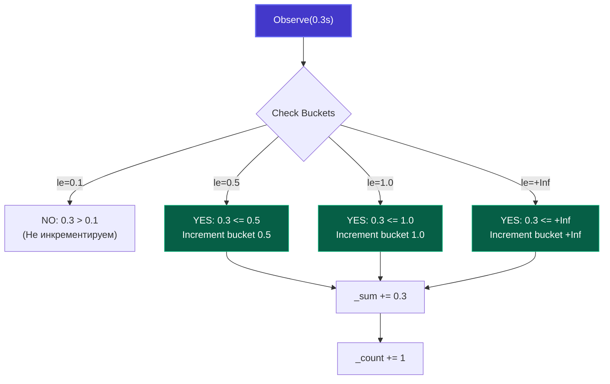

# 1. Типы метрик: Counter, Gauge, Histogram и Summary

> *«То, что вы не можете измерить, вы не сможете и улучшить».*    
> — Питер Друкер

В предыдущей статье мы рассмотрели кардинальность и убедились, что бездумное умножение меток способно мгновенно положить любую TSDB. Теперь перейдем к фундаменту, на котором строится вся телеметрия: **базовым типам данных**.

В мире телеметрии и экосистеме Prometheus (де-факто промышленного стандарта для бэкенда на Go) существует всего четыре фундаментальных примитива: **Counter**, **Gauge**, **Histogram** и **Summary**. Каждый из них решает строго свою физическую задачу, опирается на конкретные машинные инструкции процессора и требует своего математического аппарата при составлении запросов. 

Понимание их внутреннего устройства убережет вас от двух классических бед продакшена: бесполезных графиков «средней температуры по больнице» и тяжелых алертов, генерирующих ложные срабатывания.

---

## Основные типы данных в TSDB

База данных временных рядов (TSDB) оперирует потоками пар `(timestamp, float64)`. На уровне физического хранения TSDB абсолютно все равно, что означает это число `float64` — количество байт, загрузку процессора или перцентиль задержки. 

Смысловую нагрузку и семантическую модель задает клиентская библиотека в коде приложения. Если вы выберете неверный тип примитива, вы либо потеряете способность агрегировать данные между репликами сервиса, либо получите математически бессмысленный результат в PromQL.

Рассмотрим каждый тип детально — от ассемблерных инструкций инкремента до агрегации в распределенном кластере.

---

## 1. Counter (Счетчик)

**Counter** — это кумулятивный монотонный счетчик. Его значение может **только увеличиваться** либо сбрасываться до нуля при перезапуске процесса (или переполнении разрядной сетки).

*   **Назначение:** Измерение дискретных событий и объемов за все время жизни процесса.
*   **Примеры:** Количество обработанных HTTP-запросов (`http_requests_total`), число ошибок базы данных (`db_errors_total`), отправленные байты (`net_bytes_sent_total`).
*   **Операции:** `Inc()` (увеличить на 1), `Add(float64)` (увеличить на неотрицательное число).

Физическая аналогия Counter — **одометр в автомобиле**. Одометр не показывает вашу текущую скорость. Он просто непрерывно наматывает километры. Если вы хотите узнать скорость за последний час, вы вычитаете значение одометра час назад из текущего значения и делите на время.

### Under the Hood

На уровне процессора и рантайма Go вызов `Inc()` или `Add()` для Counter — это операция атомарного сложения:

```text
CPU Core 0 ────► [ LOCK XADD / atomic.AddUint64 ] ────► Cache Line (L1D)
```

В пакете `client_golang` счетчик хранит значение как `uint64` (битовое представление `float64`), обновление которого выполняется без блокировки мьютексами через атомарные инструкции процессора (`sync/atomic`). Это делает инкремент чрезвычайно быстрым — считанные единицы наносекунд.

Однако сам по себе Counter как абсолютное число практически бесполезен. Если вы увидите на графике `requests_total = 1,000,000` (или `http_requests_total = 4_500_000`), эта цифра не говорит дежурному инженеру ровным счетом ничего: это миллион запросов за пять минут под атакой, или сервис мирно переваривал их в течение трех месяцев?

Вся мощь Counter раскрывается только в PromQL через функции вычисления производной по времени: `rate()` и `irate()`.

```go
// Идиоматичное использование Counter в Go HTTP-сервере
package main

import (
	"net/http"

	"github.com/prometheus/client_golang/prometheus"
	"github.com/prometheus/client_golang/prometheus/promauto"
)

var (
	httpRequestsTotal = promauto.NewCounterVec(
		prometheus.CounterOpts{
			Name: "http_requests_total",
			Help: "Total number of HTTP requests processed by handler.",
		},
		[]string{"path", "method"},
	)
)

func handler(w http.ResponseWriter, r *http.Request) {
	// Инкремент регистрируется при завершении обработки
	defer func() {
		httpRequestsTotal.WithLabelValues(r.URL.Path, r.Method).Inc()
	}()

	// Основная бизнес-логика...
	w.WriteHeader(http.StatusOK)
	_, _ = w.Write([]byte("OK"))
}
```

Когда Prometheus вычисляет `rate(http_requests_total[5m])`, он берет разницу между значениями счетчика на 5-минутном окне и делит ее на 300 секунд, получая истинный **RPS (Requests Per Second)**.

Более того, функция `rate()` обладает встроенным механизмом **детектирования сброса (reset detection)**. Если ваш сервис упал и перезапустился, счетчик сбросился с 10 000 до нуля. Алгоритм `rate()` видит падение значения, понимает, что произошел рестарт пода, и корректно компенсирует скачок, предотвращая отрицательные всплески на графиках.

> [!tip] Собеседование
> **Вопрос:** Почему Counter не может иметь метод `Dec()` (уменьшение)?
> **Ответ:** Потому что Counter предназначен для измерения скорости (rate) процесса за время. Если бы значение могло уменьшаться, функция `rate()` давала бы отрицательные значения скорости, что нарушает физический смысл метрики. Если вам нужно уменьшать значение — вам нужен `Gauge`.

---

## 2. Gauge (Измеритель)

**Gauge** — это моментальный снимок (snapshot) некоторой числовой величины в данный конкретный момент времени. Значение Gauge может произвольно увеличиваться, уменьшаться или оставаться неизменным.

*   **Назначение:** Мониторинг текущего состояния и емкости ресурсов.
*   **Примеры:** Загрузка оперативной памяти (RAM), температура процессора, текущее количество активных горутин в рантайме, размер очереди сообщений в брокере, количество открытых TCP-соединений.
*   **Операции:** `Inc()`, `Dec()`, `Set(float64)`, `Add(float64)`, `Sub(float64)`.

Физическая аналогия Gauge — **спидометр или стрелочный указатель уровня топлива в бензобаке**. Стрелка поднимается и опускается в реальном времени, отражая текущий уровень.

### Under the Hood

В отличие от строго монотонного Counter, внутреннее состояние Gauge требует произвольной перезаписи. Под капотом `prometheus.Gauge` использует атомарные инструкции `atomic.StoreUint64` и `atomic.LoadUint64` для сохранения чисел с плавающей точкой:

```go
package main

import (
	"runtime"
	"time"

	"github.com/prometheus/client_golang/prometheus"
	"github.com/prometheus/client_golang/prometheus/promauto"
)

// Пример мониторинга горутин (Gauge)
var (
	goroutinesGauge = promauto.NewGauge(prometheus.GaugeOpts{
		Name: "current_goroutines",
		Help: "Number of current goroutines.",
	})
)

func recordMetrics() {
	// Периодическое обновление Gauge в фоновой горутине
	ticker := time.NewTicker(5 * time.Second)
	for range ticker.C {
		// runtime.NumGoroutine() - системный вызов рантайма, дорого вызывать на каждый HTTP-запрос,
		// поэтому опрашиваем состояние периодически раз в несколько секунд
		goroutinesGauge.Set(float64(runtime.NumGoroutine()))
	}
}
```

> [!warning] Ловушка / Gotcha
> **Gauge и `rate()`**.
> Главная ошибка новичков — пытаться применить функцию `rate()` к Gauge. `rate()` вычисляет скорость роста. Для Gauge это бессмысленно (если только вы не измеряете скорость изменения уровня воды в баке, но это редкий кейс).
> Для Gauge обычно используют функции `min()`, `max()`, `avg()` или просто смотрят текущее значение.
>
> Если применить `rate()` к Gauge, при каждом падении значения алгоритм решит, что произошел «сброс счетчика» из-за рестарта сервера, и попытается экстраполировать дельту, выдав на график колоссальные фантомные скачки.

---

## 3. Histogram (Гистограмма)

**Histogram** — самый мощный, статистически надежный и одновременно ресурсоемкий инструмент мониторинга. Она предназначена для измерения **распределения непрерывных величин** (задержек запросов, размеров передаваемых пакетов, времени удержания блокировок мьютекса).

### Проблема средних значений

Полагаться на среднее арифметическое (Average / Mean) в распределенных бэкенд-системах — смертный грех системной инженерии.

Представьте веб-сервис, обработавший 100 запросов:
*   99 запросов выполнились молниеносно: ровно за **10 мс**.
*   1 запрос намертво завис на таймауте базы данных: **10 000 мс** (10 секунд).

Посчитаем метрики:
*   **Average (Среднее):** $(99 \times 10 + 10000) / 100 \approx 109.9 \text{ мс}$. На графике дашборда 110 мс выглядит вполне комфортно и зелено. Руководство довольно.
*   **P99 (99-й перцентиль):** **10 000 мс**. В реальности каждый сотый покупатель в интернет-магазине уперся в 10-секундный экран загрузки и ушел к конкурентам.

Среднее значение начисто маскирует катастрофические выбросы (outliers). Чтобы видеть реальный пользовательский опыт, инженеры используют **квантили и перцентили** (P50, P90, P99, P99.9). А чтобы вычислять перцентили в распределенной системе, необходима гистограмма.

Гистограмма разбивает весь диапазон значений на фиксированные корзины (**buckets**) и подсчитывает, сколько измерений попало в каждую корзину.

### Как это работает в Go?

При объявлении гистограммы разработчик обязан заранее задать верхние границы корзин (`Buckets`).

```go
package main

import (
	"net/http"
	"time"

	"github.com/prometheus/client_golang/prometheus"
	"github.com/prometheus/client_golang/prometheus/promauto"
)

var (
	requestDuration = promauto.NewHistogramVec(
		prometheus.HistogramOpts{
			Name:    "http_request_duration_seconds",
			Help:    "A histogram of request durations.",
			Buckets: []float64{.005, .01, .025, .05, .1, .25, .5, 1, 2.5, 5, 10}, // Стандартные DefBuckets
		},
		[]string{"path"},
	)
)

func handler(w http.ResponseWriter, r *http.Request) {
	start := time.Now()
	defer func() {
		duration := time.Since(start).Seconds()
		// Метод Observe распределяет замер по подходящим бакетам
		requestDuration.WithLabelValues(r.URL.Path).Observe(duration)
	}()

	// Имитация полезной нагрузки
	w.WriteHeader(http.StatusOK)
}
```

### Under the Hood: Cost of Observation

В Prometheus бакеты гистограммы являются **кумулятивными (cumulative)**. Это означает, что бакет с границей `le="0.5"` содержит счетчик всех событий, длительность которых была $\le 0.5$ секунды.
Каждый вызов `Observe()` заставляет Histogram инкрементировать счетчики во всех бакетах, граница которых превышает наблюдаемое значение.

Если у вас запрос выполняется 0.3 секунды, и бакеты `[0.1, 0.5, 1.0]`, то будут инкрементированы счетчики для бакетов `0.5` и `1.0` (и `+Inf`).

При каждом вызове `Observe()` клиентская библиотека выполняет следующую работу:
1. Инкрементирует общий счетчик наблюдений `_count`.
2. Добавляет наблюдаемое значение к общей сумме `_sum`.
3. Пробегает по массиву бакетов и инкрементирует счетчик **каждого бакета, граница которого `le >= v`**.



В результате одна метрика `http_request_duration_seconds` экспортирует наружу:
*   `http_request_duration_seconds_bucket{le="0.005"}`
*   `...`
*   `http_request_duration_seconds_bucket{le="+Inf"}`
*   `http_request_duration_seconds_sum`
*   `http_request_duration_seconds_count`

Если у вас 11 бакетов, гистограмма порождает **13 независимых временных рядов**. Если добавить метку с 100 значениями, это даст $13 \times 100 = 1300$ рядов.

Для вычисления P99 на стороне Prometheus используется функция `histogram_quantile()`:

```promql
histogram_quantile(0.99, sum(rate(http_request_duration_seconds_bucket[5m])) by (le))
```

Сервер Prometheus берет скорость роста каждого бакета, складывает их по всем инстансам сервиса и выполняет линейную интерполяцию внутри бакета, где лежит 99-й процентиль.

---

## 4. Summary (Резюме) — краткое упоминание

Существует еще тип **Summary**. Он похож на Histogram, но вычисляет перцентили (квантили) на стороне клиента (в вашем Go-приложении).

*   **Как устроен:** Клиентская библиотека хранит скользящее окно недавних замеров (обычно за последние 10 минут) и использует алгоритмы вычисления перцентилей (такие как CKMS или T-Digest).
*   **Плюс:** Дает математически точные перцентили без необходимости вручную подбирать границы бакетов.
*   **Минус (фатальный для микросервисов):** **Summary нельзя агрегировать между репликами!** Невозможно взять 99-й перцентиль с Сервера 1 и 99-й перцентиль с Сервера 2 и усреднить их. Математически это приведет к грубой ошибке.

Именно поэтому в современных облачных и распределенных системах **Histogram** является безоговорочным выбором: бакеты гистограмм — это обычные счетчики Counter, которые можно безопасно складывать оператором `sum()` по любому количеству реплик, подов и дата-центров.

---

## Итог

Выбор типа метрики диктует способ её сбора и анализа:

| Тип | Смысл | Использование | Aggregation | Поведение в PromQL |
| :--- | :--- | :--- | :--- | :--- |
| **Counter** | Сколько всего произошло? | `rate()` для RPS, error rate, пропускной способности | Суммируется (`sum`) | Монотонный рост, автосброс при рестарте |
| **Gauge** | Сколько сейчас в наличии? | Текущее состояние, емкость, использование памяти | Нельзя суммировать слепо; `avg`, `max`, `min` | Свободные колебания вверх и вниз |
| **Histogram** | Каково распределение величин? | Задержки (Latency P95/P99), размеры тел запросов | Суммируется по бакетам (`sum by (le)`) | `histogram_quantile()` для перцентилей |
| **Summary** | Точный квантиль на одном хосте | Локальный детальный профиль процесса | **Не агрегируется** между узлами | Готовые квантили `{quantile="0.99"}` |

Понимание этих примитивов позволяет правильно спроектировать библиотеку метрик. В следующей статье мы перейдем к инструменту, который делает все это возможным — Prometheus, и разберем его архитектуру: [[2. Prometheus. Основы]].