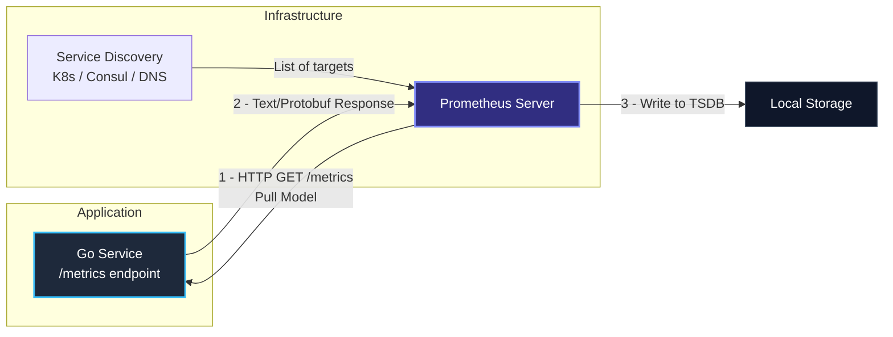

# 2. Prometheus. Основы архитектуры и TSDB

> *"Keep it simple, make each part do one thing well, and connect them with clean interfaces."*  
> — Дуг Макилрой

В предыдущей статье мы изучили математические примитивы метрик — Counter, Gauge, Histogram и Summary. Теперь настало время рассмотреть систему, которая превратила эти абстракции в стандарт индустрии для облачных микросервисов и бэкенда на Go — **Prometheus**.

Prometheus зародился в недрах SoundCloud как ответ на ограничения классических инструментов мониторинга (Nagios, Zabbix, StatsD). Он создавался инженерами для инженеров в эпоху взрывного роста контейнеров и микросервисов. Сегодня это выпускник Cloud Native Computing Foundation (CNCF) второго уровня после Kubernetes, определяющий архитектуру телеметрии тысяч компаний по всему миру.

Prometheus — это не просто база данных временных рядов (TSDB). Это целостная замкнутая экосистема, объединяющая сбор метрик по модели вытягивания (Scraping), специализированное хранилище на диске, язык выражений PromQL и подсистему генерации алертов.

---

## Стандарт индустрии для Cloud-Native мониторинга

Почему именно Prometheus стал доминирующим стандартом в мире Go и Kubernetes?

В традиционном монолитном мире сервера были статичными «домашними питомцами» (pets): у каждого сервера был постоянный IP-адрес, он жил годами, а агент мониторинга настраивался вручную. С приходом контейнеризации и Kubernetes сервера превратились в «стадо» (cattle): поды рождаются и умирают за секунды, масштабируются от 5 до 500 реплик, непрерывно меняя эфемерные IP-адреса.

В таких условиях мониторинг должен обладать тремя ключевыми свойствами:
1. **Динамическим обнаружением целей (Service Discovery):** система обязана сама узнавать, какие поды сейчас живы в кластере.
2. **Многомерной моделью данных (Labels):** фильтрация и группировка не по жестким иерархическим деревьям (как в Graphite), а по произвольным парам `ключ=значение`.
3. **Автономностью и простотой эксплуатации:** сервер мониторинга не должен зависеть от сетевых хранилищ, распределенных координаторов (ZooKeeper/etcd) или внешних СУБД. Если сеть или кластер деградируют, мониторинг обязан выжить и продолжать бить в набат.

Главная архитектурная особенность, отличающая Prometheus от систем старой школы (Nagios, Zabbix) и push-систем (InfluxDB в push-режиме, Datadog) — это модель **Pull (Вытягивание)**.

---

## Архитектура: Pull vs Push

В традиционных системах (**Push**) каждое приложение самостоятельно берет на себя ответственность за доставку метрик: процесс открывает сокет к серверу мониторинга и с определенной периодичностью «выталкивает» наружу пакеты данных.

В Prometheus парадигма перевернута с ног на голову (**Pull**): сервер мониторинга сам регулярно опрашивает (scrapes) целевые сервисы по протоколу HTTP, забирая актуальные показания счетчиков.



### Почему Pull лучше? (System Design View)

Выбор модели Pull — это фундаментальное архитектурное решение со множеством инженерных преимуществ:

1.  **Контроль над инфраструктурой:** Приложению не нужно знать адреса мониторинговых серверов. DevOps-инженер может менять конфигурацию Prometheus, перезапускать его, добавлять новые инстансы, и приложению всё равно. Это упрощает Service Discovery. Сервер сам определяет свой темп работы и объем нагрузки (защита от переполнения / Backpressure).
2.  **Единая точка истины (Centralized Config):** Все настройки частоты сбора и целей находятся в конфиге Prometheus, а не разбросаны по коду микросервисов. Если требуется временно уменьшить частоту опроса с 15 секунд до 1 минуты под высокой нагрузкой, достаточно изменить одну строчку в конфиге сервера мониторинга.
3.  **Обнаружение проблем (Health Check):** Если Prometheus не может "достучаться" до приложения, он сразу знает, что цель недоступна (`State: DOWN`). В Push-моделях, если приложение зависло, оно не может отправить метрику "Я завис", и мониторинг об этом не узнает, пока не сработает таймаут (gap). Метрика `up == 0` в Prometheus генерируется автоматически для каждого недоступного таргета.
4.  **Упрощенная локальная отладка:** Разработчик на ноутбуке может воспроизвести точь-в-точь то же самое, что делает сервер Prometheus: достаточно выполнить обычный HTTP-запрос через `curl http://localhost:8080/metrics`.

---

## Under the Hood: Работа с приложением

Ваше Go-приложение не отправляет данные. Оно просто обязано открыть HTTP-эндпоинт (обычно `/metrics`), который возвращает метрики в текстовом формате.

Приложение держит значения метрик в оперативной памяти (в атомарных переменных). Когда Prometheus присылает HTTP GET-запрос на `/metrics`, рантайм сериализует текущее состояние памяти в текстовый поток и отдает его в HTTP-ответе.

### Exposition Format (Текстовый формат)

Prometheus ожидает получить текст, похожий на этот:

```text
# HELP http_requests_total Total number of HTTP requests.
# TYPE http_requests_total counter
http_requests_total{method="GET",status="200"} 1023
http_requests_total{method="POST",status="500"} 5
```

Это человекочитаемый формат. Преимущество в том, что вы можете просто открыть `http://localhost:8080/metrics` в браузере или вызвать `curl` и увидеть всё своими глазами. Это упрощает отладку.

Формат состоит из:
- Строк комментариев метаданных: `# HELP` (описание назначения метрики) и `# TYPE` (тип примитива: `counter`, `gauge`, `histogram`, `summary`).
- Строк с конкретными замерами: имя метрики, фигурные скобки с лейблами `{key="value"}`, пробел и числовое значение (64-битный `float`).

> [!info] Под капотом
> Хотя текстовый формат дефакто стандарт, Prometheus поддерживает и бинарный формат (Protocol Buffers). Он эффективнее по сети, но в 99% случаев используется текстовый, так как он проще и поддерживается всеми клиентами. В стандарте OpenMetrics бинарная сериализация также стандартизирована, но текстовый протокол сохраняет колоссальную популярность благодаря непревзойденной простоте инспекции обычными утилитами командной строки.

---

## TSDB: Как Prometheus хранит данные

Prometheus использует локальную Time Series Database (TSDB). Она оптимизирована под паттерн "Append Only" (только добавление новых данных).

В отличие от реляционных СУБД (PostgreSQL), где строки могут произвольно обновляться через `UPDATE` или удаляться по первичным ключам, временные ряды только прибывают во времени. Инженеры Prometheus использовали это свойство для экстремальной оптимизации подсистемы дискового ввода-вывода (I/O) и сжатия данных.

### Mechanical Sympathy: Хранение и сжатие

Архитектура хранилища TSDB Prometheus состоит из трех ключевых слоев:

```text
Входящий скрейп ──► [ Head Chunk (RAM) ] ──► [ WAL (Диск, fsync) ]
                           │
                           ▼ (каждые 2 часа)
                    [ Immutable Block ]
                    ├── meta.json
                    ├── chunks/ (сжатые сэмплы Gorilla)
                    └── index (инвертированный индекс меток)
```

1.  **The Head (Голова):** Новые данные, которые приходят при скрейпинге, сначала пишутся в память и WAL (Write-Ahead Log). Это обеспечивает высокую скорость записи. Сегменты WAL пишутся на диск последовательными блоками, гарантируя сохранность данных при внезапном сбое питания или падении процесса.
2.  **Chunks (Чанки):** Данные сжимаются в блоки фиксированного размера (chunks). Внутри чанка Prometheus использует алгоритм сжатия, вдохновленный Facebook Gorilla. Он сжимает timestamp и value (double) так, что одна точка данных занимает в среднем **1.37 байта**.
    *   *Timestamp:* Хранится как дельта от предыдущего (delta-of-deltas). Поскольку скрейпинг происходит через строго равные интервалы (например, ровно каждые 15 секунд), вторая дельта равна нулю, что кодируется всего одним битом!
    *   *Value:* Хранится через XOR-сжатие, если значения меняются плавно. Поскольку в IEEE 754 float64 близкие числа имеют одинаковые старшие биты экспоненты и мантиссы, операция `XOR` дает длинные последовательности нулей, которые сжимаются с высочайшим коэффициентом.
3.  **Compaction:** Периодически фоновый процесс "уплотняет" старые чанки в более крупные блоки на диске. Несколько 2-часовых блоков объединяются в суточные блоки, удаляются дубликаты индексов и освобождается фрагментированное дисковое пространство.

Это делает Prometheus невероятно эффективным по диску. Вы можете хранить миллионы метрик на обычном SSD, пока не упретесь в память или IOPS.

---

## Service Discovery: Как Prometheus находит цели?

В современной облачной инфраструктуре невозможно прописать статические адреса серверов: поды в Kubernetes создаются и уничтожаются динамически. Поэтому Prometheus интегрирован с механизмами **Service Discovery**.

Prometheus поддерживает нативные провайдеры обнаружения: Kubernetes API, HashiCorp Consul, AWS EC2, DNS SRV-записи и файлы конфигурации.

Типичный сценарий для Kubernetes выглядит следующим образом:
1.  Prometheus опрашивает API Kubernetes.
2.  Находит все Pod'ы, имеющие определенную аннотацию (например, `prometheus.io/scrape: "true"`).
3.  Добавляет их IP-адреса в список целей (Targets).
4.  Когда под удаляется (Scale Down), Prometheus автоматически перестает его опрашивать.

Через механизм Relabeling (`relabel_configs`) инженер может на лету переписывать имена таргетов, извлекать метаданные пода (namespace, имя пода, имя ноды) и автоматически добавлять их в виде лейблов ко всем собираемым метрикам.

---

## PromQL: Язык запросов

Сами по себе сырые числа (Counter = 1000) малоинформативны. Мощность Prometheus раскрывается в **PromQL**.

PromQL (Prometheus Query Language) — это декларативный функциональный язык векторных вычислений. Он оперирует двумя типами векторов:
*   **Instant Vector (Мгновенный вектор):** срез последнего значения каждого ряда на текущий момент времени.
*   **Range Vector (Интервальный вектор):** набор точек данных за указанный интервал времени (например, `[5m]`).

Самая частая и важная операция для Counter — это вычисление скорости роста (Rate).

```promql
# Запрос: Сколько запросов в секунду обрабатывает сервис за последние 5 минут?
rate(http_requests_total[5m])
```

`rate()` автоматически обрабатывает рестарты приложения (когда Counter сбрасывается в 0) и экстраполирует данные.

> [!warning] Ловушка / Gotcha
> **Отсутствие данных.**
> Если ваш сервис не присылает метрику (например, ошибок не было вообще), Prometheus просто не запишет точку данных. В TSDB нет "нулевых" значений.
> Это важно помнить при построении графиков: отсутствие линии на графике может означать либо `0`, либо то, что сервис умер. Для решения этой проблемы в PromQL используют функцию `clamp_min(rate(...[5m]), 0)` или настройки отображения в Grafana (Connect null values).
>
> Еще более опасная ловушка — алерты на ошибки вида `rate(http_errors_total[5m]) > 10`. Если сервис работает идеально и ошибок не было вовсе, выражение возвращает пустой результат (*no data*), а не 0. Алерт не сработает вовремя, если селектор написан некорректно без учета объединения с общим вектором через `or on() vector(0)`.

---

## Pushgateway: Исключение из правил

Существуют сценарии, где Pull модель не работает: **Batch Jobs** (короткоживущие задачи).
Например, скрипт импорта данных, который запускается раз в сутки, отрабатывает за 10 секунд и умирает. Prometheus (который скрейпит раз в 15 секунд) может просто не успеть "застать" этот скрипт живым.

Для этого существует **Pushgateway**.
1.  Batch Job сам отправляет (Push) свои метрики в Pushgateway.
2.  Pushgateway хранит их в памяти.
3.  Prometheus забирает (Pull) метрики из Pushgateway, как из обычного экспортера.


> [!tip] Собеседование
> **Вопрос:** Почему Pushgateway считается "злом" и когда его можно использовать?
> **Ответ:** Pushgateway нарушает чистоту модели Pull и становится единой точкой отказа (SPOF). Если он упадет, вы потеряете метрики всех batch-задач. Кроме того, он не умеет автоматически чистить старые метрики (если задача умерла, метрика останется висеть навечно, пока вы не удалите её через API).
> **Можно использовать:** Только для short-lived batch jobs (cron scripts). Никогда не используйте его для долгоживущих сервисов — пусть они просто открывают `/metrics`.

---

## Итог

1.  **Prometheus** — это Pull-система, что упрощает управление инфраструктурой и Service Discovery.
2.  Приложение должно отдавать данные в текстовом формате на эндпоинте `/metrics`.
3.  TSDB использует агрессивное сжатие (Gorilla-inspired), позволяя хранить огромные объемы метрик на локальном диске.
4.  **PromQL** — мощный язык запросов, где `rate()` — король аналитики.

В следующей статье мы перейдем к практике: как внедрить экспорт метрик в Go-приложение, используя стандартные библиотеки и best practices: [[3. Экспорт метрик в Go]].