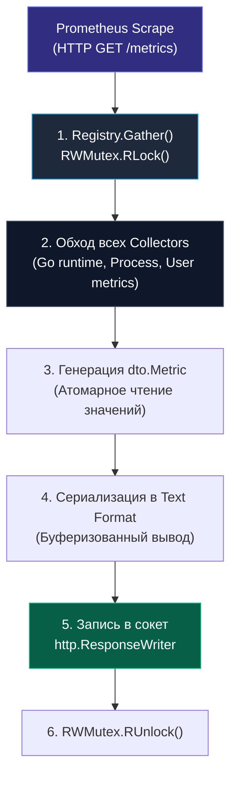

# 3. Экспорт метрик в Go: Архитектура клиентской библиотеки

> *«Лучшим диагностическим инструментом зачастую оказывается вовремя поставленный счетчик».*    
> — Брайан Керниган

В предыдущей статье мы изучили внутреннее устройство сервера Prometheus и его парадигму Pull. Теперь настало время ответить на главный практический вопрос инженера: **как правильно научить Go-приложение экспортировать метрики**, чтобы сбор телеметрии не создавал паразитной нагрузки на CPU, не провоцировал GC-паузы и оставался чистым с точки зрения архитектуры кода.

Де-факто стандартом индустрии для экспорта метрик в Go является официальная библиотека `github.com/prometheus/client_golang`. Однако просто импортировать пакет и скопировать пару строчек из документации недостаточно. Настоящий бэкенд-инженер должен понимать, что происходит в памяти процесса в момент скрейпинга, как изолировать мониторинг от бизнес-логики и как проектировать метрики так, чтобы юнит-тесты не превращались в ночной кошмар из-за глобального состояния.

---

## Базовая настройка: "Hello World" мониторинга

Самый быстрый способ начать отдавать метрики наружу — подключить пакет `promhttp`. Он предоставляет готовый HTTP-обработчик (`http.Handler`), который инкапсулирует сериализацию данных реестра в текстовый формат OpenMetrics/Prometheus.

```go
package main

import (
	"log"
	"net/http"

	"github.com/prometheus/client_golang/prometheus/promhttp"
)

func main() {
	// Регистрируем обработчик для эндпоинта /metrics
	http.Handle("/metrics", promhttp.Handler())

	log.Println("Сервер метрик запущен на :8080/metrics")
	if err := http.ListenAndServe(":8080", nil); err != nil {
		log.Fatalf("Ошибка запуска сервера: %v", err)
	}
}
```

При обращении к `http://localhost:8080/metrics`, этот хендлер сгенерирует ответ в текстовом формате. По умолчанию он уже экспортирует богатейший набор метрик рантайма Go (память кучи, количество живых горутин, активность сборщика мусора GC), благодаря встроенному сборщику `collectors.NewGoCollector`.

---

## Mechanical Sympathy: Что происходит во время Scrape?

Что на самом деле делает машина, когда Prometheus присылает HTTP GET-запрос на ваш эндпоинт `/metrics`?



Когда Prometheus дергает ваш эндпоинт `/metrics`, происходят следующие процессы:

1.  **Блокировка Реестра (Registry Lock):** Реестр метрик (`prometheus.Registry`) блокируется на чтение (`RWMutex.RLock()`). Это значит, что попытки записать новые данные в метрики (вызвать `Inc()` или `Observe()`) **не заблокируются**, так как используются атомарные операции или RWMutex (в зависимости от типа метрики).
2.  **Сбор данных (Gathering):** Реестр вызывает метод `Collect()` у каждого зарегистрированного коллектора. Стандартные метрики рантайма обращаются к системным структурам `runtime.MemStats` и `runtime/metrics`.
3.  **Сериализация:** Хендлер проходит по всем зарегистрированным метрикам и вызывает их метод `Write` для конвертации в текстовый формат Protocol Buffers или Plain Text. В памяти аллоцируются буферы для форматирования строк.
4.  **I/O:** Данные пишутся в `http.ResponseWriter` и улетают по сетевому сокету серверу мониторинга.

> [!warning] Ловушка / Gotcha
> **Влияние на Latency.**
> Если у вас миллионы временных рядов (High Cardinality), сериализация может занять заметное время (сотни миллисекунд или секунды).
> Хотя запрос `/metrics` обрабатывается в отдельной горутине, он потребляет CPU и память. В высоконагруженных сервисах (сотни тысяч RPS) рекомендуется выносить эндпоинт `/metrics` на отдельный порт (например, `:6060`), чтобы скрейпинг мониторинга не влиял на бизнес-трафик (shared nothing).

Разделение портов гарантирует две вещи:
- Внешний трафик из интернета никогда не получит доступ к внутренним деталям вашей системы через `/metrics`.
- Внезапно зависший или слишком тяжелый скрейпинг не исчерпает лимит файловых дескрипторов и потоков входящего бизнес-трафика.

---

## Паттерн проектирования: Middleware (Middleware Pattern)

В реальном бэкенде мы не пишем `Inc()` внутри каждого хендлера. Мы используем паттерн "Middleware" (или "Interceptor"). Это позволяет отделить бизнес-логику от инфраструктурной.

Бизнес-код должен отвечать за создание заказа или регистрацию пользователя, а не за вычисление длительности HTTP-запроса.

### Реализация собственного Middleware

Хотя в библиотеке есть готовый `promhttp.InstrumentHandler...`, для Senior-разработчика полезно понимать, как это работает внутри, чтобы иметь возможность кастомизации.

Главная сложность в стандартном `net/http` — перехватить код ответа (`HTTP Status Code`), так как стандартный интерфейс `http.ResponseWriter` не предоставляет метода для чтения уже записанного статуса. Нам потребуется паттерн «Декоратор»:

```go
package main

import (
	"net/http"
	"strconv"
	"time"

	"github.com/prometheus/client_golang/prometheus"
	"github.com/prometheus/client_golang/prometheus/promauto"
)

var (
	httpRequestsTotal = promauto.NewCounterVec(
		prometheus.CounterOpts{
			Name: "http_requests_total",
			Help: "Общее количество обработанных HTTP-запросов.",
		},
		[]string{"method", "code"},
	)

	httpDuration = promauto.NewHistogramVec(
		prometheus.HistogramOpts{
			Name:    "http_request_duration_seconds",
			Help:    "Гистограмма длительности HTTP-запросов.",
			Buckets: prometheus.DefBuckets,
		},
		[]string{"path"},
	)
)

// responseWriter перехватывает HTTP-статус код
type responseWriter struct {
	http.ResponseWriter
	statusCode int
}

func (rw *responseWriter) WriteHeader(code int) {
	rw.statusCode = code
	rw.ResponseWriter.WriteHeader(code)
}

// promMiddleware оборачивает http.Handler и собирает метрики
func promMiddleware(next http.Handler) http.Handler {
	return http.HandlerFunc(func(w http.ResponseWriter, r *http.Request) {
		start := time.Now()

		// Wrapping ResponseWriter для перехвата статус-кода
		ww := &responseWriter{ResponseWriter: w, statusCode: http.StatusOK}

		// Вызов бизнес-логики
		next.ServeHTTP(ww, r)

		// Запись метрик ПОСЛЕ выполнения запроса
		duration := time.Since(start).Seconds()

		// Используем глобальные метрики (определенные через promauto)
		httpDuration.WithLabelValues(r.URL.Path).Observe(duration)
		httpRequestsTotal.WithLabelValues(r.Method, strconv.Itoa(ww.statusCode)).Inc()
	})
}
```

### Использование `promhttp` (Production Way)

В продакшене лучше использовать готовые инструменты, чтобы не изобретать велосипед.

Официальный пакет `promhttp` содержит готовые фабрики декораторов:
- `promhttp.InstrumentHandlerCounter`
- `promhttp.InstrumentHandlerDuration`
- `promhttp.InstrumentHandlerInFlight`
- `promhttp.InstrumentHandlerResponseSize`

Вот как выглядит идеальная компоновка production-сервера с собственным изолированным реестром:

```go
package main

import (
	"net/http"

	"github.com/prometheus/client_golang/prometheus"
	"github.com/prometheus/client_golang/prometheus/collectors"
	"github.com/prometheus/client_golang/prometheus/promauto"
	"github.com/prometheus/client_golang/prometheus/promhttp"
)

func myHandler(w http.ResponseWriter, r *http.Request) {
	_, _ = w.Write([]byte("Hello, Observability!"))
}

func main() {
	// Создаем пользовательский регистр (best practice)
	reg := prometheus.NewRegistry()

	// Регистрируем стандартные метрики Go runtime (память, горутины)
	reg.MustRegister(collectors.NewGoCollector(
		collectors.WithGoCollections(collectors.GoRuntimeMetricsCollection),
	))

	// Регистрируем метрики процесса (CPU, FD)
	reg.MustRegister(collectors.NewProcessCollector(collectors.ProcessCollectorOpts{}))

	// Инициализируем метрики
	httpRequestsTotal := promauto.With(reg).NewCounterVec(
		prometheus.CounterOpts{
			Name: "http_requests_total",
			Help: "Total number of HTTP requests.",
		},
		[]string{"code", "method"},
	)

	// Создаем хендлер с инструментированием
	instrumentedHandler := promhttp.InstrumentHandlerCounter(
		httpRequestsTotal,
		http.HandlerFunc(myHandler),
	)

	mux := http.NewServeMux()
	mux.Handle("/api/v1/hello", instrumentedHandler)

	// Запускаем сервер с кастомным регистром
	http.Handle("/metrics", promhttp.HandlerFor(reg, promhttp.HandlerOpts{}))
	http.ListenAndServe(":8080", nil)
}
```

---

## Under the Hood: `promauto` и `Registry`

Библиотека предоставляет пакет `promauto`, который регистрирует метрики в глобальном реестре по умолчанию.

```go
var someCounter = promauto.NewCounter(prometheus.CounterOpts{
    Name: "some_counter",
    Help: "Just a test counter",
})
```

**Как это работает?**
При вызове `promauto.NewCounter` в функции `init()` (или при объявлении переменной уровня пакета), метрика добавляется в глобальный `prometheus.DefaultRegisterer`. Это удобно для простых приложений, но имеет минусы:
1.  **Тестирование:** Глобальное состояние усложняет юнит-тесты. Метрики, созданные в одном тесте, остаются в реестре и влияют на другие тесты.
2.  **Изоляция:** Вы не можете создать два независимых экземпляра приложения в одном процессе (например, в тестах на интеграцию), использующих разные метрики.

> [!tip] Собеседование
> **Вопрос:** Как правильно тестировать код, использующий метрики Prometheus?
> **Ответ:** Не использовать глобальный `promauto`. Создавайте локальный `prometheus.NewRegistry()` и передавайте его в конструкторы ваших структур (Dependency Injection). В тестах создавайте новый реестр для каждого тест-кейса и проверяйте, что метрики попадают туда корректно (`gathering := testRegistry.Gather()`).

Через интерфейс `testRegistry.Gather()` в юнит-тесте можно программно извлечь значение любого счетчика и написать четкое утверждение: `assert.Equal(t, 1.0, metricValue)`.

---

## Оптимизация: `GaugeFunc` и `CounterFunc`

Иногда значение метрики вычисляется сложным образом или уже существует в системе (например, размер очереди `len(queue)`). Вместо того чтобы запускать горутину, которая апдейтит Gauge каждые N секунд, используйте функции-коллбеки.

```go
// ОПАСНО: Отдельная горутина, конкурентный доступ
// go func() { queueSizeGauge.Set(float64(len(myQueue))) }()

// ПРАВИЛЬНО: Значение вычисляется только в момент скрейпинга (Pull)
promauto.NewGaugeFunc(prometheus.GaugeOpts{
    Name: "queue_size",
}, func() float64 {
    // Этот код выполнится только когда Prometheus придет за метриками
    return float64(len(myQueue)) 
})
```

Это экономит CPU, так как вычисление происходит только по запросу (раз в 15-60 секунд), а не на каждое действие в приложении.

Физическая аналогия: зачем круглосуточно качать воду насосом в мерный стакан, расходуя электричество, если можно заглянуть в колодец ровно в ту секунду, когда пришел контролер с проверкой?

---

## Итог

1.  **Endpoints:** Выносите `/metrics` на отдельный порт (internal port) в высоконагруженных системах.
2.  **Registry:** Используйте DI (Dependency Injection) для реестра, чтобы обеспечить тестируемость кода.
3.  **Middleware:** Используйте паттерн Middleware для инструментирования HTTP-хендлеров, не загрязняя бизнес-логику.
4.  **Performance:** Используйте `GaugeFunc` для вычисляемых значений, чтобы снизить нагрузку на CPU между скрейпингами.

В следующей статье мы углубимся в самую опасную часть работы с метриками — работу с лейблами и кардинальностью: [[4. Label и их опасности]].