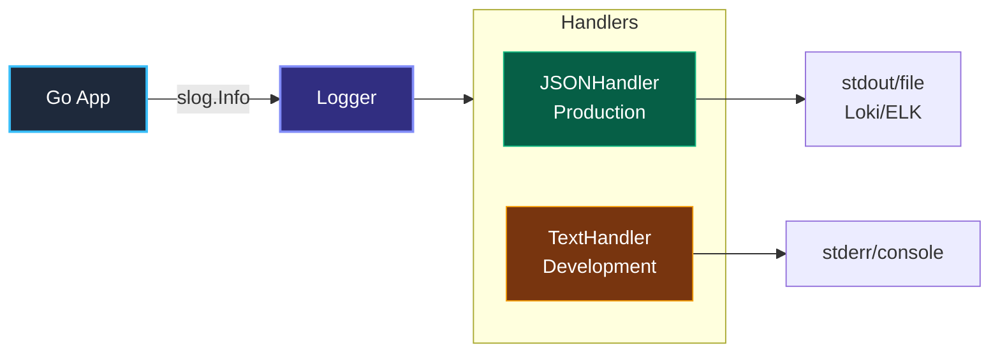

# 1. Структурированное логирование (Structured Logging)

> *«Самым надежным инструментом отладки по-прежнему остается вдумчивое размышление, подкрепленное разумно расставленными операторами вывода».*    
> — Брайан Керниган

## Эволюция логирования: От текста к данным

В предыдущих главах мы подробно изучили метрики — надежные числовые датчики на приборной панели нашей системы. Метрика мгновенно поднимает тревогу: «На сервисе заказов частота пятисотых ошибок подскочила до 15%». Но метрика принципиально не способна ответить на вопрос: **«Какая именно строка кода упала и почему?»**.

Здесь в игру вступает второй фундаментальный столп наблюдаемости — **логи (Logs)**. Логи представляют собой детальный бортовой самописец («черный ящик»), фиксирующий дискретные события с полным контекстом.

Однако классический подход к логированию из эпохи монолитов («вывести строчку текста через `printf` с отметкой времени в локальный файл») в современном распределенном Cloud-Native мире терпит полный крах. В среде микросервисов, Kubernetes и сотен тысяч событий в секунду единственным жизнеспособным решением является **Structured Logging (Структурированное логирование)**.

---

## Проблема неструктурированных логов

Представьте классический неструктурированный лог в текстовом формате:

```text
2023-10-27 10:00:05 ERROR user_id=123 failed to connect to db: connection refused
2023-10-27 10:00:06 INFO User 456 logged in successfully
```

Для человеческого глаза такая запись выглядит привычно и понятно. Но компьютер видит в ней лишь плоский нетипизированный массив байтов.

Представьте, что в продакшене дежурный инженер пытается расследовать инцидент и найти все ошибки, связанные с конкретным клиентом `user_id=123`.
В неструктурированном мире у вас есть только один инструмент — **регулярные выражения (RegEx) или `grep`**:
1. **Чудовищная нагрузка на CPU:** Полнотекстовый поиск и парсинг регулярных выражений по терабайтам логов на лету в Elasticsearch или Grafana Loki сжигает процессорные мощности дата-центра.
2. **Хрупкость и ненадежность:** Достаточно разработчику случайно поставить лишний пробел, написать `userId: 123` вместо `user_id=123` или переставить слова местами, как запрос перестанет находить эти события.
3. **Отсутствие типизации:** Числа, булевы флаги, миллисекунды задержки — все превращается в текст. Невозможно отфильтровать записи по условию `duration > 500ms` без предварительного тяжелого парсинга.

В распределенной системе, где логи пишутся в Loki или ELK, парсинг таких строк на лету — это пустая трата ресурсов.

---

## Структурированное логирование: JSON как стандарт

Structured Logging меняет парадигму. Лог — это не строка текста, а **набор пар ключ-значение** (Key-Value pairs). Обычно это сериализуется в JSON.

Каждое событие превращается в строго типизированный структурированный объект:

```json
{
  "time": "2023-10-27T10:00:05Z",
  "level": "ERROR",
  "msg": "failed to connect to db",
  "user_id": 123,
  "error": "connection refused",
  "trace_id": "abc-xyz-99"
}
```

**Преимущества:**
1.  **Индексация:** Системы агрегации (Loki, Elasticsearch) могут сразу проиндексировать поля `user_id` или `trace_id`.
2.  **Скорость поиска:** Найти все логи по `user_id=123` — это простой запрос по индексу, а не Full Scan текста.
3.  **Типизация:** `user_id` может храниться как число, `duration` — как float. Это позволяет строить графики и агрегаты прямо из логов (хотя для метрик есть Prometheus).

---

## Go и log/slog: Новый стандарт

До версии Go 1.21 в стандартной библиотеке не было структурированного логгера. Все использовали сторонние решения: `uber-go/zap`, `rs/zerolog` или `sirupsen/logrus`.

Это приводило к фрагментации экосистемы: одна библиотека требовала логгер от Uber, другая — интерфейс `logrus`, а третья писала в стандартный `log.Logger`.

С выходом Go 1.21 появился пакет **`log/slog`**. Это официальный, легковесный и производительный структурированный логгер, ставший единым стандартом языка.

### Идиоматичное использование

Ключевая концепция `slog` — это пара ключ-значение, передаваемая после сообщения.

```go
package main

import (
	"log/slog"
	"os"
)

func main() {
	// Создаем логгер с JSON-хендлером (production-ready)
	logger := slog.New(slog.NewJSONHandler(os.Stdout, nil))
	slog.SetDefault(logger) // Делаем его глобальным по умолчанию

	// Структурированное логирование с контекстными парами ключ-значение
	slog.Error("Failed to process payment",
		"user_id", 12345,
		"order_id", "ord-99",
		"error", "insufficient funds",
	)
}
```

Вывод в `os.Stdout` будет валидным JSON, готовым к ingestion в Loki или Fluentbit:
```json
{"time":"2026-09-18T16:48:00.123456Z","level":"ERROR","msg":"Failed to process payment","user_id":12345,"order_id":"ord-99","error":"insufficient funds"}
```

---

## Under the Hood: Mechanical Sympathy

Почему выбор логгера важен для производительности? В высоконагруженных бэкендах операции логирования могут легко занять до 20–30% всего процессорного времени, если подходить к ним небрежно.

### 1. Аллокации (Allocations)

Старый `fmt.Printf` или `log.Printf` неявно используют рефлексию для форматирования строк. Это создает много «мусора» в куче (Heap allocation), нагружая Garbage Collector.
Каждый аргумент оборачивается в `interface{}` (`any`), что приводит к убеганию переменной в кучу (escape analysis) и непрерывным аллокациям памяти.

В `slog` и высокопроизводительных логгерах (`zap`, `zerolog`) используется подход с минимальными аллокациями.

`slog` использует структуру `slog.Attr` и интерфейс `slog.LogValuer` и оптимизированные методы для записи значений, избегая рефлексии там, где это возможно. Например, методы `slog.Int("user_id", 123)` или `slog.String("order_id", "ord-99")` размещают значение прямо в стековом кадре без упаковки в динамическую память.

### 2. Проверка уровня логирования (Level Check)

Самая дорогая операция в логировании — это не запись в файл, а подготовка данных (форматирование, вычисление аргументов).

В наивном коде аргументы вычисляются **до** того, как логгер поймет, нужно ли вообще писать это сообщение:

```go
// ПЛОХО: Строка конкатенируется и аргументы вычисляются ВСЕГДА,
// даже если уровень логирования INFO отключен в проде.
log.Println("Debug info: " + heavyFunction())

// ХОРОШО: slog проверяет уровень ДО выполнения.
// Если уровень ниже Debug, тяжелая функция не вызывается.
slog.Debug("Debug info", "data", slog.Any("val", heavyFunction()))
```

Если логгер настроен на уровень `Info`, метод `slog.Debug` проверяет `handler.Enabled(ctx, slog.LevelDebug)` в первой же инструкции, и если уровень выключен — немедленно выходит без форматирования и аллокаций.

> [!warning] Ловушка / Gotcha
> **Форматирование строк внутри логгера.**
> Новички часто пишут: `slog.Info(fmt.Sprintf("User %s logged in", user))`.
> Это принудительно создает новую строку в памяти (аллокация) *перед* вызовом логгера.
> **Правильно:** `slog.Info("User logged in", "user", user)`. Пусть логгер сам решает, как и когда форматировать данные.

---

## Архитектура: Handler и Middleware

`slog` построен на паттерне **Handler**. Вы можете переключать вывод (JSON для продакшена, Text для локальной разработки), меняя только хендлер.



Интерфейс `slog.Handler` требует реализации всего четырех методов:
- `Enabled(context.Context, Level) bool`
- `Handle(context.Context, Record) error`
- `WithAttrs(attrs []Attr) Handler`
- `WithGroup(name string) Handler`

Это позволяет писать свой middleware (например, для добавления `trace_id` в каждый лог автоматически, если он есть в контексте).

---

## Сравнение решений

| Логгер | Особенности | Использование | Производительность |
| :--- | :--- | :--- | :--- |
| **log/slog** | Стандартная библиотека Go 1.21+, простота, zero-allocation (почти). | Рекомендуется для всех новых проектов. | Очень высокая |
| **uber-go/zap** | Очень быстрый, строгая типизация полей, пул буферов. | Высоконагруженные системы, где каждый такт CPU на счету. | Максимальная (zero alloc) |
| **rs/zerolog** | Фокус на JSON без аллокаций, лаконичный chained API. | Альтернатива Zap, чуть проще API. | Экстремальная |
| **sirupsen/logrus** | Устаревший пионер Go-логирования. Обилие рефлексии и аллокаций. | Legacy-проекты (в режиме поддержки). | Умеренная |

> [!tip] Собеседование
> **Вопрос:** Зачем нам структурированные логи, если есть метрики?
> **Ответ:** Метрики отвечают на вопрос «Сколько?». Логи отвечают на вопрос «Что именно?».
> Метрика скажет: «Ошибок 500 стало 10 в минуту».
> Лог скажет: «Ошибка в функции X, юзер Y, ошибка connection refused».
> Метрики дешевы для хранения и быстры для запросов. Логи дороги, но содержат полный контекст.

---

## Итог

1.  **Structured Logging** превращает логи из текста в машиночитаемые данные (JSON).
2.  В Go 1.21+ используйте стандартный пакет **`log/slog`**.
3.  Избегайте форматирования строк (`fmt.Sprintf`) внутри вызовов логгера. Передавайте переменные как отдельные аргументы.
4.  Структурированные логи — основа для интеграции с системами агрегации (Loki, ELK).

В следующей статье мы разберем, как правильно управлять объемом логирования через **уровни логирования**: [[2. Уровни логирования]].