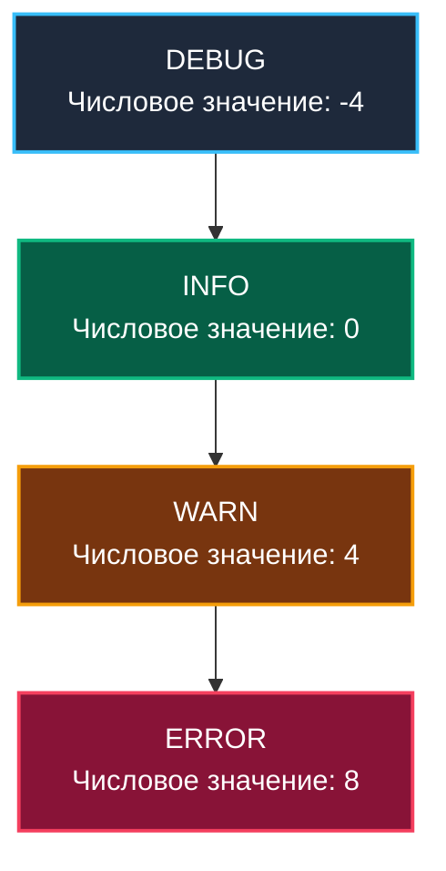

# 2. Уровни логирования (Log Levels): Фильтрация сигнала от шума

> *"There are two ways of constructing a software design: One way is to make it so simple that there are obviously no deficiencies, and the other way is to make it so complicated that there are no obvious deficiencies."*  
> — Тони Хоар

В предыдущей статье мы перешли от неструктурированного текста к типизированному JSON-логированию. Но здесь кроется коварная ловушка: структурированный логгер делает генерацию записей настолько легкой и удобной, что разработчики начинают логировать буквально каждую строчку кода и каждую итерацию цикла.

В продакшене под нагрузкой в десятки тысяч RPS такой подход моментально приводит к катастрофе: логи забивают дисковую подсистему серверов, утилизируют 100% полосы пропускания сети, а счет за хранение данных в Grafana Loki или Elasticsearch вырастает до астрономических сумм.

Чтобы обуздать этот информационный шторм, системная инженерия использует **Уровни логирования (Log Levels)** — строгий механизм фильтрации событий по степени их критичности.

---

## Управление информационным шумом

Главная задача системы логирования — сохранять **максимальный контекст при минимальном шуме**. 

Если логи переполнены мусорными сообщениями, дежурный инженер во время инцидента просто утонет в мегабайтах текста и не заметит истинную причину сбоя. Уровни логирования позволяют динамически регулировать «чувствительность микрофона»: при штатной работе мы слушаем только ключевые вехи, но при расследовании аномалий можем мгновенно повысить детальность на конкретном проблемном узле.

---

## Иерархия уровней

В стандартном пакете Go 1.21+ `log/slog` и большинстве зрелых библиотек принята стройная числовая шкала. Каждому уровню соответствует целочисленное значение (`type Level int`), причем интервал между уровнями специально равен 4, что оставляет простор для создания пользовательских промежуточных уровней:



### 1. DEBUG (-4)
**Смысл:** Детальная информация для отладки. Содержит трассировку выполнения, значения переменных, метки входа/выхода из функций.
**Когда использовать:** Только при разработке локально или при активном расследовании бага в конкретном поде. В продакшене обычно отключен.

### 2. INFO (0)
**Смысл:** Стандартные события жизненного цикла приложения. То, что происходит в «нормальном» режиме.
**Когда использовать:**
*   Запуск/остановка сервера.
*   Успешное подключение к БД.
*   Завершение бизнес-транзакции (например, «Заказ #123 создан»).

### 3. WARN (4)
**Смысл:** Предупреждение. Что-то пошло не так, но приложение может продолжить работу. Это признак потенциальной проблемы, которая может стать критической.
**Когда использовать:**
*   Попытка подключения не удалась, но есть механизм Retry.
*   Устаревший API вызван пользователем (Deprecation warning).
*   Кэш промахнулся (Cache miss), данные взяты из медленного источника.

### 4. ERROR (8)
**Смысл:** Ошибка. Сбой операции, который требует внимания. Запрос не может быть выполнен корректно.
**Когда использовать:**
*   Не удалось подключиться к БД после всех попыток.
*   Валидация данных провалена.
*   Паника внутри горутины (восстановление через `recover`).

> [!warning] Ловушка / Gotcha
> **Отсутствие FATAL уровня в slog.**
> В классических логгерах есть уровень `FATAL` (или `CRITICAL`), который пишет лог и немедленно завершает программу (`os.Exit(1)`).
> В `log/slog` (как и в философии Go) нет уровня Fatal. Завершение программы — это ответственность программиста, а не логгера. Использование `log.Fatal` из старого пакета `log` в библиотеках считается плохой практикой, так как библиотека не должна убивать приложение без ведома вызывающего кода.
> 
> Вызов `os.Exit(1)` прерывает работу рантайма без вызова отложенных функций `defer`, что приводит к утечке несохраненных буферов, незакрытым сетевым соединениям и битым файлам на диске.

---

## Mechanical Sympathy: Цена логирования

Многие разработчики думают: «Если уровень DEBUG выключен, то вызов `logger.Debug(...)` ничего не стоит». Это не совсем так. Рассмотрим два сценария.

### Сценарий 1: «Слепое» логирование

```go
// ОПАСНЫЙ КОД
result := heavyComputation()
logger.Debug("Result calculated", "value", result)
```

Даже если уровень установлен как INFO, и лог не запишется, **функция `heavyComputation()` все равно выполнится**. Процессор потратит время, память будет выделена под `result`. Это классическая проблема «вычисления аргументов». В Go аргументы функции вычисляются *до* входа в тело метода.

### Сценарий 2: Ленивое вычисление (Log This)

В `slog` и других продвинутых логгерах есть механизм проверки уровня перед вычислением.

```go
// ПРАВИЛЬНЫЙ КОД
if logger.Enabled(nil, slog.LevelDebug) {
    // Код выполнится ТОЛЬКО если Debug включен
    result := heavyComputation()
    logger.Debug("Result calculated", "value", result)
}
```

Или использование `LogValuer` интерфейса (аналог `Stringer`), который вызывается только если лог реально пишется.

> [!info] Под капотом
> `slog` использует интерфейс `LogValuer`. Если вы передаете структуру, реализующую метод `LogValue() Value`, этот метод будет вызван **только** в момент записи. Если уровень логирования фильтрует сообщение, метод вызван не будет, и вы сэкономите ресурсы CPU.
> 
> Кроме того, `LogValuer` незаменим для сокрытия чувствительных данных (Data Masking / PII). Если структура содержит пароль или номер кредитной карты, метод `LogValue()` может вернуть объект со скрытыми звездочками полями (`"card": "****-1234"`).

---

## Best Practices: Что куда писать?

Частая ошибка на собеседованиях и в продакшене — неправильный выбор уровня. Золотое правило: **Логи уровня ERROR должны требовать действия (Actionable).**

Если вы логируете `ERROR`, но игнорируете его в дежурстве (не создаете алерт и не бежите чинить), значит, это `WARN` или `INFO`.

Если дежурный инженер привыкает, что в логах постоянно мелькают сотни `ERROR`, наступает **усталость от алертов (alert fatigue)**. Когда случится настоящая авария, ее примут за очередной привычный шум.

### Пример: Работа с внешним API

1.  **Retry logic (Попытка 1 из 3):** Запрос упал.
    *   Уровень: `DEBUG` или `WARN` (если это частая проблема). Ошибка временная, система сама справляется. Не нужно будить админа ночью.
2.  **Retry logic (Попытка 3 из 3):** Все попытки исчерпаны. Запрос к API критичен для бизнес-процесса.
    *   Уровень: `ERROR`. Бизнес-операция прервана. Нужно вмешательство или компенсирующая транзакция.

---

## Динамическое управление уровнем

В продакшене часто бывает нужно временно включить `DEBUG` на конкретном инстансе, чтобы поймать редкий баг, не перезагружая приложение.

В Go это реализуется через изменение уровня в Handler'е.
Стандартный `slog` позволяет менять уровень, если вы используете кастомный хендлер или обертку. Многие используют библиотеки вроде `logr` или пишут HTTP-эндпоинт для смены уровня на лету.

В основе потокобезопасного переключения уровней лежит специальный тип `slog.LevelVar`:

```go
package main

import (
	"log/slog"
	"net/http"
	"os"
)

// Пример обертки для динамического управления
type dynamicLevelHandler struct {
	handler slog.Handler
	level   *slog.LevelVar // Потокобезопасная переменная уровня
}

func (h *dynamicLevelHandler) SetLevel(l slog.Level) {
	h.level.Set(l)
}

func main() {
	lvl := new(slog.LevelVar)
	lvl.Set(slog.LevelInfo) // По умолчанию Info

	opts := &slog.HandlerOptions{Level: lvl}
	handler := slog.NewJSONHandler(os.Stdout, opts)
	logger := slog.New(handler)
	slog.SetDefault(logger)

	// HTTP-ручка для переключения уровня дежурным инженером
	http.HandleFunc("/debug/log/level", func(w http.ResponseWriter, r *http.Request) {
		queryLevel := r.URL.Query().Get("level")
		switch queryLevel {
		case "debug":
			lvl.Set(slog.LevelDebug)
			w.Write([]byte("Log level switched to DEBUG\n"))
		case "info":
			lvl.Set(slog.LevelInfo)
			w.Write([]byte("Log level switched to INFO\n"))
		default:
			w.WriteHeader(http.StatusBadRequest)
			w.Write([]byte("Unknown level\n"))
		}
	})
}
```

Это позволяет реализовать паттерн "Tap to debug": в обычное время уровень INFO, но как только метрики показывают аномалию на конкретном поде, автоматика или человек переключает его в DEBUG на 5 минут.

---

## Итог

1.  **Уровни логирования** — это фильтр сигнала от шума.
2.  **DEBUG** — для разработки, **INFO** — для бизнес-событий, **WARN** — для аномалий, **ERROR** — для сбоев, требующих внимания.
3.  Избегайте «тяжелых» вычислений в аргументах логгера, если уровень может быть выключен (используйте проверку `Enabled`).
4.  Не злоупотребляйте уровнем `ERROR`. Если вы не собираетесь pager'ить дежурного инженера в 3 часа ночи из-за этого лога — это не `ERROR`.

В следующей статье мы подробно рассмотрим конкретные инструменты и библиотеки для логирования в экосистеме Go: [[3. Логирование в Go]].