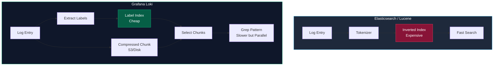

# 5. Log Aggregation: Системы сбора и агрегации логов (ELK, Loki, ClickHouse)

> *"The question of whether machines think is about as relevant as the question of whether submarines swim."*  
> — Эдсгер Дейкстра

В предыдущей статье мы выстроили магистральный пайплайн сбора логов от стандартного потока вывода `stdout` через локальные агенты ноды. Теперь перед архитектором встает ключевой инженерный вопрос: **куда складывать эти гигабайты и терабайты текстовых данных?**

Выбор платформы агрегации логов — это классический архитектурный компромисс между стоимостью хранения (Storage Cost), скоростью поиска (Query Latency) и вычислительной нагрузкой на процессор при вставке (Ingestion Throughput).

В современной бэкенд-инженерии доминируют три принципиально разные парадигмы: классический полнотекстовый поиск на инвертированных индексах (**ELK Stack / OpenSearch**), легковесный потоковый подход с индексацией только метаданных (**Grafana Loki**) и высокопроизводительное колоночное хранение (**ClickHouse**). Разберем их внутреннее устройство и инженерные трейдоффы.

---

## Выбор платформы для хранения логов

Каждая из систем проектировалась под свой набор исходных ограничений:



---

## 1. ELK Stack (Elasticsearch, Logstash, Kibana)

Исторически **ELK Stack** (и его открытый форк OpenSearch) долгие годы оставался стандартом де-факто для централизованного логирования. В основе Elasticsearch лежит поисковая библиотека Apache Lucene.

### Under the Hood: Inverted Index

Представьте фундаментальную книгу. В конце есть алфавитный предметный указатель терминов и номера страниц, где они встречаются. Это и есть **инвертированный индекс (Inverted Index)**.

Elasticsearch разбивает текст лога на токены (токенизация) и строит мапу: `Word -> [DocID1, DocID2]`.

Когда вы отправляете JSON-лог:
1. Анализатор Lucene разбивает сообщение на отдельные слова (токены), отсекает стоп-слова и приводит регистр.
2. В структуру FST (Finite State Transducer) записывается словарь терминов.
3. Для каждого термина формируется список идентификаторов документов (Posting List).

*   **Плюс:** Молниеносный полнотекстовый поиск. Вы можете найти `"NullPointerException"` по всем сервисам за секунды.
*   **Минус:** Индексация тяжелая. Каждый вставленный документ требует CPU на парсинг и обновление индекса. Хранение занимает много места (индекс может быть больше самих данных).

> [!warning] Ловушка / Gotcha
> **Mapping Explosion.**
> Elasticsearch требует жесткой схемы (mapping) для полей. Если вы логируете JSON и у вас в поле `data` иногда прилетает строка, а иногда число — Elastic упадет с ошибкой конфликта типов.
> Если вы используете динамическое маппинг, и в лог случайно попадет уникальный ID как поле верхнего уровня (например, `msg_1234: "..."`), Elastic создаст новое поле в схеме. Тысячи таких полей убьют кластер (OutOfMemory).
> 
> Состояние схемы (Cluster State) реплицируется между всеми Master-нодами кластера. При раздувании схемы до десятков тысяч полей кластер замирает при любой попытке синхронизации состояния.

---

## 2. Grafana Loki

**Loki** часто называют «Prometheus для логов». Разработчики компании Grafana Labs применили гениальную инженерную инверсию: зачем индексировать каждое слово в логах, если 99% времени инженеры ищут логи конкретного сервиса за узкий интервал времени?

### Under the Hood: Labels & Chunks

Loki индексирует только **метаданные** (лейблы: `app=payment`, `env=prod`), а сами логи хранит в сжатых чанках (chunks) без парсинга. Сами чанки сжимаются алгоритмами Snappy или Gzip и складываются напрямую в дешевое объектное хранилище (Amazon S3, Google Cloud Storage или MinIO).

Когда вы ищете текст `error` в Loki:
1.  Loki ищет все чанки по лейблам (быстро, по индексу).
2.  Загружает чанки в память.
3.  Распаковывает и делает "grep" (линейный поиск) по содержимому.

Благодаря параллелизму (распределенный компонент Querier нарезает временной диапазон на параллельные задачи для сотен ядер), распределенный «grep» по сжатым чанкам выполняется за доли секунды.

Это медленнее, чем Elastic, но **в разы дешевле** в хранении и ingestion (приеме данных).

> [!tip] Собеседование
> **Вопрос:** В чем главный риск архитектуры Loki?
> **Ответ:** Выбор неправильных лейблов. Как и в Prometheus, лейблы в Loki должны иметь низкую кардинальность. Если вы сделаете лейбл `user_id`, Loki создаст отдельный индексный стрим для каждого пользователя. Это положит базу данных Loki (High Cardinality Labels). Уникальные данные (ID, TraceID) должны быть внутри лога, а не в лейблах.

---

## 3. ClickHouse

Третий игрок — высокопроизводительная колоночная аналитическая СУБД. Изначально не предназначенная для логов, но сейчас набирающая колоссальную популярность (проекты как Victoria Logs, Uber LogKeeper или самописные таблицы на движке MergeTree).

### Under the Hood: Columnar Storage

ClickHouse хранит данные колонками, а не строками. Это дает феноменальное сжатие (логи часто повторяются) и скорость агрегации.

*   **Сценарий:** Аналитика. «Сколько ошибок 500 было за последний час с группировкой по endpoint?».
*   **Преимущество:** ClickHouse обрабатывает такие запросы в сотни раз быстрее Elastic и Loki, так как читает только нужные колонки, а не весь документ.

Данные непрерывно сжимаются векторными алгоритмами LZ4 или ZSTD. Поскольку миллионы записей в колонке `service_name` содержат одинаковые строки, они сжимаются практически в ноль.

---

## Сравнительная таблица

| Характеристика | Elasticsearch | Grafana Loki | ClickHouse |
| :--- | :--- | :--- | :--- |
| **Тип поиска** | Полнотекстовый (Index) | Поиск по лейблам + Grep | Аналитический (SQL) |
| **Стоимость хранения** | Высокая (Index overhead) | Низкая (объектное хранилище) | Очень низкая (сжатие) |
| **Нагрузка при записи** | Высокая (токенизация) | Низкая (просто append) | Средняя |
| **Потребление RAM** | Высокое (Field Data Cache) | Низкое | Высокое (для агрегаций) |
| **Сложность поддержки** | Высокая (Java, GC) | Средняя (Go, single binary) | Средняя |
| **Best for** | Поиск текста, сложные запросы | Дешевое хранение, Kubernetes logs | Аналитика, тренды, отчеты |

---

## Интеграция с Go

Независимо от выбора системы, ваш код на Go не должен зависеть от неё напрямую. Вы пишете в stdout.
Однако, формат лога важен.

1.  **Для Elastic:** Нужен плоский JSON. Избегайте вложенных объектов, если не настроили mapping — Elastic "разгладит" их (`nested.field`), что может раздуть схему.
2.  **Для Loki:** Важно правильно настроить Promtail (agent), чтобы он выдирал лейблы из лога. Часто используют формат `logfmt` (key=value), который легче парсить, чем JSON.
    *   Go библиотека `log/slog` поддерживает `LogValuer`, что позволяет гибко управлять выводом.

### Пример: Logfmt vs JSON

**JSON** (стандарт):
```json
{"level":"info","ts":1689846256,"msg":"user logged","user_id":123}
```
*   Хорошо для машины.

**Logfmt** (популярен в Loki/Prometheus):
```text
level=info ts=1689846256 msg="user logged" user_id=123
```
*   Читаемее человеком.
*   Чуть легче по CPU для парсинга (меньше скобок и кавычек).

---

## Итог

1.  **ELK** выбирайте, если вам нужен мощный полнотекстовый поиск и у вас есть бюджет на железо. Берегитесь Mapping Explosion.
2.  **Loki** — выбор для Kubernetes и стартапов. Дешево, сердито, интеграция с Grafana из коробки. Не используйте High Cardinality Labels.
3.  **ClickHouse** — для аналитики и долгосрочного хранения огромных объемов.

Раздел логирования завершен. Мы переходим к третьему столпу Observability — Трейсингу. В следующей статье мы разберем, как отслеживать запросы через границы микросервисов: [[1. Distributed tracing]].