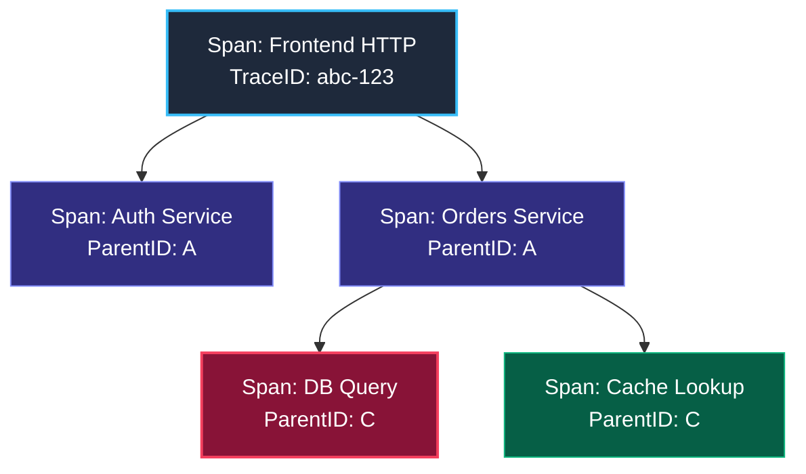

# 1. Распределенная трассировка (Distributed Tracing): Анатомия сквозного запроса

> *"Debugging is twice as hard as writing the code in the first place. Therefore, if you write the code as cleverly as possible, you are, by definition, not smart enough to debug it."*  
> — Брайан Керниган

В предыдущих разделах мы подробно изучили метрики (которые первыми бьют тревогу «что-то сломалось») и логи (которые фиксируют детальные текстовые отчеты о событиях). Однако по мере того, как архитектура наших приложений эволюционирует от монолитов к распределенным микросервисам, мы сталкиваемся с новым классом непостижимых проблем.

Представьте классическую ситуацию: пользователь жалуется, что нажатие кнопки «Оформить заказ» в мобильном приложении зависает на мучительные 10 секунд.
*   **Метрики** сервиса `frontend` показывают всплеск задержки P99, но метрики шлюза `payments` и сервиса `orders` выглядят абсолютно спокойно и зелено. Где именно теряются драгоценные секунды?
*   **Логи** сервиса `frontend` лаконично сообщают: `Error: timeout calling orders service`. Но почему случился таймаут? Застрял сетевой пакет в виртуальном коммутаторе Kubernetes? Заблокировалась таблица в PostgreSQL? Или сервис аутентификации медленно проверял JWT-токен?

В монолитном приложении программист просто снял бы стек вызовов (Stack Trace) и за пару секунд увидел цепочку функций. Но в микросервисах классический стек вызовов физически разорван сетевыми границами. Чтобы восстановить его воедино, необходима **Распределенная трассировка (Distributed Tracing)**.

---

## Проблема невидимости в микросервисах

В монолите стек вызовов поддерживается самим процессором: инструкция ассемблера `CALL` кладет адрес возврата на стек (`RSP`), а отладчик легко проходит по цепочке стековых кадров.

В микросервисной архитектуре вызов функции превращается в сериализацию JSON или Protobuf, передачу через сокет TCP, маршрутизацию в Service Mesh и ожидание ответа. Каждый микросервис живет в своем собственном адресном пространстве на разных физических серверах. Без единого сквозного идентификатора система превращается в непроницаемый «черный ящик».

Distributed Tracing выполняет роль виртуального распределенного стека вызовов, пронизывающего все узлы и сервисы кластера.

---

## Основные концепции

Трейсинг восстанавливает путь запроса через множество сервисов, баз данных и очередей.



### 1. Trace (Трейс)

Это полная история одного запроса от начала до конца. Trace объединяет все операции, произошедшие в рамках одного логического сценария (например, «Пользователь нажал кнопку Купить»).
Идентификатор трейса — **Trace ID**. Это глобальный уникальный ключ, который путешествует с запросом через все сервисы.

Физическая аналогия: **трек-номер посылки** в международной почтовой службе. Посылка меняет поезда, самолеты и склады, но ее единый трек-номер позволяет увидеть всю цепочку перемещений.

### 2. Span (Спан)

Это атомарная единица работы внутри трейса. Спан описывает, что происходило в конкретном месте.
*   Имя: `HTTP GET /checkout`
*   Время начала (Start Timestamp).
*   Длительность (Duration).
*   **Parent ID:** ID родительского спана (кто вызвал этот код).
*   Атрибуты (Key-Value теги, например `http.status_code = 200`, `db.statement = "SELECT ..."`).
*   События (Events: легковесные логи внутри спана с таймстемпом).

Трейс — это направленный ациклический граф (DAG), или дерево спанов, где у каждого дочернего спана есть ссылка на `Parent ID`.

---

## Under the Hood: Context Propagation

Самая сложная часть трейсинга — это не сбор данных, а их **проброс (Propagation)**. Как Trace ID попадает из сервиса A в сервис B?

В Go основным механизмом переноса контекста является `context.Context`. Когда вы используете библиотеку OpenTelemetry, она делает следующее:

1.  **Injection (Инъекция):** Перед отправкой HTTP-запроса в сервис B, клиент извлекает текущий Trace ID и Span ID из `context.Context` и вставляет их в HTTP-заголовки.
    *   Стандартный заголовок: `traceparent` (формат W3C Trace Context).
2.  **Extraction (Экстракция):** Сервис B получает HTTP-запрос. Middleware (HTTP Interceptor) проверяет наличие заголовка `traceparent`, извлекает оттуда Trace ID и сохраняет его в свой `context.Context`.

Структура официального бинарного и текстового стандарта консорциума W3C:

```text
HTTP Headers:
traceparent: 00-4bf92f3577b34da6a3ce929d0e0e4736-00f067aa0ba902b7-01
             ^  ^-------------------------------- ^----------------- ^
             |  Trace ID (hex)                   Parent Span ID     Flags
             Version
```

*   `00`: Версия спецификации W3C Trace Context.
*   `4bf92f3577b34da6a3ce929d0e0e4736`: 16-байтный (32 символа hex) глобальный Trace ID.
*   `00f067aa0ba902b7`: 8-байтный (16 символов hex) Span ID вызывающей стороны (Parent Span ID).
*   `01`: Битовые флаги трассировки (`01` означает, что данный трейс сэмплирован для записи).

Если вы забудете передать `context.Context` в вызов функции или HTTP-клиент, цепочка прервется. Начнется новый трейс, и вы потеряете связь между сервисами.

> [!warning] Ловушка / Gotcha
> **Горутины и контекст.**
> Если вы запускаете новую горутину для фоновой задачи, она не наследует контекст автоматически, если вы не передадите его явно.
> `go func() { doWork(ctx) }()`
> Если передать `ctx`, новая горутина продолжит участвовать в текущем трейсе. Если передать `context.Background()` или `context.TODO()`, связь потеряется.

---

## Mechanical Sympathy: Стоимость трейсинга

Трейсинг не бесплатен. Каждый спан требует ресурсов.

1.  **CPU:** Создание спана, генерация ID, запись timestamp. В Go это относительно дешево, но при 100,000 RPS накладные расходы могут составить 1-3% CPU.
2.  **Memory:** Спан — это объект в памяти. Он живет, пока запрос обрабатывается. Долгие запросы «висят» в памяти.
3.  **Network:** Данные о спанах нужно отправить в коллектор (Jaeger/Tempo).

### Семплирование (Sampling)

Чтобы не утонуть в данных, применяют сэмплирование.

*   **Head-based Sampling:** Решение о том, сохранять ли трейс, принимается в самом начале запроса (случайным образом, например, 1% трафика). Это дешево, но можно пропустить редкие ошибки.
*   **Tail-based Sampling:** Решение принимается в конце. Сохраняются только «интересные» трейсы (с ошибками или очень медленные). Это требует буферизации всех спанов в памяти коллектора, что сложно и дорого.

> [!tip] Собеседование
> **Вопрос:** В чем разница между метрикой Latency и данными из Трейсинга?
> **Ответ:** Метрика Latency (Histogram) дает агрегированную статистику: «P99 latency = 500ms». Это хорошо для алертов.
> Трейсинг дает конкретный пример: «Вот один конкретный запрос, который занял 500ms, и вот он застрял в функции `JSON.Marshal` на 400ms».
> Метрика отвечает «Сколько?», Трейсинг отвечает «Где именно?».

---

## Итог

Distributed Tracing — это «МРТ» для микросервисов. Он превращает разрозненные логи и метрики в связную историю жизни запроса.
1.  **Trace ID** связывает все события одного запроса.
2.  **Span** описывает конкретную операцию и её длительность.
3.  **Context Propagation** — механизм передачи ID между сервисами (через HTTP headers или gRPC metadata).

В следующей статье мы рассмотрим стандарт, который объединил в себе всё лучшее из мира телеметрии — OpenTelemetry: [[2. OpenTelemetry]].