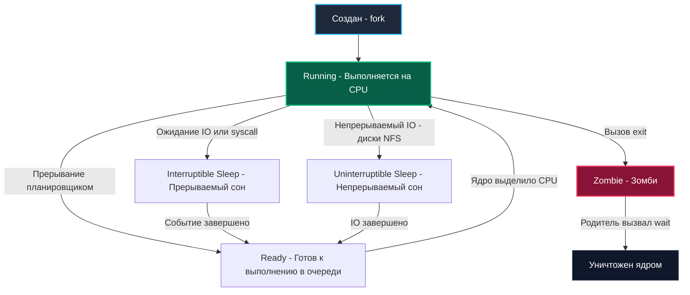

# 2. Процессы и сигналы в Linux: Анатомия управления жизненным циклом бэкенда

> *«Процессы — фундаментальная единица вычислений в Unix. Программа — всего лишь мертвые байты на диске; процесс — это программа в действии, ожившая в памяти машины».*    
> — Брайан Керниган

Когда вы компилируете бинарный файл на Go и запускаете его в операционной системе Linux, ядро создает **процесс**. Для бэкенд-инженера процесс — это не просто абстрактный «работающий код». В представлении ядра Linux процесс — это фундаментальная структура данных ядра `task_struct`, в которой зафиксированы все ресурсы: дескрипторы открытых сокетов и файлов, таблицы отображения виртуальной памяти, регистры процессора, маски сигналов и права доступа.

Управление процессами и сигналами — это базис надежности распределенных систем. Любой деплой нового релиза, любое масштабирование в Kubernetes или аварийная остановка контейнера начинаются с системных вызовов и сигналов операционной системы. Если ваш Go-сервис не умеет правильно умирать (Graceful Shutdown), вы неизбежно столкнетесь с битыми транзакциями клиентов, пятисотыми ошибками в HTTP-шлюзах и зомби-процессами, переполняющими память сервера.

---

## Анатомия процесса в Linux

В отличие от операционной системы Windows, где создание нового процесса — это тяжеловесная монолитная операция, в Unix и Linux процесс рождается через исторический тандем двух системных вызовов: `fork()` и `execve()`.

1. `fork()` (под капотом системный вызов `clone()`) создает точную копию родительского процесса: копируется таблица дескрипторов файлов, окружение, права доступа. Благодаря механизму **Copy-on-Write (COW)** страницы оперативной памяти не дублируются физически в момент создания — ядро помечает их как read-only и создает копию физической страницы только тогда, когда один из процессов пытается в нее записать.
2. `exec()` (семейство системных вызовов `execve()`) полностью заменяет адресное пространство текущего процесса новым кодом: загружает секции ELF-файла вашего Go-бинарника (секции `.text`, `.data`, `.rodata`), переинициализирует регистры и передает управление точке входа рантайма Go (`_rt0_amd64_linux`).

В глазах ядра Linux ваш запущенный Go-сервис — это обычный процесс, которому назначен уникальный числовой идентификатор PID (Process ID) и ссылка на родителя PPID (Parent PID). Внутри процесса рантайм Go создает потоки ОС (структуры M), в которых планировщик распределяет пользовательские горутины (G).

---

### Состояния процесса

Процесс не всегда "жует" такты CPU. Ядро Linux управляет процессами, переводя их в разные состояния:



*   **Running / Ready (`TASK_RUNNING`):** Процесс либо активно исполняет инструкции на ядре CPU, либо стоит в очереди планировщика CFS (Completely Fair Scheduler), готовый к немедленному исполнению.
*   **Interruptible Sleep (`TASK_INTERRUPTIBLE`):** Процесс заблокирован в ожидании события (данные из сетевого сокета, таймер, сигнал). Пробуждается по приходу данных или внешнего сигнала.
*   **Uninterruptible Sleep (`TASK_UNINTERRUPTIBLE`, состояние 'D'):** Процесс ожидает критического аппаратного ввода-вывода (например, страница подкачивается со сбоящего диска или зависшего NFS-хранилища). Процесс в состоянии 'D' нельзя убить даже сигналом `SIGKILL` — он не вернется в User Space, пока драйвер диска не завершит операцию.
*   **Zombie (`EXIT_ZOMBIE`, состояние 'Z'):** Процесс завершил работу, освободил всю память и дескрипторы, но запись о нем сохраняется в таблице процессов ядра, пока родитель не прочитает код возврата.

> [!warning] Ловушка / Gotcha
> Состояние **Zombie** (Зомби) — это процесс, который уже завершил выполнение, но его родитель еще не забрал код завершения (через системный вызов `wait`). Зомби не потребляют CPU или RAM, но они занимают запись в таблице процессов ядра (PID). Если ваш Go-сервис плодит зомби (например, выполняя `exec.Command` и не вызывая `cmd.Wait()`), рано или поздно ядро исчерпает лимит PID, и новые процессы (включая горутины, пытающиеся сделать `os/exec` или системный вызов) не смогут создаться.

---

## Сигналы: Асинхронное управление процессом

Сигналы — это программные прерывания, механизм коммуникации между ядром (или другими процессами) и вашим приложением. Когда вы нажимаете `Ctrl+C` в терминале, ядро отправляет вашему процессу сигнал `SIGINT`. Когда Docker останавливает контейнер, он отправляет `SIGTERM`.

Сигналы можно разделить на три категории:
1. **Синхронные (Ошибки)**: `SIGSEGV` (доступ к nil-указателю / незаконная память), `SIGFPE` (деление на ноль). Генерируются самим процессом из-за ошибки.
2. **Асинхронные (Внешние)**: `SIGTERM`, `SIGINT`, `SIGHUP`. Приходят извне.
3. **Неотлавливаемые**: `SIGKILL` (9) и `SIGSTOP`. Их нельзя перехватить, игнорировать или блокировать. Ядро немедленно убивает/останавливает процесс.

### Как Go обрабатывает сигналы под капотом

В классическом C/C++ написать безопасный обработчик сигнала (Signal Handler) — это ад. В обработчике нельзя вызывать почти никакие функции библиотеки C (они не async-signal-safe), нельзя выделять память, нельзя использовать мьютексы. Можно только выставить `volatile sig_atomic_t` флаг и выйти.

Go решает эту проблему элегантно, перекладывая сложную логику в мир горутин.

Когда приходит асинхронный сигнал (например, `SIGTERM`), происходит следующее:
1. Ядро прерывает выполнение потока ОС (M) и передает управление в специальную функцию-диспетчер рантайма Go (написанную на ассемблере/C).
2. Если сигнал синхронный (например, `SIGSEGV`), и горутина не восстановима — рантайм паникует (panic) и завершает программу с дампом стека.
3. Если сигнал асинхронный и предназначен для обработки пользователем (мы подписались через `os/signal`), рантайм не выполняет вашу логику прямо в обработчике прерывания. Вместо этого он пробуждает специальную, скрытую горутину — **`gsignal`**.
4. `gsignal` работает на отдельном системном потоке (или использует специальный стек сигнала `sigaltstack`, чтобы не зависеть от стека текущей горутины) и безопасно маршрутизирует сигнал в канал `os/signal`, откуда его уже читает ваша обычная горутина.

Таким образом, обработка сигналов в Go становится безопасной: вы работаете с сигналами так же, как с данными из канала, не нарушая ограничений async-signal-safety.

---

## Graceful Shutdown: Искусство правильной смерти

Главная задача бэкенд-разработчика при работе с сигналами — реализовать Graceful Shutdown (Плавное завершение). Когда Kubernetes или Docker отправляют вашему контейнеру команду на остановку, вы должны успеть:
1. Перестать принимать новые запросы.
2. Дослужить текущие активные HTTP-соединения (дожидаться окончания обработки).
3. Сбросить буферы логов.
4. Закрыть соединения с БД и кэшем.
5. Завершить фоновые воркеры.

Если вы проигнорируете `SIGTERM`, инфраструктура подождет таймаут (обычно 30 секунд) и отправит `SIGKILL`, что равносильно выдергиванию шнура из розетки. Активные запросы упадут с ошибкой 502/504, данные в буферах логов пропадут.

### Идиоматичный Graceful Shutdown в Go

С версии Go 1.16 появился прекрасный пакет `context` с функцией `signal.NotifyContext`, который делает код чистым и декларативным.

```go
package main

import (
	"context"
	"fmt"
	"log"
	"net/http"
	"os/signal"
	"syscall"
	"time"
)

func main() {
	// 1. Создаем контекст, который отменяется при получении SIGINT или SIGTERM
	ctx, stop := signal.NotifyContext(context.Background(), syscall.SIGINT, syscall.SIGTERM)
	defer stop() // Важно освободить ресурсы signal handler'а

	mux := http.NewServeMux()
	mux.HandleFunc("/", func(w http.ResponseWriter, r *http.Request) {
		// Имитация долгой обработки запроса
		time.Sleep(5 * time.Second)
		fmt.Fprintln(w, "Hello, World!")
	})

	srv := &http.Server{
		Addr:    ":8080",
		Handler: mux,
	}

	// 2. Запускаем HTTP сервер в отдельной горутине
	go func() {
		log.Println("Server starting on :8080")
		if err := srv.ListenAndServe(); err != nil && err != http.ErrServerClosed {
			log.Fatalf("Server failed: %v", err)
		}
	}()

	// 3. Блокируемся, пока не придет сигнал завершения
	<-ctx.Done()

	// Как только пришел сигнал, NotifyContext отменяет контекст
	log.Println("Shutdown signal received, shutting down gracefully...")

	// 4. Даем серверу время на доработку текущих запросов
	// Используем отдельный контекст с таймаутом для самого Shutdown
	shutdownCtx, cancel := context.WithTimeout(context.Background(), 10*time.Second)
	defer cancel()

	if err := srv.Shutdown(shutdownCtx); err != nil {
		log.Printf("Server shutdown error: %v", err)
	}

	log.Println("Server stopped")
}
```

> [!tip] Собеседование
> **Вопрос:** Что произойдет, если в коде выше мы подпишемся на `signal.Notify` и отправим процессу `SIGTERM`, но при этом забудем вызвать `srv.Shutdown()`?
> **Ответ:** По умолчанию, если Go-программа не перехватывает сигнал `SIGTERM` или `SIGINT` (или если после перехвата программа просто продолжает работать и завершает `main`), рантайм Go делает "грязное" завершение — немедленно вызывает `os.Exit(2)`. Если же вы перехватили сигнал, но функция `main` завершилась естественным путем (после `<-ctx.Done()`), программа завершится корректно, но соединения останутся открытыми до таймаута ОС. Метод `srv.Shutdown()` критически важен, потому что он закрывает слушающий сокет (перестает принимать новые коннекты) и дожидается завершения всех активных обработчиков, после чего функция `ListenAndServe` возвращает `http.ErrServerClosed`.

---

## Проблема PID 1 в контейнерах

В Linux есть процесс с PID 1 — это первый запущенный процесс (обычно `init` или `systemd`). У этого процесса есть особые обязанности:
1. Перехватывать сигналы от ядра.
2. "Жнить" (reap) зомби-процессы — дочерние процессы, которые завершились, но чьи родители умерли, и их нужно забрать из таблицы процессов.

Когда вы упаковываете Go-бинарник в Docker, по умолчанию он запускается как процесс с PID 1 внутри контейнера. И вот тут кроется ловушка.

> [!warning] Ловушка / Gotcha
> Если ваш Go-код выполняет `exec.Command` (создает дочерние процессы, например, вызов `ffmpeg` для транскодирования) и эти дочерние процессы порождают свои подпроцессы, то при их завершении они становятся зомби. В нормальной Linux-системе процесс `init` (PID 1) автоматически вызывает `wait`, чтобы их очистить. Но ваш Go-код, скорее всего, этого не делает (вы же вызываете `wait` только для прямого потомка `exec.Command`, а не для его "внуков"). В итоге таблица процессов переполняется.
> 
> **Вторая проблема:** Ядро отправляет сигналы (например, `SIGTERM` при `docker stop`) процессу с PID 1. Но если PID 1 — это ваш Go-бинарник, bash-скрипт-обертка или shell-форма `CMD` в Dockerfile (например, `CMD go run main.go`), сигнал может не дойти до вашего приложения, потому что оболочка (shell) не пробрасывает сигналы своим дочерним процессам. Контейнер просто зависнет на 30 секунд и будет убит через `SIGKILL`.

**Решения:**
1. Использовать `ENTRYPOINT` в Dockerfile в exec-форме (массив JSON): `ENTRYPOINT ["./myapp"]`. В этом случае ваш бинарник становится PID 1 напрямую, без оболочки, и корректно получает сигналы.
2. Использовать утилиту `tini` или `dumb-init` как точку входа: `ENTRYPOINT ["tini", "--", "./myapp"]`. Они станут PID 1, будут заниматься реапингом зомби и пробрасывать сигналы в ваш Go-процесс.

---

## Итог

1. Процесс в Linux — это объект `task_struct`. Понимание его состояний (особенно Zombie) критично при работе с `os/exec`.
2. Сигналы — это асинхронные прерывания. Go элегантно преобразует опасные сигналы ОС в безопасные события в каналах `os/signal` через внутреннюю горутину `gsignal`.
3. Graceful Shutdown через `signal.NotifyContext` и `http.Server.Shutdown` — абсолютный стандарт production-ready кода.
4. Проблема PID 1 в Docker требует использования exec-формы `ENTRYPOINT` или утилит вроде `tini` для корректного проброса сигналов и очистки зомби.

Понимание того, как процессы живут и умирают в Linux, неразрывно связано с тем, как они работают с файлами и устройствами. В следующей статье мы разберем файловую систему Linux: от Inodes до системных вызовов — [[3. Файловая система Linux]].