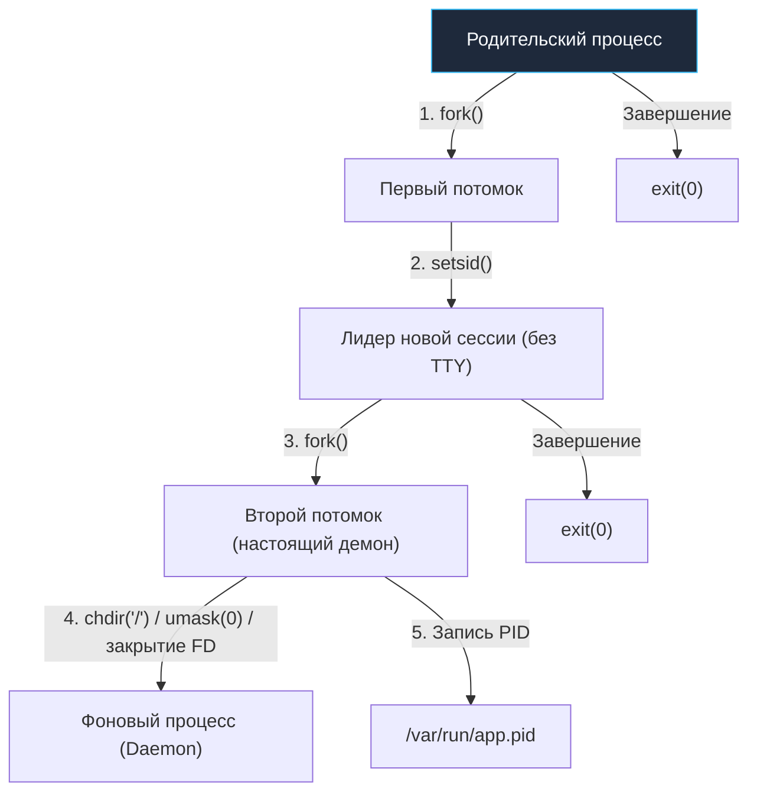

# Systemd и управление сервисами в Linux: От демонизации к современной оркестрации

Разработчики, пришедшие в Go из мира Python, Ruby, PHP или Node.js, привыкли полагаться на внешние менеджеры процессов — Gunicorn, Puma, php-fpm или PM2. Эти надстройки брали на себя заботу о размножении рабочих процессов (воркеров), их перезапуске при сбоях и агрегации журналов. 

В Go картина мира кардинально иная. Скомпилированный Go-бинарник — это полноценный, самодостаточный сервер. Внутри него уже зашит высокопроизводительный планировщик горутин (M:N), собственный HTTP/gRPC-сервер на базе неблокирующего сетевого поллера ядра и сборщик мусора. Никакой промежуточный сервер приложений не требуется.

Но возникает фундаментальный эксплуатационный вопрос: кто будет управлять самим бинарником на физическом сервере или виртуальной машине? Кто поднимет процесс после перезагрузки ОС? Кто перезапустит его при непредвиденной панике (`panic`) или фатальном `SIGSEGV`? Кто передаст ему сигналы мягкого завершения (`SIGTERM`) при деплое новой версии? В современной экосистеме Linux эту роль выполняет **Systemd** — системный менеджер и диспетчер инициализации с PID 1.

---

## 1. От классической демонизации к декларативному управлению

В классических Unix-системах долгоживущие фоновые программы (демоны) должны были самостоятельно «демонизировать» себя. Этот ритуал в Си требовал строгого и нетривиального набора системных вызовов:

1. Первый `fork()`: родительский процесс завершается, дочерний уходит в фон.
2. `setsid()`: создание новой пользовательской сессии, отсоединяющей процесс от управляющего терминала (TTY), чтобы случайное нажатие `Ctrl+C` или закрытие сессии SSH не убило демон сигналом `SIGHUP`.
3. Второй `fork()`: гарантия того, что процесс никогда больше не сможет случайно захватить новый управляющий терминал.
4. `chdir("/")`: смена текущего рабочего каталога на корень, чтобы демон не блокировал размонтирование файловых систем.
5. `umask(0)`: сброс маски прав создания файлов.
6. Переоткрытие дескрипторов 0, 1, 2 (`stdin`, `stdout`, `stderr`) в `/dev/null`.
7. Запись своего PID в файл блокировки (например, `/var/run/app.pid`).



### Почему в Go демонизация — опасный антипаттерн?

Попытка реализовать этот танец в Go сопряжена с критическими проблемами:

* **Потоки ОС и планировщик:** Системный вызов `fork()` в многопоточной программе копирует память только того системного потока ОС (`M`), который его вызвал. Состояние мьютексов других потоков рантайма Go оказывается поврежденным или замороженным. Рантайм Go принципиально запрещает вызов `fork()` в пользовательском коде без немедленного `execve()`.
* **Нарушение принципа разделения ответственности:** Процесс не должен отвечать за собственный мониторинг. Если процесс зависнет в deadlock'е или рухнет до записи PID-файла, внешняя система мониторинга потеряет над ним контроль.

Философия современных облачных и серверных архитектур гласит: **процесс не должен управлять собственным жизненным циклом**. Приложение должно работать на переднем плане (foreground). Оно читает переменные окружения, слушает сокет и пишет структурированные логи в `stdout`/`stderr`. Всю инфраструктурную работу — запуск, слежение за падениями, ограничение ресурсов и изоляцию — берет на себя Systemd (PID 1).

---

## 2. Анатомия эталонного Unit-файла для Go-сервиса

Конфигурация юнитов Systemd описывается в декларативном формате INI. Файлы сервисов размещаются в `/etc/systemd/system/<name>.service`.

Ниже представлен образцовый, закаленный в production unit-файл для высоконагруженного Go-бэкенда:

```ini
[Unit]
Description=My Awesome Go Backend Service
After=network-online.target postgresql.service
Wants=network-online.target
Documentation=https://internal.wiki/docs/backend

[Service]
# Режим notify: приложение само скажет Systemd, когда готово принимать трафик
Type=notify
NotificationSocket=/run/myapp-notify.sock

# Запуск с передачей флагов или конфигурационного файла
ExecStart=/usr/local/bin/myapp --config /etc/myapp/config.yaml

# Перезапуск только если процесс упал с ошибкой (не 0) или по сигналу
Restart=on-failure
RestartSec=5s

# Graceful Shutdown: отправляем SIGTERM, ждем 30 секунд, затем SIGKILL
KillMode=mixed
KillSignal=SIGTERM
TimeoutStopSec=30

# Лимиты системных дескрипторов (Mechanical Sympathy)
LimitNOFILE=65536

# Интеграция с Cgroups v2 (критично для Go 1.19+)
MemoryMax=512M
CPUQuota=200%

# Безопасность и изоляция (Linux Hardening)
User=myapp-user
Group=myapp-group
NoNewPrivileges=true
ProtectSystem=strict
ProtectHome=true
PrivateTmp=true
ReadWritePaths=/var/log/myapp /tmp

[Install]
WantedBy=multi-user.target
```

Разберем ключевые директивы:

* `After=network-online.target postgresql.service` и `Wants=network-online.target`: гарантируют, что сервис не попытается стартовать до того, как сетевой стек поднимет маршруты и поднимется локальная СУБД.
* `LimitNOFILE=65536`: снимает стандартное ограничение ядра на 1024 открытых файловых дескриптора. Для Go-сервера, обслуживающего тысячи одновременных TCP-соединений (keep-alive, базы данных, gRPC-каналы), дефолтный лимит означает мгновенную ошибку `socket: too many open files`.
* `NoNewPrivileges=true`, `ProtectSystem=strict`, `PrivateTmp=true`: на уровне ядра блокируют повышение привилегий через SUID, монтируют системные каталоги (`/usr`, `/boot`, `/etc`) в режиме Read-Only и создают изолированный каталог `/tmp` в отдельном пространстве имен.

> [!warning] Ловушка: Директива `Restart=always` против `Restart=on-failure`
> Указание `Restart=always` таит скрытую угрозу. Если администратор или автоматика деплоя намеренно отправляет процессу сигнал завершения, а код из-за бага завершается с ненулевым статусом или, напротив, падает в бесконечный цикл рестартов при фатальной ошибке в конфигурации, `always` заставит Systemd непрерывно перезапускать сломанный процесс, сжигая CPU и спамя в логи.
> 
> Если же приложение завершается с кодом `0` (`os.Exit(0)`), Systemd при `Restart=on-failure` справедливо решит, что задача успешно выполнена, и не будет инициировать рестарт. Применяйте `Restart=on-failure`: перезапуск произойдет только при аварийном завершении по сигналу (`SIGSEGV`, `SIGABRT`) или ненулевом коде возврата (`exit code != 0`).

---

## 3. Type=notify: Идеальный Graceful Startup без потери запросов

По умолчанию Systemd использует `Type=simple`. В этом режиме Systemd считает сервис готовым сразу после того, как родительский процесс выполнил системные вызовы `fork()` и `exec()`.

Однако реальному Go-бэкенду требуется время на прогрев:
* Чтение и валидация конфигурации.
* Инициализация пула соединений с PostgreSQL или Redis.
* Применение миграций схемы данных.
* Прогрев внутренних in-memory кэшей.

Если балансировщик нагрузки (nginx, HAProxy) или зависимые сервисы начнут направлять трафик сразу после перехода сервиса в статус `active (running)`, клиенты получат пачку ошибок `502 Bad Gateway` или `Connection Refused`.

Решение — `Type=notify`. При таком подходе Systemd переводит юнит в активный статус **только после явного уведомления от самого Go-приложения**. Связь осуществляется через UNIX-сокет датаграмм, путь к которому Systemd передает в переменной окружения `NOTIFY_SOCKET` (или `NotificationSocket=/run/myapp-notify.sock`).

Для взаимодействия с Systemd используется официальная библиотека от создателей Systemd (RedHat) — `github.com/coreos/go-systemd/v22/daemon`:

```go
package main

import (
	"context"
	"errors"
	"log"
	"net/http"
	"os"
	"os/signal"
	"syscall"
	"time"

	"github.com/coreos/go-systemd/v22/daemon"
)

func main() {
	mux := http.NewServeMux()
	mux.HandleFunc("/", func(w http.ResponseWriter, r *http.Request) {
		w.WriteHeader(http.StatusOK)
		w.Write([]byte("Hello, Systemd!"))
	})

	srv := &http.Server{
		Addr:    ":8080",
		Handler: mux,
	}

	// 1. Долгая инициализация: прогрев кэшей, проверка базы данных
	log.Println("Warming up cache...")
	time.Sleep(3 * time.Second)

	// 2. Запуск HTTP-сервера в отдельной горутине
	go func() {
		if err := srv.ListenAndServe(); err != nil && !errors.Is(err, http.ErrServerClosed) {
			log.Fatalf("Server failed: %v", err)
		}
	}()

	// 3. Отправляем сигнал READY=1 в сокет Systemd. Теперь сервис официально готов!
	sent, err := daemon.SdNotify(false, daemon.SdNotifyReady)
	if err != nil {
		log.Printf("Failed to notify systemd: %v", err)
	} else if sent {
		log.Println("Systemd notified: service is ready")
	}

	// 4. Ожидание сигнала Graceful Shutdown от Systemd
	quit := make(chan os.Signal, 1)
	signal.Notify(quit, syscall.SIGTERM, syscall.SIGINT)
	sig := <-quit
	log.Printf("Received signal %s, starting graceful shutdown...", sig)

	// Уведомляем Systemd, что мы начали процесс остановки
	daemon.SdNotify(false, daemon.SdNotifyStopping)

	ctx, cancel := context.WithTimeout(context.Background(), 25*time.Second)
	defer cancel()

	if err := srv.Shutdown(ctx); err != nil {
		log.Printf("HTTP server forced to shutdown: %v", err)
	}

	log.Println("Service cleanly stopped")
}
```

---

## 4. Systemd Socket Activation: Нулевой простой (Zero-downtime)

Одна из самых мощных концепций Unix, восходящая к классическому демону `inetd`, — **активация по сокету (Socket Activation)**.

В стандартной модели приложение само вызывает `socket()`, `bind()` и `listen()`. В модели Socket Activation сетевой сокет открывает сам **Systemd** (PID 1) на этапе загрузки операционной системы. 

Когда внешний клиент инициирует TCP-соединение (отправляет пакет `TCP SYN`):
1. Ядро Linux помещает входящее соединение в очередь ожидания сокета (`SYN backlog`), удерживаемого Systemd.
2. Systemd мгновенно запускает Go-бинарник.
3. Systemd передает открытый файловый дескриптор сокета новому процессу по наследству через переменные окружения `LISTEN_PID` и `LISTEN_FDS`.
4. Go-рантайм через пакет `net` оборачивает полученный файловый дескриптор в `net.Listener` и начинает обработку запросов.


### Преимущества Socket Activation для бэкендера:
1. **Мгновенный старт и нулевой downtime:** Сокет открыт всегда. Пока ваше приложение стартует или перезапускается, запросы копятся в буфере ядра (TCP backlog). Клиенты не получают ошибку `Connection Refused`.
2. **Dynamic Scaling:** Можно настроить Systemd так, чтобы он запускал несколько инстансов приложения при росте нагрузки на сокет.

В Go пакет `net` умеет "из коробки" подхватывать FD от Systemd через `net.Listen()` с использованием `systemd.ListenFDs` или библиотеки `github.com/coreos/go-systemd/v22/activation`:

```go
package main

import (
	"log"
	"net"
	"net/http"

	"github.com/coreos/go-systemd/v22/activation"
)

func main() {
	listeners, err := activation.Listeners()
	if err != nil {
		log.Fatalf("Failed to retrieve listeners: %v", err)
	}

	var l net.Listener
	if len(listeners) > 0 {
		// Подхватили сокет от Systemd!
		l = listeners[0]
		log.Printf("Running via Systemd Socket Activation on %s", l.Addr())
	} else {
		// Локальный запуск без Systemd (для разработки)
		l, err = net.Listen("tcp", ":8080")
		if err != nil {
			log.Fatalf("Failed to listen: %v", err)
		}
		log.Printf("Running standalone on %s", l.Addr())
	}
	defer l.Close()

	http.Serve(l, http.HandlerFunc(func(w http.ResponseWriter, r *http.Request) {
		w.Write([]byte("Handled via socket activation!"))
	}))
}
```

Для этого создается парный юнит `/etc/systemd/system/myapp.socket`:
```ini
[Unit]
Description=Socket for My Awesome Go Backend

[Socket]
ListenStream=8080

[Install]
WantedBy=sockets.target
```

---

## 5. Systemd, Cgroups и GOMEMLIMIT

Systemd опирается на подсистему контрольных групп ядра (**Cgroups**). Директива `MemoryMax=512M` в unit-файле создаст Cgroup, и ядро Linux убьет ваш Go-процесс (OOM Kill), если он превысит 512 МБ.

Но есть нюанс. До версии Go 1.19 сборщик мусора (GC) не знал о лимитах Cgroups. Он видел всю оперативную память хоста и думал: "Памяти еще вагон, можно не торопиться с очисткой". В итоге процесс аллоцировал память до упора и получал SIGKILL.

> [!info] Под капотом
> Начиная с Go 1.19, рантайм научился читать лимиты Cgroups (файл `memory.max` в cgroupv2). Это значение автоматически используется для настройки `GOMEMLIMIT`. Если вы вручную прописываете `MemoryMax` в Systemd, GC Go будет стараться удержать heap в пределах этого лимита, чаще запуская циклы очистки. Это спасает от OOM Kill, но может увеличить нагрузку на CPU (о чем мы говорили в разделе профилирования). Если вы не используете Systemd/Cgroups, вы можете задать лимит вручную через переменную окружения `GOMEMLIMIT=512MiB`.

---

## 6. Журналирование (Journald) и Структурированные логи

Когда вы пишете в `stdout` или `stderr` из Go-приложения под Systemd, данные автоматически перехватываются демоном `systemd-journald`. Это значит, что вам не нужно настраивать ротацию логов (logrotate) вручную — Journald сделает это сам: сжимает архивы, ротирует по размеру и времени.

Однако текстовые логи неудобно парсить системам мониторинга (Loki, ELK). Systemd поддерживает запись структурированных логов в формате JSON, что идеально ложится на пакет `log/slog` в Go (начиная с версии 1.21).

Для прямой записи логов в Journald с правильными системными полями и приоритетами можно использовать библиотеку `github.com/coreos/go-systemd/v22/journal`.

Пример структурированного логирования через стандартный `log/slog`:
```go
package main

import (
	"log/slog"
	"os"
)

func main() {
	// Вывод JSON в stdout — идеальный формат для Systemd journald
	logger := slog.New(slog.NewJSONHandler(os.Stdout, &slog.HandlerOptions{
		Level: slog.LevelInfo,
	}))
	slog.SetDefault(logger)

	slog.Info("Service started successfully", 
		"module", "payment", 
		"workers", 16,
	)
}
```

Просмотр логов в реальном времени:
```bash
journalctl -u myapp.service -f -o json-pretty
```

---

## 7. Тонкости Graceful Shutdown и сигналы

> [!tip] Собеседование
> **Вопрос:** Как Graceful Shutdown в Go связан с директивами `KillMode` и `TimeoutStopSec` в Systemd?
> 
> **Ответ:** Когда вы выполняете `systemctl restart myapp` (или `systemctl stop myapp`), Systemd отправляет сигнал, указанный в `KillSignal` (по умолчанию `SIGTERM`).
> 
> При `KillMode=mixed` (рекомендуется): `SIGTERM` отправляется только главному процессу (Control Group). Если процесс не завершится за `TimeoutStopSec` (обычно 90с по умолчанию), Systemd отправит `SIGKILL` всей Cgroup. Ваш код на Go должен успеть завершить HTTP-обработчики и закрыть БД за это время. В Go `http.Server.Shutdown` как раз и нужен для того, чтобы процесс завершился до жесткого `SIGKILL` от Systemd. Если время остановки велико, вы можете настроить `TimeoutStopSec=30` или увеличить `TimeoutStopSec=30s` в unit-файле.

---

## Итог

1. **Go не должен демонизироваться сам**. Запуск в foreground и делегирование управления Systemd — единственно верный путь на "голом" железе.
2. **Type=notify** позволяет балансировщикам узнавать, когда приложение действительно готово принимать трафик, а не просто запустило процесс.
3. **Socket Activation** обеспечивает бесшовный запуск и отсутствие ошибок `Connection Refused` при рестартах.
4. **Интеграция Cgroups и GC**: Настройка `MemoryMax` в Systemd напрямую влияет на работу Garbage Collector в Go (начиная с 1.19).
5. **Жизненный цикл**: Systemd управляет сигналами, и правильная настройка `KillMode` и `TimeoutStopSec` критична для работы Graceful Shutdown.

До сих пор мы рассматривали изолированные процессы, работающие с файлами и памятью. Но бэкенд не существует в вакууме — ему нужна сеть. В следующей статье мы спустимся на уровень ядра Linux и разберем, как устроены сокеты, интерфейсы и системные вызовы сетевого стека: [[6. Networking в Linux]].