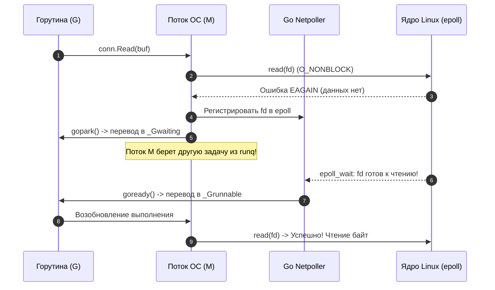

# Сетевой стек Linux: От сокетов ядра и epoll до Go Netpoller

Сеть — это кровеносная система любого распределенного бэкенда. В скриптовых языках разработчики часто абстрагируются от сетевого взаимодействия до примитивного уровня «я отправил HTTP-запрос», перекладывая низкоуровневую работу на плечи внешних серверов приложений (php-fpm, Gunicorn, Puma). 

В экосистеме Go сетевой стек — это ваша прямая зона ответственности. Ваши микросервисы самостоятельно открывают слушающие сокеты, мультиплексируют тысячи одновременных TCP-соединений, терминируют TLS и маршрутизируют пакеты. Понимание того, какой путь проходит байт от физической сетевой карты (NIC) через кольцевые буферы ядра до пользовательского буфера в вашей горутине, отличает зрелого Senior-инженера от разработчика, слепо уповающего на «магию» стандартной библиотеки `net/http`.

---

## 1. Всё есть файл: Сокеты и системные вызовы в Linux

Вспомним фундаментальную философию Unix: *«Всё есть файл»*. Сетевое соединение в Linux — это тоже разновидность файла, представленная абстракцией **Сокета (Socket)**.

Когда вы вызываете в коде `net.Listen("tcp", ":8080")`, рантайм Go обращается к операционной системе через цепочку из трех системных вызовов:

1. **`socket()`**: Ядро выделяет структуру сокета в оперативной памяти и возвращает процессу целочисленный файловый дескриптор (`FD`).
2. **`bind()`**: Привязывает выделенный сокет к конкретному локальному адресу и порту (например, `0.0.0.0:8080`).
3. **`listen()`**: Переводит сокет из активного состояния (для исходящих соединений) в пассивный режим прослушивания входящих подключений.

Именно на этапе вызова `listen()` ядро Linux аллоцирует две принципиально важные очереди в стеке TCP:

* **SYN Queue (очередь полуоткрытых соединений):** Сюда попадают клиенты, приславшие первичный пакет `TCP SYN`. Ядро отправляет в ответ `SYN-ACK` и переводит соединение в состояние `SYN_RECV`, ожидая завершающего `ACK` от клиента.
* **Accept Queue (очередь полностью установленных соединений):** Как только клиент ответил пакетом `ACK`, трехстороннее рукопожатие (TCP Three-Way Handshake) считается завершенным. Соединение переходит в статус `ESTABLISHED` и перемещается в Accept Queue. Здесь оно терпеливо ждет, пока ваше приложение вызовет `accept()`.


> [!warning] Ловушка / Gotcha: Переполнение Accept Queue и тихий сброс пакетов
> Если ваше Go-приложение не успевает вовремя вызывать `Accept()` (например, из-за блокировки в синхронном коде или нехватки системных потоков), очередь `Accept Queue` заполняется до отказа.
> 
> Когда это происходит, ядро Linux по умолчанию **молча отбрасывает входящие SYN-пакеты** (либо отправляет клиенту сброс `RST`, если включен параметр `net.ipv4.tcp_abort_on_overflow = 1`). 
> 
> Клиенты снаружи наблюдают необъяснимые таймауты подключения (Connection Timeout) или ошибки соединения, хотя процессор сервера может быть загружен всего на 5%. 
> 
> Максимальный размер этой очереди определяется системным параметром ядра `net.core.somaxconn` и аргументом `Backlog` в функции `Listen`. Убедитесь, что в `/etc/sysctl.conf` значение `net.core.somaxconn` увеличено с дефолтных 128/4096 до значений уровня 65535 для высоконагруженных шлюзов.

---

## 2. Проблема C10K и рождение Epoll

На заре веб-разработки (конец 1990-х) доминировала модель **Thread-per-Connection** (один поток ОС на каждое входящее сетевое соединение), реализованная в классическом Apache HTTPD. 

С ростом интернета индустрия столкнулась с легендарной **проблемой C10K** (необходимость обслуживать 10 000 одновременных подключений на одном сервере). Классический подход потерпел сокрушительное фиаско:
* **Расход памяти на стек:** Каждый поток ОС (pthread) в Linux требует от 2 до 8 МБ виртуальной памяти под собственный стек. 10 000 потоков моментально съедали десятки гигабайт памяти только на удержание стеков.
* **Деградация на переключении контекста (Context Switching):** Ядро Linux тратило львиную долю процессорных тактов не на полезную работу бэкенда, а на бесконечные переключения регистров процессора, сброс кэшей инструкций L1i и TLB между тысячами конкурирующих потоков.

### Эволюция мультиплексирования ввода-вывода: select, poll и epoll

Выходом стал переход от блокирующего I/O к неблокирующему мультиплексированию:

| Механизм | Сложность проверки | Лимит дескрипторов | Принцип работы |
|---|:---:|:---:|---|
| **`select`** | $O(N)$ | Ограничен `FD_SETSIZE` (1024) | Процесс передает массив битов в ядро, ядро линейно перебирает все дескрипторы при каждом вызове. |
| **`poll`** | $O(N)$ | Не ограничен (массив структур) | Снимает лимит 1024, но продолжает требовать линейного сканирования $O(N)$ дескрипторов при каждом событии. |
| **`epoll`** | $O(1)$ | Ограничен только памятью | Дескрипторы регистрируются в красно-черном дереве ядра один раз. Готовые сокеты помещаются в связанный список готовых событий. |

В Linux механизмом спасения стал системный вызов **`epoll`** (во FreeBSD и macOS его аналогом является `kqueue`).

Вместо того чтобы при каждом цикле опрашивать ядро: «Не пришло ли что-то на эти 10 000 сокетов?», приложение регистрирует интерес к сокетам один раз через `epoll_ctl()`. 

Когда сетевая карта принимает сетевой пакет, ядро через аппаратное прерывание и SoftIRQ аппаратно определяет нужный сокет и помещает его в кольцевой список готовых событий (Ready List). Приложение вызывает единственный системный вызов `epoll_wait()`, который мгновенно и без линейного перебора возвращает только те сокеты, на которых реально появились данные для чтения или записи.

---

## 3. Go Netpoller: Элегантная абстракция над неблокирующим вводом-выводом

Несмотря на колоссальную скорость `epoll`, писать сырой асинхронный код на Си или Node.js мучительно: логика дробится на функции обратного вызова (Callback Hell) или конечные автоматы (State Machines).

Создатели Go предложили гениальную концепцию: **синхронный код снаружи, полностью асинхронный и неблокирующий внутри**. Эту связку обеспечивает **Netpoller** — подсистема рантайма Go, бесшовно интегрированная с планировщиком горутин (G-M-P).

Когда вы пишете в Go привычный линейный код:

```go
conn, err := listener.Accept() // Выглядит как блокирующий вызов
buf := make([]byte, 1024)
n, err := conn.Read(buf)       // Тоже выглядит блокирующим
```

Под капотом не происходит блокировки системного потока ОС (`M`). Рантайм Go при создании сокета немедленно переводит его файловый дескриптор в неблокирующий режим с помощью флага `O_NONBLOCK`.

### Что на самом деле происходит при вызове `Read()`:

1. Горутина (`G`) выполняет системный вызов `read` над файловым дескриптором.
2. Так как дескриптор сокета неблокирующий, а в сетевом буфере ядра данных еще нет, системный вызов не засыпает, а немедленно возвращает ошибку `EAGAIN` (или `EWOULDBLOCK` — «ресурс временно недоступен, повторите позже»).
3. Рантайм Go ловит `EAGAIN`, регистрирует данный файловый дескриптор в системном `epoll` (если он еще не был зарегистрирован) и выполняет внутреннюю команду **`gopark()`**.
4. Горутина переходит из состояния `_Grunning` в состояние `_Gwaiting`.
5. Системный поток ОС (`M`) освобождается! Он не спит, а мгновенно берет из локальной очереди (`runq`) планировщика другую готовую к выполнению горутину.
6. Когда сетевая карта принимает пакет для этого сокета, `epoll` фиксирует готовность FD. Netpoller находит припаркованную горутину и вызывает **`goready()`**, возвращая ее в очередь выполнения `_Grunnable`.
7. Горутина возобновляет работу точно с того места, где прервалась, и повторный вызов `read` успешно вычитывает поступившие байты.



> [!info] Под капотом
> Netpoller в Go работает в фоновом режиме. Рантайм выделяет специальные системные потоки (M), которые периодически вызывают `epoll_wait`. В исходниках Go (runtime/netpoll_epoll.go) вы найдете вызов `syscall.EpollWait`. Важно, что Netpoller не только обрабатывает чтение/запись, но и используется для таймеров ( `time.Sleep` ) и операций с каналами (channels), которые под капотом используют те же механизмы уведомлений.

---

## 4. Сетевые пространства имен (Network Namespaces) и изоляция контейнеров

Понимание сетевого стека Linux немыслимо без знания того, как изолируется сеть в контейнерах Docker и подах Kubernetes. Ключевым примитивом изоляции является **Network Namespace (netns)**.

Когда Docker запускает контейнер, ядро Linux создает для него изолированное сетевое пространство имен. Внутри этого пространства:
* Изолирован собственный набор сетевых интерфейсов (включая персональный loopback `lo`).
* Присутствует собственная независимая таблица маршрутизации (Routing Table).
* Действует собственная таблица правил фильтрации и трансляции адресов (iptables / nftables).
* Доступен весь диапазон сетевых портов (от 1 до 65535). Вы можете запустить на одном сервере 100 контейнеров, и каждый из них будет слушать порт `8080`, не конфликтуя с соседями.

### Виртуальный патч-корд: Veth Pair

Каким образом изолированный контейнер связывается с хостовой сетью и выходит в интернет? 

Ядро Linux создает пару виртуальных связанных интерфейсов — **Virtual Ethernet Pair (veth pair)**. Это программный аналог сетевого патч-корда с двумя разъемами:
1. Один конец («разъем») помещается внутрь netns контейнера и переименовывается в `eth0`.
2. Второй конец остается в сетевом пространстве хоста и подключается к виртуальному сетевому мосту (программному коммутатору, например `docker0 bridge`).
3. Для выхода во внешнюю сеть хост выполняет трансляцию адресов (NAT / Masquerade) через правила iptables.


> [!tip] Собеседование: Директива EXPOSE против публикации портов
> **Вопрос:** Вы запускаете Go-сервер в Docker. В Dockerfile указано `EXPOSE 8080`. При запуске контейнера снаружи (с хоста) подключиться на `localhost:8080` не получается. Почему?
> 
> **Ответ:** Директива `EXPOSE` в Dockerfile — это исключительно документация и метаданные образа. Она не пробрасывает порты и не настраивает iptables ядра.
> 
> Чтобы открыть доступ к сервису извне, необходимо запустить контейнер с флагом публикации портов: `-p 8080:8080`. В этот момент демон Docker обращается к подсистеме ядра и создает правило **DNAT (Destination NAT)** в таблице `nat` цепочки `PREROUTING` iptables хоста. Это правило перехватывает пакеты, приходящие на порт 8080 хоста, и подменяет адрес назначения на приватный IP-адрес контейнера в виртуальном мосту `docker0`.

---

## 5. Проблема TIME_WAIT и опция SO_REUSEADDR

При высокой сетевой нагрузке — особенно когда Go-приложение совершает огромное количество исходящих HTTP-запросов к сторонним API или микросервисам (без пула соединений), либо когда веб-сервер часто перезапускается — инженеры неизбежно сталкиваются с состоянием сокетов **`TIME_WAIT`**.

Согласно спецификации TCP (RFC 793), сторона, инициировавшая закрытие TCP-соединения (отправившая первый пакет `FIN`), после получения финального `ACK` обязана удерживать сокет в состоянии `TIME_WAIT` в течение удвоенного максимального времени жизни сегмента: $2 \times \text{MSL}$ (Maximum Segment Lifetime, в Linux по умолчанию составляет около 60 секунд).

### Зачем нужен TIME_WAIT?
1. **Гарантия надежного закрытия:** Если последний пакет `ACK` потеряется в сети, противоположная сторона повторно пришлет `FIN`. Сервер в состоянии `TIME_WAIT` сможет ответить повторным `ACK`.
2. **Защита от блуждающих пакетов:** Защищает от ситуации, когда пакеты от старого соединения запоздали в маршрутизаторах интернета и ошибочно попали в новое соединение, случайно открытое на той же комбинации (Source IP, Source Port, Dest IP, Dest Port).

Цена `TIME_WAIT`: в течение 60 секунд пара «IP-адрес : порт» заблокирована ядром. Если сервер аварийно перезапустится и попытается заново вызвать `bind()` на свой порт, ядро вернет ошибку:
```text
bind: address already in use
```

> [!warning] Ловушка / Gotcha: Борьба с TIME_WAIT на клиенте и сервере
> В Linux по умолчанию порты в `TIME_WAIT` нельзя переиспользовать. Наивное и опасное решение — грубо уменьшить системный таймаут `net.ipv4.tcp_fin_timeout`, что грубо нарушает протокол TCP.
> 
> **Правильные инженерные практики:**
> 1. **На стороне сервера (Incoming):** Использование опции сокета **`SO_REUSEADDR`**. В Go стандартная библиотека `net` автоматически устанавливает флаг `SO_REUSEADDR` при создании серверных сокетов (начиная с определенных версий и ОС), что позволяет биндиться на порт, даже если есть соединения в `TIME_WAIT`.
> 2. **На стороне клиента (Outgoing):** Если ваше Go-приложение совершает тысячи исходящих вызовов и исчерпывает диапазон эфемерных портов (`ephemeral ports`), ядро Linux позволяет включить параметр `net.ipv4.tcp_tw_reuse = 1`. Это разрешает ядру безопасно переиспользовать сокеты из `TIME_WAIT` для новых исходящих TCP-соединений, если временные метки TCP Timestamps подтверждают актуальность пакетов.
> 3. **В Go-коде:** Всегда переиспользуйте HTTP-клиенты (`http.Client`) с включенным Connection Pooling (`http.Transport`), чтобы не открывать новое TCP-соединение на каждый микрозапрос!

---

## Итог

1. **Сокеты — это файлы ядра:** Жизненный цикл сервера начинается с системных вызовов `socket()`, `bind()` и `listen()`. Задержка обработки в `Accept()` приводит к переполнению очереди `Accept Queue` и тихому дропу пакетов ядром.
2. **Epoll разрешил проблему C10K:** Механизм событийного мультиплексирования с алгоритмической сложностью $O(1)$ позволил ядру масштабироваться до сотен тысяч одновременных соединений без затрат на Context Switch.
3. **Go Netpoller — шедевр рантайма:** Он трансформирует неблокирующий I/O ядра с ошибками `EAGAIN` в видимость прямолинейного синхронного кода: вызовы `Read`/`Write` в горутинах не блокируют потоки ОС, а паркуют горутины через `gopark()` и отдают освободившийся поток `M` другим задачам.
4. **Network Namespaces и Veth Pairs:** Формируют фундамент изоляции сети контейнеров, связывая виртуальный сетевой стек внутри контейнера с мостом хоста через виртуальный сетевой кабель.
5. **Контроль за TIME_WAIT:** Понимание жизненного цикла TCP-сегментов, включение опции `SO_REUSEADDR`, тюнинг `net.ipv4.tcp_tw_reuse = 1` и пулинг клиентских соединений спасают распределенную систему от исчерпания сетевых портов.

Освоив сетевую архитектуру Linux, мы готовы перейти к исследованию шлюзов, которые принимают трафик из глобальной сети и распределяют его между нашими сервисами. В следующем разделе мы разберем архитектуру легендарного обратного прокси: [[1. nginx. Архитектура]].