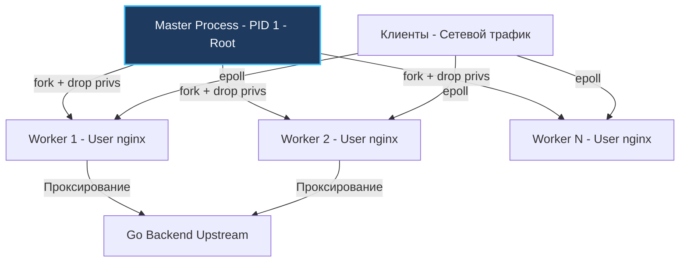
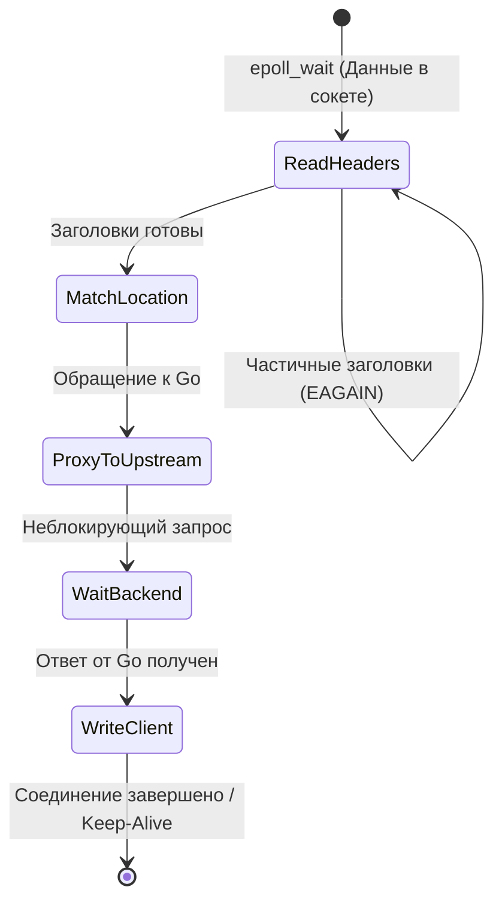

# Архитектура Nginx: От проблемы C10K до высокопроизводительного обратного прокси

В современной инфраструктуре высоконагруженного бэкенда веб-сервер **Nginx** занимает позицию первой линии обороны. Это мощный фронтальный шлюз, принимающий на себя шквал сотен тысяч одновременных TCP-соединений из ненадежного публичного интернета, терминирующий TLS, сжимающий трафик, раздающий терабайты статического контента и аккуратно распределяющий запросы между пулами ваших микросервисов на Go.

Многие инженеры склонны воспринимать Nginx как утилитарный «черный ящик», который достаточно однажды настроить по гайдам из StackOverflow и забыть. Однако для Senior-разработчика и архитектора глубокое понимание внутреннего устройства Nginx критически важно. Только зная механику событийного цикла, процессную модель и поведение ядра Linux под капотом, можно осознанно бороться с задержками (latency), устранять просадки пропускной способности при пиковых нагрузках и проектировать по-настоящему отказоустойчивые системы.

---

## 1. От Apache к Nginx: Проблема C10K

В 1990-х и начале 2000-х годов де-факто стандартом серверного интернета являлся веб-сервер Apache HTTP Server. Архитектура Apache опиралась на парадигму **Process/Thread-per-Connection** (один отдельный процесс или поток операционной системы на каждое активное сетевое соединение). 

В эпоху медленных каналов связи эта модель оказалась фатальной. Если мобильный клиент через нестабильное 3G-соединение передавал тело POST-запроса в течение 30 секунд со скоростью 5 КБ/с, выделенный поток операционной системы висел в заблокированном состоянии, удерживая память и ресурсы сервера.

На рубеже тысячелетий индустрия сформулировала знаменитую **проблему C10K** (необходимость обслуживать свыше 10 000 одновременных клиентских подключений на одной физической машине):
* **Колоссальный расход памяти на стеки:** 10 000 потоков ОС (с дефолтным размером стека 2–8 МБ) требовали десятки гигабайт оперативной памяти исключительно под служебные нужды.
* **Катастрофические затраты на Context Switching:** Планировщик ядра тратил большую часть тактов CPU на смену регистров, сброс кэшей команд L1/L2 и таблиц страниц TLB, а не на выполнение бизнес-логики.

Созданный Игорем Сысоевым веб-сервер Nginx предложил фундаментально иное решение: **Event-Driven Architecture (Событийно-ориентированная асинхронная архитектура)** на базе неблокирующего ввода-вывода.

---

## 2. Процессная модель: Master и Worker-процессы

Nginx не плодит тысячи потоков на каждый чих. Вместо этого он использует строгую, детерминированную многопроцессную архитектуру, состоящую из одного управляющего процесса и фиксированного пула рабочих воркеров:

1. **Master Process:** Запускается с правами суперпользователя (`root`). Привилегии `root` требуются для того, чтобы забиндить привилегированные сетевые порты (80 для HTTP и 443 для HTTPS), прочитать конфигурационные файлы (`nginx.conf`) и криптографические приватные ключи TLS. Главные задачи Master — парсинг конфигурации, инициализация сокетов, запуск воркеров и управление их жизненным циклом (включая горячую перезагрузку конфигурации без простоя — Zero-Downtime Reload).
2. **Worker Processes:** Форкаются от Master-процесса через системный вызов `fork()` (или при обновлении бинарника через `exec`). Мастер передает воркерам дескрипторы слушающих сокетов, после чего каждый воркер сбрасывает привилегии (`setuid`/`setgid`) до непривилегированного пользователя (обычно `nginx` или `www-data`). Всю реальную сетевую работу выполняют именно воркеры.



> [!info] Под капотом: CPU Affinity и отсутствие блокировок
> В production количество воркеров конфигурируется директивой `worker_processes auto;`, что соответствует числу доступных логических ядер процессора.
> 
> Каждый воркер — это строго однопоточный процесс (Single-threaded). С помощью системного механизма **CPU Affinity** (`worker_cpu_affinity`) каждый рабочий процесс привязывается к конкретному физическому ядру. 
> 
> Это решение обладает выдающейся аппаратной эффективностью (**Mechanical Sympathy**):
> 1. Воркер постоянно греет свой персональный кэш L1/L2, исключая дорогостоящую миграцию потока между ядрами CPU.
> 2. Между воркерами полностью отсутствует борьба за мьютексы (Mutex Contention) в пользовательском пространстве — воркеры не делят динамическую память кучи, как это бывает в многопоточных программах с thread-local storage.
> 3. Разделяемые данные (общая статистика, зоны rate-limiting и кэш) вынесены в специальные сегменты разделяемой памяти (**Shared Memory Zones**), где синхронизация выполняется через быстрые атомарные инструкции ядра (`spinlocks` и atomic CAS).

---

## 3. Событийный цикл (Event Loop) и Epoll

Каждый воркер Nginx функционирует внутри бесконечного событийного цикла (**Event Loop**). Как мы выяснили в лекции [[6. Networking в Linux]], Nginx использует системный вызов `epoll` в Linux (или `kqueue` во FreeBSD/macOS).

Воркер не засыпает в ожидании ответа от конкретного клиента. Он регистрирует все активные дескрипторы клиентских и апстрим-сокетов в ядре через `epoll_ctl()`. Системный вызов `epoll_wait()` мгновенно возвращает массив дескрипторов, на которых произошло событие: пришли данные, сокет освободился для записи или завершилось сетевое рукопожатие.

### Конечный автомат обработки запроса (State Machine)

Nginx обрабатывает HTTP-транзакцию как **детерминированный конечный автомат (State Machine)**, разбивая жизненный цикл соединения на атомарные неблокирующие фазы:

1. **Чтение HTTP-заголовков:** Сигнал от `epoll` будит воркер. Nginx вычитывает пришедшую порцию байтов в буфер. Если заголовки пришли не полностью (медленный мобильный клиент), воркер не блокируется: он сохраняет текущее состояние парсера в структуре соединения и возвращается в цикл `epoll` для обработки других запросов.
2. **Маршрутизация и фильтрация:** Когда заголовки полностью собраны, Nginx определяет подходящий блок `server` и `location`, проверяет списки доступа, лимиты запросов (`limit_req`) и зоны авторизации.
3. **Чтение тела запроса (Request Body):** Если запрос содержит payload (POST/PUT), воркер вычитывает его неблокирующими порциями. При превышении размера `client_body_buffer_size` тело сбрасывается во временный файл на диске.
4. **Проксирование в Go Upstream:** Nginx инициирует неблокирующее TCP-подключение к Go-бэкенду. Пока бэкенд вычисляет ответ, Nginx *не простаивает*: он ставит сокет бэкенда на учет в `epoll` и мгновенно переключается на обслуживание сотен других входящих соединений.
5. **Отправка ответа клиенту:** Получив ответ от Go, Nginx начинает запись в сокет клиента. Если буфер сокета заполнен (клиент не успевает скачивать), Nginx приостанавливает отправку для этого сокета, включает механизм обратного давления (Backpressure) и идет обрабатывать другие события.



> [!tip] Собеседование: Защита бэкенда от медленных клиентов
> **Вопрос:** Что произойдет, если медленный клиент (на Dial-up или нестабильном 2G) скачивает тяжелый отчет, который Go-бэкенд сгенерировал в памяти за 5 миллисекунд?
> 
> **Ответ:** 
> Если бы Go-сервер отдавал ответ клиенту напрямую, горутина висела бы в памяти все 60 секунд передачи, удерживая буферы кучи. 
> 
> Nginx берет удар на себя:
> 1. Он на максимальной скорости локальной сети вычитывает ответ из Go-бэкенда, освобождая ресурсы Go за пару миллисекунд.
> 2. Nginx начинает транслировать данные клиенту. Когда буфер сокета ядра переполняется, Nginx буферизирует оставшуюся часть ответа на диск (Disk I/O во временные файлы `proxy_temp_path`).
> 3. Если буферы диска и памяти заполнены, Nginx задействует механизм **TCP Window**: уменьшает окно приема (Window Size) в сокете с Go-бэкендом, приостанавливая генерацию трафика на стороне Go (Backpressure).
> Это защищает Go-рантайм от деградации сборщика мусора и раздувания пула горутин.

---

## 4. Mechanical Sympathy: Zero-Copy и системный вызов sendfile

Одной из причин колоссальной производительности Nginx при отдаче статических файлов (изображения, фронтенд-бандлы, медиа) является использование механизма **Zero-Copy** через системный вызов **`sendfile()`**.

### Традиционный ввод-вывод (4 копирования данных):
При классической связке `read()` + `write()` данные совершают 4 пересылки через системную шину и требуют 2 переключения контекста ядра:
1. Контроллер диска через DMA копирует файл в кэш страниц ядра (**Page Cache**).
2. Ядро копирует данные из Page Cache в пользовательский буфер приложения Nginx в User Space (`read()`).
3. Приложение Nginx копирует данные из User Space обратно в память ядра — в сетевой буфер сокета (`write()`).
4. Сетевая карта через DMA вычитывает данные из буфера сокета и передает в физический провод (NIC).

### Оптимизация sendfile() (Zero-Copy):
Системный вызов `sendfile()` в Linux передает данные **напрямую из Page Cache ядра в кольцевой буфер сетевой карты**, вообще минуя пользовательское пространство (User Space). Память процесса Nginx даже не касается этих байтов!

```mermaid
flowchart TD
    classDef process  fill:#1e293b,stroke:#38bdf8,stroke-width:1px,color:#f8fafc
    classDef success  fill:#064e3b,stroke:#34d399,stroke-width:1px,color:#f8fafc
    classDef error    fill:#7f1d1d,stroke:#f87171,stroke-width:1px,color:#f8fafc
    classDef warning  fill:#78350f,stroke:#fbbf24,stroke-width:1px,color:#f8fafc
    classDef entry    fill:#1e3a5f,stroke:#38bdf8,stroke-width:2px,color:#f8fafc
    classDef aux      fill:#334155,stroke:#64748b,stroke-width:1px,color:#f8fafc
    classDef system   fill:#312e81,stroke:#a78bfa,stroke-width:1px,color:#f8fafc
    classDef data     fill:#132d29,stroke:#2dd4bf,stroke-width:1px,color:#f8fafc
    classDef network  fill:#881337,stroke:#fb7185,stroke-width:1px,color:#f8fafc
    classDef accent   fill:#1e1b4b,stroke:#818cf8,stroke-width:1px,color:#f8fafc
    subgraph Classic ["Традиционный read/write (4 копирования)"]
        D1["Диск"]:::data -->|"DMA"| PC1["Page Cache (Ядро)"]
        PC1 -->|"Копирование 1"| US1["User Space (Буфер Nginx)"]
        US1 -->|"Копирование 2"| SB1["Буфер сокета (Ядро)"]
        SB1 -->|"DMA"| NIC1["Сетевая карта (NIC)"]
    end

    subgraph ZeroCopy ["Механизм sendfile (Zero-Copy)"]
        D2["Диск"]:::data -->|"DMA"| PC2["Page Cache (Ядро)"]
        PC2 -->|"Прямая передача дескриптора"| SB2["Буфер сокета (Заголовки)"]
        PC2 -->|"DMA напрямую"| NIC2["Сетевая карта (NIC)"]
    end
```



Конфигурация в `nginx.conf`:
```nginx
location /static/ {
    sendfile on;       # Включает прямую передачу из Page Cache в сетевой сокет (Zero-Copy)
    tcp_nopush on;     # Заставляет ядро накапливать заголовки и тело пакета, отправляя полный MSS
    tcp_nodelay on;    # Отключает алгоритм Нагла для минимальной задержки интерактивного трафика
}
```

> [!warning] Ловушка / Gotcha: Границы применения sendfile
> `sendfile` применим **исключительно для статически сохраненных файлов на диске**. 
> 
> Если вы проксируете динамический ответ от Go-бэкенда (Upstream), вызов `sendfile` бессилен: динамические байты генерируются рантаймом Go, передаются по TCP-сокету и в любом случае должны пройти через User Space Nginx.
> 
> Кроме того, `sendfile` несовместим с динамической трансформацией контента на лету (например, фильтрами `gzip` или шифрованием, требующим модификации потока байт в User Space).

---

## 5. Nginx vs. Go: Зачем ставить Nginx перед Go-сервисом?

Популярный вопрос на собеседованиях: *«В Go встроен великолепный, конкурентный и производительный веб-сервер `net/http`. Зачем усложнять архитектуру и громоздить перед Go еще и Nginx?»*

Ответ кроется в разделении зон ответственности и системной защите инфраструктуры:

1. **Изоляция сбоев (Blast Radius):** Nginx изолирован от рантайма Go. Если в Go-сервисе случится утечка памяти, OOM-киллер убьет процесс или приложение упадет по необработанной панике (`panic`), Nginx не упадет. Он моментально вернет клиенту аккуратную страницу с кодом `502 Bad Gateway` вместо аварийного разрыва TCP-соединения (`Connection Refused`).
2. **Терминация TLS (TLS Termination):** Асимметричная криптография (RSA, ECDHE) требует огромных процессорных мощностей. Nginx написан на C и оптимизирован под векторные инструкции CPU (AES-NI, AVX). Он умеет кэшировать TLS-сессии (Session Tickets / Session Cache) в разделяемой памяти между воркерами, разгружая Go GC и планировщик от нецелевой криптографической нагрузки.
3. **Снижение давления на сборщик мусора Go (GC Pacer):** Медленные клиенты заставляют бэкенд долго удерживать открытые TCP-буферы. Перекладывая буферизацию медленных соединений на Nginx (с его временными дисковыми файлами), мы гарантируем, что Go-сервер общается только по сверхбыстрому локальному сокету (loopback или unix domain socket) с минимальным временем жизни объектов в куче.
4. **Защита периметра и Rate Limiting:** Nginx эффективнее фильтрует вредоносный трафик, отражает SYN-флуд и выполняет ограничение частоты запросов (`limit_req` на алгоритме Leaky Bucket / Token Bucket) прямо в C-коде, не подпуская мусорный трафик к рантайму Go.

---

## Итог

1. **Event-Driven модель:** Nginx победил проблему C10K благодаря связке неблокирующего ввода-вывода и системного вызова `epoll`, обрабатывая десятки тысяч запросов в рамках единичных воркеров.
2. **Конечный автомат (State Machine):** Каждый воркер продвигает обработку сотен соединений параллельно без блокировки тредов операционной системы.
3. **Zero-Copy (`sendfile`):** Передача статического контента с диска прямо в сетевой интерфейс исключает копирование данных в память приложения и экономит такты процессора.
4. **Надежный щит бэкенда:** Nginx снимает с Go-приложений задачи терминации TLS, буферизации медленных клиентов, защиты от атак и статической раздачи файлов.

В следующей статье мы подробно изучим конфигурацию Nginx в роли обратного прокси, разберем директиву `proxy_pass`, правильную трансляцию заголовков и сокрытие топологии сети: [[2. Reverse proxy]].