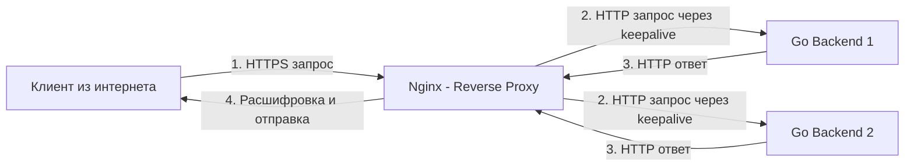
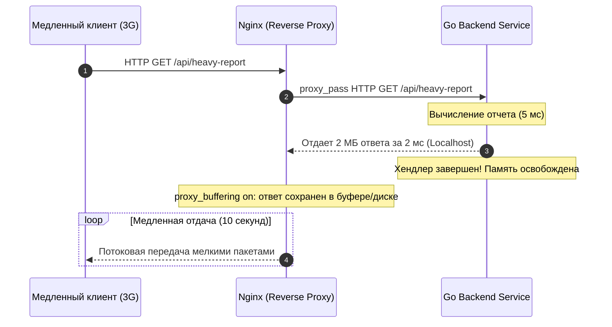

# Nginx как Reverse Proxy: Анатомия proxy_pass, трансляция заголовков и буферизация

В современной архитектуре распределенных бэкендов обратный прокси (**Reverse Proxy**) — это незаменимый архитектурный рубеж. Прямой деплой микросервисов на Go в открытый интернет без промежуточного прокси почти всегда ведет к фатальным эксплуатационным проблемам: уязвимости сетевого периметра, исчерпанию пула горутин из-за медленных клиентов, сложностям с динамической маршрутизацией и хаосу в SSL/TLS сертификатах.

В отличие от прямого прокси (**Forward Proxy**), который устанавливается на стороне клиентов (например, корпоративный прокси в офисе, скрывающий внутренние IP-адреса рабочих станций при выходе во внешнюю сеть), **Reverse Proxy** развертывается на стороне инфраструктуры сервиса. Он выступает единым фасадом для миллионов внешних пользователей, принимая весь входящий интернет-трафик и деликатно распределяя его по закрытым внутренним подсетям бэкенда.

---

## 1. Как работает директива proxy_pass под капотом

Главная рабочая лошадка конфигурации Nginx — директива `proxy_pass`. Когда запрос попадает в соответствующий блок `location`, Nginx разворачивает сложную цепочку низкоуровневых операций:

1. **Прием клиентского подключения:** Воркер Nginx принимает TCP-соединение от клиента, инициирует TLS Handshake (при HTTPS) и считывает заголовки HTTP-запроса. Если в запросе присутствует тело (body), Nginx читает его в память в пределах лимита `client_body_buffer_size`.
2. **Переиспользование пула соединений (Upstream Keepalive):** Открытие нового TCP-соединения на каждый входящий HTTP-запрос — непозволительная роскошь: три системных вызова на рукопожатие (`SYN`, `SYN-ACK`, `ACK`), медленный старт TCP (Slow Start) и накопление сокетов в `TIME_WAIT`. Nginx поддерживает пул постоянно открытых TCP-соединений к Go-бэкенду (`keepalive`). При получении запроса воркер берет готовое соединение из пула, избегая системного вызова `connect()`, либо открывает новое, если пул исчерпан.
3. **Запись в сокет бэкенда:** Nginx формирует очищенный и обогащенный служебными заголовками HTTP-запрос и асинхронно передает его в сокет Go-приложения через кольцевой буфер ядра.
4. **Вычитывание ответа и дисковый сброс:** Как только Go-сервис сгенерировал данные, Nginx вычитывает их на максимальной скорости локальной шины. Если ответ превышает размер буферов оперативной памяти (`proxy_buffers`), Nginx сбрасывает избыток во временные файлы на диске (`proxy_temp_path`), не заставляя Go ждать медленного клиента.
5. **Трансляция клиенту:** Nginx передает ответ клиенту в темпе, определяемом пропускной способностью его интернет-провайдера.



---

## 2. Проблема заголовков: «Кто звонит?»

Пожалуй, самая коварная ловушка при внедрении Reverse Proxy — **потеря контекста оригинального сетевого соединения**.

Поскольку Nginx устанавливает собственное TCP-соединение с вашим Go-сервисом, вызов стандартного метода `r.RemoteAddr` вернет внутренний IP-адрес самого Nginx (например, `172.16.0.1` или `127.0.0.1`), а поле `r.Host` может оказаться именем апстрим-группы вместо доменного имени, которое пользователь ввел в адресной строке браузера.

Если Go-бэкенд полагается на IP-адрес для rate-limiting, геолокации, логирования аудита или защиты от брутфорса, система моментально заблокирует сам Nginx или даст зеленый свет злоумышленникам.

Для корректной трансляции метаданных Nginx обязан проставлять семейство прокси-заголовков:

```nginx
location /api/ {
    proxy_pass http://go_backend:8080;
    
    # Передаем оригинальный Host из запроса пользователя
    proxy_set_header Host $host;
    
    # Передаем физический IP-адрес непосредственного клиента
    proxy_set_header X-Real-IP $remote_addr;
    
    # Добавляем IP клиента в цепочку прокси-серверов
    proxy_set_header X-Forwarded-For $proxy_add_x_forwarded_for;
    
    # Сообщаем бэкенду исходный протокол (http или https)
    proxy_set_header X-Forwarded-Proto $scheme;
}
```

### X-Forwarded-For и уязвимость IP Spoofing

Заголовок `X-Forwarded-For` (XFF) имеет формат: `client_ip, proxy1_ip, proxy2_ip`. 

Здесь кроется критическая уязвимость безопасности: любой клиент может вручную отправить поддельный заголовок `X-Forwarded-For: 1.1.1.1`. Директива Nginx `$proxy_add_x_forwarded_for` просто добавит реальный IP в конец: `1.1.1.1, attacker_real_ip`. Если ваше Go-приложение доверяет *первому* IP из этого списка, вы подвергаетесь атаке IP Spoofing.

> [!warning] Ловушка / Gotcha: Наивный парсинг X-Forwarded-For
> Никогда не парсьте `X-Forwarded-For` вручную в Go, чтобы получить IP клиента, если вы не уверены в инфраструктуре перед Nginx. Если балансировщик нагрузки (например, AWS ALB) стоит перед Nginx, цепочка будет расти.
> 
> Безопасный подход в Nginx — использовать встроенный модуль **`realip`** (`ngx_http_realip_module`):
> ```nginx
> set_real_ip_from 10.0.0.0/8;      # Доверяем внутренним балансировщикам Cloud/K8s
> real_ip_header X-Forwarded-For;
> real_ip_recursive on;
> ```
> Он заставляет Nginx переписывать `$remote_addr` на основе доверенных прокси, отбрасывая фальшивые заголовки. А в Go вы просто читаете `X-Real-IP` или используете надежные библиотеки-экстракторы IP.

### Извлечение реального IP в Go: Идиоматичный подход

Для защиты от спуфинга Go-приложение должно валидировать входящие адреса. Стандартная библиотека Go не содержит встроенного валидатора цепочек XFF, поэтому разработчики используют надежные экстракторы вроде `github.com/oapi-codegen/runtime` или пишут строгий middleware:

```go
package main

import (
	"net"
	"net/http"
	"strings"
)

// RealIPMiddleware извлекает реальный IP клиента с защитой от спуфинга
func RealIPMiddleware(next http.Handler) http.Handler {
	return http.HandlerFunc(func(w http.ResponseWriter, r *http.Request) {
		// Сначала проверяем X-Real-IP, который гарантированно выставил наш Nginx
		if ip := r.Header.Get("X-Real-IP"); ip != "" {
			r.RemoteAddr = ip
		} else if ip := r.Header.Get("X-Forwarded-For"); ip != "" {
			// В реальном проде нужно брать последний доверенный IP, 
			// а не первый! Это упрощенный пример.
			ips := strings.Split(ip, ",")
			r.RemoteAddr = strings.TrimSpace(ips[0])
		}
		
		// Нормализуем адрес, отсекая порт, если он присутствует
		if host, _, err := net.SplitHostPort(r.RemoteAddr); err == nil {
			r.RemoteAddr = host
		}

		next.ServeHTTP(w, r)
	})
}
```

---

## 3. Буферизация: Защита Go от медленных клиентов (Response Buffering)

По умолчанию в Nginx включена буферизация ответов (`proxy_buffering on`). Это одна из ключевых причин, почему Nginx бережет оперативную память бэкенда.

### Сценарий без Nginx (Go напрямую в мир):
1. Go-сервис генерирует тяжелый JSON-отчет размером 2 МБ за 5 миллисекунд.
2. Клиент подключен через перегруженную сотовую сеть 3G и способен принимать данные со скоростью не более 200 КБ/с.
3. Сокетный буфер отправки ядра переполняется за первые 64 КБ.
4. Горутина Go блокируется на вызове `w.Write()` (или тратит такты в Netpoller), удерживая в куче (Heap) срез на 2 МБ в течение 10 секунд.
5. При 1 000 таких клиентов в памяти зависает 2 ГБ живых аллокаций. Сборщик мусора Go (GC) входит в фазу паники, вызывая частые циклы Stop-The-World и сжигая CPU.

### Сценарий с Nginx:
1. Go-сервис выплевывает 2 МБ в сокет Nginx за 2 миллисекунды (пропускная способность локальной петли 10–40 Гбит/с).
2. Go-хендлер завершает работу, горутина возвращается в пул, а память буфера мгновенно маркируется сборщиком мусора как свободная.
3. Nginx сохраняет ответ в свои компактные C-структуры (`proxy_buffers 16 64k;`), а при нехватке памяти сбрасывает их во временный файл на диск.
4. Nginx в своем неблокирующем цикле событий неспешно отдает байты медленному 3G-клиенту, не нагружая процессор и память Go.



> [!info] Под капотом: Когда буферизация ломает логику
> Для потокового вещания видео, стриминга больших файлов или протокола **Server-Sent Events (SSE)** буферизация Nginx — это смерть.
> 
> Если Nginx будет буферизировать поток событий SSE, клиент не получит ни одного обновления в реальном времени: Nginx будет копить чанки, пока не заполнит системный буфер (обычно 4–8 КБ) или пока Go-сервер не закроет соединение.
> 
> Для таких endpoint'ов буферизацию отключают точечно:
> ```nginx
> location /api/events {
>     proxy_pass http://go_backend:8080;
>     proxy_buffering off;    # Отключает буферизацию для real-time потока
>     proxy_cache off;        # Исключает сохранение в кэше
>     proxy_no_cache 1;       # Запрещает кэширование ответов
>     chunked_transfer_encoding on;
> }
> ```
> Также Go-бэкенд может сам отключить буферизацию Nginx, отправив специальный заголовок `X-Accel-Buffering: no`.

---

## 4. WebSockets и протокольный апгрейд (HTTP Upgrade)

Протокол WebSocket стартует как обычный HTTP/1.1 запрос, но в процессе рукопожатия клиент запрашивает переключение протокола через заголовки:
```http
Connection: Upgrade
Upgrade: websocket
```

По спецификации HTTP/1.1 заголовки `Connection` и `Upgrade` являются hop-by-hop (действуют только на одно соединение). Nginx по умолчанию удаляет их при проксировании. Чтобы WebSocket заработал сквозь Nginx к вашему Go-бэкенду, требуется явная настройка:

```nginx
location /ws/ {
    proxy_pass http://go_backend:8080;
    proxy_http_version 1.1; # WebSockets требуют обязательного HTTP 1.1
    
    # Переписываем служебные заголовки для успешного Upgrade
    proxy_set_header Upgrade $http_upgrade;
    proxy_set_header Connection "upgrade";
    
    # Таймауты для долгоживущих соединений
    proxy_read_timeout 86400s; # 24 часа, иначе Nginx разорвет WS через дефолтные 60 секунд
    proxy_send_timeout 86400s;
}
```

> [!tip] Собеседование: Ошибочные редиректы на HTTP вместо HTTPS
> **Вопрос:** Ваше Go-приложение работает за Nginx. Вы используете `r.URL.IsAbs()` или формируете URL для редиректа, но получаете `http://` вместо `https://`. Почему?
> 
> **Ответ:** 
> Nginx терминирует TLS на внешнем порту 443. Связь между Nginx и Go внутри закрытой сети происходит по обычному незашифрованному HTTP (порт 8080). 
> 
> В результате рантайм Go видит входящее TCP-соединение без TLS (`r.TLS == nil`) и считает исходной схемой `http`. Когда код вызывает редирект или генерирует абсолютные ссылки, формируется URL `http://example.com/login`. Пользователь переходит по незащищенному адресу, браузер ругается на Mixed Content или уходит в бесконечный цикл редиректов.
> 
> **Решение:** 
> 1. Nginx обязан отправлять заголовок `X-Forwarded-Proto: https` (директива `proxy_set_header X-Forwarded-Proto $scheme;`).
> 2. В Go на входе подключается middleware (например, из библиотеки `gorilla/handlers` или стандартный), который считывает заголовок `X-Forwarded-Proto` и подменяет `r.URL.Scheme = "https"` до вызова бизнес-логики.

---

## Итог

1. **Reverse Proxy как защитный экран:** Nginx скрывает физическую топологию бэкенда, агрегирует соединения через `upstream keepalive` и защищает Go от сетевых аномалий.
2. **Заголовки `X-Forwarded-*`**: Жизненно важный мост для передачи информации (`Host`, `X-Real-IP`, `X-Forwarded-For`, `X-Forwarded-Proto`) от Nginx к Go. Ошибки в их обработке ведут к багам с авторизацией и редиректами.
3. **Безопасность IP:** Нельзя наивно доверять первому значению `X-Forwarded-For`; используйте модуль `realip` в Nginx для отсечения спуфинга.
4. **Буферизация (Response Buffering):** Защищает кучу и сборщик мусора Go от медленных клиентов, но должна быть отключена (`proxy_buffering off;`) для SSE и потокового контента.
5. **WebSocket Upgrade:** Требует явной трансляции заголовков `Upgrade` и `Connection`, а также увеличения `proxy_read_timeout`.

В следующей лекции мы разберем, как Nginx балансирует нагрузку между множеством инстансов Go-сервисов, какие существуют алгоритмы распределения трафика и как отслеживать здоровье бэкендов: [[3. Load balancing]].