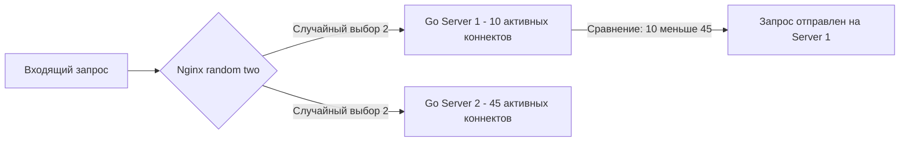
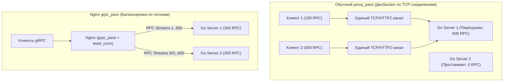

# Балансировка нагрузки в Nginx: От Round Robin до Power of Two Choices и gRPC

Когда один сервер с Go-бэкендом исчерпывает физические лимиты масштабирования (CPU, память, пропускную способность сетевой карты), естественным шагом становится горизонтальное масштабирование — запуск нескольких независимых реплик приложения на разных узлах кластера или виртуальных машинах.

Но кто будет распределять лавину входящих запросов между этими репликами? Кто вовремя заметит, что один из инстансов Go рухнул из-за паники или нехватки памяти (OOM), и мгновенно перенаправит трафик на живые узлы? Эту фундаментальную задачу берет на себя **балансировщик нагрузки (Load Balancer)**.

В классической связке Nginx выступает в роли балансировщика седьмого уровня модели OSI (**L7 Application Load Balancer**). В отличие от L4-балансировщиков (таких как чистый HAProxy в режиме TCP, Linux IPVS или AWS Network Load Balancer), оперирующих только голыми TCP-пакетами и портами, Nginx глубоко анализирует протокол HTTP: заголовки, куки, URI путей, методы и тело запроса. Это позволяет принимать гибкие и интеллектуальные решения о маршрутизации трафика к пулам Go-микросервисов.

---

## 1. Блок upstream: Декларативный пул бэкендов

В конфигурации Nginx целевая группа серверов объединяется в директиву `upstream`. Это виртуальный кластер бэкендов, к которому затем обращаются директивы `proxy_pass` или `grpc_pass`:

```nginx
upstream go_backends {
    # Основные рабочие узлы с параметрами пассивных проверок
    server 10.0.1.10:8080 max_fails=3 fail_timeout=30s;
    server 10.0.1.11:8080 max_fails=3 fail_timeout=30s;
    
    # Резервный сервер: вступает в работу только если упадут все основные
    server 10.0.1.12:8080 backup;
}

server {
    listen 80;
    server_name api.example.com;

    location / {
        proxy_pass http://go_backends;
        proxy_next_upstream error timeout http_500 http_502 http_503 http_504;
    }
}
```

---

## 2. Алгоритмы балансировки трафика

Выбор алгоритма балансировки — это ключевой фактор, определяющий хвостовую задержку (**tail latency**, p99) и равномерность утилизации ресурсов вашего Go-кластера.

### 1. Round Robin (Круговое распределение по умолчанию)
Запросы поочередно распределяются между серверами по кругу: 1-й → Сервер А, 2-й → Сервер B, 3-й → Сервер C, 4-й → Сервер А.

Round Robin справедлив только в идеальном сферическом вакууме: когда все инстансы развернуты на абсолютно идентичном железе, а каждый входящий HTTP-запрос требует одинакового времени CPU и памяти. В реальном бэкенде такого равенства не существует в принципе.

### 2. Least Connections (`least_conn`)
Директива `least_conn` указывает Nginx направлять очередной входящий запрос на тот сервер, у которого в текущий момент зафиксировано **наименьшее количество активных TCP-соединений**.

> [!tip] Собеседование: Почему least_conn превосходит Round Robin в Go-системах?
> **Вопрос:** Почему для пула микросервисов на Go алгоритм `least_conn` почти всегда оказывается предпочтительнее Round Robin?
> 
> **Ответ:** 
> Время обработки HTTP-запросов варьируется в сотни раз:
> * Запрос `GET /users` читает данные из in-memory кэша и отрабатывает за 2 мс.
> * Запрос `GET /reports/generate` выполняет тяжелую агрегацию данных в PostgreSQL и длится 2000 мс.
> 
> При использовании Round Robin оба бэкенда получат строго по 50% запросов. Но первый сервер мгновенно завершит быстрые запросы и будет простаивать, а второй накопит пачку тяжелых запросов, удерживая горутины в активном состоянии и раздувая память. Возникает эффект горячей точки (**Hot Spot**).
> 
> Алгоритм `least_conn` динамически отслеживает текущую нагрузку: как только инстанс начинает захлебываться медленными запросами, число его активных соединений возрастает, и Nginx автоматически перестает слать на него новый трафик, перенаправляя его свободным воркерам.

### 3. IP Hash (`ip_hash`)
Алгоритм вычисляет хэш от первых трех октетов IPv4-адреса клиента (или полного IPv6) и жестко привязывает пользователя к конкретному серверу бэкенда (**Sticky Sessions**).

> [!warning] Ловушка / Gotcha: Опасность ip_hash в современной архитектуре Go
> В эпоху монолитных PHP-приложений, где пользовательские сессии сохранялись в локальные файлы на диске сервера (`/var/lib/php/sessions`), `ip_hash` был неизбежным спасением.
> 
> В микросервисной архитектуре Go использование `ip_hash` считается серьезным **антипаттерном**:
> 1. **Проблема корпоративных NAT и мобильных операторов:** Если тысячи сотрудников крупного офиса или пользователи мобильного провайдера выходят в интернет через один общий NAT-шлюз, они имеют одинаковый публичный IP-адрес. В результате вся многотысячная толпа клиентов попадет на один-единственный инстанс Go, создав катастрофический перекос нагрузки (Hot Spot) и уронив узел в OOM.
> 2. **Принцип Stateless:** Go-бэкенды обязаны проектироваться без состояния (Stateless). Пользовательские сессии, токены и промежуточные состояния должны храниться во внешних распределенных хранилищах (Redis, Memcached, СУБД). Если один инстанс Go упадет, балансировщик перенаправит пользователя на любой соседний узел, и клиент даже не заметит сбоя, прочитав сессию из Redis. Применяйте `ip_hash` исключительно для локализованного кэширования статики или в редких legacy-системах.

### 4. Random и концепция «Сила двух выборов» (Power of Two Choices)
Современная директива `random two least_conn;` реализует фундаментальный алгоритм распределенных систем — **Power of Two Random Choices**.

> [!info] Под капотом: Математическое изящество Power of Two Choices
> Чтобы выбрать *абсолютно* наименее загруженный узел в пуле из сотен серверов, балансировщику пришлось бы обойти весь список и проверить счетчик каждого узла — это алгоритмическая сложность $O(N)$. При обработке сотен тысяч запросов в секунду такой глобальный перебор сам по себе создает задержки и блокировки в разделяемой памяти Nginx.
> 
> Алгоритм **Random Two Choices** действует гениально просто:
> 1. Балансировщик случайно выбирает **всего два сервера** из пула upstream ($O(1)$ операций).
> 2. Сравнивает число активных соединений только между этой парой.
> 3. Отправляет запрос тому из двух, кто менее загружен.
> 
> Теория вероятностей строго доказывает (теорема Митценмахера), что выбор из двух случайных альтернатив экспоненциально устраняет очереди и срезает хвостовую задержку (tail latency) практически так же эффективно, как полный опрос всех $N$ узлов, требуя при этом ничтожное количество процессорных тактов.



---

## 3. Health Checks: Пассивные проверки и защита от 502 Bad Gateway

Когда один из инстансов Go внезапно падает (например, аварийно завершается из-за OOM Killer ядра Linux или неперехваченной паники), балансировщик обязан незамедлительно исключить его из маршрутизации.

В базовой Open-Source версии Nginx поддерживаются **Пассивные проверки здоровья (Passive Health Checks)**. Они настраиваются директивами внутри блока `upstream`:

* `max_fails=3`: Число последовательных неудачных попыток соединения или чтения ответа от бэкенда, после которого сервер признается временно недоступным.
* `fail_timeout=30s`: Временной интервал, в течение которого Nginx выдерживает сервер в карантине (не шлет на него запросы), прежде чем предпримет новую попытку отправить проверочный запрос.

**Механика работы:** Nginx не генерирует фоновый проверочный трафик самостоятельно. Он узнает о недоступности бэкенда исключительно в момент обслуживания реального клиентского запроса. Если системный вызов `connect()` завершается по таймауту или сервер обрывает соединение, Nginx инкрементирует счетчик сбоев (`fails`).

> [!warning] Ловушка / Gotcha: Ошибка 502 первому неудачливому клиенту
> Главный изъян пассивных проверок: клиент, чей запрос первым натолкнулся на упавший бэкенд, рискует получить сухую ошибку `502 Bad Gateway`.
> 
> Чтобы исключить потерю клиентских запросов, обязательно настраивайте директиву **`proxy_next_upstream`**:
> ```nginx
> location / {
>     proxy_pass http://go_backends;
>     # При сетевых сбоях и кодах 500-504 немедленно повторяем запрос на другом узле
>     proxy_next_upstream error timeout http_500 http_502 http_503 http_504 non_idempotent;
>     proxy_next_upstream_tries 3;
>     proxy_next_upstream_timeout 5s;
> }
> ```
> Благодаря этому правилу Nginx при ошибке первого сервера мгновенно перехватит сбой и прозрачно перенаправит исходный запрос на соседний живой инстанс. Клиент получит успешный ответ `200 OK`, заметив лишь незначительное увеличение времени ответа на несколько миллисекунд.

---

## 4. Специфика балансировки gRPC и HTTP/2

С бурным развитием микросервисов в Go стандартом межсервисного общения стал фреймворк **gRPC**, работающий поверх транспортного протокола **HTTP/2**.

И здесь традиционная балансировка через обычный `proxy_pass` терпит полный крах!

Причина в архитектуре HTTP/2: протокол выполняет **мультиплексирование потоков (Streams)** внутри одного постоянного TCP-соединения. Тысячи RPC-запросов передаются параллельно в рамках единой TCP-сессии.

Если настроить обычный `proxy_pass http://grpc_backends;`:
1. Nginx установит ровно одно TCP-соединение с каждым бэкендом.
2. Все миллионы gRPC-запросов от сотен клиентов полетят через эти зафиксированные соединения.
3. Алгоритм Round Robin распределит *TCP-соединения*, а не сами RPC-вызовы! В результате один сервер может оказаться забит тысячами одновременных вызовов, а второй будет полностью простаивать.



Для корректной балансировки gRPC в Nginx используется специальный модуль:

```nginx
upstream grpc_backends {
    # Для gRPC критически важен least_conn по числу активных стримов
    least_conn;
    
    server 10.0.1.10:4443;
    server 10.0.1.11:4443;
    
    # Пул открытых соединений HTTP/2 для минимизации задержек
    keepalive 16;
}

server {
    # Включаем поддержку HTTP/2 (или gRPC over cleartext h2c)
    listen 443 ssl;
    http2 on; # Современный синтаксис Nginx 1.25+

    ssl_certificate     /etc/ssl/certs/service.crt;
    ssl_certificate_key /etc/ssl/private/service.key;

    location / {
        # Специализированное проксирование gRPC
        grpc_pass grpc://grpc_backends;
        
        # Настройка таймаутов для длительных Streaming RPC
        grpc_read_timeout 300s;
        grpc_send_timeout 300s;
    }
}
```

Ключевые требования для gRPC:
1. Использование директивы `grpc_pass` вместо `proxy_pass`.
2. Применение алгоритмов `least_conn` или `random two`, которые отслеживают количество активных потоков (активных запросов) внутри соединения.
3. Обязательный `keepalive` в блоке `upstream`, предотвращающий постоянный пересчет параметров сжатия HPACK и пересоздание TLS-сессий.

---

## Итог

1. **Least Connections — стандарт для Go:** Алгоритм `least_conn` нивелирует естественный разброс во времени выполнения тяжелых и легких HTTP-хендлеров, исключая появление Hot Spots.
2. **Опасность ip_hash:** Привязка клиентов по IP нарушает принципы Stateless-архитектуры и приводит к перегрузке узлов из-за агрегации трафика под корпоративными NAT.
3. **Power of Two Choices:** Математически выверенный выбор между двумя случайными узлами (`random two least_conn`) обеспечивает эффективную балансировку с алгоритмической сложностью $O(1)$.
4. **Пассивные проверки и отказоустойчивость:** Связка директив `max_fails`, `fail_timeout` и `proxy_next_upstream` предотвращает появление ошибок 502 у пользователей при сбоях бэкендов.
5. **Мультиплексирование gRPC:** Балансировка gRPC требует специализированной директивы `grpc_pass` и поддержки HTTP/2, чтобы балансировать отдельные RPC-вызовы, а не монолитные TCP-трубы.

Балансировщик эффективно распределяет открытый HTTP-трафик, но передача незашифрованных данных через публичный интернет недопустима. В следующей лекции мы детально изучим криптографическую защиту соединений и разгрузку бэкенда: [[4. TLS termination]].