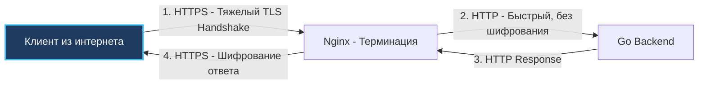

# Терминация TLS в Nginx: Разгрузка CPU, ускорение TLS 1.3 и mTLS

В современном вебе передача сетевых данных в открытом виде (по протоколу HTTP) — непростительная ошибка с точки зрения безопасности. Протокол HTTPS (HTTP поверх защищенного транспортного уровня TLS) шифрует трафик, обеспечивая строгую конфиденциальность, аутентификацию сервера и целостность передаваемых пакетов.

Однако криптография — это чрезвычайно тяжелая вычислительная математика. Операции асимметричного шифрования при установке защищенного соединения сжигают колоссальное количество процессорных тактов.

**TLS Termination (Терминирование TLS)** — это архитектурный паттерн, при котором входящие зашифрованные клиентские HTTPS-сессии расшифровываются на граничном шлюзе (**Nginx**). Дальше внутрь защищенного периметра инфраструктуры (к микросервисам на Go) очищенный трафик передается по легковесному и быстрому протоколу HTTP (или специализированному gRPC h2c). Nginx берет на себя всю криптографическую работу, терминируя защищенный канал на входе.

---

## 1. Mechanical Sympathy: Аппаратная цена рукопожатия TLS Handshake

Чтобы осознать, почему выставление Go-сервера напрямую в публичный интернет с TLS — не всегда оптимальное инженерное решение, посмотрим на происходящее глазами процессора.

Процесс установки защищенной сессии (**TLS Handshake**) опирается на ресурсоемкую асимметричную криптографию (алгоритмы RSA или кривые Диффи-Хеллмана ECDHE). Вычисление модульной экспоненты над 2048/4096-битными числами или скалярное умножение точек на эллиптических кривых требует сотен тысяч тактов CPU на каждое входящее соединение.

Если Go-приложение принимает HTTPS напрямую, его планировщик вынужден постоянно выделять потоки ОС (`M`) под криптографические операции. Но главная угроза — **медленные и нестабильные клиенты**:
* Клиент на слабом мобильном канале передает сертификаты и ключевые пакеты с задержками в сотни миллисекунд.
* В рантайме Go горутина, обслуживающая такой сокет, висит в памяти, удерживая криптографический контекст, сессионные буферы кучи и блокируя системные ресурсы.
* При наплыве тысяч таких клиентов куча (Heap) раздувается, заставляя сборщик мусора (**Garbage Collector**) непрерывно сканировать долгоживущие структуры и просаживать throughput полезного бэкенда.

### Почему Nginx эффективнее справляется с TLS:
1. **Асинхронное событийно-ориентированное ядро на Си:** Nginx использует системный вызов `epoll`. Он удерживает десятки тысяч медленных TLS-рукопожатий в компактных C-структурах, не аллоцируя динамические стеки горутин и не создавая работы для сборщика мусора.
2. **Аппаратные векторные инструкции и OpenSSL:** Nginx собирается с высокооптимизированными криптографическими библиотеками (OpenSSL, BoringSSL или wolfSSL). Они на уровне ассемблера используют специализированные векторные инструкции CPU — **AES-NI** (аппаратное шифрование AES на кремнии), CLMUL и AVX-512, выжимая предельный гигабитный трафик при минимальном нагреве кристаллов CPU.



---

## 2. Возобновление сессий TLS: Избавляемся от повторного Handshake

Самое быстрое криптографическое рукопожатие — то, которого удалось полностью избежать. Если клиент совершает серию запросов, повторный полный TLS Handshake (с асимметричным обменом ключами) создает неоправданную задержку в 1–2 сетевых round-trip'а (RTT).

В протоколах TLS предусмотрены механизмы быстрого возобновления сессий (Session Resumption), которые Nginx поддерживает на уровне конфигурации:

### 1. Session IDs (Кэширование на стороне сервера)
Сервер и клиент сохраняют уникальный 32-байтный идентификатор сессии (`Session ID`). При повторном подключении клиент передает этот ID. Если Nginx находит его в кэше разделяемой памяти, этап асимметричных вычислений пропускается: стороны мгновенно восстанавливают симметричный ключ шифрования и начинают передачу данных.

```nginx
# Выделяем 10 МБ в разделяемой памяти между воркерами для кэша сессий (~40 000 сессий)
ssl_session_cache shared:SSL:10m; 
ssl_session_timeout 1d;
```

### 2. Session Tickets (Stateless-механизм)
Хранение сессий в памяти Nginx плохо масштабируется при балансировке между несколькими серверами (клиент может прийти на другой хост, где нет нужного ID). В механизме **Session Tickets** (RFC 5077) сервер шифрует состояние сессии секретным симметричным мастер-ключом и отдает его клиенту в виде зашифрованного билета (Ticket). При следующем запросе клиент возвращает билет, Nginx расшифровывает его своим ключом и продолжает диалог.

> [!info] Под капотом: Синхронизация Session Ticket Keys в кластере
> Если в вашей инфраструктуре работает несколько независимых серверов Nginx за внешним балансировщиком L4 (или DNS Round Robin), возникает проблема: при генерации случайных ticket-ключей на каждом узле клиент, переключившийся на соседний узел, получит отказ расшифровки билета и будет вынужден проходить тяжелый полный Handshake.
> 
> В production-инфраструктуре секретный ключ `ssl_session_ticket_key` обязан быть идентичным на всех нодах кластера Nginx. Ключи генерируются криптографически стойким генератором (48 байт псевдослучайных данных), синхронизируются через секреты (HashiCorp Vault, Kubernetes Secrets) и регулярно ротируются без перезапуска демона Nginx.

---

## 3. TLS 1.3 и режим 0-RTT: Экстремальная скорость против рисков безопасности

Современный стандарт **TLS 1.3** кардинально упростил криптографию в вебе:
1. Удалены все небезопасные и устаревшие шифры (RC4, 3DES, CBC-режимы AES, MD5, SHA-1).
2. Полное рукопожатие сокращено с 2-х RTT до **ровно 1 RTT** — клиент отправляет свои криптографические параметры одновременно с пакетом Client Hello.

Вершиной оптимизации стал режим **0-RTT (Zero Round Trip Time)**, или `Early Data`. Если клиент ранее уже устанавливал защищенное соединение с сервером, он может передать первый HTTP-запрос (например, `GET /api/v1/profile`) **внутри первого же криптографического пакета**, еще до завершения нового рукопожатия!

Для включения 0-RTT в Nginx используется директива:
```nginx
ssl_early_data on;
```

> [!warning] Ловушка / Gotcha: Уязвимость 0-RTT перед атаками повтора (Replay Attacks)
> Пакеты 0-RTT принципиально не защищены от повторного воспроизведения (**Replay Attack**).
> 
> Злоумышленник, перехватывающий Wi-Fi трафик в публичном месте, может скопировать зашифрованный пакет 0-RTT (содержащий, например, запрос `POST /api/pay?amount=1000`) и отправить его на сервер 100 раз подряд. Поскольку пакет зашифрован валидным ключом, Nginx успешно расшифрует его и передаст в Go-бэкенд.
> 
> **Правила защиты при использовании 0-RTT:**
> 1. **Запрет для мутаций:** Никогда не используйте 0-RTT для небезопасных и немутабельных HTTP-методов (`POST`, `PUT`, `DELETE`, `PATCH`).
> 2. **Проверка заголовка Early-Data в Go:** Nginx автоматически проставляет HTTP-заголовок `Early-Data: 1` при трансляции ранних запросов. В Go-сервисе подключите middleware, проверяющий этот заголовок: если пришел изменяющий состояние метод с `Early-Data: 1`, немедленно отвечайте кодом `425 Too Early`, заставляя браузер повторить запрос после штатного завершения рукопожатия!

---

## 4. Передача криптографического контекста в рантайм Go

Поскольку Nginx снимает шифрование, соединение между Nginx и Go происходит по голому протоколу HTTP. Для приложения поле `r.TLS` в объекте `http.Request` равно `nil`.

Если Go-бэкенду необходимо сгенерировать абсолютный редирект, ссылку для подтверждения почты или проверить безопасность куки (`Secure`), он сформирует префикс `http://` вместо `https://`, что приведет к блокировке браузером или ошибкам авторизации.

Для передачи контекста Nginx настраивается следующим образом:

```nginx
location / {
    proxy_pass http://go_backend:8080;
    
    # Сообщаем, что клиент пришел по защищенному HTTPS
    proxy_set_header X-Forwarded-Proto $scheme; # Примет значение 'https'
    
    # Передаем оригинальный внешний порт
    proxy_set_header X-Forwarded-Port $server_port;
    
    # Транслируем доменное имя
    proxy_set_header Host $host;
}
```

В Go вы обязаны использовать мидлварь, которая читает эти заголовки и подменяет `r.URL.Scheme` и `r.URL.Host` до того, как запрос попадет в бизнес-логику. В популярных фреймворках или в стандартном пакете `net/http` через обертки это настраивается с указанием `TrustForwardHeader`:

```go
func HTTPSRedirectOrContextMiddleware(next http.Handler) http.Handler {
	return http.HandlerFunc(func(w http.ResponseWriter, r *http.Request) {
		proto := r.Header.Get("X-Forwarded-Proto")
		if proto == "https" {
			r.URL.Scheme = "https"
		}
		if host := r.Header.Get("Host"); host != "" {
			r.URL.Host = host
		}
		next.ServeHTTP(w, r)
	})
}
```

---

## 5. Взаимная аутентификация: Mutual TLS (mTLS)

В корпоративных средах и архитектуре Zero Trust все чаще применяется **Mutual TLS (mTLS)**. В отличие от стандартного HTTPS, где только клиент валидирует подлинность сертификата сервера, при mTLS сервер требует от клиента предъявить его персональный сертификат X.509 и проверяет его по локальному центру сертификации (CA).

Nginx может выступать централизованной точкой проверки mTLS-сертификатов на входе:

```nginx
server {
    listen 443 ssl;
    server_name m2m.example.com;

    ssl_certificate        /etc/ssl/server.crt;
    ssl_certificate_key    /etc/ssl/server.key;

    # Доверенный корневой сертификат для валидации клиентов
    ssl_client_certificate /etc/ssl/ca.pem;
    
    # Требовать обязательный клиентский сертификат (on) или опционально (optional)
    ssl_verify_client on;

    location / {
        proxy_pass http://go_backend:8080;
        
        # Передаем статус верификации и метаданные субъекта
        proxy_set_header X-Client-Verify $ssl_client_verify;
        proxy_set_header X-Client-Cert-Dn $ssl_client_s_dn;
        
        # Передаем весь сертификат в формате PEM для глубокого анализа в Go
        proxy_set_header X-Client-Cert $ssl_client_escaped_cert;
    }
}
```

> [!tip] Собеседование: Безопасная передача сертификата из Nginx в Go
> **Вопрос:** Ваша архитектура требует mTLS. Если Nginx терминирует TLS и проверяет клиентский сертификат, как внутренний Go-сервис узнает, кто именно (какой клиент) к нему обратился, ведь шифрование снято?
> 
> **Ответ:** 
> Nginx должен передать данные из сертификата в HTTP-заголовках. Существуют стандартные заголовки (определенные RFC), такие как `X-Client-Cert-Dn` (Distinguished Name), или Nginx может передавать сертификат в формате PEM через заголовок:
> `proxy_set_header X-Client-Cert $ssl_client_escaped_cert;`
> 
> **Критический нюанс:** Обязательно использовать переменную `$ssl_client_escaped_cert`, а не `$ssl_client_cert`! Сертификат X.509 в формате PEM содержит символы переноса строк (`\n`). Если вставить их в HTTP-заголовок напрямую, заголовок будет поврежден или сломает парсер HTTP в Go (уязвимость HTTP Response Splitting). Переменная `$ssl_client_escaped_cert` кодирует сертификат в безопасный URL-encoded формат. 
> 
> Go-бэкенд читает этот заголовок, декодирует через `url.QueryUnescape`, парсит PEM через `pem.Decode` и извлекает Subject для авторизации.

---

## Итог

1. **TLS Termination** снимает с Go-бэкенда тяжелую криптографическую нагрузку и проблемы с медленными клиентами, перекладывая их на C-ядро Nginx.
2. **Кэширование сессий** (Session Cache и Session Tickets) радикально снижает нагрузку на CPU Nginx, устраняя необходимость полных рукопожатий.
3. **TLS 1.3 0-RTT** — мощный ускоритель для API, но требует строгой защиты от Replay-атак на уровне Go-кода.
4. **Контекст протокола**: Всегда передавайте `X-Forwarded-Proto`, чтобы Go понимал, что он работает за HTTPS.
5. **mTLS**: Nginx может верифицировать клиентские сертификаты и передавать их данные в Go через HTTP-заголовки.

Расшифровав трафик и сбалансировав его, Nginx может сделать еще одну невероятно полезную вещь — кэшировать ответы бэкенда, снижая нагрузку на Go до нуля. В следующей статье мы разберем механику кэширования в Nginx: [[5. Кэширование в nginx]].