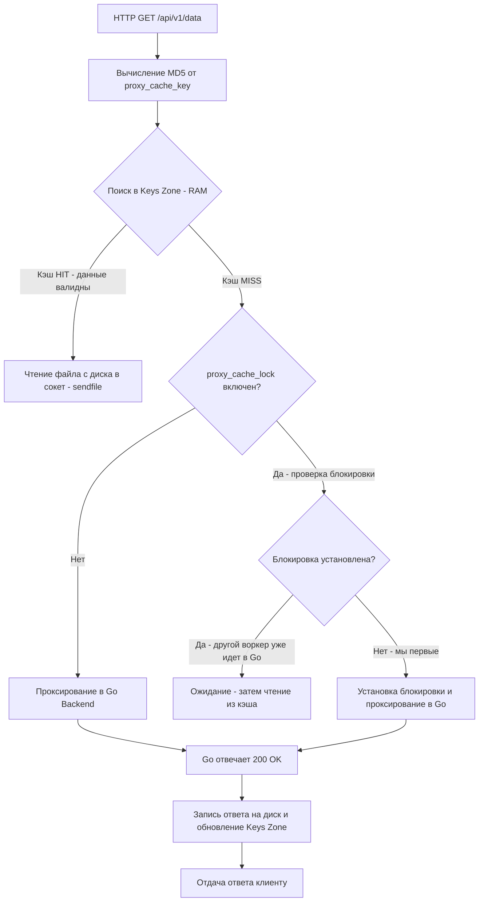

# Кэширование в Nginx: Разгрузка Go-бэкенда, борьба с Thundering Herd и Page Cache

После того как Nginx расшифровал входящий TLS-трафик и отбалансировал потоки между инстансами, перед ним открывается еще одна мощнейшая оптимизационная возможность — **кэширование ответов на пограничном уровне (Edge Caching)**.

В бэкенд-разработке под кэшированием обычно понимают in-memory структуры данных внутри процесса Go (такие как `sync.Map`, локальные кэши без сборщика мусора вроде `BigCache` или `FreeCache`), либо внешние распределенные хранилища (Redis, Memcached, KeyDB).

Однако кэширование на уровне обратного прокси Nginx обладает фундаментальным преимуществом: **оно отрабатывает до того, как сетевой пакет вообще коснется вашего приложения**.

---

## 1. Mechanical Sympathy: Почему Nginx-кэш эффективнее Go-кэша для тяжелых GET-запросов

Представьте типичный аналитический сценарий: клиент запрашивает сложный дашборд через HTTP GET. Чтобы сформировать JSON-ответ размером 500 КБ, сервис на Go выполняет 3 запроса в PostgreSQL, агрегирует данные и сериализует результат в течение 300 мс.

### Если кэшировать данные в Redis:
1. Запрос приходит в сокет Go-сервера.
2. Сетевой поллер Go будит горутину, рантайм аллоцирует структуры `http.Request` и контекст.
3. Горутина по TCP обращается в Redis, вычитывает 500 КБ JSON, парсит их или передает в `w.Write()`.
4. Рантайм Go удерживает сотни килобайт в куче (Heap), нагружая Garbage Collector сканированием объектов.
5. При 5 000 RPS даже при стопроцентном попадании в Redis Go-сервер сжигает процессорные ядра только на сетевой маршалинг и сборку мусора.

### Если ответ закэширован в Nginx:
1. Запрос попадает в однопоточный Worker Nginx.
2. Воркер находит ключ в разделяемой памяти и определяет файл с телом ответа.
3. Nginx вызывает системный вызов ядра **`sendfile()`** (о котором мы говорили в статье [[1. nginx. Архитектура]]), передавая закэшированные байты **напрямую из Page Cache операционной системы в сетевой сокет**.
4. **Go-бэкенд вообще не узнает о существовании этого запроса!** Нулевое потребление CPU в Go, ноль аллокаций в куче, ноль пауз сборщика мусора. Сервер способен отдавать десятки тысяч ответов в секунду на скорости сетевого интерфейса.

---

## 2. Архитектура кэша Nginx: Диск и Разделяемая память

Nginx реализует элегантную гибридную архитектуру кэша:

1. **Дисковая подсистема (Disk Storage):** Тела HTTP-ответов и оригинальные заголовки бэкенда записываются в обычные файлы на диске. Это решение исключительно надежно и быстро, поскольку операционная система Linux автоматически удерживает часто запрашиваемые дисковые блоки в оперативной памяти — в системном кэше страниц (**Page Cache**).
2. **Разделяемая память (Shared Memory Keys Zone):** Поиск файла на диске по строковому имени при каждом запросе создавал бы недопустимые задержки ввода-вывода (Disk I/O). Поэтому Nginx хранит все метаданные кэша в оперативной памяти, в структуре данных **Красно-черное дерево (Red-Black Tree)**. Узел дерева содержит MD5-хэш ключа кэша, размер файла, временные метки валидности и счетчик обращений.

Базовая конфигурация в `nginx.conf`:

```nginx
# Задаем параметры глобальной зоны кэширования
proxy_cache_path /var/cache/nginx/api 
                 levels=1:2 
                 keys_zone=api_cache:10m 
                 max_size=1g 
                 inactive=60m 
                 use_temp_path=off;
```

> [!info] Под капотом: Роль параметров levels и use_temp_path
> Директива `levels=1:2` критически важна для производительности файловых систем Linux (ext4, XFS).
> 
> Если опустить этот параметр, Nginx сохранит все кэш-файлы в единый плоский каталог. Когда число записей превысит 10 000–50 000 файлов, системные вызовы `open()` и `stat()` начнут фатально деградировать из-за коллизий в B-Tree каталогов файловой системы.
> 
> Конфигурация `levels=1:2` создает двухуровневую иерархию поддиректорий на основе последних символов MD5-хэша (например, `/var/cache/nginx/api/f/4a/b6...4af`), распределяя миллионы файлов равномерно по тысячам подпапок.
> 
> Параметр `use_temp_path=off` приказывает Nginx записывать входящие ответы бэкенда непосредственно во временные файлы целевой файловой системы кэша. Это исключает дорогостоящую операцию копирования между разными разделами диска при финализации файла (`rename()`).

---

## 3. Жизненный цикл запроса в кэше

При получении HTTP-запроса Nginx выполняет строгий алгоритм:



---

## 4. Thundering Herd (Стадный эффект) и директива proxy_cache_lock

Самая опасная аварийная ситуация для кэширующей системы — явление **Cache Stampede** (или **Thundering Herd** — эффект стадного наплыва).

Представьте высоконагруженный эндпоинт каталога с трафиком 2 000 RPS. Время жизни кэша (TTL) составляет 10 минут. В `12:00:00` срок жизни кэша истекает. 

Если Nginx не защищен, в `12:00:01` все 2 000 одновременных запросов обнаружат `Cache MISS` и синхронно ринутся в Go-бэкенд! В этот момент:
* Go мгновенно порождает 2 000 параллельных горутин.
* База данных получает 6 000 тяжелых SQL-запросов одновременно.
* Пул соединений PostgreSQL исчерпывается, процессор уходит в полку, и сервер падает по таймауту.

Для предотвращения этой катастрофы Nginx предоставляет спасительную связку директив:

```nginx
location /api/ {
    proxy_cache api_cache;
    proxy_cache_valid 200 10m;  // Кэшируем успешные ответы на 10 минут
    proxy_cache_key $uri$is_args$args;
    
    # Включаем блокировку Thundering Herd: только один запрос идет в Go!
    proxy_cache_lock on;
    proxy_cache_lock_timeout 5s;
    
    # Отдаем просроченный кэш, пока один запрос обновляет его в фоне
    proxy_cache_use_stale updating error timeout;
}
```

### Как работает `proxy_cache_lock`:
1. При протухании кэша Nginx пропускает к Go-бэкенду **ровно один запрос**, который захватывает внутренний мьютекс блокировки.
2. Остальные 1 999 запросов либо ждут освобождения блокировки, либо — если указана директива `proxy_cache_use_stale updating` — **мгновенно получают слегка устаревший ответ из старого кэша**.
3. Клиенты не видят задержек, база данных не замечает скачка нагрузки, а кэш бесшовно обновляется в фоне.

---

## 5. Контракт заголовков между Go и Nginx

Жестко прописывать TTL в конфигурации Nginx (`proxy_cache_valid 200 10m`) неудобно при микросервисной разработке: изменение логики кэширования требует передеплоя инфраструктуры.

Идиоматичный подход — **делегировать управление временем жизни кэша самому Go-сервису** через стандартные HTTP-заголовки `Cache-Control` и `Expires`:

```nginx
location /api/ {
    proxy_cache api_cache;
    
    # Запасные дефолтные значения TTL
    proxy_cache_valid 200 302 10m; # Дефолтный TTL
    proxy_cache_valid 404 1m;      # Кэшируем 404 на 1 минуту
    
    # Разрешаем кэширование, игнорируя мешающие служебные заголовки
    proxy_ignore_headers Set-Cookie; # Куки не должны мешать кэшированию
    proxy_hide_header Set-Cookie;    # Убираем куки из ответа клиенту, чтобы они не кэшировались в браузере
}
```

В Go-коде программист явно управляет поведением Nginx:

```go
package main

import (
	"net/http"
)

func heavyHandler(w http.ResponseWriter, r *http.Request) {
	// 1. Вычисление тяжелого ответа...
	jsonData := []byte(`{"status":"ok","data":"complex analytics"}`)

	// 2. Управляем кэшем Nginx через стандартные заголовки:
	// Говорим Nginx кэшировать на 5 минут
	w.Header().Set("Cache-Control", "public, max-age=300")
	
	// Если бы потребовалось запретить кэширование этого конкретного ответа:
	// w.Header().Set("Cache-Control", "no-cache, no-store, must-revalidate")

	w.Header().Set("Content-Type", "application/json")
	w.WriteHeader(http.StatusOK)
	w.Write(jsonData)
}
```

> [!warning] Ловушка / Gotcha: Куки убивают кэширование
> По спецификации RFC и дефолтной логике Nginx: если бэкенд возвращает заголовок `Set-Cookie`, Nginx **категорически отказывается кэшировать такой ответ**. Это разумная мера предосторожности: иначе сессионная кука пользователя А закэшировалась бы и отправилась пользователю B.
> 
> Однако в Go-сервисах глобальные middleware (например, логирование сессий или CSRF) часто проставляют `Set-Cookie` даже на публичные GET-эндпоинты. В результате кэш тихо перестает работать, а инженеры недоумевают, почему нагрузка на Go не падает. 
> 
> **Решение:** На публичных API-маршрутах обязательно указывайте `proxy_ignore_headers Set-Cookie;` и `proxy_hide_header Set-Cookie;`.

---

## 6. Инвалидация кэша: Purge и Cache Busting

Рано или поздно данные в базе данных обновляются, и закэшированный ответ становится неактуальным до истечения TTL.

Существует несколько стратегий инвалидации:

1. **Модуль `ngx_cache_purge` (или Nginx Plus):** Позволяет удалять записи из кэша точечным HTTP-запросом специального метода:
   ```http
   PURGE /api/v1/data/123 HTTP/1.1
   Host: api.example.com
   ```
2. **Паттерн Cache Busting через URL:** Если сторонние модули недоступны, в Go-архитектуре используют версионирование ключей: клиент обращается к URL вида `/api/data?v=2`. Nginx вычисляет новый MD5-хэш от ключа `$uri$is_args$args` и идет в Go за свежей копией.

> [!tip] Собеседование: Очистка кэша Nginx без сторонних модулей
> **Вопрос:** Как очистить кэш Nginx без модуля `ngx_cache_purge` и перезапуска сервера?
> 
> **Ответ:**
> 1. **Специальный заголовок от Go-бэкенда:** Go-приложение при обнаружении обновлений может вернуть ответ с директивой `Cache-Control: no-cache` или специализированным заголовком Nginx **`X-Accel-Expires: 0`**. Nginx немедленно признает локальный файл кэша устаревшим и перезапишет его свежими данными.
> 2. **Динамическая версия в ключе кэширования:** Добавить в `proxy_cache_key` кастомный заголовок версии приложения (например, `$http_x_app_version`). При деплое новой версии достаточно инкрементировать версию на клиенте — старый кэш автоматически вымоется по `inactive=60m`.

---

## Итог

1. **Двухуровневый кэш Nginx** (Keys Zone в RAM + Файлы на диске) позволяет обрабатывать тысячи запросов в секунду вообще не тревожа Go-бэкенд.
2. **`levels` и `use_temp_path`** — обязательные настройки для избежания узких мест файловой системы и блокировок IO.
3. **`proxy_cache_lock`** — ваш щит от Thundering Herd. Никогда не включайте кэширование тяжелых эндпоинтов без него.
4. **Go управляет TTL** через стандартные заголовки `Cache-Control`. Nginx должен быть настроен на чтение этих заголовков.
5. **Куки убивают кэш**. Строго изолируйте аутентификацию от публичного кэшируемого контента.

Мы завершили блок, посвященный Nginx — пограничному стражу вашей инфраструктуры. Теперь мы переходим к технологиям, которые изменили правила деплоя навсегда. В следующем разделе мы разберем, как изолировать ваше Go-приложение на уровне ядра ОС: [[1. Контейнеризация. Основы]].