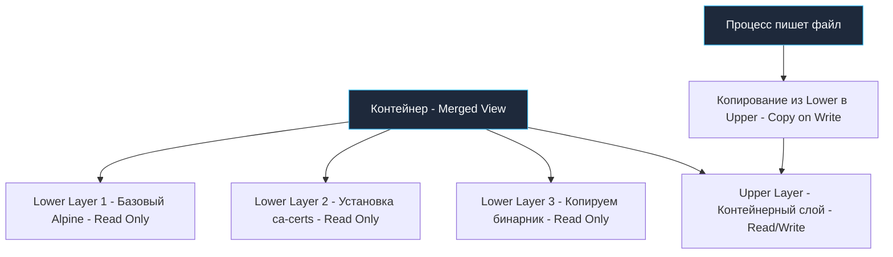
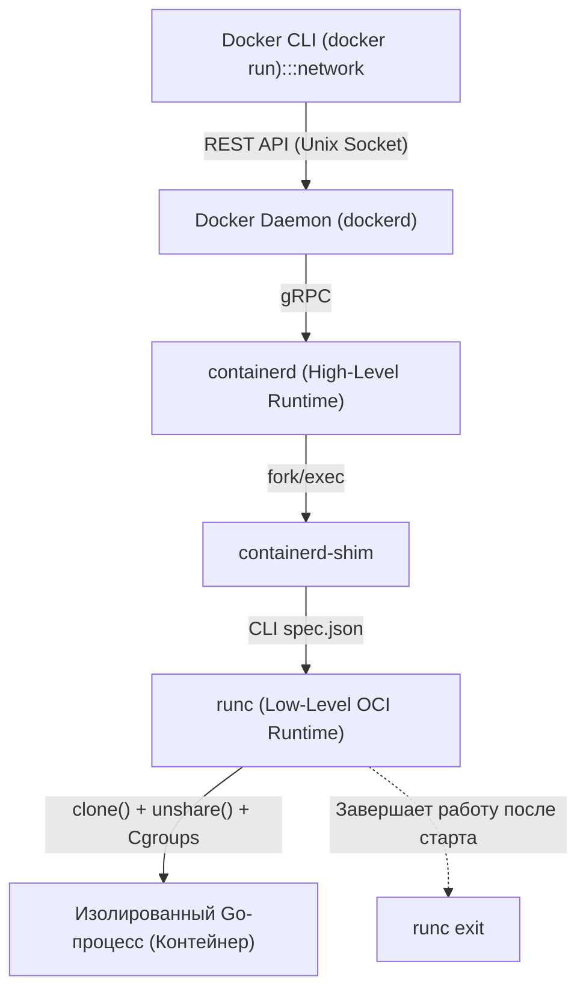

# Основы контейнеризации: От изоляции ядра Linux до образов scratch в Go

Переход от монолитных систем к микросервисной архитектуре поставил перед инженерами серьезный эксплуатационный вызов: как надежно и предсказуемо развертывать сотни независимых сервисов? Классический подход с установкой зависимостей прямо на хостовую операционную систему неизбежно порождал знаменитый «ад зависимостей» (*Dependency Hell*), когда двум сервисам на одном сервере требовались разные версии системных библиотек. Развертывание же отдельной виртуальной машины под каждый сервис приводило к чудовищной неэффективности и нерациональному расходу ресурсов.

Ответом индустрии стала **контейнеризация**, а экосистема **Docker** превратилась в промышленный стандарт упаковки и доставки программного обеспечения.

Однако для инженера уровня Senior Docker — это не просто набор удобных команд вроде `docker build` и `docker run`. Это филигранная композиция низкоуровневых примитивов ядра Linux: пространств имен (**Namespaces**), контрольных групп (**Cgroups**) и многослойных файловых систем (**OverlayFS**). Понимание этих внутренних механизмов позволяет создавать легковесные, безопасные и молниеносно запускающиеся Go-сервисы.

---

## 1. Контейнеры против Виртуальных Машин: Разрушение главного мифа

Среди начинающих разработчиков бытует опасное заблуждение: *«Контейнер — это просто урезанная и легковесная виртуальная машина»*. Это утверждение в корне неверно.

### Виртуальная машина (Hardware Virtualization):
Виртуальная машина эмулирует физическое аппаратное обеспечение. Гипервизор (KVM, Xen, VMware, Hyper-V) перехватывает команды виртуального CPU, виртуализирует контроллеры дисков и сетевые адаптеры. Внутри каждой VM загружается **полноценная гостевая операционная система (Guest OS)** со своим собственным ядром Linux, своими драйверами, собственным планировщиком задач и подсистемой управления виртуальной памятью. 
* *Цена решения:* Старт виртуальной машины занимает от десятков секунд до минут, а на поддержание гостевого ядра и системных демонов уходят гигабайты драгоценной оперативной памяти.

### Контейнер (OS-level Virtualization):
**Контейнер — это обычный изолированный процесс хостовой операционной системы Linux.** 
В контейнере нет никакого второго ядра, нет гипервизора и нет эмуляции материнской платы. Контейнеры делят одно и то же монолитное ядро Linux с хостом и всеми соседними контейнерами. Ядро просто «рисует» процессу иллюзию изолированного персонального мира.

```mermaid
flowchart TD
    classDef process  fill:#1e293b,stroke:#38bdf8,stroke-width:1px,color:#f8fafc
    classDef success  fill:#064e3b,stroke:#34d399,stroke-width:1px,color:#f8fafc
    classDef error    fill:#7f1d1d,stroke:#f87171,stroke-width:1px,color:#f8fafc
    classDef warning  fill:#78350f,stroke:#fbbf24,stroke-width:1px,color:#f8fafc
    classDef entry    fill:#1e3a5f,stroke:#38bdf8,stroke-width:2px,color:#f8fafc
    classDef aux      fill:#334155,stroke:#64748b,stroke-width:1px,color:#f8fafc
    classDef system   fill:#312e81,stroke:#a78bfa,stroke-width:1px,color:#f8fafc
    classDef data     fill:#132d29,stroke:#2dd4bf,stroke-width:1px,color:#f8fafc
    classDef network  fill:#881337,stroke:#fb7185,stroke-width:1px,color:#f8fafc
    classDef accent   fill:#1e1b4b,stroke:#818cf8,stroke-width:1px,color:#f8fafc
    subgraph VM["Виртуальная машина - Hardware Virtualization"]
        A["App A"]:::process --> B["Guest OS"]
        C["App B"]:::process --> D["Guest OS"]
        B --> E["Hypervisor - KVM"]
        D --> E
        E --> F["Host OS - Kernel"]
        F --> G["Hardware - CPU, RAM, Disk"]
    end

    subgraph Container["Контейнеры - OS Virtualization"]
        H["App A + Libs"]:::system --> I["Container Runtime - Docker"]
        J["App B + Libs"] --> I
        I --> K["Host OS - Kernel - Namespaces and Cgroups"]
        K --> L["Hardware - CPU, RAM, Disk"]
    end
```

> [!tip] Собеседование: Запуск Linux-контейнеров на Windows и macOS
> **Вопрос:** Можно ли запустить Linux-контейнер со статическим Go-бинарником на хосте с Windows или macOS нативно, без виртуализации?
> 
> **Ответ:** 
> Нет, это принципиально невозможно. Контейнер — это не эмулятор и не кроссплатформенная виртуальная машина вроде JVM. Контейнеризированный Go-бинарник выполняет прямые системные вызовы ядра Linux (например, `syscall.EpollWait`, `clone`, `futex`).
> 
> Ядро Windows (NT kernel) или ядро macOS (XNU/Darwin) имеют совершенно другой интерфейс системных вызовов (ABI) и не содержат подсистем `epoll`, `cgroups` или `namespaces`. 
> 
> Поэтому Docker Desktop на macOS и Windows скрытно поднимает легковесную виртуальную машину с Linux (через Apple Hypervisor Framework, Hyper-V или WSL2), и все ваши контейнеры на самом деле работают внутри гостевого ядра Linux этой VM.

---

## 2. Под капотом: Пространства имен (Namespaces) — изоляция видимости

Первый фундамент контейнеризации — **Namespaces (Пространства имен)**. Пространства имен определяют то, что процесс может **видеть** вокруг себя в операционной системе.

Когда Docker запускает контейнер, низкоуровневая утилита вызывает системный вызов ядра **`clone()`** со специальными битовыми флагами, порождая дочерний процесс в изолированных пространствах имен:

1. **PID Namespace (`CLONE_NEWPID`):** Изолирует дерево процессов. Ваш Go-бэкенд внутри контейнера получает идентификатор **PID 1**, становясь главным процессом пространства. При этом он не видит ни процессов хоста, ни соседних контейнеров.
2. **NET Namespace (`CLONE_NEWNET`):** Изолирует сетевой стек. Контейнер получает собственный независимый сетевой интерфейс `lo` (`127.0.0.1`), виртуальный адаптер `eth0`, персональную таблицу маршрутизации и правила iptables. Механику виртуальных пар `veth` мы подробно разбирали в статье [[6. Networking в Linux]].
3. **MNT Namespace (`CLONE_NEWNS`):** Изолирует таблицу точек монтирования файловой системы. Процесс видит персональный корень `/`, сформированный из слоев образа, и не имеет доступа к директориям хоста (если они не проброшены явно через Bind Mount).
4. **UTS Namespace (`CLONE_NEWUTS`):** Позволяет контейнеру иметь собственное сетевое имя узла (**hostname**) и доменное имя, например `my-go-app-7f4b8`, не конфликтуя с именем физического сервера `prod-server-01`.
5. **IPC Namespace (`CLONE_NEWIPC`):** Изолирует примитивы межпроцессного взаимодействия (очереди сообщений POSIX message queues и разделяемую память System V IPC), предотвращая несанкционированный доступ процессов контейнера к общей памяти хоста.
6. **USER Namespace (`CLONE_NEWUSER`):** Выполняет трансляцию идентификаторов пользователей (**UID mapping**). Процесс может выполняться с правами root (UID 0) внутри контейнера, но на физическом хосте ядро будет воспринимать его как непривилегированного пользователя (например, с UID 100000). Это краеугольный камень технологии **Rootless Docker**.

> [!warning] Ловушка / Gotcha: Уязвимости разделяемого ядра (Kernel Escapes)
> Помните: Namespaces изолируют только логические структуры данных ядра, но **ядро остается общим**. 
> 
> Любая уязвимость повреждения памяти в ядре хоста (такая как Dirty COW или критические баги в системном вызове `io_uring`) может позволить вредоносному коду, запущенному внутри контейнера, скомпрометировать ядро и совершить побег (**Container Escape**) с получением полных прав суперпользователя на всем физическом сервере. 
> 
> Поэтому регулярное обновление версий ядра Linux на хостах и соблюдение принципа наименьших привилегий (**Least Privilege**) — базовое требование безопасности.

---

## 3. Под капотом: Контрольные группы (Cgroups) — квоты ресурсов

Если пространства имен (Namespaces) отвечают за то, что процесс *видит*, то контрольные группы (**Control Groups / Cgroups**) жестко ограничивают то, что процесс может **потреблять**.

Cgroups делят физические аппаратные ресурсы сервера на иерархические группы. Для высоконагруженного Go-бэкенда критически важны две подсистемы:

### 1. Подсистема Memory (Оперативная память)
Позволяет задать жесткий лимит RAM. Если контейнер попытается выделить памяти больше установленной квоты, ядро Linux активирует **OOM Killer (Out Of Memory Killer)** и немедленно уничтожит процесс смертельным сигналом `SIGKILL`.

В современной спецификации **Cgroups v2** реализовано разделение:
* `memory.max`: Абсолютный жесткий лимит. Его пересечение означает мгновенный OOM Kill.
* `memory.high`: Мягкий порог предупреждения. При его достижении ядро начинает принудительно сбрасывать файловый кэш процесса и троттлить аллокации памяти, давая приложению шанс стабилизироваться.

### 2. Подсистема CPU (Процессорное время)
Ограничивает долю процессорного времени с помощью планировщика ядра Linux CFS (Completely Fair Scheduler). В Docker лимит задается флагом `--cpus="1.5"`. Ядро выделяет процессу квоту времени (CFS Quota) в рамках фиксированного периода (CFS Period, обычно 100 мс). Исчерпав квоту за первые 20 мс, процесс засыпает на оставшиеся 80 мс периода (**CPU Throttling**), что приводит к резким всплескам латентности (p99).

> [!info] Под капотом: Симбиоз рантайма Go с Cgroups (GOMEMLIMIT)
> В ранних версиях Go (до 1.19) сборщик мусора жил в неведении относительно ограничений Cgroup. Механизм `GOGC` рассчитывал триггер следующего запуска сборки исходя из общего объема оперативной памяти хостовой машины!
> 
> Если сервер обладал 64 ГБ RAM, а контейнеру было выделено всего 512 МБ через Cgroup, GC лениво ждал роста кучи, полагая, что памяти в избытке. В результате куча Go разрасталась до 513 МБ, и ядро мгновенно убивало контейнер по OOM Kill.
> 
> Начиная с Go 1.19, в рантайм внедрен механизм `GOMEMLIMIT` и автоматическое чтение лимитов Cgroups (`autoGOMEMLIMIT`). Рантайм читает файл `memory.max` из cgroupv2 и начинает форсированно запускать сборку мусора при приближении к границе контейнера, предотвращая аварийное завершение процесса. Это классический пример **Mechanical Sympathy** в облачных средах.

---

## 4. Слоистые файловые системы: OverlayFS и механизм Copy-on-Write

Образ Docker — это не монолитный бинарный слепок жесткого диска. Это стопка неизменяемых слоев (**Image Layers**). Каждая инструкция в Dockerfile (`FROM`, `RUN`, `COPY`) формирует отдельный компактный слой, хранящий только разницу (**diff**) по отношению к предыдущему.

Когда Docker создает контейнер, он объединяет слои в единое виртуальное дерево с помощью специальной файловой системы объединения — **OverlayFS**:

### Механика работы OverlayFS:
1. **Нижние слои (Lower Layers):** Доступны **строго только для чтения (Read-Only)**. Они принадлежат образу и могут одновременно и безопасно разделяться сотнями запущенных контейнеров, экономя физическое дисковое пространство.
2. **Верхний слой (Upper Layer):** Тонкий рабочий слой контейнера, открытый для чтения и записи (**Read/Write**). Создается индивидуально в момент старта контейнера и удаляется при его уничтожении.
3. **Объединенное представление (Merged View):** Процесс внутри контейнера видит плоскую файловую систему, где верхний слой перекрывает нижние.

### Принцип Copy-on-Write (CoW):
* При **чтении** файла (например, доверенных сертификатов `/etc/ssl/certs/ca-certificates.crt`) OverlayFS сканирует слои сверху вниз. Найдя файл в неизменяемом слое `Lower Layer 2`, ядро мгновенно отдает его процессу.
* Если процесс пытается **модифицировать** существующий файл из нижнего слоя или создать локальный файл (например, записать лог в `/var/log/app.log`), OverlayFS не трогает оригинальный Read-Only файл! Ядро перехватывает операцию, копирует весь файл целиком из нижнего слоя в верхний рабочий слой `Upper Layer`, и модифицирует уже эту копию.

> [!warning] Ловушка / Gotcha: Деградация производительности дискового I/O на OverlayFS
> Механизм Copy-on-Write создает серьезные задержки при интенсивной записи. 
> 
> Если ваше Go-приложение пишет множество данных во временные файлы, ведет локальную встроенную базу данных (SQLite, BadgerDB, BoltDB) или непрерывно пишет терабайты логов прямо в слой контейнера, каждый первый вызов `write()` вызывает тяжелое копирование метаданных и блоков диска в OverlayFS.
> 
> **Золотое правило:** Любые высоконагруженные операции ввода-вывода обязаны направляться в **Docker Volumes** или оперативную память **tmpfs** (которые монтируются напрямую в обход OverlayFS), о чем мы подробно поговорим в лекции [[5. Volumes и хранение данных]].

---

## 5. Архитектура подсистемы Docker: Daemon, containerd и runc

Современный Docker устроен по модульному принципу согласно стандартам Open Container Initiative (OCI):

1. **Docker CLI:** Консольный клиент, отправляющий декларативные команды по протоколу HTTP/REST через UNIX-сокет `/var/run/docker.sock`.
2. **Docker Daemon (`dockerd`):** Высокоуровневый серверный сервис. Отвечает за прием запросов API, управление сборкой образов (`BuildKit`), настройку виртуальных сетей и хранение томов.
3. **containerd:** Промышленный стандартизированный контейнерный рантайм (разработанный Docker и переданный в CNCF). Управляет жизненным циклом контейнеров, скачиванием образов из registry и распределением ресурсов. Именно с `containerd` напрямую взаимодействует Kubernetes (через интерфейс CRI).
4. **runc:** Эталонный низкоуровневый OCI-рантайм. Легковесная утилита на Си/Go, которая читает стандартизированный манифест `config.json`, выполняет системные вызовы ядра `clone()`, `setns()`, конфигурирует Cgroups и запускает целевой процесс. Выполнив инициализацию контейнера, `runc` немедленно завершает свою работу.

---

## 6. Статическая компиляция Go и образы Scratch

Главная суперсила языка Go в мире контейнеризации — **статическая компиляция**.

В отличие от интерпретируемых языков (Python, Ruby, Node.js) или JVM, требующих для запуска тяжелые рантаймы, интерпретаторы и сотни разделяемых библиотек, Go компилирует исходный код в единый монолитный машинный бинарник. 

Более того, стандартный рантайм Go при сборке без CGO (`CGO_ENABLED=0`) линкуется напрямую с системными вызовами ядра Linux через собственные ассемблерные вставки, вообще не завися от стандартной библиотеки языка Си (`glibc` или `musl`).

Это позволяет использовать фундаментальный образ Docker — **`FROM scratch`**:
* Образ `scratch` абсолютно пуст — он весит ровно **0 байт**.
* В нем нет операционной системы, нет системных библиотек, нет пакетного менеджера (`apt`, `apk`) и нет командной оболочки (`sh`, `bash`).
* Вы просто копируете в пустой образ скомпилированный Go-бинарник и файл доверенных корневых сертификатов `ca-certificates.crt`.

Получившийся образ весит всего 15–20 МБ, запускается за доли миллисекунды и представляет собой неприступную крепость: даже если злоумышленник найдет уязвимость в приложении, он не сможет выполнить команду шелла или скачать бэкдор, потому что в контейнере нет ни `curl`, ни `sh`, ни утилиты `ls`.

---

## Итог

1. **Контейнеры — это не виртуальные машины:** Это изолированные процессы на уровне хостового ядра Linux, не требующие гипервизора и гостевой ОС.
2. **Namespaces изолируют видимость:** Шесть ключевых пространств имен (PID, NET, MNT, UTS, IPC, USER) формируют для процесса иллюзию владения отдельным компьютером.
3. **Cgroups нормируют ресурсы:** Контрольные группы лимитируют CPU и RAM; рантайм Go (с версии 1.19+) автоматически адаптирует сборщик мусора к лимитам Cgroups через `GOMEMLIMIT`.
4. **OverlayFS и CoW:** Организуют слои образов по принципу Copy-on-Write, экономя место, но требуют выноса интенсивного I/O в Docker Volumes.
5. **Превосходство Go в контейнерах:** Статическая компиляция позволяет упаковывать Go-сервисы в пустые образы `scratch`, достигая минимального размера и абсолютной безопасности.

Теперь, понимая системные принципы работы контейнеров, перейдем к искусству написания правильных манифестов сборки. В следующей статье мы разберем лучшие практики и типовые ловушки: [[2. Dockerfile best practices]].