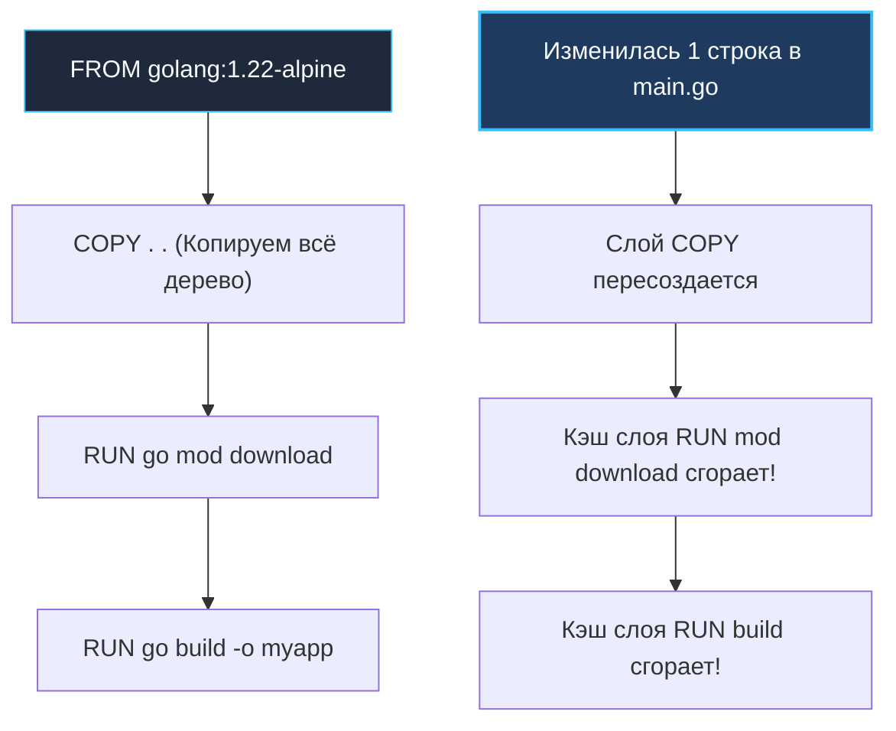

# Лучшие практики написания Dockerfile для Go: От кэширования слоев до флагов компилятора

Написание Dockerfile для сервиса на Go — это не просто механическое перечисление директив `RUN`, `COPY` и `CMD`. Это тонкий архитектурный процесс, определяющий скорость и стоимость пайплайнов CI/CD, объем потребляемого трафика и дискового пространства в реестрах контейнеров (Container Registry), а главное — безопасность и предсказуемость вашего приложения в боевой эксплуатации.

Для Go-разработчика Dockerfile служит прямым мостом между компилятором `go build` и низкоуровневой инфраструктурой ядра Linux. Здесь в полной мере раскрывается концепция **Mechanical Sympathy**: понимание того, как сборочный движок (Docker BuildKit) кэширует слои и как флаги линковщика влияют на отлаживаемость и устойчивость процесса к атакам.

---

## 1. Механика инвалидации кэша: Как Docker видит слои

Сборщик Docker строит образ пошагово: каждая инструкция в Dockerfile (`FROM`, `RUN`, `COPY`, `ADD`) порождает неизменяемый снимок файловой системы — **слой (Layer)**. 

При повторных сборках движок проверяет контрольные суммы входных данных каждого шага. Если инструкция и ее входной контекст не изменились, Docker берет готовый слой из локального кэша (`CACHED`), экономя драгоценное время.

Фундаментальный закон кэширования Docker: **Если изменился хотя бы один байт во входных данных текущего слоя, кэш этого слоя и ВСЕХ последующих слоев немедленно сгорает (инвалидируется)!**



### В чем фатальная ошибка наивного подхода?
Если разработчик пишет `COPY . .` в самом начале Dockerfile, то любое косметическое изменение — будь то правка комментария в коде, обновление `README.md` или добавление иконки — приводит к инвалидации слоя с зависимостями. 

Сборщик вынужден заново выполнять команду `RUN go mod download`, выкачивая сотни мегабайт внешних пакетов из глобальной сети. В результате время сборки микросервиса в CI/CD возрастает с 5 секунд до 3–5 минут, парализуя работу команды.

---

## 2. Идиоматичный паттерн: Раздельное кэширование зависимостей

В экосистеме Go дерево внешних модулей и их криптографические контрольные суммы строго зафиксированы в двух файлах: `go.mod` и `go.sum`. В стабильном проекте эти файлы меняются на порядки реже, чем исходный код бизнес-логики.

Идиоматичный подход заключается в разделении сборочного контекста на два изолированных этапа:
1. Сначала копируются исключительно `go.mod` и `go.sum` и выполняется выкачивание зависимостей в кэш модулей.
2. И только затем копируется остальной исходный код.

```dockerfile
FROM golang:1.22-alpine

WORKDIR /app

# 1. Копируем только манифесты зависимостей
COPY go.mod go.sum ./

# 2. Скачиваем зависимости (этот слой будет надежно закэширован, 
# пока мы явно не обновим библиотеки в go.mod/go.sum)
RUN go mod download

# 3. Копируем остальной исходный код (меняется часто)
COPY . .

# 4. Сборка бинарника (использует уже прогретый локальный кэш модулей)
RUN go build -o /myapp .
```

При таком подходе 95% сборок при коммитах в код стартуют сразу с шага 3, занимая считанные секунды!

---

## 3. Флаги компилятора: Тонкая настройка бинарника под контейнеры

Сборка Go-кода внутри контейнера по умолчанию («как на рабочем ноутбуке») — распространенный антипаттерн. В контейнерной среде компилятору необходимо передавать специализированные флаги.

### 1. `CGO_ENABLED=0`: Полная статическая компиляция
Как мы выяснили в лекции [[1. Контейнеризация. Основы]], рантайм Go при компиляции по умолчанию может попытаться использовать системную библиотеку Си (`glibc`) хоста — например, для системного резолвинга DNS или вызова криптографических функций ОС.

Флаг `CGO_ENABLED=0` принудительно отключает мост CGO. Компилятор использует чистый Go-рантайм и встроенный DNS-резолвер Go. Сгенерированный ELF-бинарник становится **полностью статическим**: у него нет динамических связей (`not a dynamic executable`), и он может исполняться в абсолютно пустом окружении `scratch` или минимальном образе без `glibc` (Alpine на базе `musl`).

### 2. `-ldflags="-s -w"`: Стриппинг отладочных символов
Флаги компоновщика (линкера) `-s` и `-w` удаляют из скомпилированного бинарника таблицу символов (Symbol Table) и отладочные структуры формата DWARF:
* `-s`: вырезает таблицу символов.
* `-w`: отключает генерацию отладочной информации DWARF.

Это сокращает физический вес бинарного файла на 20–30% (например, с 35 МБ до 24 МБ).

> [!warning] Ловушка / Gotcha: Скрытая цена флагов -s -w в продакшене
> Удаление отладочной информации через `-s -w` — это всегда компромисс между размером и наблюдаемостью (**Observability**).
> 
> Если приложение упадет с критической паникой (`panic`), в журнале ошибок вы рискуете увидеть лишь невнятные шестнадцатеричные адреса памяти вместо человекочитаемых имен функций и точных номеров строк в исходных файлах. 
> 
> Кроме того, стриппинг ломает корректную работу профилировщиков производительности (pprof, Linux perf) и системных вызовов интроспекции `runtime.Caller`. Если размер диска в реестре не является критическим лимитом, в продакшене рекомендуется **сохранять отладочные символы** ради быстрой локализации инцидентов.

### 3. `-trimpath`: Воспроизводимость и безопасность сборки
По умолчанию компилятор Go вшивает в бинарник абсолютные файловые пути машины, на которой происходила компиляция (например, `/home/runner/work/backend/src/...`). 

Это несет две проблемы:
1. **Утечка внутренней информации:** Злоумышленник, получивший бинарник, может извлечь структуру директорий серверов сборки и логины разработчиков.
2. **Нарушение Reproducible Builds:** Бинарники, собранные из одного коммита на разных компьютерах, будут иметь разные контрольные суммы из-за отличающихся путей.

Флаг `-trimpath` вырезает все локальные пути из бинарника: если вы собирали проект из `/home/developer/project`, этот путь больше не попадет в бинарник, заменяясь на относительные пути модулей.

> [!tip] Собеседование: Динамическое внедрение версии через -ldflags -X
> **Вопрос:** Как передать в Go-бинарник версию приложения, хэш git-коммита и дату сборки во время билда в CI/CD, не модифицируя исходный код?
> 
> **Ответ:** 
> Для этого используется флаг линкера `-X`. Он позволяет перезаписать значение строковой переменной прямо на этапе сборки:
> ```bash
> go build -ldflags="-X main.buildVersion=$(git rev-parse --short HEAD)" -o myapp
> ```
> В коде вы объявляете `var buildVersion string`, и после сборки она будет содержать хеш коммита.

---

## 4. Файл .dockerignore: Гигиена сборочного контекста

Когда вы запускаете `docker build -t myapp .`, клиент Docker упаковывает **все файлы текущей директории** в tar-архив и передает их демону Docker (это называется *Build Context*).

Если в репозитории лежат скрытая папка `.git/` (которая может весить сотни мегабайт истории), локальные тестовые дампы, временные бинарники из папки `bin/` или директория `vendor/`, все эти гигабайты мусора полетят по сокету в сборочный демон, раздувая время сборки и ломая кэш.

Обязательный файл `.dockerignore` в корне каждого Go-репозитория:

```text
# Исключаем служебные файлы системы контроля версий
.git/
.gitignore

# Исключаем локальные бинарники и временные каталоги
bin/
tmp/
dist/

# Исключаем документацию и тесты
*.md
*.test
*_test.go

# В Dockerfile зависимости скачиваются через go mod download
vendor/

# Локальные конфиги с секретами разработчиков
.env
local.yaml
```

---

## 5. Безопасность: Least Privilege

Как мы подробно разбирали в статье [[4. Права доступа и безопасность]], запуск сетевого сервиса от пользователя `root` (UID 0) внутри контейнера — опасная антипрактика. Если в Go-приложении будет найдена уязвимость типа Remote Code Execution (RCE), злоумышленник получит права суперпользователя в контейнере и сможет попытаться атаковать ядро хоста.

В минимальных базовых образах (Alpine Linux) непривилегированный пользователь отсутствует по умолчанию, поэтому его создают вручную:

```dockerfile
# ... этап компиляции бинарника ...

# Создаем системную группу и системного пользователя с фиксированными UID/GID
RUN addgroup -S appgroup && adduser -S appuser -G appgroup

# Создаем рабочие каталоги и назначаем права владения appuser
# Без этого запись логов или кэша завершится ошибкой Permission Denied
RUN mkdir -p /app/data && chown -R appuser:appgroup /app/data

# Явно переключаемся на непривилегированного пользователя для всех последующих инструкций
USER appuser

# Копируем скомпилированный бинарник
COPY --from=builder /myapp /app/myapp

# Запускаем приложение
ENTRYPOINT ["/app/myapp"]
```

> [!info] Под капотом: Что происходит на уровне ядра при директиве USER
> Директива `USER appuser` инструктирует рантайм `runc` выполнить системные вызовы **`setgid()`** и **`setuid()`** непосредственно перед запуском целевого процесса в контейнере.
> 
> Эффективный идентификатор пользователя (**EUID**) процесса становится ненулевым (например, 1001). 
> 
> С этого момента ядро Linux активирует стандартные проверки прав: процессу запрещается открывать низкоуровневые сокеты (`SOCK_RAW`), монтировать файловые системы, изменять сетевые маршруты или модифицировать системные файлы ядра. Любая попытка несанкционированного системного вызова пресекается ошибкой `EPERM`.

---

## Итог

1. **Кэширование слоев:** Копируйте `go.mod` и `go.sum` отдельным шагом перед исходным кодом, гарантируя мгновенную сборку при изменении логики.
2. **`CGO_ENABLED=0`:** Гарантирует статическую компиляцию и совместимость с `scratch`/`distroless` образами.
3. **`-trimpath`:** Обеспечивает воспроизводимость сборки и защищает от утечки путей файловой системы разработчиков.
4. **`.dockerignore`:** Отсекает мусор (`.git`, `vendor`, временные файлы), ускоряя передачу контекста сборки.
5. **`USER appuser`:** Запуск от непривилегированного пользователя — незыблемое правило информационной безопасности.

Все эти оптимизации приближают нас к идеалу, однако базовый образ с компилятором Go (`golang:1.22-alpine`) весит около 300 МБ. Тащить компилятор, сборочные утилиты и исходный код в боевой продакшен — непозволительная расточительность. В следующей лекции мы освоим паттерн, ставший золотым стандартом упаковки Go-сервисов: [[3. Multi stage build]].