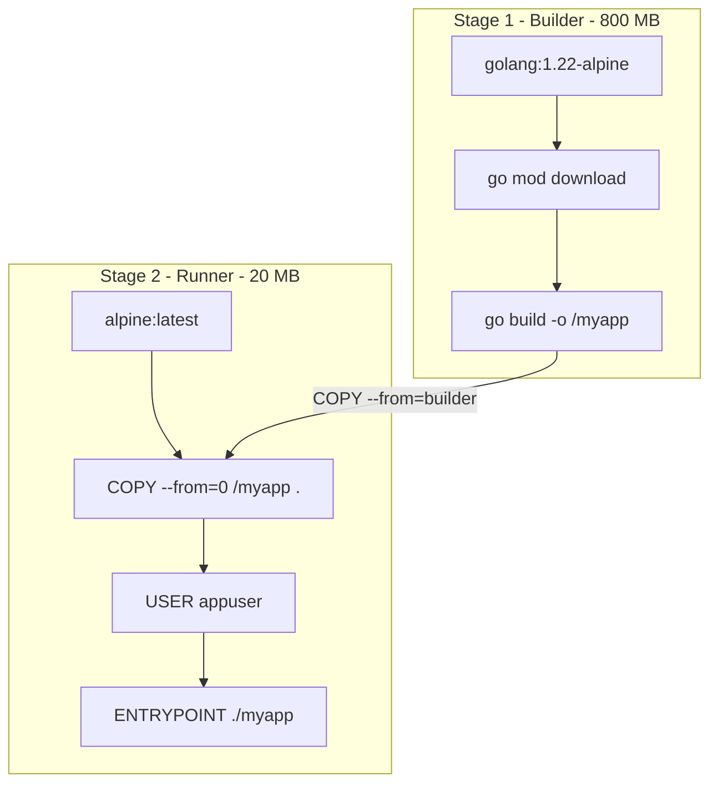

# Многоэтапная сборка (Multi-Stage Build): От гигабайтных билдеров к минимальным образам

В предыдущей статье мы исследовали кэширование слоев и тонкую настройку флагов компилятора. Однако какая бы виртуозная оптимизация ни применялась в рамках одноэтапного Dockerfile, итоговый образ неизбежно останется перегруженным. 

Если в Dockerfile используется единственная инструкция `FROM golang:1.22`, то в продакшен-образ гарантированно попадут компилятор Go, исходные файлы, тесты, ассемблер, утилиты линковки и системный пакетный менеджер. Всё это — чистый «мертвый груз» весом в сотни мегабайт. В боевой среде такой балласт замедляет выкачивание образов (Pull Time) в кластере и катастрофически расширяет поверхность для потенциальных атак.

В компилируемых языках — Си, C++, Rust и Go — **среда сборки (Build Environment)** и **среда исполнения (Runtime Environment)** кардинально различаются. Сборка требует богатого набора инструментов, но для выполнения полностью статического Go-бинарника не нужна даже операционная система — достаточно лишь ядра Linux.

---

## 1. Архитектурная концепция Multi-Stage Build

Движок Docker позволяет объявлять инструкцию `FROM` **несколько раз внутри одного Dockerfile**. Каждая последующая директива `FROM` начинает **новый этап сборки (Stage)** с абсолютно чистого листа, отсекая все слои и временные файлы предыдущих этапов.

Это фундаментальное решение породило классический паттерн:
1. **Этап сборщика (Builder Stage):** Тяжелый образ с компилятором, где скачиваются зависимости и компилируется бинарник.
2. **Этап выполнения (Runner Stage):** Минимальный чистый образ, в который копируется **только один скомпилированный бинарный файл** и необходимые статические сертификаты.



> [!info] Под капотом: Изоляция этапов сборки в BuildKit
> Когда Docker встречает несколько инструкций `FROM`, он не склеивает их в единый бутерброд слоев OverlayFS.
> 
> Сборочный движок (BuildKit) создает полностью изолированные временные контейнеры для каждого этапа. Инструкция `COPY --from=...` (например, `COPY --from=builder`) обращается к файловой системе завершенного этапа сборщика как к внешнему источнику: сборщик монтирует образ этапа `builder`, вычитывает запрошенный файл `/myapp` и сохраняет его в единственный компактный слой финального образа.
> 
> Все промежуточные слои этапа `builder` (кэш компилятора, исходники, временные файлы) отбрасываются и не попадают в реестр контейнеров.

---

## 2. Идеальный production-ready Multi-Stage Dockerfile для Go

Соберем воедино все передовые инженерные практики: именованные этапы, кэширование зависимостей, статическую сборку, работу от непривилегированного пользователя и системные сертификаты:

```dockerfile
# -------------------------------------------------------------
# ЭТАП 1: Сборка (Builder)
# Именование этапа через 'AS builder' улучшает читаемость
# -------------------------------------------------------------
FROM golang:1.22-alpine AS builder

WORKDIR /app

# Шаг 1: Кэширование зависимостей
COPY go.mod go.sum ./
RUN go mod download

# Шаг 2: Копирование исходного кода
COPY . .

# Шаг 3: Статическая компиляция под Linux x86_64
RUN CGO_ENABLED=0 GOOS=linux GOARCH=amd64 \
    go build -ldflags="-s -w -X main.buildVersion=$(cat version.txt)" \
    -trimpath -o /myapp .

# -------------------------------------------------------------
# ЭТАП 2: Эксплуатация (Runner)
# -------------------------------------------------------------
FROM alpine:latest AS runner

# Устанавливаем корневые CA-сертификаты и данные о часовых поясах (tzdata)
# Это критично для корректной работы исходящих HTTPS-запросов и time.LoadLocation
RUN apk --no-cache add ca-certificates tzdata

WORKDIR /app

# Создаем системную группу и непривилегированного пользователя
RUN addgroup -S appgroup && adduser -S appuser -G appgroup

# Копируем бинарник из этапа builder с немедленной сменой владельца (--chown)
COPY --from=builder --chown=appuser:appgroup /myapp /app/myapp

# Переключаемся на непривилегированного пользователя
USER appuser

# Запуск приложения
ENTRYPOINT ["/app/myapp"]
```

---

## 3. Выбор базового образа для Runner: scratch, distroless или alpine?

Выбор базового образа для финального этапа — это стратегический компромисс между максимальной безопасностью, минимальным размером и удобством диагностики инцидентов:

| Характеристика | `scratch` | `distroless` (Google) | `alpine` |
|---|:---:|:---:|:---:|
| **Размер образа** | 10–20 МБ (только бинарник) | ~25–30 МБ | ~30–35 МБ |
| **Командный шелл (`sh`/`bash`)** | ❌ Отсутствует | ❌ Отсутствует | ✅ Присутствует (BusyBox) |
| **CA-сертификаты (`ca-certificates`)** | ❌ Нужно копировать вручную | ✅ Включены из коробки | ✅ Доступны через `apk` |
| **Временные зоны (`tzdata`)** | ❌ Нужно копировать вручную | ✅ Включены из коробки | ✅ Доступны через `apk` |
| **Возможность `docker exec`** | ❌ Невозможна | ❌ Невозможна | ✅ Возможна |
| **Уровень защищенности от эксплойтов** | ⭐️⭐️⭐️ Максимальный | ⭐️⭐️⭐️ Максимальный | ⭐️⭐️ Высокий |

### 1. Образ `scratch` (Абсолютный вакуум)
В образе `scratch` нет вообще ничего — ни одного файла, ни оболочки shell, ни директории `/etc/passwd`.
* **Плюсы:** Минимальный физический размер. Абсолютная защита: злоумышленник физически не может запустить шелл-скрипт или скачать вредоносный бинарник.
* **Минусы:** Нельзя зайти в контейнер через `docker exec -it ... sh` для дебага. Отсутствуют CA-сертификаты (ваши исходящие HTTPS-запросы упадут с ошибкой `x509: certificate signed by unknown authority`). Отсутствуют файлы временных зон (`time.LoadLocation` вернет ошибку).
* *Решение:* Скопировать сертификаты и tzdata на этапе `builder`:
  ```dockerfile
  COPY --from=builder /etc/ssl/certs/ca-certificates.crt /etc/ssl/certs/
  ```

### 2. Образы Google `distroless` (Золотой корпоративный стандарт)
Линейка образов `gcr.io/distroless/static-debian12` специально спроектирована инженерами Google для статических приложений.
* **Плюсы:** Образ содержит корневые сертификаты, базу таймзон `/usr/share/zoneinfo`, файл `/etc/passwd` с дефолтным пользователем `nonroot` (UID 65532), но **не содержит командной оболочки shell**. Это гарантирует непробиваемость перед атаками типа Command Injection при нулевых затратах на ручную конфигурацию.
* **Минусы:** Отладка через `exec` по-прежнему невозможна (нет `sh`).

### 3. Образ `alpine` (Прагматичный выбор для разработки)
* **Плюсы:** Наличие минималистичного шелла BusyBox позволяет в критической ситуации подключиться к контейнеру командой `docker exec -it <id> sh` и запустить сетевую диагностику через `netstat` или `wget`.
* **Минусы:** Использует стандартную библиотеку языка Си **`musl libc`** вместо `glibc`.

> [!warning] Ловушка / Gotcha: Конфликт glibc и musl при использовании CGO
> Самая частая ошибка начинающих: компилировать проект в образе `golang:1.22` (основанном на Debian с `glibc`) с включенным CGO (`CGO_ENABLED=1`), а затем копировать бинарник в финальный образ `alpine` (работающий на `musl`).
> 
> При попытке запустить контейнер вы получите пугающую ошибку ядра:
> ```text
> standard init_linux.go:228: exec user process caused: no such file or directory
> ```
> Разработчик в панике проверяет: файл `/app/myapp` на месте, права `chmod +x` выданы, почему «no such file»?
> 
> Дело в том, что системный загрузчик Linux (ELF interpreter) ищет динамический компоновщик `glibc` по пути `/lib64/ld-linux-x86-64.so.2`. В Alpine его нет — там живет `/lib/ld-musl-x86_64.so.1`. Ядро Linux сообщает об отсутствии именно файла динамического линкера!
> 
> **Правило:** Либо всегда отключайте CGO (`CGO_ENABLED=0`), либо собирайте код в том же дистрибутиве, где будете запускать (например, `FROM golang:1.22-alpine AS builder`).

---

## `COPY --chown`: Изящное владение файлами

В классическом одноэтапном подходе файлы, скопированные в образ, автоматически принадлежат пользователю `root`. Чтобы перевести их на `appuser`, разработчики выполняли:
```dockerfile
COPY /myapp /app/myapp
RUN chown -R appuser:appgroup /app
```

Вспомним механизм Copy-on-Write (CoW) из лекции [[1. Контейнеризация. Основы]]: команда `RUN chown` не модифицирует файл на месте, а **копирует его целиком в новый слой OverlayFS**, фактически удваивая вес бинарника в итоговом образе!

Флаг `--chown` в директиве `COPY`:
```dockerfile
COPY --from=builder --chown=appuser:appgroup /myapp /app/myapp
```
назначает корректного владельца непосредственно в момент записи файла в слой контейнера, не создавая лишних мегабайт в снимках файловой системы.

---

## 5. Расширенный паттерн: Инъекция отладочных инструментов (Delve)

Что делать, если в тестовом окружении или на staging-стенде требуется подключиться к живому Go-процессу интерактивным отладчиком **Delve (`dlv`)** или снять профили через pprof, но тащить тяжелые отладочные пакеты в продакшен строго запрещено?

Многоэтапная сборка позволяет формировать альтернативные сборочные цели (**Build Targets**):

```dockerfile
# Базовый образ выполнения
FROM alpine:latest AS runner
WORKDIR /app
COPY --from=builder --chown=appuser:appgroup /myapp /app/myapp
USER appuser
ENTRYPOINT ["/app/myapp"]

# Альтернативная отладочная цель
FROM runner AS debug
USER root
# Устанавливаем отладчик Delve и сетевые утилиты
RUN go install github.com/go-delve/delve/cmd/dlv@latest && \
    apk --no-cache add curl bind-tools
USER appuser
ENTRYPOINT ["/go/bin/dlv", "--listen=:40000", "--headless=true", "--api-version=2", "exec", "/app/myapp"]
```

В файле `docker-compose.yaml` для локальной разработки достаточно указать директиву `target: debug`, в то время как боевой CI/CD соберет легковесный `target: runner`.

> [!tip] Собеседование: Инспекция продакшен-контейнера distroless без шелла
> **Вопрос:** Ваш Go-сервис развернут в production в минимальном контейнере `distroless`. Процесс завис в deadlock'е или течет память. Командного шелла (`sh`) в контейнере нет, команда `docker exec` бессильна. Как провести диагностику инцидента?
> 
> **Ответ:** 
> 1. **Встроенный пакет `net/http/pprof`:** Высококлассные Go-сервисы всегда открывают внутренний административный порт (на localhost или отдельной подсети), где активен сервер `net/http/pprof`. Достаточно пробросить порт наружу и выполнить `curl http://localhost:6060/debug/pprof/goroutine?debug=2` для получения полного дампа всех стеков горутин.
> 2. **Механизм `kubectl debug` (Ephemeral Containers):** Начиная с Kubernetes 1.18+, администратор может на лету добавить в работающий Pod временный отладочный контейнер с полным набором утилит (Alpine/Ubuntu), подключив его к общим пространствам имен **Process (PID)** и **Network (NET)** зависшего пода.
> 3. **Трассировка через eBPF с хостовой ноды:** С помощью утилит `bpftrace` или BCC на физическом сервере можно отслеживать системные вызовы процесса, сетевые пакеты и латентность функций Go без модификации и перезапуска контейнера.

---

## Итог

1. **Multi-Stage Build** кардинально разделяет среду компиляции и среду исполнения, уменьшая размер продакшен-образов Go с сотен мегабайт до компактных 15–25 МБ.
2. **Выбор Runner:** `distroless` — эталон безопасности для боевого продакшена; `alpine` — удобный компромисс для сервисов, требующих оперативной ручной диагностики; `scratch` — предельный минимализм, требующий ручной подкладки сертификатов.
3. **`COPY --chown`:** Исключает раздувание слоев OverlayFS за счет атомарного назначения прав при копировании артефактов.
4. **Совместимость libc:** При сборке с CGO среда компилятора (`glibc` vs `musl`) обязана строго совпадать со средой выполнения во избежание сбоев динамического компоновщика.

Контейнер упакован, оптимизирован и надежно изолирован. Однако современные распределенные системы состоят из десятков взаимодействующих контейнеров, которым требуется защищенная и быстрая сетевая связность. В следующей лекции мы погрузимся в сетевую подсистему Docker: [[4. Docker networking]].