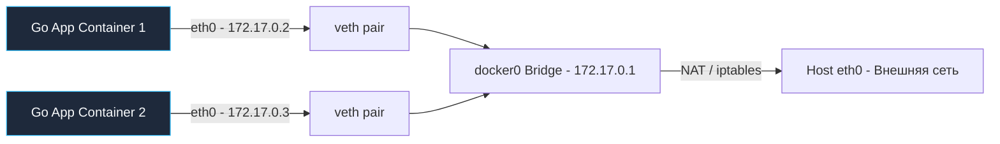

# Сетевая подсистема Docker: От виртуальных мостов и iptables до ловушки ndots в Go

Контейнеры изолируют сетевые процессы с помощью пространств имен **Network Namespaces** (как мы выяснили в лекции [[6. Networking в Linux]]). Однако изолированный бэкенд не может функционировать автономно: реальному Go-сервису требуется принимать входящие HTTP/gRPC-запросы клиентов, совершать вызовы к пулу PostgreSQL, сохранять кэш в Redis и обмениваться сообщениями с соседними микросервисами.

Сетевая подсистема Docker (**Docker Networking**) — это программная виртуальная фабрика коммутации, которая связывает изолированные сетевые пространства имен (netns) между собой, маршрутизирует трафик через ядро хоста и выводит пакеты в открытый интернет.

---

## 1. Сеть по умолчанию (Default Bridge) и виртуальный мост docker0

При установке Docker автоматически создает на хосте программный виртуальный сетевой коммутатор (мост второго уровня L2) — интерфейс **`docker0`** (обычно с подсетью `172.17.0.0/16` и IP-адресом `172.17.0.1`).

Если запустить контейнер командой `docker run` без явного указания сети, он автоматически подключается к этому дефолтному мосту:

1. **Создание виртуального кабеля (veth pair):** Демон Docker создает пару связанных виртуальных сетевых интерфейсов — программный аналог двустороннего патч-корда.
2. **Подключение к мосту:** Один конец пары (например, `veth1234`) подключается к мосту `docker0` на хосте.
3. **Изоляция в netns:** Второй конец переносится внутрь сетевого пространства контейнера и переименовывается в стандартный **`eth0`**.
4. **Конфигурация IP и маршрутизации:** Контейнеру выделяется приватный IP-адрес (например, `172.17.0.2`), а шлюзом по умолчанию (**default gateway**) назначается IP моста `docker0` (`172.17.0.1`).



> [!warning] Ловушка / Gotcha: Отсутствие DNS в дефолтной сети bridge
> В дефолтной сети `bridge` **категорически отсутствует автоматический DNS-резолвинг по именам контейнеров!**
> 
> Если ваш Go-контейнер попытается подключиться к базе данных по хосту `postgres:5432`, системный вызов `net.Dial` немедленно завершится ошибкой: внутри контейнера нет DNS-сервера, а файл `/etc/hosts` ничего не знает об имени `postgres`.
> 
> Пытаться хардкодить IP-адреса (например, `172.17.0.3`) — фатальная ошибка: при первом же перезапуске контейнера демон Docker перевыделит IP-адрес случайным образом. **Никогда не используйте default bridge в реальных микросервисах!**

---

## 2. Пользовательские сети (Custom Bridge) и встроенный DNS

Чтобы контейнеры могли безопасно и прозрачно находить друг друга по доменным именам (Service Discovery), Docker требует создания **пользовательских сетей (Custom Bridge Networks)**:

```bash
docker network create my-app-network
```

При запуске сервисов с флагом `--network my-app-network` вступает в действие встроенный механизм обнаружения сервисов Docker:
* Docker поднимает для этой сети **изолированный DNS-сервер** на локальном адресе **`127.0.0.11`**.
* Теперь любой Go-сервис может безопасно обращаться к зависимостям по именам сервисов: `http://redis:6379` или `postgres:5432`.

> [!info] Под капотом: Перехват резолвинга через 127.0.0.11
> При старте контейнера в custom bridge файл `/etc/resolv.conf` автоматически заполняется строкой:
> ```text
> nameserver 127.0.0.11
> options ndots:0
> ```
> Когда рантайм Go обращается к DNS, системный вызов `getaddrinfo` (или чистый UDP-запрос встроенного резолвера Go) отправляет датаграмму на локальный адрес сокета ядра `127.0.0.11`.
> 
> Внутренний DNS-прокси демона Docker мгновенно сопоставляет имя с таблицей запущенных контейнеров сети и возвращает текущий IP-адрес. Это работает на порядки быстрее и безопаснее, чем запросы к внешним корпоративным серверам имен.

---

## 3. Проброс портов (Port Mapping) и цепочки iptables

Каким образом внешний клиент из публичного интернета может достучаться до Go-сервиса, если тот заперт в изолированной приватной подсети `172.17.0.0/16`?

Эту задачу решает подсистема ядра Linux **Netfilter** и таблицы **`iptables`**.

Когда вы запускаете контейнер с флагом публикации порта `-p 8080:80`, демон Docker создает правило **DNAT (Destination NAT)** в цепочке `PREROUTING` таблицы `nat`:

1. Входящий TCP-пакет от клиента приходит на порт 8080 физического интерфейса хоста (`eth0`).
2. Модуль ядра `iptables` перехватывает пакет и перезаписывает его Destination IP: адрес назначения хоста подменяется на внутренний IP контейнера (`172.17.0.2:80`).
3. Ядро маршрутизирует модифицированный пакет через коммутатор `docker0` прямо в `netns` контейнера.
4. Исходящий ответ от Go-сервиса на обратном пути проходит через правило **SNAT (Source NAT / Masquerade)**: ядро подменяет исходный адрес `172.17.0.2` на публичный IP хоста, создавая для внешнего клиента полную иллюзию прямого диалога с хост-машиной.

> [!tip] Собеседование: Накладные расходы Port Mapping и nf_conntrack
> **Вопрос:** Почему проброс портов через `-p` создает дополнительную латентность и может привести к деградации при экстремальных нагрузках?
> 
> **Ответ:** 
> Для выполнения трансляции сетевых адресов (DNAT/SNAT) ядро Linux обязано поддерживать таблицу состояний соединений — **`conntrack` (Connection Tracking)** в модуле `nf_conntrack`.
> 
> 1. Каждый входящий пакет требует поиска в хэш-таблице `conntrack` под системными спинлоками ядра.
> 2. Ядро перезаписывает заголовки IP- и TCP-пакетов и заново пересчитывает их контрольные суммы (checksum).
> 3. При сотнях тысяч одновременных подключений таблица `conntrack` может переполниться (ошибка `nf_conntrack: table full, dropping packet`), что приводит к массовой потере пакетов и обрывам связей.
> 
> Для ультра-высоконагруженных сетевых сервисов (шлюзы ingress, прокси Envoy/Nginx) часто выбирают режим сети **`host`**.

---

## 4. Сеть Host: Обход изоляции

При указании флага `--network host` демон Docker **не создает отдельный Network Namespace**. Go-процесс запускается непосредственно в сетевом пространстве хостовой операционной системы.

* **Плюсы:** Полный отказ от виртуальных мостов, veth-интерфейсов и правил iptables NAT. Нулевые накладные расходы — пакеты с сетевой карты хоста попадают прямо в сетевой сокет Go-приложения без единой микросекунды задержки.
* **Минусы:** Абсолютная потеря сетевой изоляции. Если Go-сервис забиндит порт 8080, никакой другой процесс на хосте не сможет его использовать. Запустить два одинаковых контейнера на одном сервере невозможно без переопределения конфигурации портов.

В промышленной эксплуатации сеть `host` используется для инфраструктурных агентов мониторинга (Prometheus Node Exporter, DaemonSets сбора логов), а также для сверхнагруженных сетевых прокси.

---

## 5. Специфика резолвинга в Go и коварная ловушка ndots:5

Пожалуй, самая распространенная сетевая аномалия при переносе Go-микросервисов в контейнеры Docker и кластеры Kubernetes связана с параметром **`ndots`** и особенностями встроенного резолвера Go.

В контейнерных окружениях (особенно в Kubernetes) файл `/etc/resolv.conf` конфигурируется с параметром:
```text
options ndots:5
search default.svc.cluster.local svc.cluster.local cluster.local
```

Директива `options ndots:5` инструктирует резолвер: **если в запрошенном доменном имени содержится меньше 5 точек, имя считается неполным (не FQDN)**. Резолвер обязан сначала попытаться найти имя, последовательно подставляя все домены поиска из списка `search`, и только если все попытки вернут отрицательный результат (`NXDOMAIN`), отправить запрос на поиск имени как абсолютного.

### В чем опасность для чистого Go?
Если в проекте скомпилирован полностью статический бинарник (`CGO_ENABLED=0`), рантайм Go использует собственный встроенный Pure Go DNS-клиент. 

Когда ваш код обращается к базе данных по короткому имени `db` (в имени 0 точек):
1. Go отправляет UDP-запрос: `db.default.svc.cluster.local` -> Ждет ответа.
2. Если не нашел: `db.svc.cluster.local` -> Ждет ответа.
3. Затем: `db.cluster.local` -> Ждет ответа.
4. И только в самом конце: прямой запрос `db`!

Каждый такой холостой круг генерирует 3–5 последовательных сетевых запросов к DNS-серверу (CoreDNS), создавая колоссальный всплеск задержек (**в сотни миллисекунд**) при установке соединений и перегружая инфраструктуру DNS-запросами.

> [!warning] Ловушка / Gotcha: Способы устранения задержек ndots в Go
> 1. **Абсолютные FQDN с точкой на конце:** Всегда завершайте внешние или абсолютные имена сервисов замыкающей точкой: `postgres.internal.` или `api.example.com.`. Точка на конце сигнализирует резолверу: «Это абсолютное имя, не нужно подставлять домены поиска!».
> 2. **Явные полные имена внутри кластера:** Вместо `db` прописывайте полное имя `db.default.svc.cluster.local`.
> 3. **Переключение на системный libc-резолвер:** Сборка с `CGO_ENABLED=1` переключает резолвинг на системную функцию `getaddrinfo` библиотеки `glibc`, которая способна параллелить запросы A и AAAA и эффективнее кэшировать ответы, однако это закрывает возможность сборки в чистом `scratch`.

---

## 6. Сеть None: Абсолютная изоляция

При флаге `--network none` контейнер получает персональный сетевой неймспейс, в котором активен **исключительно loopback-интерфейс `lo` (`127.0.0.1`)**. Внешние интерфейсы не создаются вовсе.

Этот режим незаменим для:
* Изолированных криптографических вычислений и генерации закрытых ключей.
* Обработки конфиденциальных данных (batch processing), где законодательно или архитектурно требуется гарантировать невозможность утечки в сеть.
* Сервисов, общающихся с внешними процессами исключительно через локальные разделяемые тома и UNIX Domain Sockets.

---

## Итог

1. **Default Bridge опасен:** В нем отсутствует автоматический DNS-сервер; для надежного Service Discovery всегда создавайте **Custom Bridge** сети.
2. **Port Mapping через iptables:** Проброс портов `-p` работает через механизм DNAT и модуль ядра `conntrack`, что добавляет накладные расходы на отслеживание соединений.
3. **Сеть Host для экстремального I/O:** Устраняет оверхед трансляции адресов ценой полной потери сетевой изоляции.
4. **Коварство ndots:5:** Статический DNS-резолвер Go при коротких именах может генерировать цепочки холостых запросов; защищайтесь использованием FQDN и замыкающих точек.
5. **Сеть None:** Гарантирует абсолютную сетевую изоляцию процессов для критических задач.

Сетевое взаимодействие налажено. Однако контейнеры эфемерны: при падении или перезапуске все изменения в слое контейнера бесследно стираются. В следующей лекции мы детально изучим надежное сохранение данных и высокопроизводительный дисковый ввод-вывод: [[5. Volumes и хранение данных]].