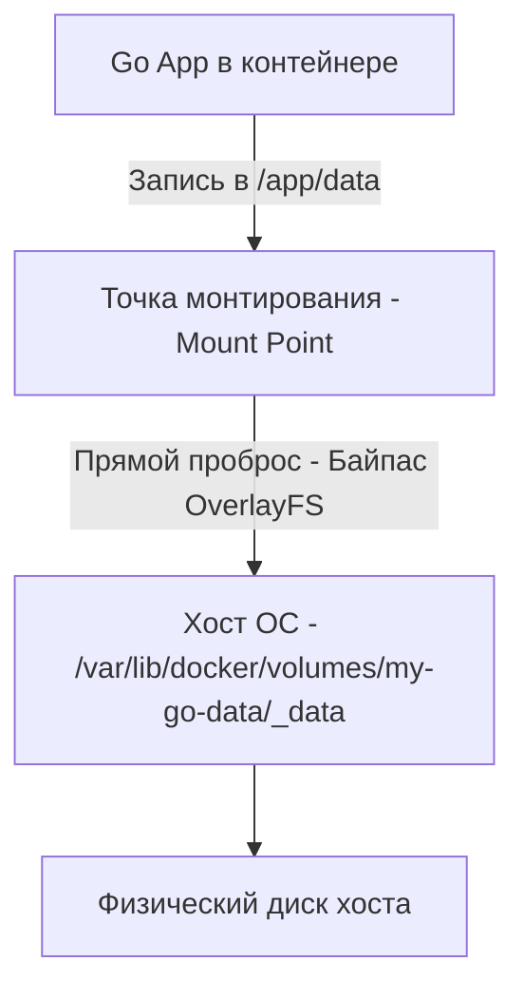

# Volumes и хранение данных в Docker: От деградации OverlayFS к нативному I/O и SQLite

Фундаментальный постулат контейнерной парадигмы гласит: **Контейнеры строго эфемерны (ephemeral)**. Они создаются за доли секунды, масштабируются горизонтально, уничтожаются планировщиком и пересоздаются при каждом деплое новой версии сервиса (Rolling Update).

Если ваше Go-приложение сохраняет состояние (записывает загруженные пользователем аватарки, ведет локальную встраиваемую базу данных или сбрасывает файлы отчетов) непосредственно во внутреннюю файловую систему контейнера, эти данные будут **безвозвратно уничтожены** в момент перезапуска процесса.

Для долговременного сохранения состояния (**Stateful Data**) и достижения нативной скорости дискового ввода-вывода Docker предоставляет специализированные механизмы монтирования хранилищ. Выбор конкретного механизма напрямую определяет не только сохранность ваших данных при сбоях, но и показатели дисковой латентности (IOPS и Write Latency).

---

## 1. Проблема Writable Layer в OverlayFS: Почему контейнеры «тормозят» при записи

Как мы детально разбирали в статье [[1. Контейнеризация. Основы]], файловая система контейнера представляет собой многослойный пирог **OverlayFS**. Все базовые слои образа неизменяемы (Read-Only), а поверх них монтируется единственный тонкий рабочий слой контейнера — **Upper Layer (Writable Layer)**, доступный для записи.

Когда в Go-коде выполняется операция создания или изменения файла, например:
```go
f, err := os.Create("app.log")
```
под капотом файловой системы ядра Linux разворачивается многоступенчатый сценарий:
1. Ядро сканирует стопку слоев сверху вниз, проверяя наличие файла `app.log`.
2. Если файл отсутствует, он создается с нуля в рабочем слое Upper Layer.
3. Если же файл уже присутствовал в одном из слоев образа (например, конфиг по умолчанию) и приложение пытается выполнить дозапись, активируется механизм **Copy-on-Write (CoW)**: ядро Linux полностью копирует весь файл из неизменяемого нижнего слоя в верхний рабочий слой, и только затем применяет модификацию.

> [!warning] Ловушка / Gotcha: Деградация IOPS и фрагментация диска на OverlayFS
> Механизм Copy-on-Write в OverlayFS создает колоссальные накладные расходы на дисковый ввод-вывод.
> 
> Если ваше Go-приложение интенсивно пишет в файл (например, выполняет аппенд сотен тысяч строк логов, ведет встроенную БД SQLite или обрабатывает временные файлы загрузок), каждый вызов `write()` инициирует сложную цепочку обновления метаданных и фрагментирует запись на хостовом диске.
> 
> Скорость дисковых операций в Writable Layer контейнера может **падать в 3–5 раз** по сравнению с прямой записью на диск хоста! 
> 
> **Золотое правило:** Никогда не храните базы данных, очереди сообщений или интенсивные логи в слое контейнера. Любой реальный I/O обязан выноситься в специально смонтированные тома.

---

## 2. Архитектура хранилищ Docker: Volumes, Bind Mounts и tmpfs

Чтобы обеспечить персистентность данных и нативную скорость дисковой подсистемы, Docker позволяет пробросить хранилище хоста напрямую в пространство имен контейнера (**Mount Namespace**), полностью обходя накладные расходы OverlayFS:



### 1. Именованные тома (Docker Volumes)
**Volume** — это официально рекомендуемый и полностью управляемый Docker механизм персистентного хранения.

При создании тома:
```bash
docker volume create my-go-data
docker run -d -v my-go-data:/app/data my-go-image
```
Docker выделяет на хосте выделенный каталог (по умолчанию `/var/lib/docker/volumes/<volume_name>/_data`) и монтирует его непосредственно в контейнер.

> [!info] Под капотом: Нативная скорость через bind mount
> Когда Docker монтирует Volume, ядро Linux создает прямую системную привязку (**bind mount**) между каталогом хоста и целевой точкой в Mount Namespace контейнера.
> 
> Все операции записи из Go минуют логику Copy-on-Write и драйвер OverlayFS, направляясь напрямую в хостовую файловую систему (ext4 или XFS). Это обеспечивает **нативную аппаратную скорость дискового I/O**, идентичную работе обычного системного процесса на хосте.
> 
> В оркестраторах (Kubernetes) концептуальным аналогом томов являются абстракции **PersistentVolume (PV)** и **PersistentVolumeClaim (PVC)**.

### 2. Прямое монтирование каталогов (Bind Mounts)
**Bind Mount** позволяет примонтировать абсолютно любой существующий файл или директорию с хоста в произвольную точку файловой системы контейнера:

```bash
docker run -d -v /home/user/myapp/config.yaml:/app/config.yaml my-go-image
```

* **Преимущества:** Незаменимый инструмент для локальной разработки. Вы можете пробросить папку с исходным Go-кодом внутрь сборочного контейнера и использовать утилиты горячей перезагрузки (такие как `air`), чтобы код автоматически перекомпилировался при сохранении файла в IDE без пересборки Docker-образа.
* **Недостатки:** Жесткая привязка к конкретной структуре директорий хостовой машины. Если на продакшен-сервере путь `/home/user/myapp/config.yaml` отсутствует, контейнер аварийно завершится при старте. В production-средах использование Bind Mounts считается антипаттерном.

### 3. Хранение в оперативной памяти (tmpfs Mounts)
Файловая система **tmpfs** монтирует изолированный виртуальный каталог непосредственно в оперативную память (RAM) хоста, минуя постоянные накопители (SSD/NVMe):

```bash
docker run -d --tmpfs /app/cache:rw,size=100m my-go-image
```

* **Сферы применения:**
  1. Сверхбыстрый временный кэш, для которого задержка записи в RAM на порядки ниже любых NVMe-дисков.
  2. Хранение чувствительных данных (секретные криптографические ключи, токены сессий, временные расшифрованные сертификаты), которые категорически запрещено сбрасывать на физический диск.
* **Подводный камень:** Размер `tmpfs` жестко квотируется (в примере: 100 МБ). При переполнении памяти системный вызов записи в Go немедленно вернет ошибку ядра **`ENOSPC` (No space left on device)**.

---

## 3. Специфика Go: Встраиваемые базы данных (SQLite) и файловые блокировки flock

В экосистеме Go огромной популярностью пользуются встраиваемые бессерверные базы данных (**Embedded Databases**): SQLite (как в CGO-версии, так и в современных чистых Go-портах вроде `modernc.org/sqlite`), BadgerDB и BoltDB. Они не требуют развертывания отдельного сервера баз данных и хранят все структуры прямо в единственном файле.

Однако при их запуске внутри контейнеров инженеры регулярно сталкиваются с фатальными ошибками: `database is locked`, паникой повреждения страниц или сбоем ядра `SIGBUS: bus error`.

> [!warning] Ловушка / Gotcha: Логика flock() поверх OverlayFS и NFS
> SQLite для обеспечения транзакционной целостности (ACID) использует системный вызов ядра **`flock()`** (или `fcntl` file locking), блокирующий байтовые диапазоны файла БД при операциях записи.
> 
> 1. **Крах на OverlayFS:** Если файл SQLite лежит в Writable Layer контейнера (без смонтированного Volume), драйвер OverlayFS из-за своей слоистой природы не гарантирует корректную семантику POSIX-блокировок. При одновременной записи из нескольких горутин файл базы данных гарантированно разрушается (**Data Corruption**).
> 2. **Крах на сетевых хранилищах (NFS/AWS EFS):** Если вы смонтируете Volume через сетевую распределенную файловую систему, сетевой протокол не сможет синхронизировать быстрые блокировки `flock()` между разными хостами. Вы получите регулярные таймауты `database is locked`.
> 
> **Решение:** Встраиваемые базы данных SQLite обязаны работать **исключительно на локальных Docker Volumes (блочных устройствах хоста)**. В Kubernetes том для SQLite обязан монтироваться в монопольном режиме **ReadWriteOnce (RWO)**, гарантируя, что только одна реплика пода имеет доступ к файлу.

---

## 4. Проблема прав доступа: Маппинг UID/GID и ошибка Permission Denied

Пожалуй, самая частая и раздражающая ошибка при подключении томов в production — внезапный отказ в доступе: `open /app/data/app.db: permission denied`.

### В чем природа конфликта прав?
1. Когда Docker впервые создает Volume на хосте (`/var/lib/docker/volumes/.../_data`), владельцем каталога на уровне операционной системы хоста становится пользователь **`root:root` (UID 0, GID 0)**.
2. В то же время наш Go-контейнер собран по стандартам безопасности и работает от непривилегированного пользователя `appuser` (например, с UID 10001), как мы настраивали в лекции [[2. Dockerfile best practices]].
3. При попытке Go-процесса создать файл в точке монтирования `/app/data` ядро Linux сверяет права: процесс с EUID 10001 пытается писать в каталог владельца UID 0 с правами `drwxr-xr-x`. Ядро мгновенно блокирует операцию с ошибкой `EACCES` (Permission Denied).

Аналогично при использовании Bind Mount (`-v /host/dir:/app/dir`): если файлы на хосте принадлежат локальному пользователю разработчика с UID 1000, а процесс внутри контейнера работает под UID 2000, Go-сервис даже не сможет прочитать собственный конфигурационный файл.

> [!tip] Собеседование: Способы разрешения конфликтов UID/GID при работе с томами
> **Вопрос:** Как организовать работу непривилегированного Go-приложения в контейнере с внешними томами (Docker Volumes / Bind Mounts) без ошибок прав доступа?
> 
> **Ответ:** В современной инфраструктуре применяется несколько проверенных паттернов:
> 1. **Стандартизация фиксированного UID:** В Dockerfile создаем пользователя с конкретным UID (например, `adduser -u 10001 appuser`), а системным администраторам гарантируем, что целевая директория Volume на хосте/в K8s принадлежит этому же UID. В Kubernetes это настраивается декларативно в манифесте пода через `securityContext.fsGroup: 10001`.
> 2. **Паттерн Root Entrypoint + gosu/su-exec:** Контейнер стартует от пользователя `root`. Легковесный стартовый скрипт (`entrypoint.sh`) перед запуском приложения проверяет права на точку монтирования, при необходимости выполняет быстрый `chown -R appuser:appgroup /app/data`, после чего вызывает утилиту **`gosu`** или `su-exec`. Утилита сбрасывает привилегии до `appuser` и через системный вызов `exec` запускает скомпилированный Go-бинарник. (Именно так устроены официальные production-образы PostgreSQL и Redis).
> 3. **Активация User Namespaces (`userns-remap`):** Настройка демона Docker, при которой пользователь `root` внутри контейнера автоматически транслируется ядром в непривилегированного пользователя на хосте, устраняя конфликты владельцев.

---

## Итог

1. **Writable Layer (OverlayFS) — зона риска:** Он предназначен только для эфемерных временных файлов; операции записи туда деградируют по скорости из-за оверхеда Copy-on-Write.
2. **Docker Volumes:** Основной и рекомендуемый способ хранения данных; обеспечивает прямое обращение к блочным устройствам хоста с нативной скоростью файловой системы.
3. **Bind Mounts:** Идеальны для быстрой локальной разработки и горячей перезагрузки (`air`), но опасны в production из-за привязки к путям файловой системы хоста.
4. **tmpfs Mounts:** Гарантируют молниеносный кэш и абсолютную безопасность конфиденциальных данных за счет хранения исключительно в оперативной памяти.
5. **Тонкости SQLite и flock():** Встраиваемые базы данных требуют монопольного доступа к локальным томам с честной поддержкой POSIX-блокировок.
6. **Синхронизация UID/GID:** Требует обязательной координации между непривилегированным пользователем контейнера и правами на смонтированные каталоги.

Мы научились собирать, связывать по сети и обеспечивать надежное хранение данных наших Go-контейнеров. Однако открытым остается ключевой вопрос: как защитить контейнеризированную среду от взлома и изощренных атак на ядро? В следующей статье мы разберем боевую безопасность контейнеров: [[6. Безопасность контейнеров]].