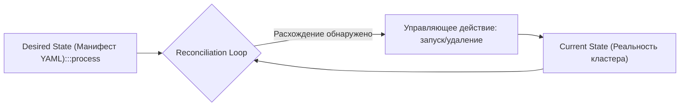
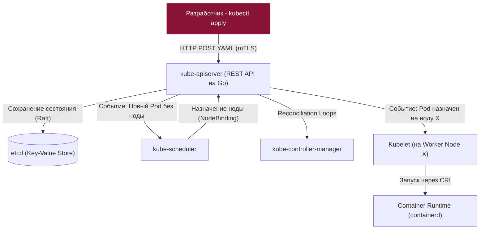
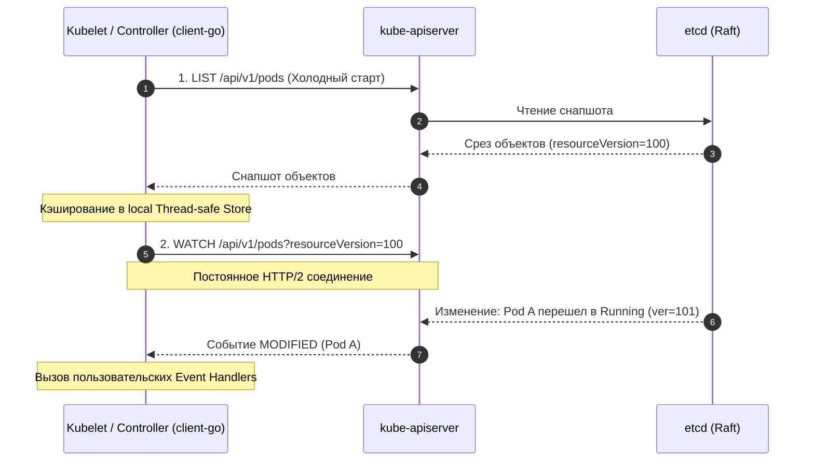

# Архитектура Kubernetes: От циклов согласования etcd до механики List-Watch в Go

Когда распределенная система вырастает из масштабов одиночных серверов с Docker Compose до сотен узлов и тысяч микросервисов, перед инженерами встают вызовы совершенно иного порядка:
* Что делать, если физический сервер внезапно сгорает в дата-центре?
* Как обновить 100 запущенных реплик Go-приложения с нулевым временем простоя (**Zero-Downtime Rolling Update**)?
* Как автоматически балансировать входящий трафик и динамически масштабировать сервисы при утреннем пике нагрузки?

Ответом облачной индустрии стал **Kubernetes (K8s)** — де-факто промышленный стандарт оркестрации контейнеризированных приложений.

Для многих разработчиков Kubernetes выглядит непостижимым «черным ящиком», пугающим сотнями строк конфигурационных YAML-файлов. Однако Kubernetes целиком написан на языке **Go**. Вся его внутренняя архитектура является образцовым воплощением классической философии Go: конкурентность, декларативность, реактивная обработка событий и общение компонентов через очереди вместо блокировок. Глубокое понимание устройства Control Plane и Worker-нод — обязательный рубеж для перехода на уровень Senior и Staff/Lead инженера.

---

## 1. Философия Kubernetes: Декларативное состояние и циклы согласования

Ключевой сдвиг ментальной парадигмы при переходе к K8s — отказ от императивного управления в пользу **декларативного подхода (Declarative State)**.

В традиционных скриптах развертывания (Bash, Ansible) мы отдаем императивные команды: *«Скачай образ, останови старый процесс, запусти новый на порту 8080»*. Если на промежуточном шаге моргнет сеть, скрипт упадет в непредсказуемом состоянии.

В Kubernetes вы не приказываете кластеру, *что именно делать*. Вы декларируете, **каким должен быть желаемый финальный результат (Desired State)**:
> *«В кластере должно работать ровно 3 живые реплики микросервиса `auth-service` с лимитом памяти 512 МБ»*.

Оркестратор непрерывно сравнивает реальное текущее состояние системы (**Current State**) с желаемым (**Desired State**). Если нода сгорает и одна реплика погибает, K8s фиксирует расхождение (Current: 2, Desired: 3) и самостоятельно планирует запуск недостающего контейнера на другом физическом сервере.

Этот непрерывный процесс называется **циклом согласования (Reconciliation Loop)**:

---

## 2. Control Plane: Мозг и командный пункт кластера

Слой управления (**Control Plane**, исторически называемый Master) отвечает за принятие глобальных решений в кластере: планирование подов, реакцию на сбои и хранение конфигураций. В продакшене все компоненты Control Plane резервируются на 3 или 5 независимых серверах.

### 1. `kube-apiserver` (Единая точка входа)
Центральный нервный узел всей системы. Это высокопроизводительный HTTP/REST сервер на Go. 
* Единственный компонент кластера, который имеет право напрямую читать и писать в базу данных `etcd`.
* Все остальные участники (включая утилиту `kubectl`, планировщик, контроллеры и агенты на нодах) взаимодействуют строго с API Server по защищенному протоколу HTTPS с двусторонней аутентификацией (mTLS).
* Выполняет валидацию манифестов (Schema Validation), аутентификацию (JWT, токены, сертификаты), авторизацию (RBAC) и запуск мутирующих и валидирующих хуков (**Admission Webhooks**).

### 2. `etcd` (Память кластера)
Высоконадежное распределенное key-value хранилище, написанное на Go. Оно реализует строгий алгоритм консенсуса **Raft**, обеспечивающий устойчивость к разделению сети (Network Partitions). В `etcd` хранится абсолютно всё состояние кластера: описания подов, сервисов, секреты, роли доступа и текущие сетевые эндпоинты.

> [!info] Под капотом: Дисковый I/O и библиотека Bbolt в etcd
> Под капотом `etcd` использует библиотеку **Bbolt** (форк классической BoltDB, написанной на чистом Go). 
> 
> Bbolt хранит данные в файле на диске в виде B+ дерева с отображением в память через `mmap`. 
> 
> Каждая транзакция записи в `etcd` требует обязательного синхронного вызова системного вызова **`fsync()`**, гарантирующего физический сброс страниц кэша ядра на накопитель. 
> 
> Если ноды Control Plane запущены на медленных дисках (HDD или перегруженных облачных сетевых томах с лимитом IOPS), вызовы `fsync()` начинают зависать на десятки миллисекунд. Это приводит к разрыву Raft-сердечных сокращений (Heartbeats), потере лидерства в `etcd`, зависанию `kube-apiserver` и общему коллапсу управления кластером. Для `etcd` требуются **локальные выделенные NVMe SSD**.

### 3. `kube-scheduler` (Планировщик)
Интеллектуальный диспетчер, написанный на Go. Он непрерывно мониторит API Server в поисках вновь созданных Подов, у которых поле `nodeName` пустое (статус `Pending`).
Планировщик анализирует ресурсы:
1. **Фильтрация (Predicates):** Отсекает ноды, на которых недостаточно свободной памяти или CPU (`requests`), либо нарушены правила `nodeSelector`, `taints/tolerations` и ограничения affinity/anti-affinity.
2. **Скоринг (Priorities):** Ранжирует подходящие ноды по специальной оценочной шкале (например, равномерность распределения реплик одного сервиса по разным стойкам и зонам доступности).
3. **Биндинг (Binding):** Планировщик *не запускает* контейнер сам! Он лишь отправляет в API Server команду связать Под с выбранной нодой.

### 4. `kube-controller-manager` (Менеджер контроллеров)
Монолитный Go-бинарник, объединяющий десятки параллельных циклов согласования (Reconciliation Loops):
* **Deployment Controller:** Следит за обновлениями образов и организует стратегии выкатки (Rolling Updates).
* **ReplicaSet Controller:** Следит за тем, чтобы количество живых реплик пода строго соответствовало спецификации `replicas`.
* **Node Controller:** Реагирует на потерю связи с серверами: если нода не отвечает более 5 минут, инициирует аварийное выселение (Eviction) всех запущенных на ней подов.

---

## 3. Worker Nodes: Мускулы кластера

Воркер-ноды — это физические серверы или виртуальные машины, на которых непосредственно исполняется полезная нагрузка — ваши Go-микросервисы.

### 1. `kubelet` (Хостовый агент)
Главный агент Kubernetes на каждом сервере, написанный на Go. Kubelet отвечает за реальную жизнь подов на конкретной ноде:
* Отслеживает в API Server поды, назначенные на его ноду.
* Общается со средой исполнения контейнеров через интерфейс **CRI (Container Runtime Interface)** по протоколу gRPC.
* Монтирует тома и пробрасывает секреты из `ConfigMap` и `Secret`.
* Регулярно запускает проверки жизнеспособности подов (**Liveness, Readiness и Startup Probes**), перезапуская зависшие контейнеры.

### 2. `kube-proxy` (Сетевой диспетчер)
Сетевой компонент, обеспечивающий абстракцию **Kubernetes Service**. Он отвечает за то, чтобы запросы на стабильный виртуальный IP-адрес сервиса (ClusterIP) равномерно балансировались между эфемерными IP-адресами реальных подов.

> [!warning] Ловушка / Gotcha: Производительность iptables против IPVS в kube-proxy
> `kube-proxy` умеет работать в двух режимах трансляции трафика:
> 
> 1. **Режим `iptables` (по умолчанию):** Для каждого эндпоинта каждого сервиса `kube-proxy` добавляет правила в таблицы `iptables` ядра Linux. Однако ядро проверяет правила iptables **последовательно (линейный поиск с алгоритмической сложностью $O(N)$)**. В кластере с 5 000 сервисов и 20 000 подов таблица iptables разрастается до сотен тысяч строк. Каждый сетевой пакет тратит миллисекунды только на последовательный перебор цепочек ядра!
> 2. **Режим `IPVS` (IP Virtual Server):** Механизм балансировки L4, встроенный непосредственно в ядро Linux. IPVS организует виртуальные сервисы на базе эффективных хэш-таблиц ядра (**алгоритмическая сложность $O(1)$**). 
> 
> **Рекомендация для Senior-инженера:** В любых нагруженных кластерах переключайте `kube-proxy` в режим `mode: ipvs` (или используйте современные eBPF-решения вроде Cilium), обеспечивая предсказуемую субмиллисекундную задержку сети независимо от масштаба кластера.

### 3. Container Runtime (Среда исполнения)
Низкоуровневый программный комплекс, управляющий контейнерами на ноде. С версии Kubernetes 1.24 поддержка монолитного Docker Engine была официально исключена (Dockershim removed). Стандартом де-факто стал легковесный рантайм **containerd** (или **CRI-O**), который взаимодействует с Kubelet через строгий интерфейс OCI.

---

## 4. Механика синхронизации: Паттерн List-Watch и Informers в Go

Каким образом тысячи распределенных агентов (Kubelet, Scheduler, Controllers) мгновенно узнают об изменениях манифестов в `kube-apiserver`, не убивая базу данных `etcd` постоянным поллингом?

Kubernetes решает эту задачу с помощью изящного архитектурного паттерна **List-Watch**:

1. **Фаза `LIST` (Инициализация):** При холодном старте компонент отправляет обычный HTTP GET-запрос к API Server: `GET /api/v1/pods`. Он получает полный моментальный снимок (Snapshot) всех объектов и фиксирует текущую версию ресурса (**`resourceVersion`**).
2. **Фаза `WATCH` (Подписка на поток дельт):** Компонент открывает долгоживущее HTTP-соединение с параметром `?watch=true&resourceVersion=12345`. API Server удерживает это TCP-соединение и потоково передает компактные события об изменениях (**ADDED**, **MODIFIED**, **DELETED**) по мере их появления в `etcd`.

В официальной клиентской библиотеке **`k8s.io/client-go`** эта концепция упакована в абстракцию **SharedInformer**:
* Информер держит локальный потокобезопасный кэш объектов в памяти (**Indexer / Thread-safe Store**).
* Бизнес-логика контроллера читает данные **только из локального кэша**, вообще не создавая нагрузки на API Server.
* При поступлении событий информер складывает ключи изменившихся объектов в очередь с дедупликацией (**WorkQueue**), из которой рабочие горутины вызывают циклы согласования.

> [!tip] Собеседование: Живучесть подов при падении Control Plane
> **Вопрос:** В кластере Kubernetes полностью рухнули все ноды Control Plane (сгорел etcd или упал kube-apiserver). Что произойдет с уже запущенными в кластере Go-микросервисами?
> 
> **Ответ:** 
> Запущенные сервисы **продолжат работать без каких-либо сбоев!**
> 
> Kubernetes строго разделяет **Control Plane** (плоскость управления) и **Data Plane** (плоскость передачи данных):
> 1. `kubelet` на каждой воркер-ноде хранит локальный кэш манифестов запущенных подов. Он продолжит мониторить процессы, снимать liveness-пробы и перезапускать контейнеры при сбоях.
> 2. `kube-proxy` уже загрузил все правила маршрутизации в таблицы ядра `iptables`/`IPVS`. Сетевой трафик клиентов между сервисами и подами идет напрямую через сетевой стек ядра Linux, вообще не касаясь API Server.
> 
> Падение Control Plane блокирует только **возможность вносить изменения**: нельзя задеплоить новую версию, применить манифест или выполнить горизонтальное авто масштабирование. Но текущая работа сервисов не пострадает.

---

## Итог

1. **Декларативное управление:** Kubernetes непрерывно приводит Current State системы к Desired State с помощью Reconciliation Loops.
2. **Control Plane:** `kube-apiserver` выступает единственным фасадом к `etcd`, планировщик `kube-scheduler` находит оптимальные ноды, а `kube-controller-manager` управляет жизненным циклом ресурсов.
3. **Требования к etcd:** Распределенное хранилище консенсуса критически чувствительно к задержкам дискового ввода-вывода (`fsync()`) и требует скоростных NVMe SSD.
4. **IPVS в kube-proxy:** Масштабирование сервисов требует перехода с последовательных правил `iptables` ($O(N)$) на хэш-таблицы ядра `IPVS` ($O(1)$).
5. **Механика List-Watch:** Реактивная подписка на события через `client-go` Informers минимизирует нагрузку на API Server и обеспечивает мгновенную реакцию на изменения.
6. **Автономия Data Plane:** Выход из строя Control Plane не нарушает работу уже запущенных сервисов.

Архитектура кластера задает базовый каркас оркестрации. Но повседневная работа разработчика сосредоточена вокруг базовых примитивов рабочей нагрузки: Подов, Деплойментов и Сервисов. В следующей статье мы разберем их анатомию и жизненный цикл: [[2. Pod, Deployment, Service]].